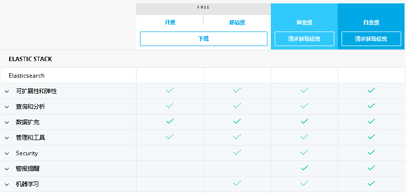

### 1. 常见命令

#### 查看当前节点的所有Index

```shell
curl -X GET 'localhost:9200/_cat/indices?v'	
```

#### 列出Index 所包含的 Type

```shell
curl -X GET 'localhost:9200/_mapping?pretty=true'   	      #所有index
curl -X GET 'localhost:9200/customer/_mapping?pretty=true'    #单个index 
```

#### 重新启动elasticsearch

~~~
ps -ef | grep elasticsearch
sudo kill -9 ????
./bin/elasticsearch -d
~~~

在docker的环境中. 把容器stop, 然后start即达到重启的目的. 

#### 查看es集群信息

~~~
curl -X GET 'localhost:9200'
~~~

#### 查看节点健康状态

~~~shell
curl -X GET 'localhost:9200/_cat/nodes?v'
curl -X GET 'localhost:9200/_cat/health?v'
curl -X GET 'localhost:9200/_cluster/health?pretty'
~~~

#### 查看shard的个数

~~~shell
curl -X GET 'localhost:9200/_cat/shards?v&pretty'
~~~

#### 新增/删除index

~~~shell
# 新增
curl -X PUT "localhost:9200/customer?pretty"
curl -X GET "localhost:9200/_cat/indices?v"

# 删除
curl -X DELETE "localhost:9200/customer?pretty"
curl -X GET "localhost:9200/_cat/indices?v"

~~~

#### 打开/关闭 index

目前知道的作用是, 可以让synonym的修改后的同义词库生效. 

~~~shell
curl -X POST "localhost:9200/customer/_close"
curl -X POST "localhost:9200/customer/_open"
~~~

#### 新增document

指定了明确的id值. 如果id值已经存在，将会替换已有的document

~~~shell
curl -X PUT "localhost:9200/customer/_doc/1?pretty" -H 'Content-Type: application/json' -d'
{
  "name": "John Doe"
}
'
curl -X GET "localhost:9200/customer/_doc/1?pretty"
~~~

 未明确指定id值，会id是一段随机编码.

~~~shell
curl -X POST "localhost:9200/customer/_doc?pretty" -H 'Content-Type: application/json' -d'
{
  "name": "Michael, xu"
}
'
~~~

#### 查看document

~~~shell
curl -XGET 'localhost:9200/customer/_doc/1?pretty'      # 单个文档

#返回10文档  
curl -XGET 'localhost:9200/customer/_search?size=10&pretty=true'
~~~

#### 更新document

~~~shell
curl -X POST "localhost:9200/customer/_update/1?pretty" -H 'Content-Type: application/json' -d'
{
  "doc": { "name": "Jane Doe", "age": 20 }
}
'
curl -X GET "localhost:9200/customer/_doc/1?pretty"
~~~

另外一种更新方式. 

~~~shell
curl -X POST "localhost:9200/customer/_update/1?pretty" -H 'Content-Type: application/json' -d'
{
  "script" : "ctx._source.age += 5"
}
'

curl -XGET 'localhost:9200/customer/_doc/1?pretty'	

~~~

#### 删除document

~~~shell
curl -X DELETE "localhost:9200/customer/_doc/1?pretty"
~~~

#### 批量处理（bulk processing）

~~~shell
curl -X POST "localhost:9200/customer/_bulk?pretty" -H 'Content-Type: application/json' -d'
{"index":{"_id":"1"}}
{"name": "John Doe" }
{"index":{"_id":"2"}}
{"name": "Jane Doe" }
'

curl -XGET 'localhost:9200/customer/_doc/1?pretty'	
~~~

更新id=1的document， 并同时删除id=2的document. 

~~~
curl -X POST "localhost:9200/customer/_bulk?pretty" -H 'Content-Type: application/json' -d'
{"update":{"_id":"1"}}
{"doc": { "name": "John Doe becomes Jane Doe" } }
{"delete":{"_id":"2"}}
'

~~~

#### ES的版本

详见https://www.elastic.co/cn/subscriptions



#### Production模式

奇怪无法生效,在docker的环境

~~~
sysctl -w vm.max_map_count=262144
grep vm.max_map_count /etc/sysctl.conf
~~~


#### Kibana状态

http://aa00:5601/status


## 2. 概念

[Elasticsearch](http://www.elasticsearch.org/)是一款基于 Apache Lucene 构建的开源搜索引擎，它采用 Java 编写并使用 Lucene 构建索引、提供搜索功能，Elasticsearch 的目标是让全文搜索变得简单，开发者可以通过它简单明了的 RESTFul API 轻松地实现搜索功能，而不必去面对 Lucene 的复杂性。


#### Index

Elastic 会索引所有字段，经过处理后写入一个反向索引（Inverted Index）。查找数据的时候，直接查找该索引。所以，Elastic 数据管理的顶层单位就叫做 Index（索引）。每个 Index 的名字必须是小写。


#### Document

Index 里面单条的记录称为 Document（文档）。许多条 Document 构成了一个 Index。同一个 Index 里面的 Document，不要求有相同的结构（scheme），但是最好保持相同，这样有利于提高搜索效率。

Document 使用 JSON 格式表示，下面是一个例子。

{   "user": "张三",   "title": "工程师",   "desc": "数据库管理" }


## 好文章

1. [lucene 的评分机制](https://www.cnblogs.com/yjf512/p/4860134.html)
2. [【Elasticsearch】打分策略详解与explain手把手计算](https://blog.csdn.net/molong1208/article/details/50623948)
3. [es为什么要移除type？](https://www.cnblogs.com/huangfox/p/9460361.html)

