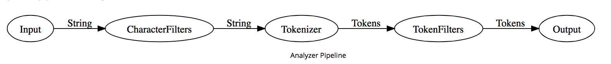

## 1 前言

Analyzer 一般由三部分构成，character filters、tokenizers、token filters。掌握了 Analyzer 的原理，就可以根据我们的应用场景配置 Analyzer。

## 2 Analyzer 的组成要素

Analyzer 的内部就是一条流水线. 

- 字符过滤（character filter）: 对字符串进行操作. 一个analyzer可以由0到多个character filters.

  比如:   [HTML Strip Character Filter](https://www.elastic.co/guide/en/elasticsearch/reference/current/analysis-htmlstrip-charfilter.html) 可以转换HTML标记.   

  原始文本:

  ~~~html
  
I&apos;m so <b>happy</b>!

  ~~~

  处理为:

  ~~~
  \nI'm so <b>happy</b>!\n
  ~~~

- 分词 （tokenizer）:  把字符串分解成token列表.  一个analyzer有且只能有一个tokenizer. 

  比如, [`whitespace`](https://www.elastic.co/guide/en/elasticsearch/reference/current/analysis-whitespace-tokenizer.html) tokenizer根据空格进行分词.  

  原始文本:

  ~~~
  Quick brown fox!
  ~~~

  处理为:

  ~~~
  [Quick, brown, fox!]
  ~~~

- Token 过滤（token filter）: 对token列表再进行处理. 一个analyzer可以由0到多个token filter.

  比如, [`lowercase`](https://www.elastic.co/guide/en/elasticsearch/reference/current/analysis-lowercase-tokenfilter.html) token filter把所有token变成小写. [`stop`](https://www.elastic.co/guide/en/elasticsearch/reference/current/analysis-stop-tokenfilter.html) token filter用于移除公共的stop words. [`synonym`](https://www.elastic.co/guide/en/elasticsearch/reference/current/analysis-synonym-tokenfilter.html) token filter把同义词加入到token列表中.  

## 3.  测试Analyzer

[`analyze` API](https://www.elastic.co/guide/en/elasticsearch/reference/current/indices-analyze.html)这个工具真的棒,  通过它, 可以看到analyzer产生的细节, 包括token, start_offset, end_offset, type等. 

~~~shell
curl -X POST "localhost:9200/_analyze?pretty" -H 'Content-Type: application/json' -d'
{
  "tokenizer": "standard",
  "filter":  [ "lowercase", "asciifolding" ],
  "text":      "Is this déja vu?"
}
'
~~~

执行后的结果:

~~~shell
{
  "tokens" : [
    {
      "token" : "is",
      "start_offset" : 0,
      "end_offset" : 2,
      "type" : "<ALPHANUM>",
      "position" : 0
    },
    {
      "token" : "this",
      "start_offset" : 3,
      "end_offset" : 7,
      "type" : "<ALPHANUM>",
      "position" : 1
    },
    {
      "token" : "deja",
      "start_offset" : 8,
      "end_offset" : 12,
      "type" : "<ALPHANUM>",
      "position" : 2
    },
    {
      "token" : "vu",
      "start_offset" : 13,
      "end_offset" : 15,
      "type" : "<ALPHANUM>",
      "position" : 3
    }
  ]
}
~~~

[`custom` analyzer](https://www.elastic.co/guide/en/elasticsearch/reference/current/analysis-custom-analyzer.html) 的示例如下. 

~~~shell
curl -X PUT "localhost:9200/my_index" -H 'Content-Type: application/json' -d'
{
  "settings": {
    "analysis": {
      "analyzer": {
        "std_folded": { 
          "type": "custom",
          "tokenizer": "standard",
          "filter": [
            "lowercase",
            "asciifolding"
          ]
        }
      }
    }
  },
  "mappings": {
    "properties": {
      "my_text": {
        "type": "text",
        "analyzer": "std_folded" 
      }
    }
  }
}
'
curl -X GET "localhost:9200/my_index/_analyze?pretty" -H 'Content-Type: application/json' -d'
{
  "analyzer": "std_folded", 
  "text":     "Is this déjà vu?"
}
'
# 同上
curl -X GET "localhost:9200/my_index/_analyze?pretty" -H 'Content-Type: application/json' -d'
{
  "field": "my_text", 
  "text":  "Is this déjà vu?"
}
'

~~~

## 参考

- [Elasticsearch Analyzer 的内部机制](https://mednoter.com/all-about-analyzer-part-one.html)