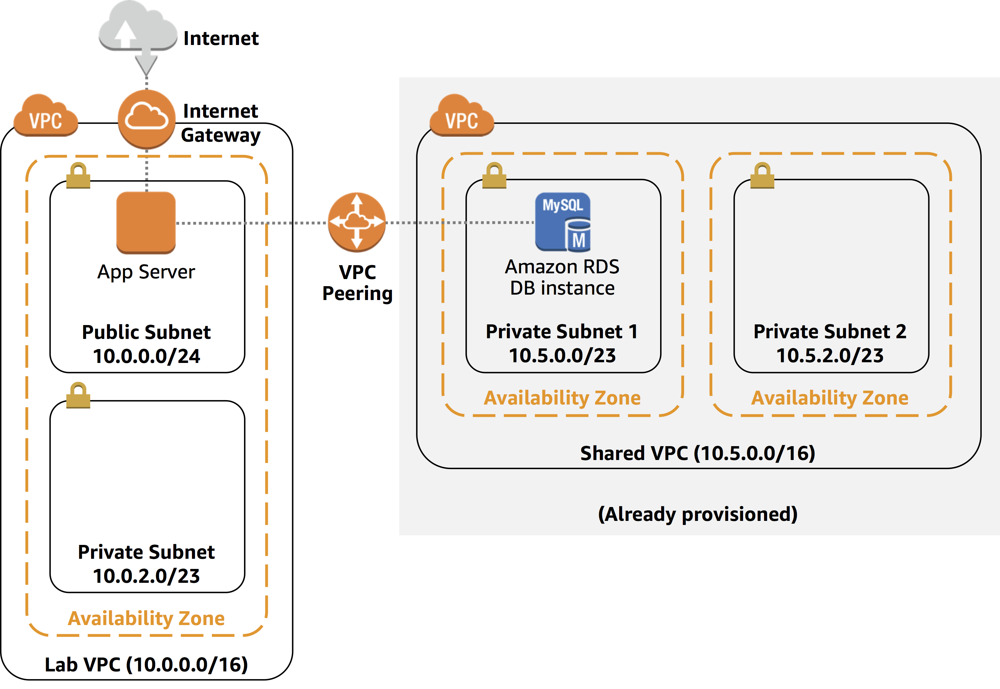
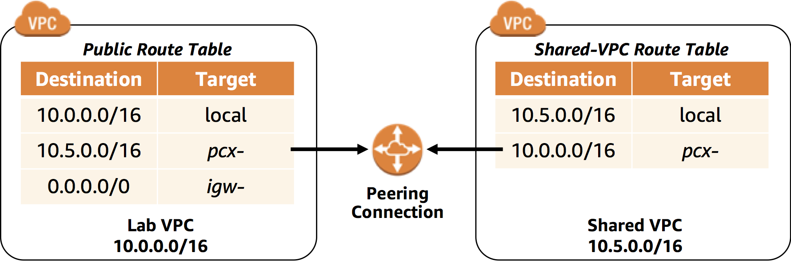

## VPC, Subnet, Route Table, Internet Gateway, Peering Connection的关系

- 一个Subnet可以绑定一个Route Table, 而一个Route Table可以分配给多个Subnet
- 网络:    VPC[ Internet Gateway] -> Subnet[Network ACL, Route Table] ->  EC2 Instance[Security Group]

这几个东东, 和网络多层协议的关系, 还是要搞清楚. 

###  Configure  Route Table 

