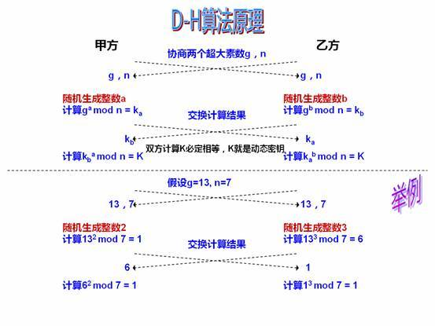

- 数字签名、数字证书、SSL、https是什么关系？<https://www.zhihu.com/question/52493697/answer/130813213>
- 互联网加密及OpenSSL介绍和简单使用   [https://mritd.me/2016/07/02/%E4%BA%92%E8%81%94%E7%BD%91%E5%8A%A0%E5%AF%86%E5%8F%8AOpenSSL%E4%BB%8B%E7%BB%8D%E5%92%8C%E7%AE%80%E5%8D%95%E4%BD%BF%E7%94%A8/](https://mritd.me/2016/07/02/互联网加密及OpenSSL介绍和简单使用/)
- Diffie-Hellman密码交换是如何运作的？<https://www.zhihu.com/question/29383090/answer/72896018> 
- OpenSSL 与 SSL 数字证书概念贴 <http://seanlook.com/2015/01/15/openssl-certificate-encryption/>
- 基于OpenSSL自建CA和颁发SSL证书 <http://seanlook.com/2015/01/18/openssl-self-sign-ca/> 
- openssl 创建CA和申请证书 <https://www.jianshu.com/p/15b3d94c24f5>

**密码(cipher)**

密码学中的密码（cipher）和我们日常生活中所说的密码不太一样，计算机术语『密码 cipher』是一种用于加密或者解密的算法。

**明文/密文**

明文（plaintext）是加密之前的原始数据，密文是通过密码（cipher）运算后得到的结果成为密文（ciphertext）。

**密钥(key) - 钥匙**

密钥是一种参数，它是在使用密码（cipher）算法过程中输入的参数。同一个明文在相同的密码算法和不同的密钥计算下会产生不同的密文。很多知名的密码算法都是公开的，密钥才是决定密文是否安全的重要参数，通常密钥越长，破解的难度越大。密钥分为对称密钥与非对称密钥。

**对称密钥**

对称密钥（Symmetric-key algorithm）又称为共享密钥加密，对称密钥在加密和解密的过程中使用的密钥是相同的，常见的对称加密算法有DES、3DES、AES、RC5、RC6。

对称密钥的优点是计算速度快，但是他也有缺点，密钥需要在通讯的两端共享，让彼此知道密钥是什么对方才能正确解密，如果所有客户端都共享同一个密钥，那么这个密钥就像万能钥匙一样，可以凭借一个密钥破解所有人的密文了，如果每个客户端与服务端单独维护一个密钥，那么服务端需要管理的密钥将是成千上万，这会给服务端带来噩梦。

**非对称密钥** 

非对称密钥（public-key cryptography），又称为公开密钥加密，服务端会生成一对密钥，一个私钥保存在服务端，仅自己知道，另一个是公钥，公钥可以自由发布供任何人使用。客户端的明文通过公钥加密后的密文需要用私钥解密。

非对称密钥在加密和解密的过程的使用的密钥是不同的密钥，加密和解密是不对称的，所以称之为非对称加密。与对称密钥加密相比，非对称加密无需在客户端和服务端之间共享密钥，只要私钥不发给任何用户，即使公钥在网上被截获，也无法被解密，仅有被窃取的公钥是没有任何用处的。常见的非对称加密有RSA，非对称加解密的过程：

1. 服务端生成配对的公钥和私钥
2. 私钥保存在服务端，公钥发送给客户端
3. 客户端使用公钥加密明文传输给服务端
4. 服务端使用私钥解密密文得到明文

公钥算法的主要局限在于，这种加密形式的速度相对较低。实际上，通常仅在关键时刻才使用公钥算法，如在实体之间交换对称密钥时，或者在签署一封邮件的散列时（散列是通过应用一种单向数学函数获得的一个定长结果，对于数据而言，叫做散列算法）。将公钥加密与其它加密形式（如对称密钥加密）结合使用，可以优化性能，如数字签名和密钥交换。

**数字签名（Digital Signature）- 个人签名**

报文的摘要信息用私钥加密后生成的内容就是数字签名。

数据在浏览器和服务器之间传输时，有可能在传输过程中被冒充的盗贼把内容替换了，那么如何保证数据是真实服务器发送的而不被调包呢，同时如何保证传输的数据没有被人篡改呢，要解决这两个问题就必须用到数字签名，同时如何保证传输的数据没有被人篡改呢，要解决这两个问题就必须用到数字签名，这是任何人都没法仿造的，因为这是你专有的手迹，任何人是造不出来的。

那么在计算机中的数字签名怎么回事呢？数字签名就是用于验证传输的内容是不是真实服务器发送的数据，那么在计算机中的数字签名怎么回事呢？数字签名就是用于验证传输的内容是不是真实服务器发送的数据，通过与之配对的公钥来解密。

1. 服务端把报文经过Hash处理后生成摘要信息Digest，服务端把报文经过Hash处理后生成摘要信息Digest。
2. 客户端接收到数据后，把签名提取出来用public-key解密，如果能正常的解密出来Digest2，那么就能确认是对方发的。 
3. 客户端把报文Text提取出来做同样的Hash处理，得到的摘要信息Digest1，再与之前解密出来的Digist2对比，如果两者相等，就表示内容没有被篡改，否则内容就是被人改过了。因为只要文本内容哪怕有任何一点点改动都会Hash出一个完全不一样的摘要信息出来。

数字签名一般有：

- 签发者
- 证书用途
- 公钥
- 加密算法
- HASH算法
- 证书的到期时间

**数字证书 - 身份证**

简称CA，它由权威机构给某网站颁发的一种认可凭证，这个凭证是被大家（浏览器）所认可的。

**为什么需要用数字证书？：**难道有了数字签名还不够安全吗？有这样一种情况，就是浏览器无法确定所有的真实服务器是不是真的是真实的。举一个简单的例子：A厂家给你们家安装锁，同时把钥匙也交给你，只要钥匙能打开锁，你就可以确定钥匙和锁是配对的，如果有人把钥匙换了或者把锁换了，你是打不开门的，你就知道肯定被窃取了，但是如果有人把锁和钥匙替换成另一套表面看起来差不多的，但质量差很多的，但是如果有人把锁和钥匙替换成另一套表面看起来差不多的，但质量差很多的，这套锁是不是真的来自于A厂家，质检部门是权威机构，他说的话是可以被公众认可的（呵呵）。

同样的， 因为如果有人（张三）用自己的公钥把真实服务器发送给浏览器的公钥替换了，于是张三用自己的私钥执行相同的步骤对文本Hash、数字签名，最后得到的结果都没什么问题，但事实上浏览器看到的东西却不是真实服务器给的，而是被张三从里到外（公钥到私钥）换了一通。那么如何保证你现在使用的公钥就是真实服务器发给你的呢？我们就用数字证书来解决这个问题。数字证书一般由数字证书认证机构（Certificate Authority）颁发，证书里面包含了真实服务器的公钥和网站的一些其他信息，数字证书机构用自己的私钥加密后发给浏览器，浏览器使用数字证书机构的公钥解密后得到真实服务器的公钥。这个过程是建立在被大家所认可的证书机构之上得到的公钥，所以这是一种安全的方式。

**SSL（Secure socket layer）**

其实就是依赖非对称和对称算法的一种网络通信协议栈，它通过非对称算法来加密传输一个对称算法加解密的密钥，然后用这个密钥来加密/解密传输的数据。

**https**

是在SSL之上的http协议，一般只要求服务端有证书即可，当然也可以要求客户端和服务端都有证书

- 若只有服务器证书，那就是表示，这个网站由CA来担保，的确是我的，不是个钓鱼网站
- 若既有服务器证书，也有客户端证书，那就表示，客户端的确是某个用户而不是另一个用户，具体到支付宝的个人证书来说，就算你的支付宝密码被人猜出来了，但是这个人木有你的证书，他还是不能用你的支付宝来付款。

**Diffie-Hellman**

**OpenSSL**

OpenSSL 是一组加密套件，其提供了功能强大的加密解密功能，以及证书相关的操作工具，OpenSSL 分为三大部分 

- libcrypto 通用功能的加密库
- libssl 用于实现TLS/SSL的功能 
- openssl 多功能命令工具；而一般 OpenSSL 使用指的就是多功能命令行工具的使用。