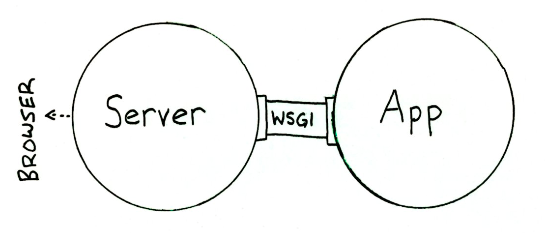

WSGI（Web Server Gateway Interface）是Python应用程序（或者框架、套件）与服务器之间的一种接口，其定义了两者进行通信的接口规范。

当我们实现一个Web应用（application）的时候，通常不会考虑如何接受HTTP请求、解析HTTP请求、发送HTTP响应等等，我们只关心处理逻辑，而不用去关心HTTP规范的细节。

之所以有这层透明，是因为Web Server和Web Application之间有一套规范的接口，这套接口帮我们隐藏了很多HTTP相关的细节。这套接口规范就是WSGI（Web Server Gateway Interface）。

W要实现WSGI协议，必须同时实现`Web serve`r和`Web application`，当前运行在WSGI协议之上的web框架有`Torando`,`Flask`,`Django`

- Web Server：接收来自客户端的HTTP，然后将请求交给Web Application
- Web Application：根据请求来调用相应的处理逻辑，生成response；通过Web Server把response发送给客户端

## 参考

- [WSGI简介](https://www.cnblogs.com/wilber2013/p/4763067.html)