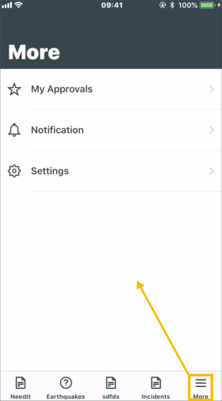
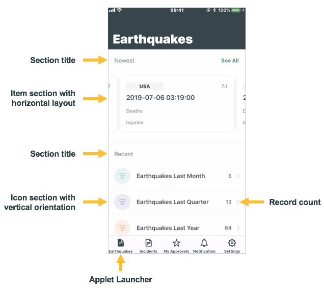
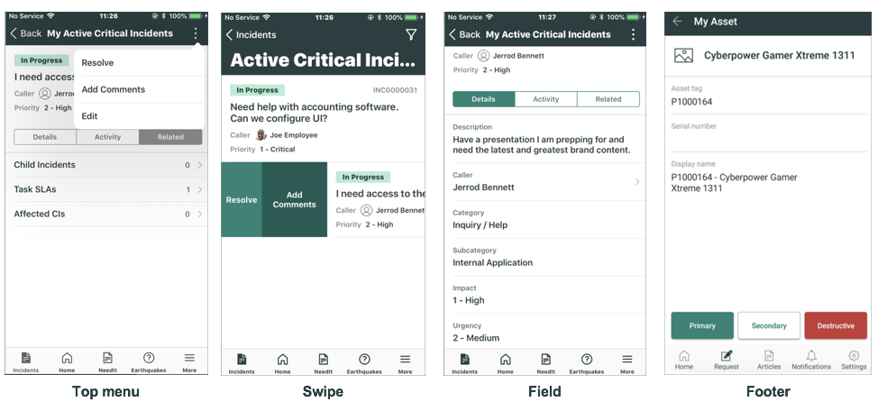

# Mobile Application

总体结构

- application menu
  - navigation tabs： app中的导航tab
    - applet launcher
      - ui section： 对applet进行分组
        - applet
          - list screen
          - form screen

## application menu

目前可以分为：

- mobile agent： Legacy，看上去是上一代的
- now mobile

在application menu中可以定义多个Navigation Tab。

 

> 1. mobile agent和now mobile什么区别？

## applet launcher

  

Question:

1. list screen 和 form screen的区别，为何需要list screen

## applet

总体结构：

- applet

  - list screen

    - data fields 
      - data item: 1
        - conditions
        - parameter
      - Screen UI  Parameter Mapping: UI参数和Data Item参数的映射
    - functions

  - form screen

    - overall settings

      - data fields 
      - functions

    - body

      

## data item

## function

包含三种类型。

- ***Actions***: Change data, such as modifying a field value.
- ***Navigation***: Move between screens, such as opening a record from a list.
- ***Smart buttons***: Allow users to take action on demand, such as making a telephone call.

用户可以通过四种方式来访问函数：

- *Tapping a Top menu*
- *Swiping*
- *Tapping a field*
- Tapping a footer option

### Action

 Actions把Action Items封装成buttons.  button is a generic term for the back end of a UI element such as a menu item, swipe button, or field icon. 

- action
  - Type
    - Action Item
  - UI parameter
  - Action Parameter Mapping: UI参数和Action Item参数的映射