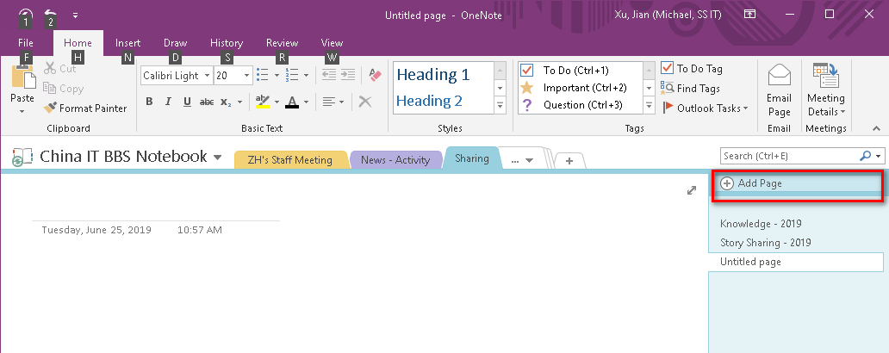
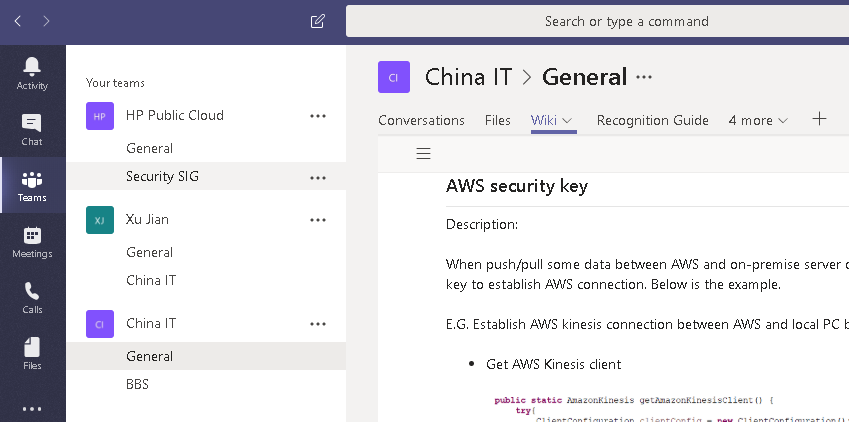
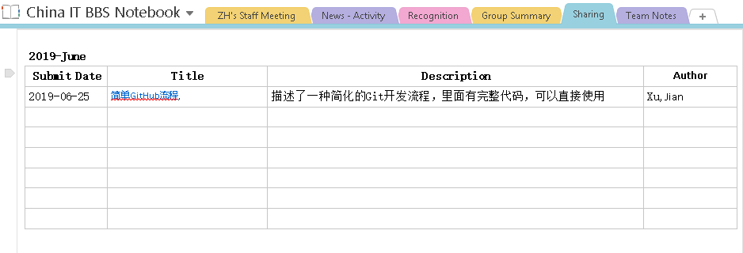

## 如何提交笔记，wiki或者文章？

提供多种提交知识的途径。 除了Teams和OneNote中创建， 还可以把其他地方创建的，通过链接的方式添加进来。

1. 提交OneNote笔记。在China BBS Notebook Onenote中[Sharing](onenote:https://hp.sharepoint.com/sites/ChinaITBBS/SiteAssets/China IT BBS Notebook/Sharing.one#section-id={4D9A1119-7391-49C8-9C9A-55C41962856C}&end) 下，创建笔记（Add Page）。**这是首选方式。**

   

   OneNote安装地址： https://www.onenote.com/download%3Fomkt%3Dzh-CN

   

2. 提交Microsoft Teams wiki. 打开teams，在China IT的general下，创建wiki。

   

   Teams安装地址：https://aka.ms/teams64bitmsi

   

3. 提交链接。在China BBS Notebook Onenote>Sharing> [Knowledge - 2019](onenote:https://hp.sharepoint.com/sites/ChinaITBBS/SiteAssets/China IT BBS Notebook/Sharing.one#Knowledge - 2019&section-id={4D9A1119-7391-49C8-9C9A-55C41962856C}&page-id={58D6B13B-96A5-4FC3-A62A-F37BC09C869B}&end)  ([Web view](https://hp.sharepoint.com/sites/ChinaITBBS/_layouts/OneNote.aspx?id=%2Fsites%2FChinaITBBS%2FSiteAssets%2FChina IT BBS Notebook&wd=target(Sharing.one|4D9A1119-7391-49C8-9C9A-55C41962856C%2FKnowledge - 2019|58D6B13B-96A5-4FC3-A62A-F37BC09C869B%2F))) 下，添加一条文章链接。务必保证这个链接，其他人有权限打开。具体格式如下：

   

## 鼓励

1. 鼓励原创。不建议把互联网上的文章原封不动的粘贴或者链接进来，但如果对这些文章进行了归纳，整理和加工，使得知识更加容易理解，或结合了工作实际，这样的文章也算原创。
2. 鼓励提交Team外同事的文章。尤其对于项目经理和架构师，鼓励团队成员花时间整理知识，并帮助把适合分享的知识添加进来。不限于我们Team，只要原创的好的东西，都可以加进来。
3. 知识点不论大小，只要有分享价值，都鼓励提交。

## 月度分享

1. montly meeting中，主持人review一下当月的新的wiki, 笔记或文章
2. montly meeting中，分享1-2篇文章或笔记。

## 季度评估

### 奖项

每个季度，评选出如下奖项。

- Best Note Award

  - 1st     ： 300 points
  - 2nd    ： 150 points  
  - 3rd     ： 75 points 

- Most Contribution Award：  the guy who writes the most notes in the quarter

  - 1st ：  75 points

    

### 评奖流程

待定

