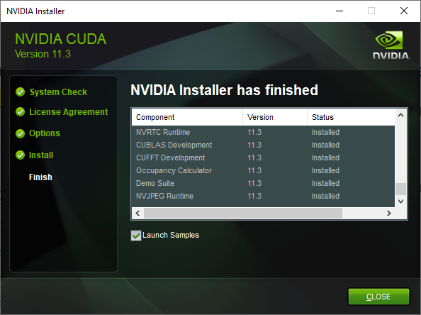

本文将详述Windows 10环境下如何安装nvidia GPU driver, CUDA和cuDNN。下面看看要安装的内容：

- **nvidia GPU driver**：英伟达公司显卡驱动。要安装CUDA， cuDNN，这是必要的。  

- **CUDA（Compute Unified Device Architecture）**：是英伟达公司推出的一种基于新的并行编程模型和指令集架构的通用计算架构，它能利用英伟达GPU的并行计算引擎，比CPU更高效的解决许多复杂计算任务。

- **cuDNN（CUDA Deep Neural Network library）**：是NVIDIA打造的针对深度神经网络的加速库，是一个用于深层神经网络的GPU加速库。如果你要用GPU训练模型，cuDNN不是必须的，但是一般会采用这个加速库。

本文安装的版本：

- NVidia显卡驱动：517.40
- CUDA:  11.3.1
- cuDNN:  8.60

## 1. [系统要求](https://docs.nvidia.com/cuda/archive/11.3.1/cuda-installation-guide-microsoft-windows/index.html)

首先要保证操作系统符合CUDA 11.3的要求。

## 2. 安装NVidia显卡驱动

1. 根据要安装CUDA的版本，找到合适的显卡驱动。本次安装需要满足$\geq 465.89$。详见[NVIDIA CUDA Toolkit Release Notes](https://docs.nvidia.com/cuda/cuda-toolkit-release-notes/index.html#abstract)。

   

2. 点击"NVIDIA Control Panel"。

   

3. 点击左下角的"System Information"。

   

4. 在弹出窗口检查显卡驱动版本。

   

   显然上图中显示的驱动器版本满足需要。

   如果驱动器版本不够新的话，可以到[NVIDIA网站](https://www.nvidia.com/Download/index.aspx?lang=en-us)下载相应型号的驱动。
   
   

## 3. 安装Visual Stuido

为了获得完整的CUDA功能，需要安装VisualStuido。相关支持的版本见第一章。

1. 下载[安装文件](https://learn.microsoft.com/en-us/visualstudio/releases/2019/release-notes)，选择社区版（Community）。

   

2. 开始安装。

   

3. 勾选Desktop development with C++。

   

4. 安装完成后，打开Visual Studio，看到如下界面，表示安装成功了。

   

## 4. [安装CUDA](https://docs.nvidia.com/cuda/archive/11.3.1/cuda-installation-guide-microsoft-windows/index.html#download-cuda-software)

1. 在 [CUDA Download](https://developer.nvidia.com/cuda-11-3-1-download-archive) 选择合适的CUDA版本。

   

2. 点击下载的安装文件，开始安装。

3. 安装选项中选择Custom。

   

4. 不要勾选Driver components。由于在上一节已经安装了最新的显卡驱动了。

   

5. 然后开始一步一步安装。

   

   看到上图，表示安装完成了。

6. 验证安装。

   - 打开CMD，看看CUDA的版本。

     ~~~shell
     nvcc -V
     ~~~

     

   - 打开CMD，查看GPU的状态。

     ~~~shell
     nvidia-smi
     ~~~

     

   - 运行`deviceQuery` 和 示例程序。具体步骤如下。

     - 双击`C:\ProgramData\NVIDIA Corporation\CUDA Samples\v11.3`目录下的Samples_vs2019.sln。将会打开Visual Studio 2019.

     - 在Toolbar中选择Release。

       

     - 在右边的Solution Explorer中，点击1_Utilities，然后按住Ctrl选择deviceQuery和bandwidthTest，进行编译。

       

     - 打开`C:\ProgramData\NVIDIA Corporation\CUDA Samples\v11.3\bin\win64\Release`，可以看到deviceQuery.exe和bandwidthTest.exe两个可执行文件。

       

     - 打开CMD，运行deviceQuery.exe。如果看到如下类似信息，表示CUDA已经成功安装，测试通过了。

       

     - 上一步如果成功，可以继续运行bandwidthTest.exe。将会看到如下信息。

       

## 5. 安装cuDNN

安装文档详见[Installing cuDNN on Windows](https://docs.nvidia.com/deeplearning/cudnn/install-guide/index.html#install-windows)。

1. 下载并安装[Zlib](http://www.winimage.com/zLibDll/zlib123dllx64.zip)。这是官方文档中要求安装的[Prerequisites](https://docs.nvidia.com/deeplearning/cudnn/install-guide/index.html#prerequisites-windows)。解压后将zlibwapi.dll放到环境变量zlibwapi.dll中。步骤详见[Create and Modify Environment Variables on Windows](https://docs.oracle.com/en/database/oracle/machine-learning/oml4r/1.5.1/oread/creating-and-modifying-environment-variables-on-windows.html)。设置之后，如下。

   

2. 下载cuDNN。打开[cuDNN](https://developer.nvidia.com/cudnn) ，登录以后，选择最新版本后，点击`Local Installer for Windows`链接进行下载。

   

3. 把现在的zip文件解开，里面将有如下内容。

   

4. 将上面三个目录拷贝到[C:\Program Files\NVIDIA GPU Computing Toolkit\CUDA\v11.]()3目录，安装就完成了。

~~~
python -c "import tensorflow as tf; print(tf.__version__); print(tf.config.list_physical_devices('GPU'))"
~~~

## 安装WSL（Windows Subsystem for Linux）

以下是步骤。详见[Install Linux on Windows with WSL](https://learn.microsoft.com/en-us/windows/wsl/install#install-your-linux-distribution-of-choice)。

1. 以管理员身份打开cmd。

   

2. 输入如下命令。默认会安装Ubuntu系统。
    ~~~shell
    wsl --install
    ~~~

    

3. 安装完成后，重启系统，设置默认的用户名和密码。

   

到此，安装完成。更多详细的设置可以参考如下链接。

- [Basic commands for WSL](https://learn.microsoft.com/en-us/windows/wsl/basic-commands).

- [Set up a WSL development environment](https://learn.microsoft.com/en-us/windows/wsl/setup/environment)

## 安装TensorFlow-DirectML和PyTorch-DirectML

步骤如下，详见[Setting up TensorFlow-DirectML or PyTorch-DirectML](https://learn.microsoft.com/en-us/windows/wsl/tutorials/gpu-compute#setting-up-tensorflow-directml-or-pytorch-directml)。

1. 安装Miniconda。

   ~~~shell
   wget https://repo.anaconda.com/miniconda/Miniconda3-latest-Linux-x86_64.sh 
   bash Miniconda3-latest-Linux-x86_64.sh 
   ~~~

2. 设置Python虚拟环境。当前DirectML并不支持Python 3.8以上的版本，详见[TensorFlow-DirectML](https://github.com/microsoft/tensorflow-directml)。

   ~~~
   conda create --name directml python=3.7 -y
   conda activate directml
   ~~~

3. 安装TensorFlow-DirectML。需要注意：`tensorflow-directml` 包仅支持 TensorFlow 1.15。

   ~~~shell
   pip install tensorflow-directml
   ~~~

4. 安装PyTorch-DirectML。

   ~~~
   sudo apt install -y libblas3 libomp5 liblapack3
   pip install pytorch-directml
   ~~~

   

## 参考

- [Windows安装CUDA和CUDNN运行环境](https://blog.ailemon.net/2020/07/27/windows-install-cuda-and-cudnn-environment/)

   

