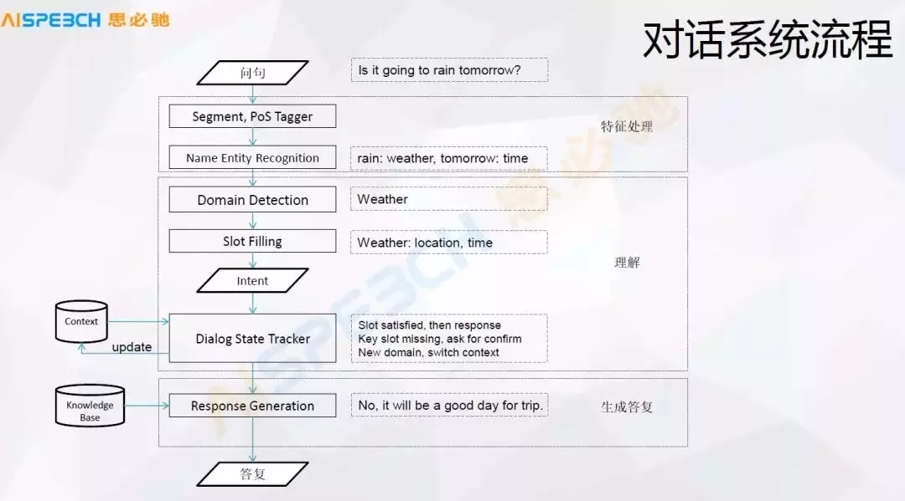
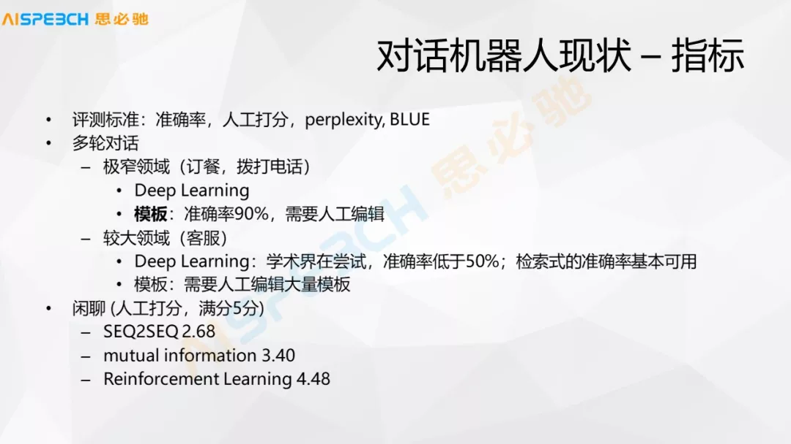

# 0. Log

## 任务

### Todo List

- 2020-11-26： 把之前blog里面的每个内容都分别进行细化。比如mnist中，就把tensorflow和pytorch分开，变成两篇文章。把模型的构建都改成funcational形式，增加混淆矩阵，同时分成多个模型优化步骤。
  - 经典神经网络
  - Lenet
  - 更好的模型
  - 网上更好的模型
  - 迁移学习
- 2020-12-01：把Cats vs. Dogs的内容，做一个blog。

### Done

- 2020-11-26：把eipi10.cn里面style改成，左边，文章目录结构，中间文件内容，右边所有文章列表的结构。

## 比赛

- 千言：多技能对话 https://www.datafountain.cn/competitions/470/datasets4
- 千言数据集：文本相似度 https://aistudio.baidu.com/aistudio/competition/detail/45/1
- 房产行业聊天问答匹配 https://www.datafountain.cn/competitions/474/datasets
- 百度大脑。新手专享https://aistudio.baidu.com/aistudio/newbie

## 面试

- leecode
- 牛客网

## 其它

- 这个machine guide非常棒 https://developers.google.com/machine-learning/guides
- 这个网站好像不错 https://www.yuque.com/zy19970/vo3yim/seytxm 语雀 https://www.yuque.com/dashboard
- 采用keras调优以下fashion minist的一些其它模型。


## 文章
- Street View House Numbers Classification https://www.kaggle.com/dimitriosroussis/svhn-classification-with-cnn-keras-96-acc  这篇文章中，有一些对Street View House Numbers Classification进行分类，一些比较有意思的方法. 里面对于SVHN数据集，能够取得95%以上的准确性。非常不错。

  这个更厉害，取得了97.6%的准确率

  https://www.kaggle.com/tteokl/svhn-classification-using-cnn-97-86-format-2

- 这篇文章 **使用非常少的数据构建强大的图像分类模型.md** https://github.com/ictar/python-doc/blob/master/Machine%20Learning/%E4%BD%BF%E7%94%A8%E9%9D%9E%E5%B8%B8%E5%B0%91%E7%9A%84%E6%95%B0%E6%8D%AE%E6%9E%84%E5%BB%BA%E5%BC%BA%E5%A4%A7%E7%9A%84%E5%9B%BE%E5%83%8F%E5%88%86%E7%B1%BB%E6%A8%A1%E5%9E%8B.md  讲了用很少数据能够构建很高准确率的方法，值得好好研读。 文章虽然out of date，但是思想值得一看。

## 感悟

- from_logits=True这个参数的究竟作用是什么，还有点每搞清楚，有时候模型性能非常差

- 当某一个更复杂的模型，收敛的速度比一个简单模型更慢时，考虑有可能是learning_rate过大的原因。比如三个模型中 ， 模型1比模型2慢，当模型3把 learning_rate降低到0.0002，收敛速度大大提高。

  ~~~python
  def get_mlp1(input_shape):
      model = models.Sequential()
      model.add(layers.Flatten(input_shape=input_shape))
      model.add(layers.Dense(128, activation='relu'))
      model.add(layers.Dense(10, activation='softmax'))    
  	model.compile(optimizer=tf.keras.optimizers.Adam(learning_rate=0.001),
                    loss=losses.SparseCategoricalCrossentropy(),
                    metrics=['accuracy'])
      return model
                             
  def get_mlp2(input_shape, learning_rate):
      model = models.Sequential()
      model.add(layers.Flatten(input_shape=input_shape))
      model.add(layers.Dense(128, activation='relu'))
      model.add(layers.Dense(128, activation='relu'))    
      model.add(layers.Dense(10, activation='softmax'))    
  	model.compile(optimizer=tf.keras.optimizers.Adam(learning_rate=0.001),
                    loss=losses.SparseCategoricalCrossentropy(),
                    metrics=['accuracy'])
      return model 
  
  def get_mlp3(input_shape, learning_rate):
      model = models.Sequential()
      model.add(layers.Flatten(input_shape=input_shape))
      model.add(layers.Dense(128, activation='relu'))
      model.add(layers.Dense(128, activation='relu'))  
      model.add(layers.Dense(10, activation='softmax'))    
  	model.compile(optimizer=tf.keras.optimizers.Adam(learning_rate=0.0001),
                    loss=losses.SparseCategoricalCrossentropy(),
                    metrics=['accuracy'])
      return model 
  
  input_shape = (32, 32, 1)
  model1 = get_mlp1(input_shape)
  model2 = get_mlp2(input_shape)
  model3 = get_mlp3(input_shape)
  ~~~

  

# 1. 索引

- 
- 滴答清单 https://dida365.com 微信
- [百度思维导图](http://naotu.baidu.com/home)：eipi10@qq.com
- [coggle思维导图](https://coggle.it/)
- [dl_env](http://aa00:18888/notebooks/eipi10/python-book/arsenal/notebook/dl/dl_env.ipynb): 环境配置，软件安装，以及notebook的一些通用代码
- [dl_01](http://aa00:18888/notebooks/eipi10/python-book/arsenal/notebook/dl/dl_01.ipynb):  即本文。包括notebook索引，Idea/plan，笔记/感想，好文等
- [dl_02](http://aa00:18888/notebooks/eipi10/python-book/arsenal/notebook/dl/dl_02.ipynb): 知识库1-20
- [dl_03](http://aa00:18888/notebooks/eipi10/python-book/arsenal/notebook/dl/dl_03.ipynb): 知识库21-40
- [dl_04](http://aa00:18888/notebooks/eipi10/python-book/arsenal/notebook/dl/dl_04.ipynb): 知识库41-60

# 2. Idea and Plan

- 【2018-10-19】有空可以看看下面这些比较火的算法
    - https://github.com/danielfrg/tsne Python library containing T-SNE algorithms.里面有几个例子，非常不错
    - FastRGF ： 这个算法最近几年很火，知乎大V推荐
    - libFM: Factorization Machine Library。 基于SVD的因子分解，对稀疏数据尤其有效
    - LIBFFM: A Library for Field-aware Factorization Machines
    - XGBoost：GBDT的实现，基于树的方法。
- 【2018-10-17】平时刷题
    - https://developers.google.com/machine-learning/crash-course/ml-intro 这里有很多tensorflow相关的课程，无聊的时候，不想做其他的时候，刷刷这个。
    - https://tianchi.aliyun.com/learn/index.htm?spm=5176.11510288.5610778.9.7b16b7bdxqULT6 阿里云——天池的AI学习
- 【2018-10-17】当前一些有兴趣的比赛
    - https://www.datafountain.cn/competitions/312/details/rule 基金间的相关性预测
    - https://dc.cloud.alipay.com/index#/topic/intro?id=8  还是之前ali nlp的比赛，可以继续参加，验证自己成绩的提高。
    - https://tianchi.aliyun.com/competition/raceEnteredSuccess.htm?raceId=231687 瑞金医院MMC人工智能辅助构建知识图谱大赛。想用这个机会学习一下知识图谱
    - https://www.kaggle.com/c/two-sigma-financial-news 这是一个kaggle关于通过文本预测股票动向的比赛，可以考虑参加一下。
- 【2018-09-18】明年准备了一个机器学习十大算法课程。用通俗易懂的例子介绍10个算法。目前可以做的是：正态分布（e，pi等有意思），kmeans, 最近邻，em， 奇异值分解，logistic regression，决策树，HMM，朴素贝叶斯，神经网络(可以用kaggle中[
Digit Recognizer](https://www.kaggle.com/c/digit-recognizer/kernels)为例), word2vec（包括可视化）。

## 2.1 wechat user profile

- 【2018-10-22】survey—prediction, 是否可以采用迁移学习呢

# 3. 笔记/感想

- 【2019-03-02】 最近的一个月，忙于用户画像的开发，真是累坏了，但整个心也算是收回来了。好好开始充电了。最近还是要重点学习一下NLP方面的内容。学习的思路如下。1）学习一门有较好作业和进度要求的课程；2）学习一些网上的程序，小技巧，增加兴趣和实战能力；3）找一本比较好的教材，在学习相关知识的同时，能够有一定的理论深度。4） 使用一些业界比较好的工具和产品，比较自己的程序的差距和优缺点。
    - 课程
        - [Text Mining and Analytics](https://www.coursera.org/learn/text-mining/home/info)宅成翔教授的经典课程，在coursera有课程，有作业，以这个为主，来进行学习。由于第三周编程作业，需要使用C++，的确有挑战。
        - [Natural Language Processing | Dan Jurafsky, Chr·istopher Manning](https://www.youtube.com/playlist?list=PLQiyVNMpDLKnZYBTUOlSI9mi9wAErFtFm) 看到知乎里面，大家都说Dan的课程是经典。所以必须一看，只是没有作业。可以作为辅助课程来看
        - [YSDA course in Natural Language Processing]() 俄罗斯人的课程，大家都说不错。在coursera上做过一些，的确不错。放在之后来看。
    - 技巧
        - [NLP精讲二十课](https://www.jianshu.com/p/b87e01374a65) 这里面主要是一些技术的简单讲解。每天看4课，5天看完。主要是了解一下之前知识体系中缺失的部分。   
    - 书籍 
        - [An Introduction to Natural Language Processing, 
Computational Linguistics, and Speech Recognition
Second Edition](http://www.cs.colorado.edu/~martin/slp2.html) 应该和上面的视频是配套的书。这是[第三版](https://web.stanford.edu/~jurafsky/slp3/ed3book.pdf)。
        - [Natural Language Processing](https://github.com/jacobeisenstein/gt-nlp-class/blob/master/notes/eisenstein-nlp-notes.pdf)由Jacob Eisenstein编写，18年底最新release出来的自然语言处理综述教材。这本书也有配套课程的。
        - [Text_Data_Management_and_Analysis](https://github.com/xuxiangwen/ai/blob/master/book/nlpext_Data_Management_and_Analysis-A_Practical_Introduction_to_Information_Retrieval_and_Text_Mining.pdf) 宅成翔教授的书，上面课程的配套书。
    - 工具和api 
        - 百度AI http://ai.baidu.com/ 里面有很多NLP的API，可以玩一玩。也可以研究一下，项目中是否可以来用。

- 【2019-02-08】 最近半年的工作学习，其实安排的一团糟。想做的事情太多。计划要做的事情太多，最后反而债多人不愁。目前的方案是，其实只要计划最近一周要做的事情就好，不要规划那么长远的。要保证最近的事情能够做完。所有的计划都是最近一周能完成的，临时的一些任务也必须是当天能够完成的。还是准备采用滴答清单： https://www.dida365.com ，账号:微信。    以前的账号是eipi10@qq.com  里面有以前留下的一些任务，看起来还是有价值，所以留着。以后有时间再翻阅            

- 【2018-09-25】 最近一个月，使用番茄的经验是，对于休息时间一定严格起来，不能放纵，否者有时候一休息就是半个小时。
- 【2018-08-25】   
    - 学习的情绪： 最近在学习nlp的课程，中间讲到了HMM，由此把HMM，viterbi算法，EM算法，最大熵模型，拉格朗日乘法（KKT条件，对偶性）等概念重新学习了一下，感觉收获良多，理解更加深入了。学习的过程中，脑子里总有个声音说，很难的，忽略过去吧，还有另外一个声音说，一定要学会，掌握。学习中总是充满着两种情绪的对抗。几个经验来处理：  
      
        - 坚定一定要学会的信心；那种逃避的情绪或许是人类特有的一种畏难情绪，要理解它，有这种情绪也可以接受，但同时告诉自己一定可以做到的。
        - 实在感觉看不进去，就抄书，抄文章。有的时候看到一大堆数学符号，真感觉头皮发麻，抄书可以让这种情绪淡化，因为虽然我看不懂，但抄写肯定没问题，这样心就静了下来。
        - 形象化。如果能把抽象的理论做一些简化，映射到一些简单有趣的例子，这样能够更好的记忆，理解这个理论。
        - 实现自己代码。如果能把抽象的理论用程序写出来，辅助以一定的说明。这样以后即使以后记不清楚了，看到代码，也能很快的回忆起来              
    - 番茄工作法： 大概应该2个多月前开始用番茄工作法，开始有些效果，但后来又懈怠了。经过思考，目前的方法是： 计划+番茄+总结。
    
        - 计划： 每天早上工作之前，第一件事情是确定今天的计划，也就是确定，今天什么任务需要几个番茄，大概什么时间段，做这些番茄。
        - 番茄： 具体一个一个完成番茄
        - 总结： 把番茄完成的结果填写到实际完成情况中。
        
      好处：
        - 保证计划的完成。以前没有用番茄之前，也列计划，但计划往往很难完成，慢慢就懈怠了。主要问题是，没有考虑如何来保证以一个小的目标完成，往往是前面任务没完成，后面的也一直拖，总也完成不了。
        - 保证番茄的数量。如果仅仅用番茄，而没有计划，会造成只见树木不见森林。计划的引入，每天番茄完成的完成计划，会督促自己来完成番茄。一旦达到番茄数，自己也可以放心的娱乐放松。
    
- [自动编码器读后感](./autoencoder_think.ipynb)  关于自动编码器的一些胡思乱想。里面有关于记忆，联想和专注度，网络融合的一些想法。

# 4 好文 (必须读过，而且要点评) 

## 4.2 chatbot

- [一文详解启发式对话中的知识管理](https://www.jiqizhixin.com/articles/2018-10-15-27): 作者介绍了启发式对话系统中的知识管理，详细介绍了对话系统的流程和其中的一些技术细节点。文章的中后部分介绍了启发式对话系统中的关键思路，还没有详细阅读，以后仔细看看。
  

  

  

## 4.1 common
- [多图 | 从神经元到CNN、RNN、GAN…神经网络看本文绝对够了](https://mp.weixin.qq.com/s?__biz=MzI0ODcxODk5OA==&mid=2247486196&idx=1&sn=da94fd48b9258034d70399c6c6f35d2a)  
    2018-05-04： 本文遍历了神经网络的多种结构，看起来感觉很熟悉，亲切。不错，不错。  
- [为什么在实际的kaggle比赛中，GBDT和Random Forest效果非常好？](https://www.zhihu.com/question/51818176)   
   其中提到了一些理论的分析，挺有道理的。另外提到这个算法xgboost，说非常不错，有机会尝试一下。
   

```python

```

51330112 宽带