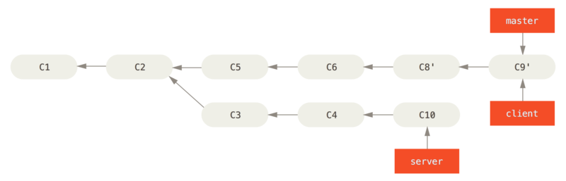
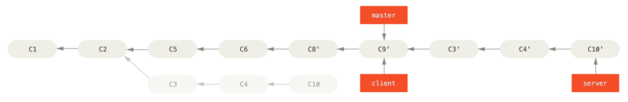

# git rebase

git rebase操作的实质是丢弃一些现有的提交，然后相应地新建一些内容一样但实际上不同的提交。


为了体会`rebase`, 可以体验下面几个场景. 

## 基本例子

最基本的场景, 把某个分支的内容合并到master分支. 

**初始化环境**

~~~shell
rm -rf rebase1
mkdir rebase1
cd rebase1
git init

touch D.txt
git add D.txt
git commit -m 'D'

touch E.txt
git add E.txt
git commit -m 'E'

git checkout -b topic
touch A.txt
git add A.txt
git commit -m 'A'

touch B.txt
git add B.txt
git commit -m 'B'

touch C.txt
git add C.txt
git commit -m 'C'

git checkout master
touch F.txt
git add F.txt
git commit -m 'F'

touch G.txt
git add G.txt
git commit -m 'G'

git lg --all
~~~

以上脚本, 将会得到如下的提交树. 

```shell
          A---B---C topic
         /
    D---E---F---G master
```

然后执行rebase

```shell
git rebase master topic
git lg --all
```

提交树变为:

```shell
                  A'--B'--C' topic
                 /
    D---E---F---G master
```

### 有趣的例子

假设创建了一个特性分支 `server`，为服务端添加了一些功能，提交了 `C3` 和 `C4`。 然后从 `C3` 上创建了特性分支 `client`，为客户端添加了一些功能，提交了 `C8` 和 `C9`。 最后，你回到 `server` 分支，又提交了 `C10`。


**初始化环境**

~~~shell
rm -rf rebase2
mkdir rebase2
cd rebase2
git init

touch C1.txt
git add C1.txt
git commit -m 'C1'

touch C2.txt
git add C2.txt
git commit -m 'C2'

git checkout -b server
touch C3.txt
git add C3.txt
git commit -m 'C3'

git tag v_c3

touch C4.txt
git add C4.txt
git commit -m 'C4'

git checkout master 
touch C5.txt
git add C5.txt
git commit -m 'C5'

touch C6.txt
git add C6.txt
git commit -m 'C6'

git checkout  -b  client v_c3

touch C8.txt
git add C8.txt
git commit -m 'C8'

touch C9.txt
git add C9.txt
git commit -m 'C9'

git checkout server

touch C10.txt
git add C10.txt
git commit -m 'C10'

git lg --all
~~~

这时, 你希望将 `client` 中的修改合并到主分支并发布，但暂时并不想合并 `server` 中的修改，因为它们还需要经过更全面的测试。 这时，你就可以使用 `git rebase` 命令的 `--onto` 选项，选中在 `client` 分支里但不在 `server` 分支里的修改（即 `C8` 和 `C9`），将它们在 `master` 分支上重放：

```
git rebase --onto master server client
```

以上命令的意思是：“取出 `client` 分支，找出处于 `client` 分支和 `server` 分支的共同祖先之后的修改，然后把它们在 `master` 分支上重放一遍”。 这理解起来有一点复杂，不过效果非常酷。


把client快速合并进master

~~~
git checkout master
git merge client
~~~



接下来你决定将 `server` 分支中的修改也整合进来。使用 `git rebase [basebranch] [topicbranch]`命令可以直接将特性分支（即本例中的 `server`）变基到目标分支（即 `master`）上。 ****

~~~
git rebase master server  
~~~



把server快速合并进master, 并删除client, server分支.   

~~~
git checkout master
git merge server

git branch -d client
git branch -d server
~~~


## 用 reword 和 fixup 打磨提交颗粒

在开发中, 在本地有时会产生很多次的提交,  这些提交有些过于琐碎. 可以通过`git base`来保持提交的合适粒度.  

在`git push`之前, 用rebase去整理本地的提交.  合并那些琐碎的提交, 使得精简后的每个提交都是较为有意义.  这样的提交同步到远程库后, 其他人能够清晰的了解你的完成思路. 如果没有这一步精简,其他人看到的或许是啰嗦的, 过于细节话的提交信息,反而很难理解你的真实思路. 

首先看看, 整理前后的版本树. 


**初始环境**

```shell
rm -rf rebase3
mkdir rebase3
cd rebase3
git init  

# 创建初次提交 C1
touch C1.txt
git add .
git commit -m 'C1-初次提交'  

# 创建提交 C2
git checkout -b develop
touch C2.txt
git add .
git commit -m "C2-详情页布局完成一半"

# 创建提交 C3
touch C3.txt
git add .
git commit -m "C3-详情页布局结束"

# 创建提交 C4
touch C4.txt
git add .
git commit -m "C4-修复了2个bug"

git lg --all
```

分析：`

1. 要把 C2 和 C3 合并为一个提交 C5. 
2. C5 的提交信息 C2 和 C3 都不同，那么 C2 需要先把提交信息改成合并后的提交信息。
3. C4 的提交信息修改。

```shell
git rebase -i HEAD^^^   # 整理前面几次的提交. 
```

这时会出现如下内容:


根据如下的命令, 对历史提交进行修改. 

- **p,pick**: 使用该提交，也是默认操作。这个命令的含义是拿到这个命令，但是什么都不做。
- **r,reword**: 拿到提交，修改提交的提交信息。

- **e,edit** : 拿到提交，修改这个提交的内容。使用这个命令的时候，rebase 操作会停在操作提交处，等待修改完毕，使用`git add .`和 `git commit --amend`修改提交，`git rebase --continue`继续 rebase 进程。
- **s,squash** : 这个命令很厉害的，可以将使用这个命令的提交与它的父提交融合为一个提交。
- **f,fixup**: 和 squash 命令的作用一样，不同的是，squash 命令会把融合的提交的提交信息都保存融合后的提交信息中，但是 fixup 会放弃被融合的提交。
- **d,drop**: 删除提交
- **x,exec**: 这个不常用

修改后的样子如下: 


保存退出后, 将会出现如下的窗口,  在里面我们输入如下新的submit message. 


再次保存退出后, 将会出现如下的窗口,  在里面我们输入如下新的submit message. 


查看版本树.

~~~shell
git lg --all
~~~


## 参考

- [git-rebase](<https://git-scm.com/docs/git-rebase>)
- [pro git - rebase](<https://progit.bootcss.com/#_rebasing>)
- [Git-rebase 黑魔法之打磨 commit 颗粒度](https://drprincess.github.io/2018/02/27/Git-rebase打造喜欢的commit颗粒感/#more)