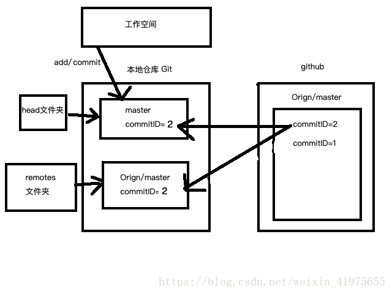
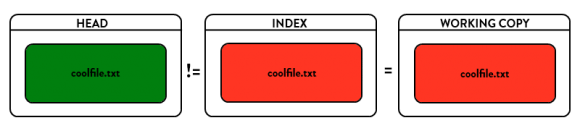
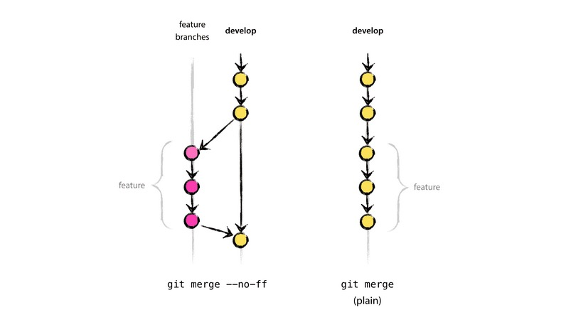

##  git

##  1. 常见命令

### .gitignore规则

~~~shell
#               表示此为注释,将被Git忽略
*.a             表示忽略所有 .a 结尾的文件
!lib.a          表示但lib.a除外
/TODO           表示仅仅忽略项目根目录下的 TODO 文件，不包括 subdir/TODO
build/          表示忽略 build/目录下的所有文件，过滤整个build文件夹；
doc/*.txt       表示会忽略doc/notes.txt但不包括 doc/server/arch.txt
 
bin/:           表示忽略当前路径下的bin文件夹，该文件夹下的所有内容都会被忽略，不忽略 bin 文件
/bin:           表示忽略根目录下的bin文件
/*.c:           表示忽略cat.c，不忽略 build/cat.c
debug/*.obj:    表示忽略debug/io.obj，不忽略 debug/common/io.obj和tools/debug/io.obj
**/foo:         表示忽略/foo,a/foo,a/b/foo等
a/**/b:         表示忽略a/b, a/x/b,a/x/y/b等
!/bin/run.sh    表示不忽略bin目录下的run.sh文件
*.log:          表示忽略所有 .log 文件
config.php:     表示忽略当前路径的 config.php 文件
 
/mtk/           表示过滤整个文件夹
*.zip           表示过滤所有.zip文件
/mtk/do.c       表示过滤某个具体文件
~~~

#### git fetch vs. git pull

git pull看起来像git fetch+get merge，但是根据commit ID来看的话，他们实际的实现原理是不一样的。详见[详解git pull和git fetch的区别](https://blog.csdn.net/weixin_41975655/article/details/82887273)，。

](images/20180928164725364.png)



#### 退出rebase

~~~shell
git rebase --abort
~~~

#### 更新远程分支

以下两个命令都可以的。

~~~shell
git remote update origin --prune
git fetch origin --prune
~~~

#### 修改远程地址

~~~shell
git remote set-url origin git@github.com:xuxiangwen/git-lab.git
git remote -vv
~~~

### 添加远程地址

~~~shell
git remote add splunk git@github.azc.ext.hp.com:splunk-it-ops/michael-splunk-study.git
git remote -vv
~~~

### centos7安装最新的git

centos7上默认的git版本是1.8. 解决方法是从 IUS repository安装。

IUS is a community project that provides RPM packages for newer versions of select software for Enterprise Linux distributions.

~~~
git --version
sudo yum -y remove git*
sudo yum -y install  https://centos7.iuscommunity.org/ius-release.rpm
sudo yum -y install  git2u-all
git --version
~~~


### github-git-cheat-sheet

[github-git-cheat-sheet](<https://github.github.com/training-kit/downloads/zh_CN/github-git-cheat-sheet/>)

### 避免直接把代码提交到master

首先定位到本地的repository目录，然后执行以下脚本。这样当用户`git commit`的时候，会触发警告，并提交失败。

~~~shell
cat << EOF > .git/hooks/pre-commit
#!/bin/sh

branch="\$(git rev-parse --abbrev-ref HEAD)"

if [ "\$branch" = "master" ]; then
  echo "You can't commit directly to master branch. "
  echo "Please see https://github.com/xuxiangwen/xuxiangwen.github.io/blob/master/20-git/simple_git_flow.md"
  exit 1
fi
EOF

chmod 755 .git/hooks/pre-commit
~~~

> 建议一个项目中，每个开发人员都在本地开发环境进行上述设置。

### [What's the difference between HEAD^ and HEAD~ in Git?](https://stackoverflow.com/questions/2221658/whats-the-difference-between-head-and-head-in-git)

在版本树中, 对于某一个节点, 我们可以用^或者~定位其上游的节点. 逻辑如下图所示

```
G   H   I   J
 \ /     \ /
  D   E   F
   \  |  / \
    \ | /   |
     \|/    |
      B     C
       \   /
        \ /
         A
         
A =      = A^0
B = A^   = A^1     = A~1
C = A^2  = A^2
D = A^^  = A^1^1   = A~2
E = B^2  = A^^2
F = B^3  = A^^3
G = A^^^ = A^1^1^1 = A~3
H = D^2  = B^^2    = A^^^2  = A~2^2
I = F^   = B^3^    = A^^3^
J = F^2  = B^3^2   = A^^3^2
```

### [删除敏感数据](https://help.github.com/en/articles/removing-sensitive-data-from-a-repository)

有的时候不小心把一些敏感信息发不到了GitHub上, 即使把这些信息除去，在文件的历史版本，还是可以看到。这种情况下，我们有两个方法。

#### [Using the BFG](<https://rtyley.github.io/bfg-repo-cleaner/>)

下载BFG包到本地. 

~~~
wget https://repo1.maven.org/maven2/com/madgag/bfg/1.13.0/bfg-1.13.0.jar -O bfg.jar
~~~

开始清理. 

~~~shell
url=git@github.com:xuxiangwen/aws-dms-wisdom.git
delete_files=dms.conf

# clone to local
git clone --mirror $url

# 清除一些文件. 默认情况下, BFG不会修改`master` (or '`HEAD`') branch的最后提交的内容, 而只会清除之前的提交. 
java -jar bfg.jar --strip-blobs-bigger-than 20M $(basename $url)   #删除超过20M的文件
java -jar bfg.jar --delete-files id_{dsa,rsa} $(basename $url)     #删除私钥
java -jar bfg.jar --delete-files ${delete_files:-un_exist_file}  $(basename $url)   #删除指定文件

# 把passwords.txt中所有的文本(支持正则表达式),替换为***REMOVED***.
cat << EOF > passwords.txt
XXXXXX
EOF

java -jar bfg.jar --replace-text passwords.txt --no-blob-protection $(basename $url)

# 
cd $(basename $url)
git reflog expire --expire=now --all && git gc --prune=now --aggressive     
git push   

# 
~~~

#### [Using filter-branch](https://help.github.com/en/articles/removing-sensitive-data-from-a-repository#using-filter-branch)

和BFG相似的方法。

~~~shell
file_name=????
git filter-branch --force --index-filter "git rm --cached --ignore-unmatch $file_name" --prune-empty --tag-name-filter cat -- --all

# 本地记录覆盖github的所有branch和tags
git push origin --force --all
git push origin --force --tags

# 如果没有问题的话，强制解除对本地存储库中的所有对象的引用和垃圾收集
git for-each-ref --format='delete %(refname)' refs/original | git update-ref --stdin
git reflog expire --expire=now --all
git gc --prune=now
~~~

#### 如何避免类似的泄密事件发生

- 使用可视化工具来提交, 这样可以更加容易看到哪些文件被添加, 修改和删除了.
- 避免`git add .` and `git commit -a`
- 使用`git add --interactive` 来review每个文件的 stage changes.
- 使用 `git diff --cached` 来review  the changes that you have staged for commit

### 处理push大文件（超过100m）的文件

~~~shell
git rm --cached giant_file   # Stage our giant file for removal, but leave it on disk
git commit --amend -CHEAD   # Amend the previous commit with your change   
# Simply making a new commit won't work, as you need# to remove the file from the unpushed history as well
git push   # Push our rewritten, smaller commit
~~~
### 设置用户和邮箱

~~~shell
#global configuration
git config --global user.name "eipi10"
git config --global user.email "eipi10@qq.com"

git config --global user.email aa00@hp.com
git config --global user.name aa00
~~~

### 查看设定

~~~shell
git config --list          #列出所有 Git当时能找到的配置
git config user.name
git config http.proxy
~~~

### 设置代理

~~~shell
git config --global  http.proxy proxy-server:port
~~~

### 移除文件

```shell
git rm PROJECTS.md            # 删除工作区和暂存区文件
git rm --cached PROJECTS.md   # 删除暂存区文件。对文件不再trace
```

### 显示所有分支

~~~
git branch -a    #包括本地和远程.
git branch -vv   #显示本地分支和远程分支的关系
~~~

### 查看已暂存和未暂存的修改

```shell
git diff            # 比较工作区和暂存区
git diff --staged   # 比较暂存区和git仓库
git diff --cached   # 同上
```

### 回退修改

**放弃当前工作区的修改**

~~~shell
git checkout -- <file>
~~~

**撤销提交到版本库**

撤销`git commit`. 常用的场景是, 在开发过程中, 进行了一次错误的提交(比如: 正常要提交到某个feature分支, 但错误提交到了master分支), 可以使用这个命令, 回滚到之前的某次提交.  相当于: 版本库->暂存区->工作区: 

```shell
git reset --hard  [commit-id]  #比较危险,慎用
git reset --hard HEAD          #丢掉本地修改. 把版本库刷到暂存区和工作区
```

> --hard
>
> Resets the index and working tree. Any changes to tracked files in the working tree since <commit> are discarded.


**撤销加入到暂存器的文件/目录**

Resets the index but not the working tree

一般都使用`git add`把文件或目录加入到暂存区. 以下命令会撤销这个动作, 撤销后, 文件/目录在当前工作区还是保持原来的状态(新增,修改或删除).    相当于: 版本库->暂存区

~~~shell
git reset -- [file/path]     
git reset HEAD [file/path]          # 和上面相同作用
git reset --mixed [commit-id]       # 如果[commit-id]没有指定, 会把当前版本库的内容替换暂存区
~~~

> --mixed
>
> Resets the index but not the working tree (i.e., the changed files are preserved but not marked for commit) and reports what has not been updated.


**把当前HEAD的指针指向某一个commit**

仅仅把HEAD指向某个commit,  不会修改暂存区和工作区的内容.   **暂时想不到场景下, 需要采用这条命令**

~~~shell
git reset --soft  [commit-id]   
~~~

> --soft
>
> Does not touch the index file or the working tree at all (but resets the head to <commit>, just like all modes do). This leaves all your changed files "Changes to be committed", as git status would put it.



### 查看远程仓库

~~~shell
git status -s    # 一种更为紧凑的格式输出 
~~~

### 查看已暂存和未暂存的修改

~~~shell
git diff            # 比较工作区和暂存区
git diff --staged   # 比较暂存区和git仓库. 也可以用git diff --cached 
git diff head       # 比较工作区和版本库(当前)
~~~

### 查看日志

~~~shell
git config --global alias.lg "log --color --graph --pretty=format:'%Cred%h%Creset -%C(yellow)%d%Creset %s %Cgreen(%cr) %C(bold blue)<%an>%Creset' --abbrev-commit"
git lg -p 5         # 显示最近5次的提交结果
git log --oneline --decorate --graph --all -p 5    # 上面的命令，内容和颜色都很丰富，下面的更简明
~~~

### [Git怎样撤销一次分支的合并Merge](https://segmentfault.com/q/1010000000140446)

```shell
git checkout 【merge操作时所在的分支】
git reset --hard 【merge前的版本号】
```

### git merge vs. git merge -no-ff



git merge –no-ff 可以保存你之前的分支历史。能够更好的查看 merge历史，以及branch 状态。–no-ff指的是强行关闭fast-forward方式。
git merge 则不会显示 feature，只保留单条分支记录。

> fast-forward方式就是当条件允许的时候，git直接把HEAD指针指向合并分支的头，完成合并。属于“快进方式”，不过这种情况如果删除分支，则会丢失分支信息。因为在这个过程中没有创建commit

## 2. Git 原理

#### 三大区域

- 工作区: Working Directory. 在git帮助中, 把它称为`working tree`.
- 暂存区: Staging Area.  在git帮助中, 把它称为`the index file`.
- 版本库: Repository


#### 提交对象

每次提交都会生成提交对象。见下图黄色部分。它包括：

- 树对象：指向暂存内容快照的指针。即下图绿色的部分。
- 作者的姓名和邮箱
- 提交时输入的信息
- 指向它的父对象的指针


#### Git 的分支（branch）

其实本质上仅仅是指向提交对象的可变指针。


####  HEAD 

是个指向当前所在的分支的特殊指针。当提交的时候，当前分支会移动，指向最新提交的对象，而HEAD总是指向当前分支。

**开始**


​           **提交后**

   

#### 提交信息

## 3. Git GUI

#### GitKrken

尝试了不少软件。感觉GitKrken界面效果很棒，但是linux下proxy无法设置成功，网上也没有找到可以解决的方法。

##### Linux

~~~
# 安装 https://support.gitkraken.com/how-to-install/
wget https://release.gitkraken.com/linux/gitkraken-amd64.rpm
sudo yum install ./gitkraken-amd64.rpm

## 启动
gitkraken --proxy-server=10.200.0.1:8080
~~~

在GitKrken中如果pull，push失败，可能需要[设置代理](#设置代理)。**前看起来还是不行。放弃这个工具了。**

#### GitHub Desktop

##### Linux

官方版本目前不支持linux，但是网上有linux的发布版本：<https://github.com/shiftkey/desktop>。惊喜。

~~~shell
wget https://github.com/shiftkey/desktop/releases/download/release-1.6.6-linux2/GitHubDesktop-linux-1.6.6-linux2.rpm
sudo yum install GitHubDesktop-linux-1.6.6-linux2.rpm
~~~

## 4. Git Flow

Git 作为一个源码管理系统，不可避免涉及到多人协作。

协作必须有一个规范的工作流程，让大家有效地合作，使得项目井井有条地发展下去。"工作流程"在英语里，叫做"workflow"或者"flow"，原意是水流，比喻项目像水流那样，顺畅、自然地向前流动，不会发生冲击、对撞、甚至漩涡。


主要有三种广泛使用的工作流程：

> - Git flow
> - Github flow
> - Gitlab flow

上文摘自[阮一峰](http://www.ruanyifeng.com/)的 [Git 工作流程](http://www.ruanyifeng.com/blog/2015/12/git-workflow.html)。

