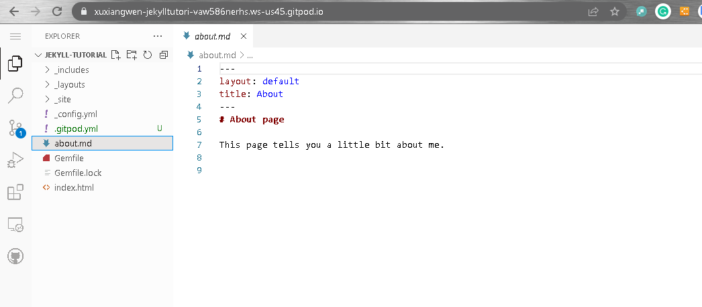
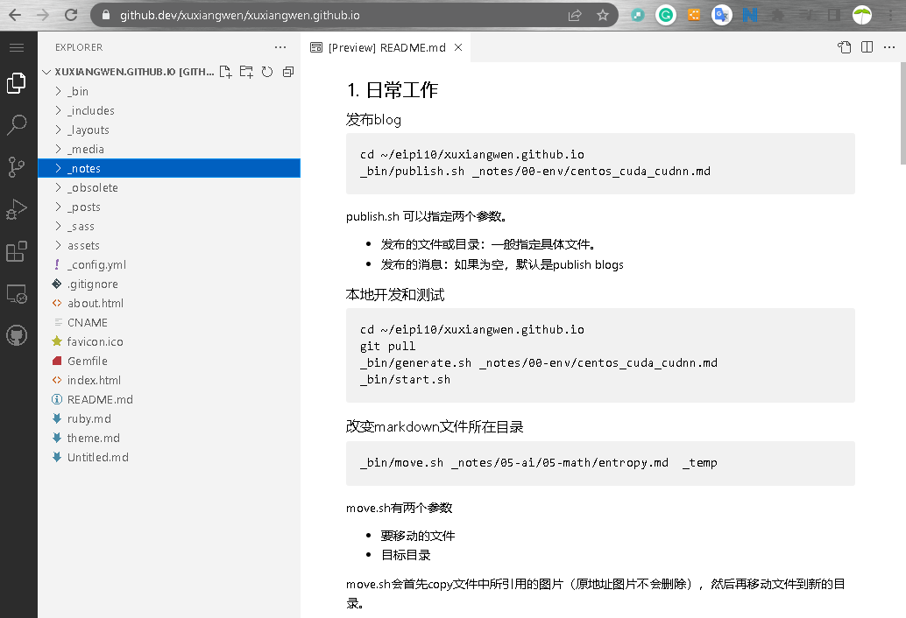
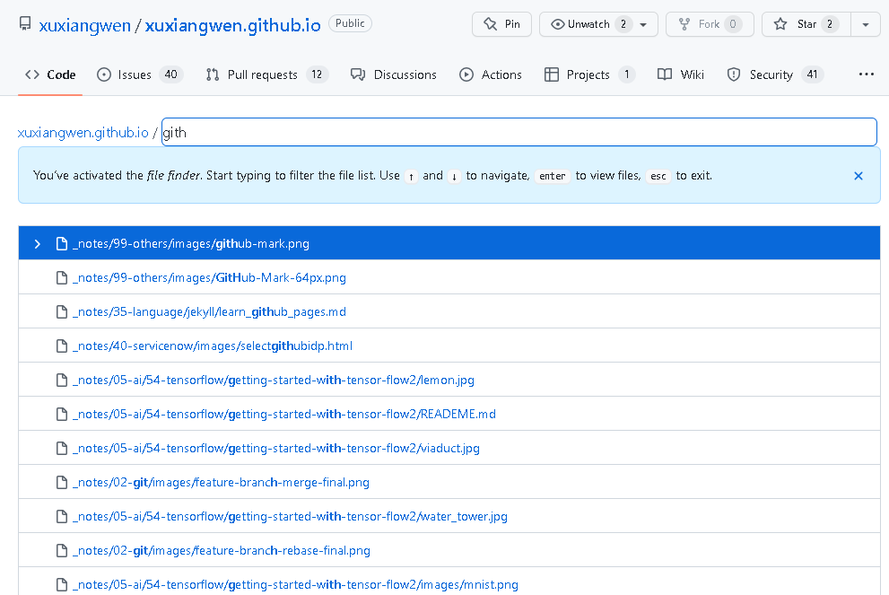
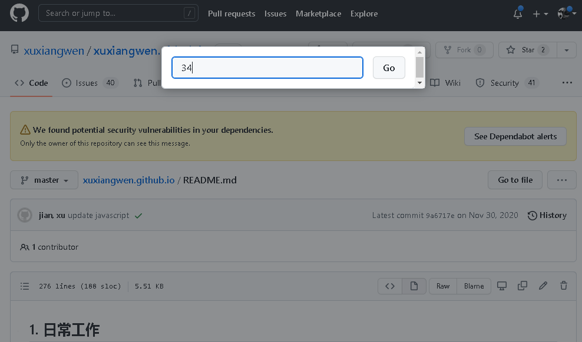
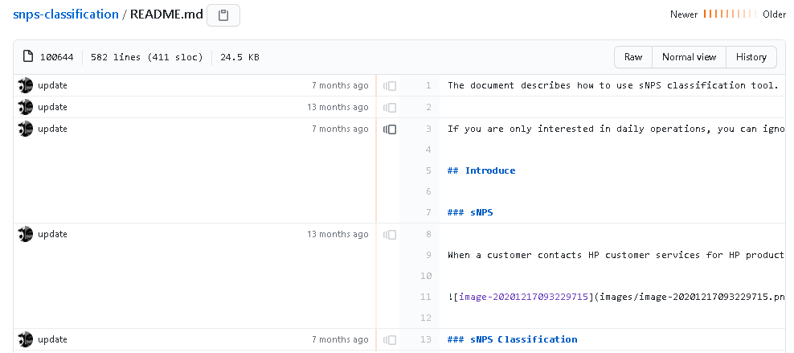

https://docs.github.com/cn/get-started/using-github/keyboard-shortcuts

## 最有用的那几个

### 站点操作

#### 高级搜索

- 命令

  | 限定符            | 示例                                                         |
  | ----------------- | ------------------------------------------------------------ |
  | `in:name`         | **jquery in:name** 匹配其名称中含有 "jquery" 的仓库。        |
  | `in:description`  | **jquery in:name,description** 匹配其名称或说明中含有 "jquery" 的仓库。 |
  | `in:readme`       | **jquery in:readme** 匹配其自述文件中提及 "jquery" 的仓库。  |
  | `repo:owner/name` | **repo:octocat/hello-world** 匹配特定仓库名称。              |

  | 限定符      | 示例                                                         |
  | ----------- | ------------------------------------------------------------ |
  | `stars:*n*` | **stars:500** 匹配恰好具有 500 个星号的仓库。                |
  |             | **stars:10..20** 匹配具有 10 到 20 个星号、小于 1000 KB 的仓库。 |
  |             | **stars:>=500 fork:true language:php** 匹配具有至少 500 个星号，包括复刻的星号（以 PHP 编写）的仓库。 |

  | 限定符    | 示例                                                         |
  | --------- | ------------------------------------------------------------ |
  | `in:file` | **octocat in:file** 匹配文件内容中出现 "octocat" 的代码。    |
  | `in:path` | **octocat in:path** 匹配文件路径中出现 "octocat" 的代码。    |
  |           | **octocat in:file,path** 匹配文件内容或文件路径中出现 "octocat" 的代码。 |

  https://www.365seal.com/y/58nrPolqVd.html

- 高级搜索页：https://github.com/search/advanced

### Repository操作

- 在repository前面加gitpod.io, 可以进入一个强大编辑器。

  

  Gitpod是一个在线IDE，可以从任何GitHub页面启动。只需**在任何GitHub-URL前加上“https：//gitpod.io#”**，或使用我们的[浏览器扩展](https://link.zhihu.com/?target=https%3A//chrome.google.com/webstore/detail/gitpod-online-ide/dodmmooeoklaejobgleioelladacbeki%3Fhl%3Den)为GitHub页面添加一个按钮。

- `.`

   打开web代码编辑器。

  

- `T`

  全文查找

  

### 文件操作

- `L`

  跳至代码中的某一行

  

- `B`

  打开一个文件，可以看到文件各个部分修改的历史。

  

## 站点快捷键

| 键盘快捷键 | 描述                                                         |
| :--------- | :----------------------------------------------------------- |
| S 或 /     | 聚焦于搜索栏。 更多信息请参阅“[关于在 GitHub 上搜索](https://docs.github.com/cn/search-github/getting-started-with-searching-on-github/about-searching-on-github)”。 |
| G N        | 转到您的通知。 更多信息请参阅"[关于通知](https://docs.github.com/cn/github/managing-subscriptions-and-notifications-on-github/about-notifications)”。 |
| Esc        | 当聚焦于用户、议题或拉取请求悬停卡时，关闭悬停卡并重新聚焦于悬停卡所在的元素 |

Command+K (Mac) 或
Ctrl+K (Windows/Linux) | 打开 GitHub 命令面板。 如果要编辑 Markdown 文本，请使用 Command+Option+K 或 Ctrl+Alt+K打开命令面板。 更多信息请参阅“[GitHub 命令面板](https://docs.github.com/cn/get-started/using-github/github-command-palette)”。

## 仓库

| 键盘快捷键 | 描述                                                         |
| :--------- | :----------------------------------------------------------- |
| G C        | 转到 **Code（代码）**选项卡                                  |
| G I        | 转到 **Issues（议题）**选项卡。 更多信息请参阅“[关于议题](https://docs.github.com/cn/articles/about-issues)”。 |
| G P        | 转到 **Pull requests（拉取请求）**选项卡。 更多信息请参阅“[关于拉取请求](https://docs.github.com/cn/pull-requests/collaborating-with-pull-requests/proposing-changes-to-your-work-with-pull-requests/about-pull-requests)”。 |
| G A        | 转到 **Actions（操作）**选项卡。 更多信息请参阅“[关于 Actions](https://docs.github.com/cn/actions/getting-started-with-github-actions/about-github-actions)”。 |
| G B        | 转到 **Projects（项目）**选项卡。 更多信息请参阅“[关于项目板](https://docs.github.com/cn/articles/about-project-boards)”。 |
| G W        | 转到 **Wiki** 选项卡。 更多信息请参阅“[关于 wiki](https://docs.github.com/cn/communities/documenting-your-project-with-wikis/about-wikis)”。 |
| G G        | 转到 **Discussions（讨论）**选项卡。 更多信息请参阅“[关于讨论](https://docs.github.com/cn/discussions/collaborating-with-your-community-using-discussions/about-discussions)”。 |

## 源代码编辑

| 键盘快捷键                                                   | 描述                                                         |
| :----------------------------------------------------------- | :----------------------------------------------------------- |
| .                                                            | 在基于 Web 的编辑器中打开存储库或拉取请求。 更多信息请参阅“[基于 Web 的编辑器](https://docs.github.com/cn/codespaces/developing-in-codespaces/web-based-editor)”。 |
| Command+B (Mac) 或 Ctrl+B (Windows/Linux)                    | 插入 Markdown 格式用于粗体文本                               |
| Command+I (Mac) 或 Ctrl+I (Windows/Linux)                    | 插入 Markdown 格式用于斜体文本                               |
| Command+K (Mac) 或 Ctrl+K (Windows/Linux)                    | 插入 Markdown 格式以创建链接                                 |
| Command+Shift+7 (Mac) 或 Ctrl+Shift+7 (Windows/Linux)        | 为有序列表插入 Markdown 格式                                 |
| Command+Shift+8 (Mac) 或 Ctrl+Shift+8 (Windows/Linux)        | 为无序列表插入 Markdown 格式                                 |
| Command+Shift+. (Mac) 或 Ctrl+Shift+. (Windows/Linux)        | 为报价插入 Markdown 格式                                     |
| E                                                            | 在 **Edit file（编辑文件）**选项卡中打开源代码文件           |
| Command+F (Mac) 或 Ctrl+F (Windows/Linux)                    | 开始在文件编辑器中搜索                                       |
| Command+G (Mac) 或 Ctrl+G (Windows/Linux)                    | 查找下一个                                                   |
| Command+Shift+G (Mac) 或 Ctrl+Shift+G (Windows/Linux)        | 查找上一个                                                   |
| Command+Option+F (Mac) 或 Ctrl+Shift+F (Windows/Linux)       | 替换                                                         |
| Command+Shift+Option+F (Mac) 或 Ctrl+Shift+R (Windows/Linux) | 全部替换                                                     |
| Alt+G                                                        | 跳至行                                                       |
| Command+Z (Mac) 或 Ctrl+Z (Windows/Linux)                    | 撤消                                                         |
| Command+Y (Mac) 或 Ctrl+Y (Windows/Linux)                    | 重做                                                         |
| Command+Shift+P                                              | 在 **Edit file（编辑文件）** 与 **Preview changes（预览更改）**选项卡之间切换 |
| Command+S (Mac) 或 Ctrl+S (Windows/Linux)                    | 填写提交消息                                                 |

有关更多键盘快捷键，请参阅 [CodeMirror 文档](https://codemirror.net/doc/manual.html#commands)。

## 源代码浏览

| 键盘快捷键 | 描述                                                         |
| :--------- | :----------------------------------------------------------- |
| T          | 激活文件查找器                                               |
| L          | 跳至代码中的某一行                                           |
| W          | 切换到新分支或标记                                           |
| Y          | 将 URL 展开为其规范形式。 更多信息请参阅“[获取文件的永久链接](https://docs.github.com/cn/articles/getting-permanent-links-to-files)”。 |
| I          | 显示或隐藏有关差异的评论。 更多信息请参阅“[评论拉取请求的差异](https://docs.github.com/cn/articles/commenting-on-the-diff-of-a-pull-request)”。 |
| A          | 在差异上显示或隐藏注释                                       |
| B          | 打开追溯视图。 更多信息请参阅“[跟踪文件中的更改](https://docs.github.com/cn/articles/tracing-changes-in-a-file)”。 |