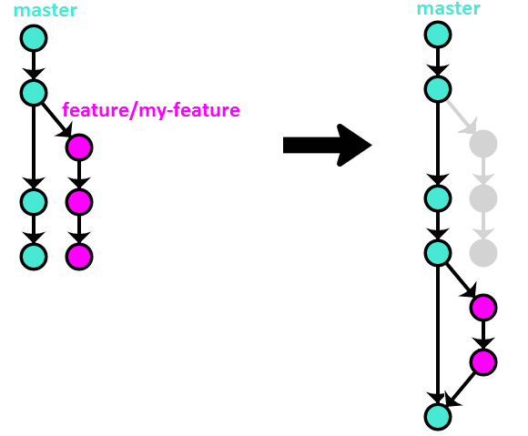

https://www.endoflineblog.com/oneflow-a-git-branching-model-and-workflow

## 创建实验环境脚本

~~~shell
cat << EOF > build.sh
# !/bin/bash
feature=\$1
export feature=\$feature

echo -----------------refresh master-----------------

git checkout master
git fetch origin
git merge origin/master

echo -----------------remove \$feature created before-----------------
git branch -vv -a
if git branch -vv -a | grep "origin/\$feature"; then git push origin -d \$feature; fi 
if git branch -vv -a | grep "\$feature"; then git branch -D \$feature; fi

echo -----------------create branch  \$feature-----------------
git checkout -b \$feature master

echo `date "+%Y-%m-%d %H:%M:%S"` > \$feature.txt
git add \$feature.txt
git commit -m "add \$feature.txt"
git push -u origin \$feature 

echo ------------------------changes on master------------------------

git checkout master
echo `date "+%Y-%m-%d %H:%M:%S"`: after checkout \$feature > master.txt
git add master.txt build.sh
git commit --author="others <others@hp.com>" -m "when develop \$feature branch"
git push 

echo ------------------------branch------------------------
git branch -vv -a

echo ------------------------log------------------------
git config --global alias.lg "log --color --graph --pretty=format:'%Cred%h%Creset -%C(yellow)%d%Creset %s %Cgreen(%cr) %C(bold blue)<%an>%Creset' --abbrev-commit"

git lg -10  --all

EOF

chmod 755 build.sh

~~~

## 几种选项

##### Option 1  – rebase

~~~shell
. ./build.sh  feature-01

git checkout $feature
git rebase -i master

git checkout master
git merge --ff-only $feature
git push origin master

git branch -D $feature

git branch -vv -a
git lg -10  --all
~~~

##### Option 2 – merge –no-ff

~~~shell
. ./build.sh  feature-02

git checkout master
git merge --no-ff $feature
git push origin master
git branch -D $feature

git branch -vv -a
git lg -10  --all
~~~

##### Option 3 – rebase + merge –no–ff

~~~shell
. ./build.sh  feature-03

git checkout $feature
git rebase -i master

git checkout master
git merge --no-ff $feature
git push origin master

git branch -D $feature

git branch -vv -a
git lg -10  --all
~~~

> 对于option 1, option 3，其远程分支(origin/feature-xxx)无法使用，对于多人开发，这是一个问题。