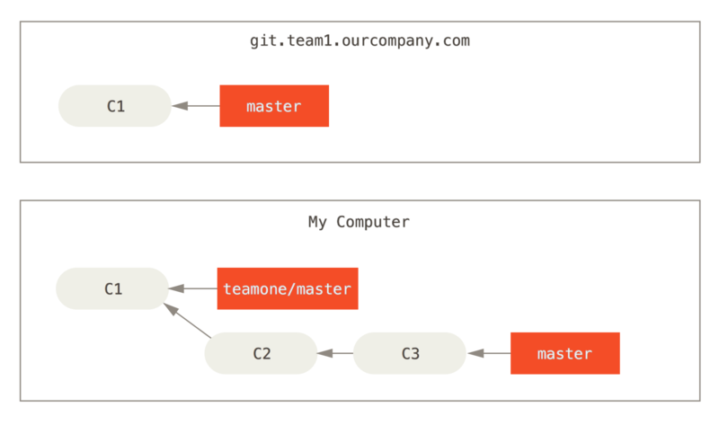

## Git 分支

为何 Git 的分支模型如此出众呢？ Git 处理分支的方式可谓是难以置信的轻量，创建新分支这一操作几乎能在瞬间完成，并且在不同分支之间的切换操作也是一样便捷。

### 分支简介

Git 保存的不是文件的变化或者差异，而是一系列不同时刻的文件快照。

在进行提交操作时，Git 会保存一个提交对象（commit object），提交对象会包含：

- 指向暂存内容快照的指针
- 作者的姓名和邮箱
- 提交时输入的信息
- 指向它的父对象的指针

假设现在有一个工作目录，里面包含了三个将要被暂存和提交的文件。 暂存操作会为每一个文件计算校验和（使用我们在 [起步](https://progit.bootcss.com/#_getting_started) 中提到的 SHA-1 哈希算法），然后会把当前版本的文件快照保存到 Git 仓库中（Git 使用 blob 对象来保存它们），最终将校验和加入到暂存区域等待提交：

```console
git add README test.rb LICENSE
git commit -m 'The initial commit of my project'
```

当使用 `git commit` 进行提交操作时，Git 会先计算每一个子目录（本例中只有项目根目录）的校验和，然后在 Git 仓库中这些校验和保存为树对象。 随后，Git 便会创建一个提交对象，它除了包含上面提到的那些信息外，还包含指向这个树对象（项目根目录）的指针。

现在，Git 仓库中有五个对象：三个 blob 对象（保存着文件快照）、一个树对象（记录着目录结构和 blob 对象索引）以及一个提交对象（包含着指向前述树对象的指针和所有提交信息）。


*Figure 9. 首次提交对象及其树结构*

做些修改后再次提交，那么这次产生的提交对象会包含一个指向上次提交对象（父对象）的指针。


 *Figure 10. 提交对象及其父对象*

**Git 的分支，其实本质上仅仅是指向提交对象的可变指针。**

#### 分支创建

Git 是怎么创建新分支的呢？ 很简单，它只是为你创建了一个可以移动的新的指针。

```console
git branch testing
git log --oneline --decorate   # 查看各个分支当前所指的对象
```


*Figure 12. 两个指向相同提交历史的分支*

Git 又是怎么知道当前在哪一个分支上呢？ 也很简单，它有一个名为 `HEAD` 的特殊指针。 请注意它和许多其它版本控制系统（如 Subversion 或 CVS）里的 `HEAD` 概念完全不同。 在 Git 中，它是一个指针，指向当前所在的本地分支（译注：将 `HEAD` 想象为当前分支的别名）。


*Figure 13. HEAD 指向当前所在的分支*

#### 分支切换

```console
git checkout testing    # 这样 HEAD 就指向 testing 分支了。
```


*Figure 14. HEAD 指向当前所在的分支*

这样的实现方式会给我们带来什么好处呢？ 现在不妨再提交一次：

```console
echo test > test.rb
git add test.rb
git commit -m 'made a change'
git log --oneline --decorate  
```

`testing` 分支向前移动了，但是 `master` 分支却没有，它仍然指向运行 `git checkout` 时所指的对象。

15. HEAD 分支随着提交操作自动向前移动*

```console
git checkout master
git log --oneline --decorate  
```


*Figure 16. 检出时 HEAD 随之移动*

这条命令做了两件事。 一是使 HEAD 指回 `master` 分支，二是将工作目录恢复成 `master` 分支所指向的快照内容。 也就是说，你现在做修改的话，项目将始于一个较旧的版本（可以发现test.rb不在当前工作区了）。 本质上来讲，这就是忽略 `testing` 分支所做的修改，以便于向另一个方向进行开发。 

再稍微做些修改并提交：

```
echo test1 > test.rb
git add test.rb
git commit -m 'made a change'
git log --oneline --decorate --graph --all
```

这个项目的提交历史已经产生了分叉（参见 [项目分叉历史](https://progit.bootcss.com/#divergent_history)）。 因为刚才你创建了一个新分支，并切换过去进行了一些工作，随后又切换回 master 分支进行了另外一些工作。 上述两次改动针对的是不同分支：你可以在不同分支间不断地来回切换和工作，并在时机成熟时将它们合并起来。 


*Figure 17. 项目分叉历史*

由于 Git 的分支实质上仅是包含所指对象校验和（长度为 40 的 SHA-1 值字符串）的文件，所以它的创建和销毁都异常高效。 创建一个新分支就相当于往一个文件中写入 41 个字节（40 个字符和 1 个换行符），如此的简单能不快吗？

这与过去大多数版本控制系统形成了鲜明的对比，它们在创建分支时，将所有的项目文件都复制一遍，并保存到一个特定的目录。 完成这样繁琐的过程通常需要好几秒钟，有时甚至需要好几分钟。所需时间的长短，完全取决于项目的规模。而在 Git 中，任何规模的项目都能在瞬间创建新分支。 同时，由于每次提交都会记录父对象，所以寻找恰当的合并基础（译注：即共同祖先）也是同样的简单和高效。 这些高效的特性使得 Git 鼓励开发人员频繁地创建和使用分支。

### 分支的新建与合并

经历如下步骤：

1. 开发某个网站。
2. 为实现某个新的需求，创建一个分支。
3. 在这个分支上开展工作。

正在此时，你突然接到一个电话说有个很严重的问题需要紧急修补。 你将按照如下方式来处理：

1. 切换到你的线上分支（production branch）。
2. 为这个紧急任务新建一个分支，并在其中修复它。
3. 在测试通过之后，切换回线上分支，然后合并这个修补分支，最后将改动推送到线上分支。
4. 切换回你最初工作的分支上，继续工作。

准备工作

```
git checkout master
echo create > branch_demo.txt
git add branch_demo.txt
git commit -m 'add branch_demo.txt'
```

#### 新建分支

当前状态如下:


*Figure 18. 一个简单提交历史*

现在，你已经决定要解决你的公司使用的问题追踪系统中的 #53 问题。 想要新建一个分支并同时切换到那个分支上。

```console
git checkout -b iss53
git branch iss53          # 上面命令简写
git checkout iss53		  # 上面命令简写
```


*Figure 19. 创建一个新分支指针*

你继续在 #53 问题上工作，并且做了一些提交。 在此过程中，`iss53` 分支在不断的向前推进，因为你已经检出到该分支（也就是说，你的 `HEAD` 指针指向了 `iss53` 分支）

```console
echo modify [issue 53] >> branch_demo.txt
git commit -a -m 'modify [issue 53]'
```


*Figure 20. iss53 分支随着工作的进展向前推进*

现在你接到那个电话，有个紧急问题等待你来解决。 有了 Git 的帮助，你不必把这个紧急问题和 `iss53` 的修改混在一起，你也不需要花大力气来还原关于 53# 问题的修改，然后再添加关于这个紧急问题的修改，最后将这个修改提交到线上分支。 你所要做的仅仅是切换回 `master` 分支。

但是，在你这么做之前，要留意你的工作目录和暂存区里那些还没有被提交的修改，它可能会和你即将检出的分支产生冲突从而阻止 Git 切换到该分支。 最好的方法是，在你切换分支之前，保持好一个干净的状态。 有一些方法可以绕过这个问题（即，保存进度（stashing） 和 修补提交（commit amending）），我们会在 [储藏与清理](https://progit.bootcss.com/#_git_stashing) 中看到关于这两个命令的介绍。 现在，我们假设你已经把你的修改全部提交了，这时你可以切换回 `master`分支了：

```console
git checkout master
```

这个时候，你的工作目录和你在开始 #53 问题之前一模一样，现在你可以专心修复紧急问题了。 请牢记：当你切换分支的时候，Git 会重置你的工作目录，使其看起来像回到了你在那个分支上最后一次提交的样子。 Git 会自动添加、删除、修改文件以确保此时你的工作目录和这个分支最后一次提交时的样子一模一样。

接下来，你要修复这个紧急问题。 让我们建立一个针对该紧急问题的分支（hotfix branch），在该分支上工作直到问题解决：

```console
git checkout -b hotfix
echo modify hotfix >> branch_demo.txt
git commit -a -m 'fix hotfix'
```


*Figure 21. 基于* `master` *分支的紧急问题分支* `hotfix branch`

你可以运行你的测试，确保你的修改是正确的，然后将其合并回你的 `master` 分支来部署到线上。 你可以使用 `git merge` 命令来达到上述目的：

```console
git checkout master
git merge hotfix
```

在合并的时候，你应该注意到了"快进（fast-forward）"这个词。 由于当前 `master` 分支所指向的提交是你当前提交（有关 hotfix 的提交）的直接上游，所以 Git 只是简单的将指针向前移动。 换句话说，当你试图合并两个分支时，如果顺着一个分支走下去能够到达另一个分支，那么 Git 在合并两者的时候，只会简单的将指针向前推进（指针右移），因为这种情况下的合并操作没有需要解决的分歧——这就叫做 “快进（fast-forward）”。


*Figure 22.* `master` *被快进到* `hotfix`

关于这个紧急问题的解决方案发布之后，你准备回到被打断之前时的工作中。 然而，你应该先删除 `hotfix` 分支，因为你已经不再需要它了 —— `master` 分支已经指向了同一个位置。 你可以使用带 `-d` 选项的 `git branch` 命令来删除分支：

```console
git branch -d hotfix
```

现在你可以切换回你正在工作的分支继续你的工作，也就是针对 #53 问题的那个分支（iss53 分支）

```console
git checkout iss53
echo modify iss53 >> index.html
git commit -a -m 'finished the new footer [issue 53]'
```


Figure 23. 继续在 `iss53` 分支上的工作

你在 `hotfix` 分支上所做的工作并没有包含到 `iss53` 分支中。 如果你需要拉取 `hotfix` 所做的修改，你可以使用 `git merge master` 命令将 `master` 分支合并入 `iss53` 分支，或者你也可以等到 `iss53` 分支完成其使命，再将其合并回 `master` 分支。

#### 分支的合并

假设你已经修正了 #53 问题，并且打算将你的工作合并入 `master` 分支。 为此，你需要合并 `iss53` 分支到 `master` 分支，这和之前你合并 `hotfix` 分支所做的工作差不多。 你只需要检出到你想合并入的分支，然后运行 `git merge` 命令：

```console
git checkout master
git merge iss53
git commit -a -m 'merge with iss53'   # 实际操作中，index.html，需要人为合并一下，然后再提交。
git log --oneline --decorate --graph --all -6  
```

这和你之前合并 `hotfix` 分支的时候看起来有一点不一样。 在这种情况下，你的开发历史从一个更早的地方开始分叉开来（diverged）。 因为，`master` 分支所在提交并不是 `iss53` 分支所在提交的直接祖先，Git 不得不做一些额外的工作。 出现这种情况的时候，Git 会使用两个分支的末端所指的快照（`C4` 和 `C5`）以及这两个分支的工作祖先（`C2`），做一个简单的三方合并。

*

*Figure 24. 一次典型合并中所用到的三个快照*

和之前将分支指针向前推进所不同的是，Git 将此次三方合并的结果做了一个新的快照并且自动创建一个新的提交指向它。 这个被称作一次合并提交，它的特别之处在于他有不止一个父提交。


*Figure 25. 一个合并提交*

需要指出的是，Git 会自行决定选取哪一个提交作为最优的共同祖先，并以此作为合并的基础；这和更加古老的 CVS 系统或者 Subversion （1.5 版本之前）不同，在这些古老的版本管理系统中，用户需要自己选择最佳的合并基础。 Git 的这个优势使其在合并操作上比其他系统要简单很多。

既然你的修改已经合并进来了，你已经不再需要 `iss53` 分支了。 现在你可以在任务追踪系统中关闭此项任务，并删除这个分支。

git branch -d iss53

#### 遇到冲突时的分支合并

有时候合并操作不会如此顺利。 如果你在两个不同的分支中，对同一个文件的同一个部分进行了不同的修改，Git 就没法干净的合并它们。 如果你对 #53 问题的修改和有关 `hotfix` 的修改都涉及到同一个文件的同一处，在合并它们的时候就会产生合并冲突：

```console
git merge iss53
Auto-merging index.html
CONFLICT (content): Merge conflict in index.html
Automatic merge failed; fix conflicts and then commit the result.
```

此时 Git 做了合并，但是没有自动地创建一个新的合并提交。 Git 会暂停下来，等待你去解决合并产生的冲突。 你可以在合并冲突后的任意时刻使用 `git status` 命令来查看那些因包含合并冲突而处于未合并（unmerged）状态的文件：

```console
git status
On branch master
You have unmerged paths.
  (fix conflicts and run "git commit")

Unmerged paths:
  (use "git add <file>..." to mark resolution)

    both modified:      index.html

no changes added to commit (use "git add" and/or "git commit -a")
```

任何因包含合并冲突而有待解决的文件，都会以未合并状态标识出来。 Git 会在有冲突的文件中加入标准的冲突解决标记，这样你可以打开这些包含冲突的文件然后手动解决冲突。 出现冲突的文件会包含一些特殊区段，看起来像下面这个样子：

```html
<<<<<<< HEAD:index.html
<div id="footer">contact : email.support@github.com</div>
=======
<div id="footer">
 please contact us at support@github.com
</div>
>>>>>>> iss53:index.html
```

这表示 `HEAD` 所指示的版本（也就是你的 `master` 分支所在的位置，因为你在运行 merge 命令的时候已经检出到了这个分支）在这个区段的上半部分（`=======` 的上半部分），而 `iss53` 分支所指示的版本在 `=======` 的下半部分。 为了解决冲突，你必须选择使用由 `=======` 分割的两部分中的一个，或者你也可以自行合并这些内容。 

如果你想使用图形化工具来解决冲突，你可以运行 `git mergetool`(用起来还需要慢慢熟悉)，该命令会为你启动一个合适的可视化合并工具，并带领你一步一步解决这些冲突：

```console
git mergetool

This message is displayed because 'merge.tool' is not configured.
See 'git mergetool --tool-help' or 'git help config' for more details.
'git mergetool' will now attempt to use one of the following tools:
opendiff kdiff3 tkdiff xxdiff meld tortoisemerge gvimdiff diffuse diffmerge ecmerge p4merge araxis bc3 codecompare vimdiff emerge
Merging:
index.html

Normal merge conflict for 'index.html':
  {local}: modified file
  {remote}: modified file
Hit return to start merge resolution tool (opendiff):
```

等你退出合并工具之后，Git 会询问刚才的合并是否成功。 如果你回答是，Git 会暂存那些文件以表明冲突已解决： 你可以再次运行 `git status` 来确认所有的合并冲突都已被解决：

```console
git status
On branch master
All conflicts fixed but you are still merging.
  (use "git commit" to conclude merge)

Changes to be committed:

    modified:   index.html
```

如果你对结果感到满意，并且确定之前有冲突的的文件都已经暂存了，这时你可以输入 `git commit` 来完成合并提交。 默认情况下提交信息看起来像下面这个样子：

```console
Merge branch 'iss53'

Conflicts:
    index.html
#
# It looks like you may be committing a merge.
# If this is not correct, please remove the file
#	.git/MERGE_HEAD
# and try again.

# Please enter the commit message for your changes. Lines starting
# with '#' will be ignored, and an empty message aborts the commit.
# On branch master
# All conflicts fixed but you are still merging.
#
# Changes to be committed:
#	modified:   index.html
#
```

### 分支管理

`git branch` 命令不加参数，得到所有分支列表。

```console
git branch
```

```console
  iss53
* master
  testing
```

注意 `master` 分支前的 `*` 字符：它代表现在检出的那一个分支（也就是说，当前 `HEAD` 指针所指向的分支）。

```console
git branch -v     #  查看每一个分支的最后一次提交
```

`--merged` 与 `--no-merged` 这两个有用的选项可以过滤这个列表中已经合并或尚未合并到当前分支的分支。 

```console
git branch --merged
git branch --no-merged
```

### 分支开发工作流

#### 长期分支

因为 Git 使用简单的三方合并，所以就算在一段较长的时间内，反复把一个分支合并入另一个分支，也不是什么难事。 也就是说，在整个项目开发周期的不同阶段，你可以同时拥有多个开放的分支；你可以定期地把某些特性分支合并入其他分支中。

许多使用 Git 的开发者都喜欢使用这种方式来工作，比如只在 `master` 分支上保留完全稳定的代码——有可能仅仅是已经发布或即将发布的代码。 他们还有一些名为 `develop` 或者 `next` 的平行分支，被用来做后续开发或者测试稳定性——这些分支不必保持绝对稳定，但是一旦达到稳定状态，它们就可以被合并入 `master` 分支了。 

事实上我们刚才讨论的，是随着你的提交而不断右移的指针。 稳定分支的指针总是在提交历史中落后一大截，而前沿分支的指针往往比较靠前。


*Figure 26. 渐进稳定分支的线性图*

通常把他们想象成流水线（work silos）可能更好理解一点，那些经过测试考验的提交会被遴选到更加稳定的流水线上去。


*Figure 27. 渐进稳定分支的流水线（“silo”）视图*

#### 特性分支

特性分支对任何规模的项目都适用。 特性分支是一种短期分支，它被用来实现单一特性或其相关工作。

考虑这样一个例子，你在 `master` 分支上工作到 `C1`，这时为了解决一个问题而新建 `iss91` 分支，在 `iss91` 分支上工作到 `C4`，然而对于那个问题你又有了新的想法，于是你再新建一个 `iss91v2` 分支试图用另一种方法解决那个问题，接着你回到 `master` 分支工作了一会儿，你又冒出了一个不太确定的想法，你便在 `C10` 的时候新建一个 `dumbidea` 分支，并在上面做些实验。 你的提交历史看起来像下面这个样子：


*Figure 28. 拥有多个特性分支的提交历史*

现在，我们假设两件事情：你决定使用第二个方案来解决那个问题，即使用在 `iss91v2` 分支中方案；另外，你将 `dumbidea` 分支拿给你的同事看过之后，结果发现这是个惊人之举。 这时你可以抛弃 `iss91` 分支（即丢弃 `C5` 和 `C6` 提交），然后把另外两个分支合并入主干分支。 最终你的提交历史看起来像下面这个样子：


*Figure 29. 合并了* `dumbidea` *和* `iss91v2` *分支之后的提交历史*

### 远程分支

远程引用是对远程仓库的引用（指针），包括分支、标签等等。 你可以通过 `git ls-remote (remote)` 来显式地获得远程引用的完整列表，或者通过 `git remote show (remote)` 获得远程分支的更多信息。 然而，一个更常见的做法是利用远程跟踪分支。

远程跟踪分支是远程分支状态的引用。 它们是你不能移动的本地引用，当你做任何网络通信操作时，它们会自动移动。 远程跟踪分支像是你上次连接到远程仓库时，那些分支所处状态的书签。

它们以 `(remote)/(branch)` 形式命名。 例如，如果你想要看你最后一次与远程仓库 `origin` 通信时 `master` 分支的状态，你可以查看 `origin/master` 分支。 你与同事合作解决一个问题并且他们推送了一个 `iss53` 分支，你可能有自己的本地 `iss53` 分支；但是在服务器上的分支会指向 `origin/iss53` 的提交。

 假设你的网络里有一个在 `git.ourcompany.com` 的 Git 服务器。 如果你从这里克隆，Git 的 `clone` 命令会为你自动将其命名为 `origin`，拉取它的所有数据，创建一个指向它的 `master` 分支的指针，并且在本地将其命名为 `origin/master`。 Git 也会给你一个与 origin 的 `master` 分支在指向同一个地方的本地 `master` 分支，这样你就有工作的基础。


*Figure 30. 克隆之后的服务器与本地仓库*

如果你在本地的 `master` 分支做了一些工作，然而在同一时间，其他人推送提交到 `git.ourcompany.com`并更新了它的 `master` 分支，那么你的提交历史将向不同的方向前进。 也许，只要你不与 origin 服务器连接，你的 `origin/master` 指针就不会移动。


*Figure 31. 本地与远程的工作可以分叉*

如果要同步你的工作，运行 `git fetch origin` 命令。 这个命令查找 “origin” 是哪一个服务器（在本例中，它是 `git.ourcompany.com`），从中抓取本地没有的数据，并且更新本地数据库，移动 `origin/master`指针指向新的、更新后的位置。


*Figure 32.* `git fetch` *更新你的远程仓库引用*

**多个远程分支**


可以运行 `git fetch teamone` 来抓取远程仓库 `teamone` 有而本地没有的数据。


*Figure 34. 远程跟踪分支* `teamone/master`

#### 推送

当你想要公开分享一个分支时，需要将其推送到有写入权限的远程仓库上。 本地的分支并不会自动与远程仓库同步 - 你必须显式地推送想要分享的分支。 这样，你就可以把不愿意分享的内容放到私人分支上，而将需要和别人协作的内容推送到公开分支。比如：有的时候你的代码是公司项目的内容，同时公司也允许你的历史版本进行开源，就可以用这个方法，但这种情况下，一定要小心谨慎。

```console
git checkout -b serverfix   # 保证本地有serverfix分支
git push origin serverfix
```

这里有些工作被简化了。 Git 自动将 `serverfix` 分支名字展开为 `refs/heads/serverfix:refs/heads/serverfix`，那意味着，“推送本地的 serverfix 分支来更新远程仓库上的 serverfix 分支。你也可以运行 `git push origin serverfix:serverfix`，它会做同样的事 - 相当于它说，“推送本地的 serverfix 分支，将其作为远程仓库的 serverfix 分支” 可以通过这种格式来推送本地分支到一个命名不相同的远程分支。 如果并不想让远程仓库上的分支叫做 `serverfix`，可以运行 `git push origin serverfix:awesomebranch` 来将本地的 `serverfix` 分支推送到远程仓库上的 `awesomebranch` 分支。

一次其他协作者从服务器上抓取数据时，他们会在本地生成一个远程分支 `origin/serverfix`，指向服务器的 `serverfix` 分支的引用：

```console
git fetch origin
```

可以运行 `git merge origin/serverfix` 将这些工作合并到当前所在的分支。 如果想要在自己的 `serverfix` 分支上工作，可以将其建立在远程跟踪分支之上：

```console
git checkout -b serverfix origin/serverfix
```

#### 跟踪分支

从一个远程跟踪分支检出一个本地分支会自动创建一个叫做 “跟踪分支”（有时候也叫做 “上游分支”）。 跟踪分支是与远程分支有直接关系的本地分支。 如果在一个跟踪分支上输入 `git pull`，Git 能自动地识别去哪个服务器上抓取、合并到哪个分支。

当克隆一个仓库时，它通常会自动地创建一个跟踪 `origin/master` 的 `master` 分支。 然而，如果你愿意的话可以设置其他的跟踪分支 - 其他远程仓库上的跟踪分支，或者不跟踪 `master` 分支。 最简单的就是之前看到的例子，运行 `git checkout -b [branch] [remotename]/[branch]`。 这是一个十分常用的操作所以 Git 提供了 `--track` 快捷方式：

```console
git checkout --track origin/serverfix
```

#### 拉取

当 `git fetch` 命令从服务器上抓取本地没有的数据时，它并不会修改工作目录中的内容。 它只会获取数据然后让你自己合并。 然而，有一个命令叫作 `git pull` 在大多数情况下它的含义是一个 `git fetch` 紧接着一个 `git merge` 命令。

由于 `git pull` 的魔法经常令人困惑所以通常单独显式地使用 `fetch` 与 `merge` 命令会更好一些。

#### 删除远程分支

```console
git push origin --delete serverfix
```

### 变基

在 Git 中整合来自不同分支的修改主要有两种方法：`merge` 以及 `rebase`。 在本节中我们将学习什么是“变基”，怎样使用“变基”，并将展示该操作的惊艳之处，以及指出在何种情况下你应避免使用它。

#### 变基的基本操作


*Figure 35. 分叉的提交历史*

之前介绍过，整合分支最容易的方法是 `merge` 命令。 它会把两个分支的最新快照（`C3` 和 `C4`）以及二者最近的共同祖先（`C2`）进行三方合并，合并的结果是生成一个新的快照（并提交）。


*Figure 36. 通过合并操作来整合分叉了的历史*

其实，还有一种方法：你可以提取在 `C4` 中引入的补丁和修改，然后在 `C3` 的基础上应用一次。 在 Git 中，这种操作就叫做 *变基*。 你可以使用 `rebase` 命令将提交到某一分支上的所有修改都移至另一分支上，就好像“重新播放”一样。

```console
git checkout experiment
git rebase master
```

它的原理是首先找到这两个分支（即当前分支 `experiment`、变基操作的目标基底分支 `master`）的最近共同祖先 `C2`，然后对比当前分支相对于该祖先的历次提交，提取相应的修改并存为临时文件，然后将当前分支指向目标基底 `C3`, 最后以此将之前另存为临时文件的修改依序应用。（译注：写明了 commit id，以便理解，下同）


*Figure 37. 将* `C4` *中的修改变基到* `C3` *上*

现在回到 `master` 分支，进行一次快进合并。

```console
 git checkout master
 git merge experiment
```


*Figure 38. master 分支的快进合并*

此时，`C4'` 指向的快照就和上面使用 `merge` 命令的例子中 `C5` 指向的快照一模一样了。 这两种整合方法的最终结果没有任何区别，但是变基使得提交历史更加整洁。 

一般我们这样做的目的是为了确保在向远程分支推送时能保持提交历史的整洁——例如向某个其他人维护的项目贡献代码时。 在这种情况下，你首先在自己的分支里进行开发，当开发完成时你需要先将你的代码变基到 `origin/master` 上，然后再向主项目提交修改。 这样的话，该项目的维护者就不再需要进行整合工作，只需要快进合并便可。

#### 更有趣的变基例子

在对两个分支进行变基时，所生成的“重放”并不一定要在目标分支上应用，你也可以指定另外的一个分支进行应用。 就像 [从一个特性分支里再分出一个特性分支的提交历史](https://progit.bootcss.com/#rbdiag_e) 中的例子那样。 你创建了一个特性分支 `server`，为服务端添加了一些功能，提交了 `C3` 和 `C4`。 然后从 `C3` 上创建了特性分支 `client`，为客户端添加了一些功能，提交了 `C8` 和 `C9`。 最后，你回到 `server` 分支，又提交了 `C10`。


*Figure 39. 从一个特性分支里再分出一个特性分支的提交历史*

假设你希望将 `client` 中的修改合并到主分支并发布，但暂时并不想合并 `server` 中的修改，因为它们还需要经过更全面的测试。 这时，你就可以使用 `git rebase` 命令的 `--onto` 选项，选中在 `client` 分支里但不在 `server` 分支里的修改（即 `C8` 和 `C9`），将它们在 `master` 分支上重放：

```console
git rebase --onto master server client
```

以上命令的意思是：“取出 `client` 分支，找出处于 `client` 分支和 `server` 分支的共同祖先之后的修改，然后把它们在 `master` 分支上重放一遍”。 这理解起来有一点复杂，不过效果非常酷。


*Figure 40. 截取特性分支上的另一个特性分支，然后变基到其他分支*

现在可以快进合并 `master` 分支了。（如图 [快进合并 master 分支，使之包含来自 client 分支的修改](https://progit.bootcss.com/#rbdiag_g)）：

```console
git checkout master
git merge client
```

接下来你决定将 `server` 分支中的修改也整合进来。 使用 `git rebase [basebranch] [topicbranch]`命令可以直接将特性分支（即本例中的 `server`）变基到目标分支（即 `master`）上。这样做能省去你先切换到 `server` 分支，再对其执行变基命令的多个步骤。

```console
git rebase master server
```

如图 [将 server 中的修改变基到 master 上](https://progit.bootcss.com/#rbdiag_h) 所示，`server` 中的代码被“续”到了 `master` 后面。


*Figure 42. 将 server 中的修改变基到 master 上*

```console
git checkout master
git merge server
```

至此，`client` 和 `server` 分支中的修改都已经整合到主分支里了，你可以删除这两个分支，最终提交历史会变成图 [最终的提交历史](https://progit.bootcss.com/#rbdiag_i) 中的样子：

```console
git branch -d client
git branch -d server
```


*Figure 43. 最终的提交历史*

呃，奇妙的变基也并非完美无缺，要用它得遵守一条准则：

**不要对在你的仓库外有副本的分支执行变基。**

换句话说, 当分支里的commit已经push到远程分支, 不能在对这些commit再进行变基操作.  因为有可能其他人, 已经把这个分支同步(merge或rebase)到了他们的本地分支中. 

变基操作的实质是丢弃一些现有的提交，然后相应地新建一些内容一样但实际上不同的提交。 如果你已经将提交推送至某个仓库，而其他人也已经从该仓库拉取提交并进行了后续工作，此时，如果你用 `git rebase` 命令重新整理了提交并再次推送，你的同伴因此将不得不再次将他们手头的工作与你的提交进行整合，如果接下来你还要拉取并整合他们修改过的提交，事情就会变得一团糟。总结起来注意两点, 可以避免这样的问题. 

让我们来看一个在公开的仓库上执行变基操作所带来的问题。 假设你从一个中央服务器克隆然后在它的基础上进行了一些开发。 你的提交历史如图所示：



Figure 44. 克隆一个仓库，然后在它的基础上进行了一些开发

然后，某人又向中央服务器提交了一些修改，其中还包括一次合并。 你抓取了这些在远程分支上的修改，并将其合并到你本地的开发分支，然后你的提交历史就会变成这样：


Figure 45. 抓取别人的提交，合并到自己的开发分支

接下来，这个人又决定把合并操作回滚，改用变基；继而又用 `git push --force` 命令覆盖了服务器上的提交历史。 之后你从服务器抓取更新，会发现多出来一些新的提交。


Figure 46. 有人推送了经过变基的提交，并丢弃了你的本地开发所基于的一些提交

结果就是你们两人的处境都十分尴尬。 如果你执行 `git pull` 命令，你将合并来自两条提交历史的内容，生成一个新的合并提交，最终仓库会如图所示：


Figure 47. 你将相同的内容又合并了一次，生成了一个新的提交

此时如果你执行 `git log` 命令，你会发现有两个提交的作者、日期、日志居然是一样的，这会令人感到混乱。 此外，如果你将这一堆又推送到服务器上，你实际上是将那些已经被变基抛弃的提交又找了回来，这会令人感到更加混乱。 很明显对方并不想在提交历史中看到 `C4` 和 `C6`，因为之前就是他把这两个提交通过变基丢弃的。

#### 用变基解决变基

略。有些复杂，超过了日常的工作。

#### 变基 vs. 合并

变基和合并的用法，哪种方式更好。回答这个问题之前，让我们退后一步，想讨论一下提交历史到底意味着什么。

- 仓库的提交历史即是 **记录实际发生过什么**。 它是针对历史的文档，本身就有价值，不能乱改。从这个角度看来，改变提交历史是一种亵渎，你使用_谎言_掩盖了实际发生过的事情。
- 提交历史是 **项目过程中发生的事**。 没人会出版一本书的第一版草稿，软件维护手册也是需要反复修订才能方便使用。 持这一观点的人会使用 rebase 及 filter-branch 等工具来编写故事，怎么方便后来的读者就怎么写。
