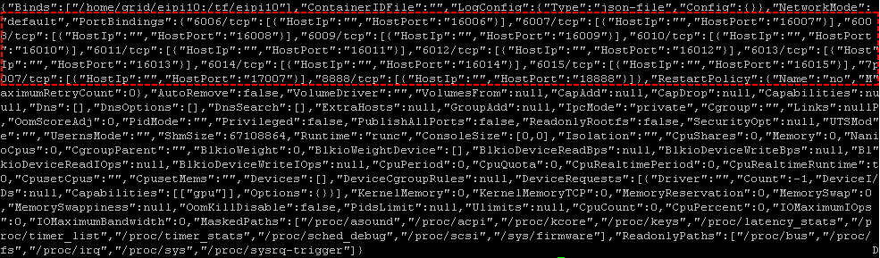
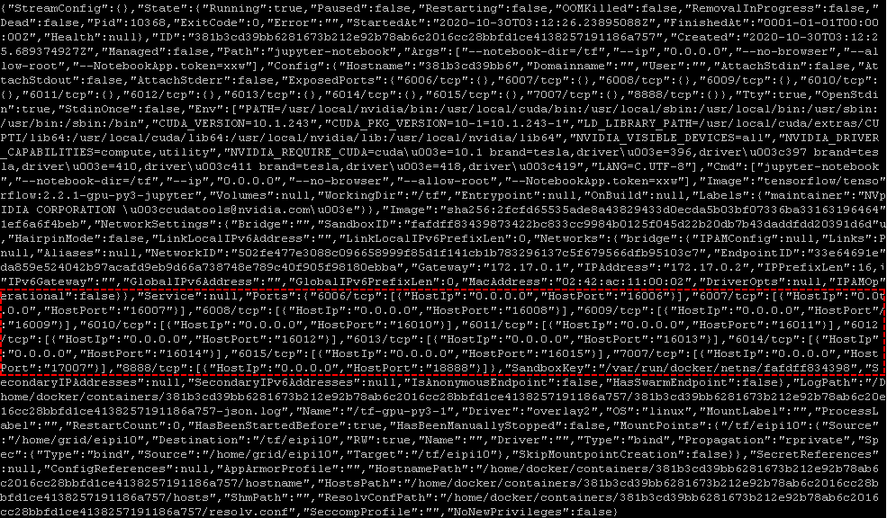

## 1. 常见命令和资源

####  docker 在线书

 https://yeasy.gitbooks.io/docker_practice/content/

https://joshhu.gitbooks.io/dockercommands/content/

### 安装Docker

https://yeasy.gitbooks.io/docker_practice/content/install/centos.html

~~~shell
# 卸载旧版
sudo yum remove docker \
                  docker-client \
                  docker-client-latest \
                  docker-common \
                  docker-latest \
                  docker-latest-logrotate \
                  docker-logrotate \
                  docker-selinux \
                  docker-engine-selinux \
                  docker-engine
                            

# # 如果需要清理以前的docker-ce
# sudo yum remove -y docker-ce
# sudo rm -rf /var/lib/docker /var/lib/docker-engine 
# sudo rm -rf /etc/systemd/system/docker.service.d/docker.conf
# ll /var/lib/ | grep docker
# ll /etc/systemd/system/docker.service.d
# ll /\"   # 老的版本，可能会把docker安装到这个地方

# 安装依赖包
sudo yum install -y yum-utils \
           device-mapper-persistent-data \
           lvm2

# 更新 yum 软件源缓存，并安装 docker-ce
sudo yum-config-manager \
     --add-repo \
     https://download.docker.com/linux/centos/docker-ce.repo
sudo yum makecache fast
sudo yum install -y docker-ce

# 建立 docker 用户组，需要重新登陆才能生效
sudo groupadd docker
sudo usermod -aG docker $USER

# 测试Docker是否安装成功
docker run hello-world
~~~

### 启动docker

~~~shell
sudo systemctl enable docker
sudo systemctl start docker
~~~

### 

### 安装docker-compose

~~~shell
curl -L https://github.com/docker/compose/releases/download/1.25.5/docker-compose-`uname -s`-`uname -m` > docker-compose
chmod +x docker-compose
sudo mv docker-compose /usr/local/bin/docker-compose
sudo chown root:root /usr/local/bin/docker-compose
ll /usr/local/bin/docker-compose
docker-compose --version
~~~

### 安装nvidia-docker

参见https://github.com/NVIDIA/nvidia-docker。

~~~shell
distribution=$(. /etc/os-release;echo $ID$VERSION_ID)
curl -s -L https://nvidia.github.io/nvidia-docker/$distribution/nvidia-docker.repo | sudo tee /etc/yum.repos.d/nvidia-docker.repo

sudo yum install -y nvidia-container-toolkit
sudo systemctl restart docker
~~~

### 创建 Swarm 集群

#### 初始化集群

~~~
docker swarm init
~~~

#### 加入swarm

~~~
docker swarm join --token SWMTKN-1-1ngrjkqk2356wfhuibeforvbfsn7rlfbol5foglcnegvsbcnd1-9aw3kcsq5ish8c0cs37cbpj8o 15.15.165.218:2377
~~~

#### 切换docker所占目录

~~~shell
sudo systemctl stop docker

sudo -s
mkdir /home/docker
mv  /var/lib/docker /var/lib/docker-temp
ln -s /home/docker /var/lib/docker
mv /var/lib/docker-temp/* /var/lib/docker
exit

sudo systemctl start docker
~~~

### 清理docker

~~~shell
# 删除现有容器未使用的所有镜像
docker image prune -a

# 删除已停止的容器
docker container prune 

# 删除所有未使用的卷
docker volume prune 

# 修剪镜像，容器，和网络
docker system prune --volumes
~~~

### 修改容器的端口映射

https://blog.opensvc.net/yun-xing-zhong-de-dockerrong-qi/

**有一个问题config.v2.json总是被重复覆盖，导致设置失败。留待以后解决**

~~~shell
container_id=
# docker_path=/var/lib/docker/container/${container_id}
docker_path=/home/docker/container/${container_id}

~~~

接下来修改hostconfig.json和config.v2.json.

~~~shell
cat hostconfig.json
~~~

~~~shell
cat config.v2.json
~~~

~~~shell
portbindings='"PortBindings":{"6006/tcp":[{"HostIp":"","HostPort":"16006"}],"6007/tcp":[{"HostIp":"","HostPort":"16007"}],"6008/tcp":[{"HostIp":"","HostPort":"16008"}],"6009/tcp":[{"HostIp":"","HostPort":"16009"}],"6010/tcp":[{"HostIp":"","HostPort":"16010"}],"6011/tcp":[{"HostIp":"","HostPort":"16011"}],"6012/tcp":[{"HostIp":"","HostPort":"16012"}],"6013/tcp":[{"HostIp":"","HostPort":"16013"}],"6014/tcp":[{"HostIp":"","HostPort":"16014"}],"6015/tcp":[{"HostIp":"","HostPort":"16015"}],"7007/tcp":[{"HostIp":"","HostPort":"17007"}],"8888/tcp":[{"HostIp":"","HostPort":"18888"}]}'
exposedports=''"ExposedPorts":{"6006/tcp":{},"6007/tcp":{},"6008/tcp":{},"6009/tcp":{},"6010/tcp":{},"6011/tcp":{},"6012/tcp":{},"6013/tcp":{},"6014/tcp":{},"6015/tcp":{},"7007/tcp":{},"8888/tcp":{}}''
ports='"Ports":{"6006/tcp":[{"HostIp":"0.0.0.0","HostPort":"16006"}],"6007/tcp":[{"HostIp":"0.0.0.0","HostPort":"16007"}],"6008/tcp":[{"HostIp":"0.0.0.0","HostPort":"16008"}],"6009/tcp":[{"HostIp":"0.0.0.0","HostPort":"16009"}],"6010/tcp":[{"HostIp":"0.0.0.0","HostPort":"16010"}],"6011/tcp":[{"HostIp":"0.0.0.0","HostPort":"16011"}],"6012/tcp":[{"HostIp":"0.0.0.0","HostPort":"16012"}],"6013/tcp":[{"HostIp":"0.0.0.0","HostPort":"16013"}],"6014/tcp":[{"HostIp":"0.0.0.0","HostPort":"16014"}],"6015/tcp":[{"HostIp":"0.0.0.0","HostPort":"16015"}],"7007/tcp":[{"HostIp":"0.0.0.0","HostPort":"17007"}],"8888/tcp":[{"HostIp":"0.0.0.0","HostPort":"18888"}]}'

sed -i "s|\"PortBindings\":.*}\]}|$portbindings|g"  hostconfig.json
sed -i "s|\"ExposedPorts\":.*{}}|$exposedports|g"   config.v2.json
sed -i "s|\"Ports\":.*}\]}|$ports|g"   config.v2.json

cat hostconfig.json
cat config.v2.json

sed  "s|\"ExposedPorts\":.*\}\}|$exposedports|g"   config.v2.json
sed  "s|\"PortBindings\":.*?}\]}|$ports|g"   config.v2.json
~~~

### Window下Docker Container的时间同步

在window中，如果机器sleep或者hibernate，container的时间和宿主机器时间将会不一致（这篇文章详述了这点https://thorsten-hans.com/docker-on-windows-fix-time-synchronization-issue）。手工解决方法有：

1. restart docker container

   ~~~powershell
   docker restart uf
   ~~~

2. eanble "Time Synchronization". run the following scripts in PowerShell as administrator.

   ~~~powershell
   Get-VMIntegrationService -VMName DockerDesktopVM
   Disable-VMIntegrationService -Name "Time Synchronization" -VMName DockerDesktopVM
   Enable-VMIntegrationService -Name "Time Synchronization" -VMName DockerDesktopVM
   ~~~

   再次检查时间。

   ~~~powershell
   docker exec -it uf date "+%Y-%m-%dT%H:%M:%S";(get-date).ToUniversalTime().ToString("yyyy-MM-ddTHH:mm:ss")
   ~~~

> 或许一个task在Sleep和Hibernate之后运行，可以解决这个问题。参见：https://sumtips.com/how-to/run-program-windows-wakes-up-sleep-hibernate/