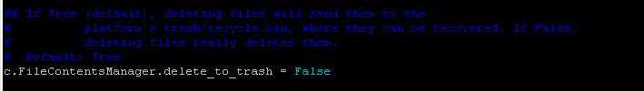

## 直接删除文件

jupyter notebook默认会把文件放到垃圾箱里，在docker container里面有时回报错*Unable to find or create trash directory*。解决方法是，

1. 通过以下命令创建 `~/.jupyter/jupyter_notebook_config.py`

   ~~~
   jupyter notebook --generate-config
   ~~~

2. 修改  `~/.jupyter/jupyter_notebook_config.py`

   ~~~
   vim ~/.jupyter/jupyter_notebook_config.py
   ~~~

   找到`c.FileContentsManager.delete_to_trash = False`，把该行注释去掉。即如下样子。

   

3. 重启jupyter notebook。对于docker container，重启容器就好。

## 安装插件管理器

- 安装插件管理包

  ~~~shell
  pip install --upgrade pip
  pip install jupyter_contrib_nbextensions
  pip install jupyter_nbextensions_configurator
  ~~~

- 安装一些插件并启用插件管理器

  ~~~shell
  jupyter contrib nbextension install --user 
  jupyter nbextensions_configurator enable --user
  ~~~

- 如果jupyter部署在docker上，需要重启启动容器

## 安装插件

5款个人认为不错的插件。

- Table of Contents：自动生成目录
- Execute Time：显示cell的执行时间
- Nofity：能够在代码运行结束时发出通知，及时告知你代码运行结束了。
- Codefolding：代码折叠工具
- Hinterland： 自动补全插件

## 支持JavaScript

### unbuntu

~~~shell
apt install npm -y
npm install -g ijavascript
ijsinstall
~~~

## 调增Notebook的宽度

~~~python
from IPython.core.display import display, HTML
display(HTML(""))
# display(HTML(""))
# display(HTML(""))
~~~

## 下一代notebook: JupyterLab

[JupyterLab，极其强大的下一代notebook！ - 知乎](https://zhuanlan.zhihu.com/p/87403131)

## 参考

- [开发工具 | 你真的会用jupyter吗](https://zhuanlan.zhihu.com/p/83252017)