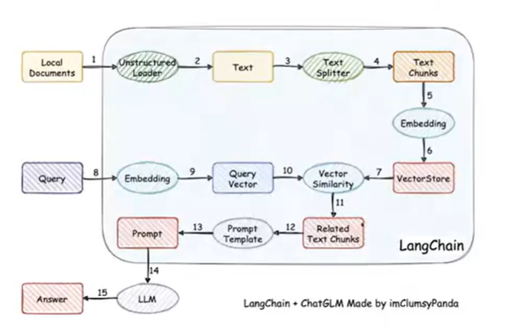
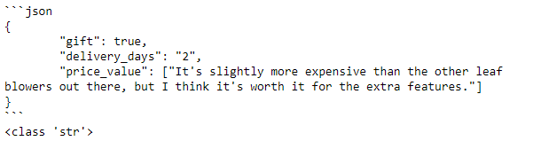
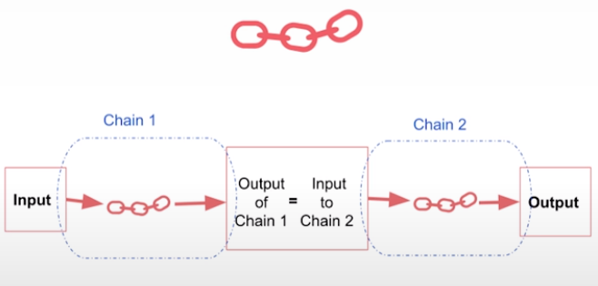
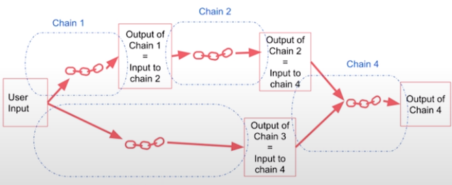
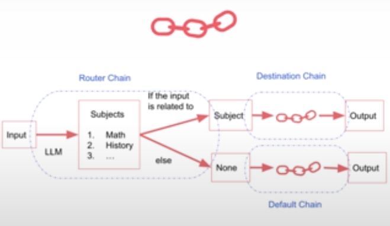
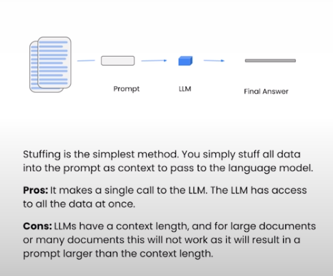
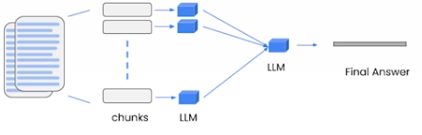
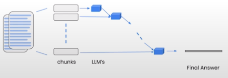
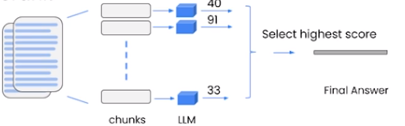
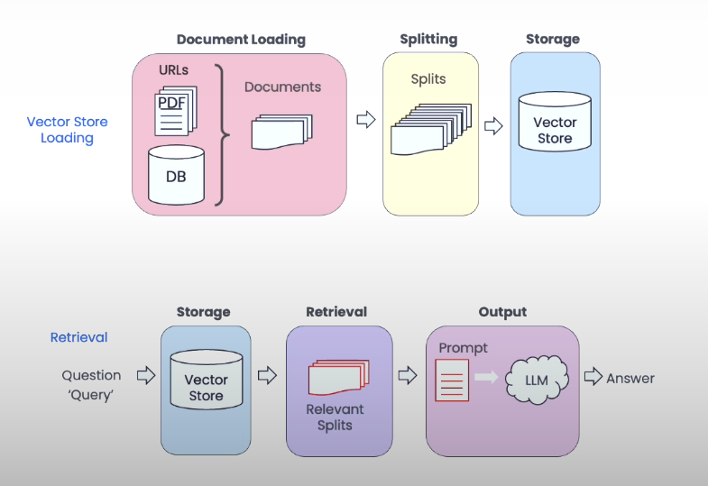

# Build Local Knowledge Base

- principle of implementation




# [DLAI - LangChain for LLM Application Development (deeplearning.ai)](https://learn.deeplearning.ai/courses/langchain/lesson/1/introduction)

## Models, Prompts and parsers

~~~python
#!pip install python-dotenv
#!pip install openai

import os
import openai

from dotenv import load_dotenv, find_dotenv
_ = load_dotenv(find_dotenv()) # read local .env file
openai.api_key = os.environ['OPENAI_API_KEY']
~~~

~~~
# account for deprecation of LLM model
import datetime
# Get the current date
current_date = datetime.datetime.now().date()

# Define the date after which the model should be set to "gpt-3.5-turbo"
target_date = datetime.date(2024, 6, 12)

# Set the model variable based on the current date
if current_date > target_date:
    llm_model = "gpt-3.5-turbo"
else:
    llm_model = "gpt-3.5-turbo-0301"
~~~

### Chat API : OpenAI

~~~python
def get_completion(prompt, model=llm_model):
    messages = [{"role": "user", "content": prompt}]
    response = openai.ChatCompletion.create(
        model=model,
        messages=messages,
        temperature=0, 
    )
    return response.choices[0].message["content"]
    
get_completion("What is 1+1?")
~~~

~~~python
customer_email = """
Arrr, I be fuming that me blender lid \
flew off and splattered me kitchen walls \
with smoothie! And to make matters worse,\
the warranty don't cover the cost of \
cleaning up me kitchen. I need yer help \
right now, matey!
"""

style = """American English \
in a calm and respectful tone
"""

prompt = f"""Translate the text \
that is delimited by triple backticks 
into a style that is {style}.
text: ```{customer_email}```
"""

print(prompt)
~~~

~~~
response = get_completion(prompt)
response
~~~

### Chat API : LangChain

~~~python
#!pip install --upgrade langchain

from langchain.chat_models import ChatOpenAI

# To control the randomness and creativity of the generated
# text by an LLM, use temperature = 0.0
chat = ChatOpenAI(temperature=0.0, model=llm_model)
chat
~~~

#### Prompt template

~~~python
template_string = """Translate the text \
that is delimited by triple backticks \
into a style that is {style}. \
text: ```{text}```
"""

from langchain.prompts import ChatPromptTemplate

prompt_template = ChatPromptTemplate.from_template(template_string)
print(prompt_template.messages[0].prompt)
print(prompt_template.messages[0].prompt.input_variables)
~~~

~~~python
customer_style = """American English \
in a calm and respectful tone
"""

customer_email = """
Arrr, I be fuming that me blender lid \
flew off and splattered me kitchen walls \
with smoothie! And to make matters worse, \
the warranty don't cover the cost of \
cleaning up me kitchen. I need yer help \
right now, matey!
"""

customer_messages = prompt_template.format_messages(
                    style=customer_style,
                    text=customer_email)

print(type(customer_messages))
print(type(customer_messages[0]))
~~~

~~~python
customer_response = chat(customer_messages)
print(customer_response.content)
~~~

~~~python
service_reply = """Hey there customer, \
the warranty does not cover \
cleaning expenses for your kitchen \
because it's your fault that \
you misused your blender \
by forgetting to put the lid on before \
starting the blender. \
Tough luck! See ya!
"""

service_style_pirate = """\
a polite tone \
that speaks in English Pirate\
"""

service_messages = prompt_template.format_messages(
    style=service_style_pirate,
    text=service_reply)

print(service_messages[0].content)
service_response = chat(service_messages)
print(service_response.content)
~~~

#### Output Parsers

Let's start with defining how we would like the LLM output to look like:

~~~python
{
  "gift": False,
  "delivery_days": 5,
  "price_value": "pretty affordable!"
}
~~~

~~~python
customer_review = """\
This leaf blower is pretty amazing.  It has four settings:\
candle blower, gentle breeze, windy city, and tornado. \
It arrived in two days, just in time for my wife's \
anniversary present. \
I think my wife liked it so much she was speechless. \
So far I've been the only one using it, and I've been \
using it every other morning to clear the leaves on our lawn. \
It's slightly more expensive than the other leaf blowers \
out there, but I think it's worth it for the extra features.
"""

review_template = """\
For the following text, extract the following information:

gift: Was the item purchased as a gift for someone else? \
Answer True if yes, False if not or unknown.

delivery_days: How many days did it take for the product \
to arrive? If this information is not found, output -1.

price_value: Extract any sentences about the value or price,\
and output them as a comma separated Python list.

Format the output as JSON with the following keys:
gift
delivery_days
price_value

text: {text}
"""
~~~

~~~python
from langchain.prompts import ChatPromptTemplate

prompt_template = ChatPromptTemplate.from_template(review_template)
print(prompt_template)
~~~

~~~python
messages = prompt_template.format_messages(text=customer_review)
chat = ChatOpenAI(temperature=0.0, model=llm_model)
response = chat(messages)
print(response.content)
type(response.content)

# response.content.get('gift')  # 结果是一个json字符串，所以无法直接调用里面的内容。
~~~

#### Parse the LLM output string into a Python dictionary

~~~python
from langchain.output_parsers import ResponseSchema
from langchain.output_parsers import StructuredOutputParser

gift_schema = ResponseSchema(name="gift",
                             description="Was the item purchased\
                             as a gift for someone else? \
                             Answer True if yes,\
                             False if not or unknown.")
delivery_days_schema = ResponseSchema(name="delivery_days",
                                      description="How many days\
                                      did it take for the product\
                                      to arrive? If this \
                                      information is not found,\
                                      output -1.")
price_value_schema = ResponseSchema(name="price_value",
                                    description="Extract any\
                                    sentences about the value or \
                                    price, and output them as a \
                                    comma separated Python list.")

response_schemas = [gift_schema, 
                    delivery_days_schema,
                    price_value_schema]

output_parser = StructuredOutputParser.from_response_schemas(response_schemas)
format_instructions = output_parser.get_format_instructions()
print(format_instructions)
~~~

~~~python
review_template_2 = """\
For the following text, extract the following information:

gift: Was the item purchased as a gift for someone else? \
Answer True if yes, False if not or unknown.

delivery_days: How many days did it take for the product\
to arrive? If this information is not found, output -1.

price_value: Extract any sentences about the value or price,\
and output them as a comma separated Python list.

text: {text}

{format_instructions}
"""

prompt = ChatPromptTemplate.from_template(template=review_template_2)

messages = prompt.format_messages(text=customer_review, 
                                format_instructions=format_instructions)

print(messages[0].content)
~~~

~~~python
response = chat(messages)
print(response.content)
print(type(response.content))
~~~



~~~python
output_dict = output_parser.parse(response.content)  #可以直接转化成dict
print(output_dict)
print(type(output_dict))
print(output_dict.get('delivery_days'))
~~~

## LangChain: Memory

* ConversationBufferMemory
* ConversationBufferWindowMemory
* ConversationTokenBufferMemory
* ConversationSummaryMemory

## Chains in LangChain

- LLMChain

* Sequential Chains
  * SimpleSequentialChain
  
    
  
  * SequentialChain
  
    
  
- Router Chain

  


## LangChain: Q&A over Documents

- Stuff Method



- Additional methods

  - Map reduce

    

  - Refine

    

  - Map rerank

    

## LangChain: Evaluation

## LangChain: Agents


# LangChain Chat with Your Data

- RAG (Retrieval Augmented Generation)

  像OpenAI的ChatGPT和Anthropic的Claude这样的大型语言模型（LLMs）已经以其能力彻底改变了AI领域。然而，它们固有地存在重大缺陷。一个主要问题是它们的静态本质，这意味着它们“冻结在时间里”。尽管如此，LLMs可能经常对较新的查询作出过于自信的响应，这种现象被称为“幻觉”。这类错误可能非常有害，尤其是当这些模型服务于关键的现实世界应用时。

  RAG 是一种突破性技术，旨在克服基础大型语言模型（LLMs）的限制。通过将LLM与RAG管道配对，我们可以使用户能够访问模型使用的底层数据源。这种透明的方法确保可以验证LLM的声明的准确性，并在用户中建立信任因素。
  
  此外，RAG提供了一种成本效益高的解决方案。RAG可以在许多情况下，作为足够的替代方案，而不是承担训练定制模型或微调现有模型的广泛计算和财务负担。这种资源消耗的减少对于那些没有足够手段从头开始开发和部署基础模型的组织尤其有益。
  
  
  
  
