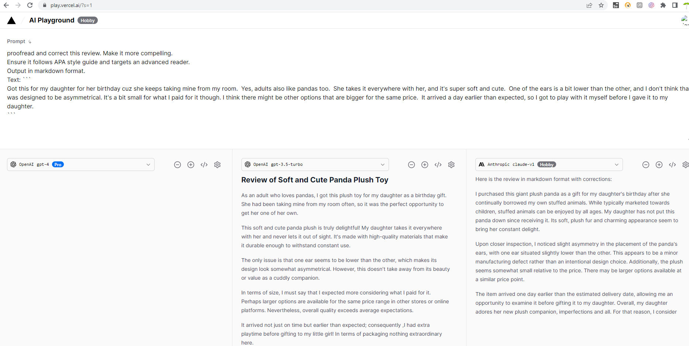
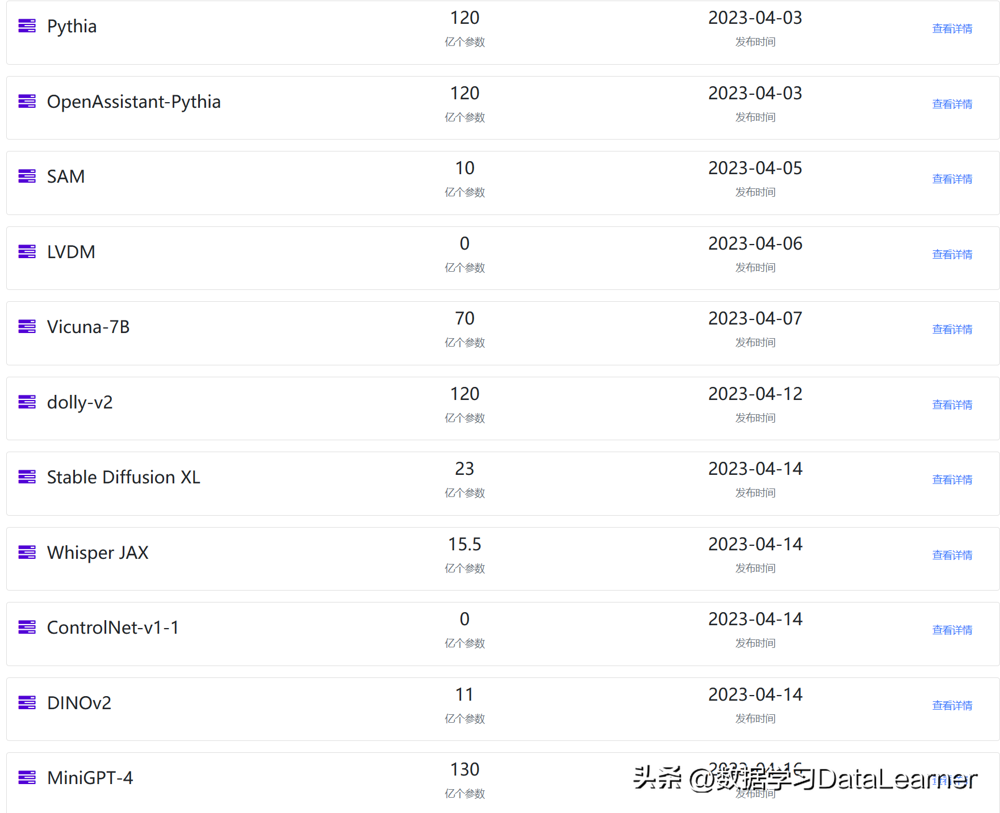

## LLM Platform

### Jupyter AI 

- Document: [Users — Jupyter AI documentation (jupyter-ai.readthedocs.io)](https://jupyter-ai.readthedocs.io/en/latest/users/index.html)

- Model providers

  | Provider         | Provider ID          | Environment variable(s)    | Python package(s)                         |
  | ---------------- | -------------------- | -------------------------- | ----------------------------------------- |
  | AI21             | `ai21`               | `AI21_API_KEY`             | `ai21`                                    |
  | Anthropic        | `anthropic`          | `ANTHROPIC_API_KEY`        | `langchain-anthropic`                     |
  | Anthropic (chat) | `anthropic-chat`     | `ANTHROPIC_API_KEY`        | `langchain-anthropic`                     |
  | Bedrock          | `bedrock`            | N/A                        | `boto3`                                   |
  | Bedrock (chat)   | `bedrock-chat`       | N/A                        | `boto3`                                   |
  | Cohere           | `cohere`             | `COHERE_API_KEY`           | `cohere`                                  |
  | ERNIE-Bot        | `qianfan`            | `QIANFAN_AK`, `QIANFAN_SK` | `qianfan`                                 |
  | Gemini           | `gemini`             | `GOOGLE_API_KEY`           | `langchain-google-genai`                  |
  | GPT4All          | `gpt4all`            | N/A                        | `gpt4all`                                 |
  | Hugging Face Hub | `huggingface_hub`    | `HUGGINGFACEHUB_API_TOKEN` | `huggingface_hub`, `ipywidgets`, `pillow` |
  | NVIDIA           | `nvidia-chat`        | `NVIDIA_API_KEY`           | `langchain_nvidia_ai_endpoints`           |
  | OpenAI           | `openai`             | `OPENAI_API_KEY`           | `langchain-openai`                        |
  | OpenAI (chat)    | `openai-chat`        | `OPENAI_API_KEY`           | `langchain-openai`                        |
  | SageMaker        | `sagemaker-endpoint` | N/A                        | `boto3`                                   |

## Skills

### 如何注册和充值sms-activate教程,全球第一大虚拟号码接收验证码平台!

https://www.youtube.com/watch?v=Np7Fj2pJ8RU

网站： https://sms-activate.org/cn

### Claude ai注册教学！

https://www.youtube.com/watch?app=desktop&v=I0diTeo9i7g

其中采用sms-activate进行电话注册。

## ChatGPT & LLM

- New Bing: [The New Bing - Learn More](https://www.bing.com/new)

- Claude: https://chatpracticeworkspace.slack.com/

- MPT-7B： https://www.mosaicml.com/blog/mpt-7b

  MPT-7B模型是一个基于Transformer在1T文本/代码Token上训练得到的，且不包含任何预训练。**「该模型开源，可用于商业用途，并且与LLaMA-7B模型效果相匹配」**。MPT-7B基于MosaicML平台进行训练，零人工干预，耗时9.5天，共计花费20万美元。任何人都可以基于MPT模型进行训练、微调和部署，除此之外，**「它们还发布了三个微调模型：MPT-7B-Instruct、MPT-7B-Chat和MPT-7B-StoryWriter-65k+」** ，其中最后一个可以使用65k Token的上下文长度。

- alpaca-lora: [tloen/alpaca-lora: Instruct-tune LLaMA on consumer hardware (github.com)](https://github.com/tloen/alpaca-lora)

  Alpaca-Lora 则是利用 Lora 技术，在冻结原模型 LLaMA 参数的情况下，通过往模型中加入额外的网络层，并只训练这些新增的网络层参数。由于这些新增参数数量较少，这样不仅微调的成本显著下降（使用一块 RTX 4090 显卡，只用 5 个小时就训练了一个与 Alpaca 水平相当的模型，将这类模型对算力的需求降到了消费级），还能获得和全模型微调（full fine-tuning）类似的效果。

- Pythia: https://github.com/EleutherAI/pythia

  

- Dolly 2.0：

  *Dolly是Databricks员工基于约15000条指令/响应精调数据集`databricks-dolly-15k`训练的，`databricks-dolly-15k`是参照InstructGPT论文的能力域生成，这些能力域包括头脑风暴、分类、封闭式问答、文本生成、信息提取、开放式问答和摘要。*

  Databricks刚刚宣布发布Dolly 2.0，这是第一个完全开源的、遵循指令的大型语言模型，在手动生成的指令数据集上进行了微调，可被授权用于研究和商业用途。

- OpenAssistant: https://zhuanlan.zhihu.com/p/622436065

  OpenAssistant是一个基于聊天的助手，可以理解任务，可以与第三方系统交互，并动态检索信息。

- AI Playground: https://play.vercel.ai/

  Vercel今天刚发布了一个名叫AI Playground的产品，包含了各家的“ChatGPT”应用，大家可以提出一个问题直接获得多个“GPT”的回答。
  
  

## Reference

- [AI模型大放异彩：2023年4月发布的23个模型总结与解析](https://www.toutiao.com/article/7228497771072963107/?app=news_article&timestamp=1683448892&use_new_style=1&req_id=2023050716413185C8AC9D4DC44B516CF5&group_id=7228497771072963107&wxshare_count=1&tt_from=weixin&utm_source=weixin&utm_medium=toutiao_android&utm_campaign=client_share&share_token=fc7ecf45-3b82-4301-83e1-06d650caf837&source=m_redirect&wid=1683450705947)

  

   这几天有3个AI模型我认为值得大家关注：分别是MiniGPT-4、LLaVA和DINOv2。
MiniGPT-4是一个低成本的多模态预训练模型，用了4个A100，10个小时左右训练完成的。基于前段时间开源的Vacuna模型和BLIP-2结合得到。先用500万个文本-图像数据训练，然后再用3500个高质量的数据微调，一下就让语言模型有了理解图像的能力，十分值得借鉴的思路。
LLaVA是微软联合威斯康星麦迪逊分校老师发布的另一个多模态大模型。与MiniGPT-4不同的是，这个模型主要是把instruction-tuning放到了多模态模型上，这是将指令调整扩展到多模态空间的第一次尝试，使用ChatGPT/GPT-4将图像-文本对转换为适当的指令跟随格式。将CLIP视觉编码器与语言解码器LLaMA连接起来，并进行端到端微调。最终效果也是很不错。
DINOv2是MetaAI开源的一个计算机视觉领域的预训练模型，也是一种希望将LLM能力改造到CV领域的一次尝试。DINO最早是MetaAI在2021年提出的方法，在2022年第一次开源第一个版本，这是第2个版本发布，相比较之前的模型，它的性能更好，而且比基于text-image的预训练模型也好很多，不过因为是纯CV领域的预训练结果（1.40亿图像数据集），它主要抽取的是基础特征。但是可以用这个特征做图片分类、图像分割、深度估计等，模型开源，11亿参数版本也就4.2G。
这三个模型都是开源模型，除了DINOv2的数据集没有开放外，其它均可直接获取。	

- [A Cookbook of Self-Supervised Learning](https://arxiv.org/pdf/2304.12210.pdf)

  在对话AI中,预训练和微调是构建高质量对话模型的两个关键步骤。在预训练步骤中,模型在大规模非对话语料上进行初始化,然后在对话语料上进行微调。在本文中,我们介绍了两种流行的对话AI方法:预训练的seq2seq和预训练的语言模型微调。这两种方法产生了最先进的对话模型,包括GPT-3、DialoGPT和Blender。

  Seq2seq方法使用编码器-解码器架构。编码器将对话上下文序列作为输入,并产生上下文向量。然后,解码器生成响应 conditioned 在这个上下文向量和以前产生的输出上。使用大规模非对话语料预训练编码器是关键的一步,这有助于学习上下文表示。然后在对话语料上微调整个模型。

  另一种预训练语言模型微调的方法仅在大规模非对话语料上预训练语言模型,然后通过在对话语料上微调该模型来进行对话学习。这减少了构建对话系统所需的工作量。最后,预训练语言模型可以大大提高对话模型的学习效率和最终质量,因为它们提供了一种更好的初始化,并在微调过程中加速收敛。

  在本文的第三部分,我们描述了如何构建端到端的对话系统。我们介绍了对话数据集的采集、模型的选择和训练、生成的问题以及评估指标。最后,我们展望了对话AI的未来前景,包括多轮交互、多域模型和可解释性。整体而言,这篇论文简要概述了对话AI系统的构建,着重于预训练和微调的作用。这为任何想要开发自己的对话AI系统的人提供了很好的指导。

- [Awesome ChatGPT Prompts](https://www.toutiao.com/article/7225262699532337698/)

  提供挖掘ChatGPT能力的Prompt收集网站。
  
- [训练个中文版ChatGPT没那么难：不用A100，开源Alpaca-LoRA+RTX 4090就能](https://mp.weixin.qq.com/s?__biz=MzA3MzI4MjgzMw==&mid=2650871883&idx=1&sn=2aae485c9a0241c54e1588873597ef3f)

  Alpaca-LoRA 将微调类 ChatGPT 模型的算力需求降到了消费级，训练个自己的中文对话模型真就没那么难了。

  2023 年，聊天机器人领域似乎只剩下两个阵营：「OpenAI 的 ChatGPT」和「其他」。

  ChatGPT 功能强大，但 OpenAI 几乎不可能将其开源。「其他」阵营表现欠佳，但不少人都在做开源方面的努力，比如前段时间。

  LLaMA 是一系列模型的总称，参数量从 70 亿到 650 亿不等，其中，130 亿参数的 LLaMA 模型「在大多数基准上」可以胜过参数量达 1750 亿的 GPT-3。不过，该模型并没有经过指令微调（instruct tuning），因此生成效果较差。

  为了提高模型性能，来自斯坦福的研究者帮助其完成了指令微调的工作，训练了一个名为 （羊驼）的 70 亿参数新模型（基于 LLaMA 7B）。具体来说，他们让 OpenAI 的 text-davinci-003 模型以 self-instruct 方式生成 52K 指令遵循（instruction-following）样本，以此作为 Alpaca 的训练数据。实验结果表明，Alpaca 的很多行为都与 text-davinci-003 类似。也就是说，只有 7B 参数的轻量级模型 Alpaca 性能可媲美 GPT-3.5 这样的超大规模语言模型。

- [使用 Docker 和 Alpaca LoRA 对 LLaMA 65B 大模型进行 Fine-Tune](https://soulteary.com/2023/03/25/model-finetuning-on-llama-65b-large-model-using-docker-and-alpaca-lora.html)it