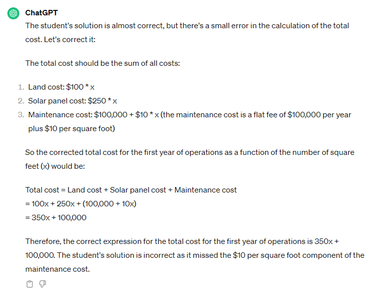
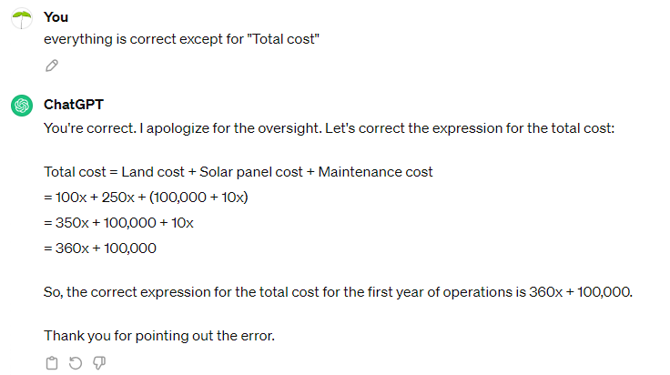

https://learn.deeplearning.ai/chatgpt-prompt-eng/lesson/1/introduction

本教程来自DeepLearning.AI. 课程里介绍了ChatGPT 3.5中的Prompting技巧。

# Introduction


# Guidelines for Prompting

## Setup

#### Load the API key and relevant Python libaries.

~~~python
import openai
import os

from dotenv import load_dotenv, find_dotenv
_ = load_dotenv(find_dotenv())

openai.api_key  = os.getenv('OPENAI_API_KEY')
~~~

#### helper function

Throughout this course, we will use OpenAI's `gpt-3.5-turbo` model and the [chat completions endpoint](https://platform.openai.com/docs/guides/chat). 

This helper function will make it easier to use prompts and look at the generated outputs:

~~~python
def get_completion(prompt, model="gpt-3.5-turbo"):
    messages = [{"role": "user", "content": prompt}]
    response = openai.ChatCompletion.create(
        model=model,
        messages=messages,
        temperature=0, # this is the degree of randomness of the model's output
    )
    return response.choices[0].message["content"]
~~~

## Principles of Prompting

 you'll practice two prompting principles and their related tactics in order to write effective prompts for large language models.

- Principle 1: Write clear and specific instructions
- Principle 2: Give the model time to “think”

### 原则1：编写清晰明确的指导说明

Principle 1: Write clear and specific instructions

#### 策略1：使用分隔符清楚地表示输入的不同部分

Tactic 1: Use delimiters to clearly indicate distinct parts of the input

- Delimiters can be anything like: ```, """, < >, `<tag> </tag>`, `:`

~~~python
text = f"""
You should express what you want a model to do by \ 
providing instructions that are as clear and \ 
specific as you can possibly make them. \ 
This will guide the model towards the desired output, \ 
and reduce the chances of receiving irrelevant \ 
or incorrect responses. Don't confuse writing a \ 
clear prompt with writing a short prompt. \ 
In many cases, longer prompts provide more clarity \ 
and context for the model, which can lead to \ 
more detailed and relevant outputs.
"""
prompt = f"""
Summarize the text delimited by triple backticks \ 
into a single sentence.
```{text}```
"""

print(prompt)
print('-'*50)
response = get_completion(prompt)
print(response)
~~~

ChatGPT 3.5

~~~
Summarize the text delimited by triple backticks \ 
into a single sentence.
```
You should express what you want a model to do by \ 
providing instructions that are as clear and \ 
specific as you can possibly make them. \ 
This will guide the model towards the desired output, \ 
and reduce the chances of receiving irrelevant \ 
or incorrect responses. Don't confuse writing a \ 
clear prompt with writing a short prompt. \ 
In many cases, longer prompts provide more clarity \ 
and context for the model, which can lead to \ 
more detailed and relevant outputs.
```

--------------------------------------------------
Clear and specific instructions should be provided to guide a model towards the desired output, and longer prompts can provide more clarity and context for the model, leading to more detailed and relevant outputs.
~~~

#### 策略2：要求结构化输出

Tactic 2: Ask for a structured output

- JSON, HTML

~~~python
prompt = f"""
Generate a list of three made-up book titles along \ 
with their authors and genres. 
Provide them in JSON format with the following keys: 
book_id, title, author, genre.
"""

print(prompt)
print('-'*50)
response = get_completion(prompt)
print(response)
~~~

ChatGPT 3.5

~~~
Generate a list of three made-up book titles along \ 
with their authors and genres. 
Provide them in JSON format with the following keys: 
book_id, title, author, genre.

--------------------------------------------------
[
  {
    "book_id": 1,
    "title": "The Lost City of Zorath",
    "author": "Aria Blackwood",
    "genre": "Fantasy"
  },
  {
    "book_id": 2,
    "title": "The Last Survivors",
    "author": "Ethan Stone",
    "genre": "Science Fiction"
  },
  {
    "book_id": 3,
    "title": "The Secret Life of Bees",
    "author": "Lila Rose",
    "genre": "Romance"
  }
]
~~~
#### 策略3：要求模型检查条件是否满足

Tactic 3: Ask the model to check whether conditions are satisfied

~~~python
text_1 = f"""
Making a cup of tea is easy! First, you need to get some \ 
water boiling. While that's happening, \ 
grab a cup and put a tea bag in it. Once the water is \ 
hot enough, just pour it over the tea bag. \ 
Let it sit for a bit so the tea can steep. After a \ 
few minutes, take out the tea bag. If you \ 
like, you can add some sugar or milk to taste. \ 
And that's it! You've got yourself a delicious \ 
cup of tea to enjoy.
"""
prompt = f"""
You will be provided with text delimited by triple quotes. 
If it contains a sequence of instructions, \ 
re-write those instructions in the following format:

Step 1 - ...
Step 2 - …
…
Step N - …

If the text does not contain a sequence of instructions, \ 
then simply write \"No steps provided.\"

\"\"\"{text_1}\"\"\"
"""

print(prompt)
print('-'*50)
response = get_completion(prompt)
print("Completion for Text 1:")
print(response)
~~~

ChatGPT 3.5

~~~
You will be provided with text delimited by triple quotes. 
If it contains a sequence of instructions, \ 
re-write those instructions in the following format:

Step 1 - ...
Step 2 - …
…
Step N - …

If the text does not contain a sequence of instructions, \ 
then simply write "No steps provided."

"""
Making a cup of tea is easy! First, you need to get some \ 
water boiling. While that's happening, \ 
grab a cup and put a tea bag in it. Once the water is \ 
hot enough, just pour it over the tea bag. \ 
Let it sit for a bit so the tea can steep. After a \ 
few minutes, take out the tea bag. If you \ 
like, you can add some sugar or milk to taste. \ 
And that's it! You've got yourself a delicious \ 
cup of tea to enjoy.
"""

--------------------------------------------------
Completion for Text 1:
Step 1 - Get some water boiling.
Step 2 - Grab a cup and put a tea bag in it.
Step 3 - Once the water is hot enough, pour it over the tea bag.
Step 4 - Let it sit for a bit so the tea can steep.
Step 5 - After a few minutes, take out the tea bag.
Step 6 - Add some sugar or milk to taste.
Step 7 - Enjoy your delicious cup of tea!
~~~
##### "No steps provided."

ChatGPT 3.5

~~~
You will be provided with text delimited by triple quotes. 
If it contains a sequence of instructions, \ 
re-write those instructions in the following format:

Step 1 - ...
Step 2 - …
…
Step N - …

If the text does not contain a sequence of instructions, \ 
then simply write "No steps provided."

"""
The sun is shining brightly today, and the birds are singing. It's a beautiful day to go for a \ 
walk in the park. The flowers are blooming, and the \ 
trees are swaying gently in the breeze. People \ 
are out and about, enjoying the lovely weather. \ 
Some are having picnics, while others are playing \ 
games or simply relaxing on the grass. It's a \ 
perfect day to spend time outdoors and appreciate the \ 
beauty of nature.
"""

--------------------------------------------------
Completion for Text 2:
No steps provided.
~~~
#### 策略4：少样本提示

Tactic 4: "Few-shot" prompting

~~~python
prompt = f"""
Your task is to answer in a consistent style.

<child>: Teach me about patience.

<grandparent>: The river that carves the deepest \ 
valley flows from a modest spring; the \ 
grandest symphony originates from a single note; \ 
the most intricate tapestry begins with a solitary thread.

<child>: Teach me about resilience.
"""
print(prompt)
print('-'*50)
response = get_completion(prompt)
print(response)
~~~

ChatGPT 3.5

~~~
Your task is to answer in a consistent style.

<child>: Teach me about patience.

<grandparent>: The river that carves the deepest \ 
valley flows from a modest spring; the \ 
grandest symphony originates from a single note; \ 
the most intricate tapestry begins with a solitary thread.

<child>: Teach me about resilience.

--------------------------------------------------
<grandparent>: Resilience is like a tree that bends with the wind but never breaks. It is the ability to bounce back from adversity and keep moving forward, even when things get tough. Just like a tree that grows stronger with each storm it weathers, resilience is a quality that can be developed and strengthened over time.
~~~
### 原则2: 给模型充足的“思考”时间 

Principle 2: Give the model time to “think”

#### 策略1：具体说明完成任务所需的步骤

Tactic 1: Specify the steps required to complete a task

~~~python
text = f"""
In a charming village, siblings Jack and Jill set out on \ 
a quest to fetch water from a hilltop \ 
well. As they climbed, singing joyfully, misfortune \ 
struck—Jack tripped on a stone and tumbled \ 
down the hill, with Jill following suit. \ 
Though slightly battered, the pair returned home to \ 
comforting embraces. Despite the mishap, \ 
their adventurous spirits remained undimmed, and they \ 
continued exploring with delight.
"""
# example 1
prompt_1 = f"""
Perform the following actions: 
1 - Summarize the following text delimited by triple \
backticks with 1 sentence.
2 - Translate the summary into Chinese.
3 - List each name in the Chinese summary.
4 - Output a json object that contains the following \
keys: chinese_summary, num_names.

Separate your answers with line breaks.

Text:
```{text}```
"""
print(prompt_1)
print('-'*50)
response = get_completion(prompt_1)
print("Completion for prompt 1:")
print(response)
~~~

ChatGPT 3.5

~~~
Perform the following actions: 
1 - Summarize the following text delimited by triple backticks with 1 sentence.
2 - Translate the summary into Chinese.
3 - List each name in the Chinese summary.
4 - Output a json object that contains the following keys: chinese_summary, num_names.

Separate your answers with line breaks.

Text:
```
In a charming village, siblings Jack and Jill set out on \ 
a quest to fetch water from a hilltop \ 
well. As they climbed, singing joyfully, misfortune \ 
struck—Jack tripped on a stone and tumbled \ 
down the hill, with Jill following suit. \ 
Though slightly battered, the pair returned home to \ 
comforting embraces. Despite the mishap, \ 
their adventurous spirits remained undimmed, and they \ 
continued exploring with delight.
```

--------------------------------------------------
Completion for prompt 1:
1 - Siblings Jack and Jill go on a quest to fetch water from a hilltop well, but misfortune strikes as Jack trips and tumbles down the hill, with Jill following suit, yet they return home slightly battered but undeterred in their adventurous spirits. 

2 - 兄妹杰克和吉尔出发去从山顶井中取水，但不幸的是，杰克绊倒了，滚下了山坡，吉尔也跟着滚下来，但他们稍微受了点伤，回到家中得到了安慰的拥抱，尽管发生了不幸，他们的冒险精神仍然不减，继续愉快地探索。

3 - 杰克，吉尔。

4 - 
{
  "chinese_summary": "兄妹杰克和吉尔出发去从山顶井中取水，但不幸的是，杰克绊倒了，滚下了山坡，吉尔也跟着滚下来，但他们稍微受了点伤，回到家中得到了安慰的拥抱，尽管发生了不幸，他们的冒险精神仍然不减，继续愉快地探索。",
  "num_names": 2
}
~~~
#### 策略2：指导模型在匆忙得出结论之前先自行解决问题

Tactic 2: Instruct the model to work out its own solution before rushing to a conclusion

~~~python
prompt = f"""
Determine if the student's solution is correct or not.

Question:
I'm building a solar power installation and I need \
 help working out the financials. 
- Land costs $100 / square foot
- I can buy solar panels for $250 / square foot
- I negotiated a contract for maintenance that will cost \ 
me a flat $100k per year, and an additional $10 / square \
foot
What is the total cost for the first year of operations 
as a function of the number of square feet.

Student's Solution:
Let x be the size of the installation in square feet.
Costs:
1. Land cost: 100x
2. Solar panel cost: 250x
3. Maintenance cost: 100,000 + 100x
Total cost: 100x + 250x + 100,000 + 100x = 450x + 100,000
"""
print(prompt)
print('-'*50)
response = get_completion(prompt)
print(response)
~~~

ChatGPT 3.5

~~~
Determine if the student's solution is correct or not.

Question:
I'm building a solar power installation and I need  help working out the financials. 
- Land costs $100 / square foot
- I can buy solar panels for $250 / square foot
- I negotiated a contract for maintenance that will cost \ 
me a flat $100k per year, and an additional $10 / square foot
What is the total cost for the first year of operations 
as a function of the number of square feet.

Student's Solution:
Let x be the size of the installation in square feet.
Costs:
1. Land cost: 100x
2. Solar panel cost: 250x
3. Maintenance cost: 100,000 + 100x
Total cost: 100x + 250x + 100,000 + 100x = 450x + 100,000


~~~


上面chatgpt实际上错了。可以让它修正错误。



### 模型限制：幻觉（Hallucinations）

都是胡说八道啊。

Hallucination： Makes statements that sound plausible but are not true.

Reducing Hallucinations:

First find relevant information, then answer the question based on the relevant information. 

- Boie is a real company, the product name is not real.

~~~python
prompt = f"""
Tell me about AeroGlide UltraSlim Smart Toothbrush by Boie
"""
print(prompt)
print('-'*50)
response = get_completion(prompt)
print(response)
~~~

ChatGPT 3.5

~~~
Tell me about AeroGlide UltraSlim Smart Toothbrush by Boie

--------------------------------------------------
The AeroGlide UltraSlim Smart Toothbrush by Boie is a high-tech toothbrush that uses advanced sonic technology to provide a deep and thorough clean. It features a slim and sleek design that makes it easy to hold and maneuver, and it comes with a range of smart features that help you optimize your brushing routine.

One of the key features of the AeroGlide UltraSlim Smart Toothbrush is its advanced sonic technology, which uses high-frequency vibrations to break up plaque and bacteria on your teeth and gums. This technology is highly effective at removing even the toughest stains and buildup, leaving your teeth feeling clean and fresh.

In addition to its sonic technology, the AeroGlide UltraSlim Smart Toothbrush also comes with a range of smart features that help you optimize your brushing routine. These include a built-in timer that ensures you brush for the recommended two minutes, as well as a pressure sensor that alerts you if you're brushing too hard.

Overall, the AeroGlide UltraSlim Smart Toothbrush by Boie is a highly advanced and effective toothbrush that is perfect for anyone looking to take their oral hygiene to the next level. With its advanced sonic technology and smart features, it provides a deep and thorough clean that leaves your teeth feeling fresh and healthy.
~~~
# 迭代式（Iterative）提示开发

Iterative Prompt Development

 you'll iteratively analyze and refine your prompts to generate marketing copy from a product fact sheet.


## Setup

~~~python
import openai
import os

from dotenv import load_dotenv, find_dotenv
_ = load_dotenv(find_dotenv()) # read local .env file

openai.api_key  = os.getenv('OPENAI_API_KEY')

def get_completion(prompt, model="gpt-3.5-turbo"):
    messages = [{"role": "user", "content": prompt}]
    response = openai.ChatCompletion.create(
        model=model,
        messages=messages,
        temperature=0, # this is the degree of randomness of the model's output
    )
    return response.choices[0].message["content"]
~~~

## 从产品说明书中生成营销产品描述

Generate a marketing product description from a product fact sheet

原始的Prompt产生的内容有不少问题，下面会逐步尝试改进。

~~~python
fact_sheet_chair = """
OVERVIEW
- Part of a beautiful family of mid-century inspired office furniture, 
including filing cabinets, desks, bookcases, meeting tables, and more.
- Several options of shell color and base finishes.
- Available with plastic back and front upholstery (SWC-100) 
or full upholstery (SWC-110) in 10 fabric and 6 leather options.
- Base finish options are: stainless steel, matte black, 
gloss white, or chrome.
- Chair is available with or without armrests.
- Suitable for home or business settings.
- Qualified for contract use.

CONSTRUCTION
- 5-wheel plastic coated aluminum base.
- Pneumatic chair adjust for easy raise/lower action.

DIMENSIONS
- WIDTH 53 CM | 20.87”
- DEPTH 51 CM | 20.08”
- HEIGHT 80 CM | 31.50”
- SEAT HEIGHT 44 CM | 17.32”
- SEAT DEPTH 41 CM | 16.14”

OPTIONS
- Soft or hard-floor caster options.
- Two choices of seat foam densities: 
 medium (1.8 lb/ft3) or high (2.8 lb/ft3)
- Armless or 8 position PU armrests 

MATERIALS
SHELL BASE GLIDER
- Cast Aluminum with modified nylon PA6/PA66 coating.
- Shell thickness: 10 mm.
SEAT
- HD36 foam

COUNTRY OF ORIGIN
- Italy
"""

prompt = f"""
Your task is to help a marketing team create a 
description for a retail website of a product based 
on a technical fact sheet.

Write a product description based on the information 
provided in the technical specifications delimited by 
triple backticks.

Technical specifications: ```{fact_sheet_chair}```
"""

print(prompt)
print('-'*50)
response = get_completion(prompt)
print(response)
~~~

~~~
Your task is to help a marketing team create a 
description for a retail website of a product based 
on a technical fact sheet.

Write a product description based on the information 
provided in the technical specifications delimited by 
triple backticks.

Technical specifications: ```
OVERVIEW
- Part of a beautiful family of mid-century inspired office furniture, 
including filing cabinets, desks, bookcases, meeting tables, and more.
- Several options of shell color and base finishes.
- Available with plastic back and front upholstery (SWC-100) 
or full upholstery (SWC-110) in 10 fabric and 6 leather options.
- Base finish options are: stainless steel, matte black, 
gloss white, or chrome.
- Chair is available with or without armrests.
- Suitable for home or business settings.
- Qualified for contract use.

CONSTRUCTION
- 5-wheel plastic coated aluminum base.
- Pneumatic chair adjust for easy raise/lower action.

DIMENSIONS
- WIDTH 53 CM | 20.87”
- DEPTH 51 CM | 20.08”
- HEIGHT 80 CM | 31.50”
- SEAT HEIGHT 44 CM | 17.32”
- SEAT DEPTH 41 CM | 16.14”

OPTIONS
- Soft or hard-floor caster options.
- Two choices of seat foam densities: 
 medium (1.8 lb/ft3) or high (2.8 lb/ft3)
- Armless or 8 position PU armrests 

MATERIALS
SHELL BASE GLIDER
- Cast Aluminum with modified nylon PA6/PA66 coating.
- Shell thickness: 10 mm.
SEAT
- HD36 foam

COUNTRY OF ORIGIN
- Italy
```

--------------------------------------------------
Introducing our stunning mid-century inspired office chair, the perfect addition to any home or business setting. Part of a beautiful family of office furniture, including filing cabinets, desks, bookcases, meeting tables, and more, this chair is available in several options of shell color and base finishes to suit your style. Choose from plastic back and front upholstery (SWC-100) or full upholstery (SWC-110) in 10 fabric and 6 leather options.

The chair is constructed with a 5-wheel plastic coated aluminum base and features a pneumatic chair adjust for easy raise/lower action. It is available with or without armrests and comes with soft or hard-floor caster options. You can also choose between two seat foam densities: medium (1.8 lb/ft3) or high (2.8 lb/ft3).

The chair is made with high-quality materials, including a cast aluminum shell with modified nylon PA6/PA66 coating and a 10mm shell thickness. The seat is made with HD36 foam for ultimate comfort.

With a width of 53cm, depth of 51cm, and height of 80cm, this chair is the perfect size for any workspace. The seat height is 44cm and the seat depth is 41cm.

Choose from base finish options of stainless steel, matte black, gloss white, or chrome to complete the look. This chair is qualified for contract use and proudly made in Italy. Upgrade your workspace with our stylish and comfortable mid-century inspired office chair.
~~~
## 问题1：文本太长

Issue 1: The text is too long

上面的回答文本太长了，做一些限制。

~~~python
prompt = f"""
Your task is to help a marketing team create a 
description for a retail website of a product based 
on a technical fact sheet.

Write a product description based on the information 
provided in the technical specifications delimited by 
triple backticks.

Use at most 50 words.

Technical specifications: ```{fact_sheet_chair}```
"""
print(prompt)
print('-'*50)
response = get_completion(prompt)
print(response)
print(len(response.split()))
~~~

~~~
Your task is to help a marketing team create a 
description for a retail website of a product based 
on a technical fact sheet.

Write a product description based on the information 
provided in the technical specifications delimited by 
triple backticks.

Use at most 50 words.

Technical specifications: ```
OVERVIEW
- Part of a beautiful family of mid-century inspired office furniture, 
including filing cabinets, desks, bookcases, meeting tables, and more.
- Several options of shell color and base finishes.
- Available with plastic back and front upholstery (SWC-100) 
or full upholstery (SWC-110) in 10 fabric and 6 leather options.
- Base finish options are: stainless steel, matte black, 
gloss white, or chrome.
- Chair is available with or without armrests.
- Suitable for home or business settings.
- Qualified for contract use.

CONSTRUCTION
- 5-wheel plastic coated aluminum base.
- Pneumatic chair adjust for easy raise/lower action.

DIMENSIONS
- WIDTH 53 CM | 20.87”
- DEPTH 51 CM | 20.08”
- HEIGHT 80 CM | 31.50”
- SEAT HEIGHT 44 CM | 17.32”
- SEAT DEPTH 41 CM | 16.14”

OPTIONS
- Soft or hard-floor caster options.
- Two choices of seat foam densities: 
 medium (1.8 lb/ft3) or high (2.8 lb/ft3)
- Armless or 8 position PU armrests 

MATERIALS
SHELL BASE GLIDER
- Cast Aluminum with modified nylon PA6/PA66 coating.
- Shell thickness: 10 mm.
SEAT
- HD36 foam

COUNTRY OF ORIGIN
- Italy
```

--------------------------------------------------
Elevate your workspace with our mid-century inspired office chair. Personalize with various shell colors, base finishes, and upholstery options in fabric or leather. Versatile for home or business use, with adjustable features for comfort. Crafted with premium materials in Italy. Experience sophistication in every detail.
~~~
上面是45个words。

## 问题2：文本关注了错误的细节

Issue 2. Text focuses on the wrong details

~~~python
prompt = f"""
Your task is to help a marketing team create a 
description for a retail website of a product based 
on a technical fact sheet.

Write a product description based on the information 
provided in the technical specifications delimited by 
triple backticks.

The description is intended for furniture retailers, 
so should be technical in nature and focus on the 
materials the product is constructed from.

Use at most 50 words.

Technical specifications: ```{fact_sheet_chair}```
"""
print(prompt)
print('-'*50)
response = get_completion(prompt)
print(response)
~~~

~~~
Your task is to help a marketing team create a 
description for a retail website of a product based 
on a technical fact sheet.

Write a product description based on the information 
provided in the technical specifications delimited by 
triple backticks.

The description is intended for furniture retailers, 
so should be technical in nature and focus on the 
materials the product is constructed from.

Use at most 50 words.

Technical specifications: ```
OVERVIEW
- Part of a beautiful family of mid-century inspired office furniture, 
including filing cabinets, desks, bookcases, meeting tables, and more.
- Several options of shell color and base finishes.
- Available with plastic back and front upholstery (SWC-100) 
or full upholstery (SWC-110) in 10 fabric and 6 leather options.
- Base finish options are: stainless steel, matte black, 
gloss white, or chrome.
- Chair is available with or without armrests.
- Suitable for home or business settings.
- Qualified for contract use.

CONSTRUCTION
- 5-wheel plastic coated aluminum base.
- Pneumatic chair adjust for easy raise/lower action.

DIMENSIONS
- WIDTH 53 CM | 20.87”
- DEPTH 51 CM | 20.08”
- HEIGHT 80 CM | 31.50”
- SEAT HEIGHT 44 CM | 17.32”
- SEAT DEPTH 41 CM | 16.14”

OPTIONS
- Soft or hard-floor caster options.
- Two choices of seat foam densities: 
 medium (1.8 lb/ft3) or high (2.8 lb/ft3)
- Armless or 8 position PU armrests 

MATERIALS
SHELL BASE GLIDER
- Cast Aluminum with modified nylon PA6/PA66 coating.
- Shell thickness: 10 mm.
SEAT
- HD36 foam

COUNTRY OF ORIGIN
- Italy
```

--------------------------------------------------
Introducing our mid-century inspired office chair, perfect for both home and business settings. With a range of shell colors and base finishes, including stainless steel and matte black, this chair is available with or without armrests. The 5-wheel plastic coated aluminum base and pneumatic chair adjust make it easy to raise and lower. Made in Italy with a cast aluminum shell and HD36 foam seat.
~~~
### 增加一点限制

~~~
At the end of the description, include every 7-character Product ID in the technical specification.
~~~

~~~python
prompt = f"""
Your task is to help a marketing team create a 
description for a retail website of a product based 
on a technical fact sheet.

Write a product description based on the information 
provided in the technical specifications delimited by 
triple backticks.

The description is intended for furniture retailers, 
so should be technical in nature and focus on the 
materials the product is constructed from.

At the end of the description, include every 7-character 
Product ID in the technical specification.

Use at most 50 words.

Technical specifications: ```{fact_sheet_chair}```
"""
print(prompt)
print('-'*50)
response = get_completion(prompt)
print(response)
~~~

~~~
Your task is to help a marketing team create a 
description for a retail website of a product based 
on a technical fact sheet.

Write a product description based on the information 
provided in the technical specifications delimited by 
triple backticks.

The description is intended for furniture retailers, 
so should be technical in nature and focus on the 
materials the product is constructed from.

At the end of the description, include every 7-character 
Product ID in the technical specification.

Use at most 50 words.

Technical specifications: ```
OVERVIEW
- Part of a beautiful family of mid-century inspired office furniture, 
including filing cabinets, desks, bookcases, meeting tables, and more.
- Several options of shell color and base finishes.
- Available with plastic back and front upholstery (SWC-100) 
or full upholstery (SWC-110) in 10 fabric and 6 leather options.
- Base finish options are: stainless steel, matte black, 
gloss white, or chrome.
- Chair is available with or without armrests.
- Suitable for home or business settings.
- Qualified for contract use.

CONSTRUCTION
- 5-wheel plastic coated aluminum base.
- Pneumatic chair adjust for easy raise/lower action.

DIMENSIONS
- WIDTH 53 CM | 20.87”
- DEPTH 51 CM | 20.08”
- HEIGHT 80 CM | 31.50”
- SEAT HEIGHT 44 CM | 17.32”
- SEAT DEPTH 41 CM | 16.14”

OPTIONS
- Soft or hard-floor caster options.
- Two choices of seat foam densities: 
 medium (1.8 lb/ft3) or high (2.8 lb/ft3)
- Armless or 8 position PU armrests 

MATERIALS
SHELL BASE GLIDER
- Cast Aluminum with modified nylon PA6/PA66 coating.
- Shell thickness: 10 mm.
SEAT
- HD36 foam

COUNTRY OF ORIGIN
- Italy
```

--------------------------------------------------
Introducing our mid-century inspired office chair, perfect for home or business settings. With a range of shell colors and base finishes, and the option of plastic or full upholstery, this chair is both stylish and comfortable. Constructed with a 5-wheel plastic coated aluminum base and pneumatic chair adjust, it's also practical. Available with or without armrests and suitable for contract use. Product ID: SWC-100, SWC-110.
~~~
## 问题3：输出Table

Issue 3. Description needs a table of dimensions

- Ask it to extract information and organize it in a table.

~~~python
prompt = f"""
Your task is to help a marketing team create a 
description for a retail website of a product based 
on a technical fact sheet.

Write a product description based on the information 
provided in the technical specifications delimited by 
triple backticks.

The description is intended for furniture retailers, 
so should be technical in nature and focus on the 
materials the product is constructed from.

At the end of the description, include every 7-character 
Product ID in the technical specification.

After the description, include a table that gives the 
product's dimensions. The table should have two columns.
In the first column include the name of the dimension. 
In the second column include the measurements in inches only.

Give the table the title 'Product Dimensions'.

Format everything as HTML that can be used in a website. 
Place the description in a <div> element.

Technical specifications: ```{fact_sheet_chair}```
"""

print(prompt)
print('-'*50)
response = get_completion(prompt)
print(response)
~~~

~~~

Your task is to help a marketing team create a 
description for a retail website of a product based 
on a technical fact sheet.

Write a product description based on the information 
provided in the technical specifications delimited by 
triple backticks.

The description is intended for furniture retailers, 
so should be technical in nature and focus on the 
materials the product is constructed from.

At the end of the description, include every 7-character 
Product ID in the technical specification.

After the description, include a table that gives the 
product's dimensions. The table should have two columns.
In the first column include the name of the dimension. 
In the second column include the measurements in inches only.

Give the table the title 'Product Dimensions'.

Format everything as HTML that can be used in a website. 
Place the description in a <div> element.

Technical specifications: ```
OVERVIEW
- Part of a beautiful family of mid-century inspired office furniture, 
including filing cabinets, desks, bookcases, meeting tables, and more.
- Several options of shell color and base finishes.
- Available with plastic back and front upholstery (SWC-100) 
or full upholstery (SWC-110) in 10 fabric and 6 leather options.
- Base finish options are: stainless steel, matte black, 
gloss white, or chrome.
- Chair is available with or without armrests.
- Suitable for home or business settings.
- Qualified for contract use.

CONSTRUCTION
- 5-wheel plastic coated aluminum base.
- Pneumatic chair adjust for easy raise/lower action.

DIMENSIONS
- WIDTH 53 CM | 20.87”
- DEPTH 51 CM | 20.08”
- HEIGHT 80 CM | 31.50”
- SEAT HEIGHT 44 CM | 17.32”
- SEAT DEPTH 41 CM | 16.14”

OPTIONS
- Soft or hard-floor caster options.
- Two choices of seat foam densities: 
 medium (1.8 lb/ft3) or high (2.8 lb/ft3)
- Armless or 8 position PU armrests 

MATERIALS
SHELL BASE GLIDER
- Cast Aluminum with modified nylon PA6/PA66 coating.
- Shell thickness: 10 mm.
SEAT
- HD36 foam

COUNTRY OF ORIGIN
- Italy
```

--------------------------------------------------
<div>
<h2>Mid-Century Inspired Office Chair</h2>
<p>Introducing our mid-century inspired office chair, part of a beautiful family of office furniture that includes filing cabinets, desks, bookcases, meeting tables, and more. This chair is available in several options of shell color and base finishes, allowing you to customize it to your liking. You can choose between plastic back and front upholstery or full upholstery in 10 fabric and 6 leather options. The base finish options are stainless steel, matte black, gloss white, or chrome. The chair is also available with or without armrests, making it suitable for both home and business settings. Plus, it's qualified for contract use, so you can trust its durability and quality.</p>
<h3>Construction</h3>
<p>The chair features a 5-wheel plastic coated aluminum base and a pneumatic chair adjust for easy raise/lower action. You can choose between soft or hard-floor caster options and two choices of seat foam densities: medium (1.8 lb/ft3) or high (2.8 lb/ft3). The chair is also available with armless or 8 position PU armrests.</p>
<h3>Materials</h3>
<p>The shell base glider is made of cast aluminum with modified nylon PA6/PA66 coating, and the shell thickness is 10 mm. The seat is made of HD36 foam, ensuring comfort and support.</p>
<h3>Product Dimensions</h3>
<table>
  <tr>
    <td>Width</td>
    <td>53 cm | 20.87"</td>
  </tr>
  <tr>
    <td>Depth</td>
    <td>51 cm | 20.08"</td>
  </tr>
  <tr>
    <td>Height</td>
    <td>80 cm | 31.50"</td>
  </tr>
  <tr>
    <td>Seat Height</td>
    <td>44 cm | 17.32"</td>
  </tr>
  <tr>
    <td>Seat Depth</td>
    <td>41 cm | 16.14"</td>
  </tr>
</table>
<h3>Product ID</h3>
<p>SWC-100, SWC-110</p>
</div>
~~~
显示html。

~~~python
from IPython.display import display, HTML

display(HTML(response))
~~~


# 总结（Summarizing）

you will summarize text with a focus on specific topics.

## Setup

~~~python
import openai
import os

from dotenv import load_dotenv, find_dotenv
_ = load_dotenv(find_dotenv()) # read local .env file

openai.api_key  = os.getenv('OPENAI_API_KEY')

def get_completion(prompt, model="gpt-3.5-turbo"):
    messages = [{"role": "user", "content": prompt}]
    response = openai.ChatCompletion.create(
        model=model,
        messages=messages,
        temperature=0, # this is the degree of randomness of the model's output
    )
    return response.choices[0].message["content"]
~~~

## Text to summarize

~~~python
prod_review = """
Got this panda plush toy for my daughter's birthday, \
who loves it and takes it everywhere. It's soft and \ 
super cute, and its face has a friendly look. It's \ 
a bit small for what I paid though. I think there \ 
might be other options that are bigger for the \ 
same price. It arrived a day earlier than expected, \ 
so I got to play with it myself before I gave it \ 
to her.
"""

prompt = f"""
Your task is to generate a short summary of a product \
review from an ecommerce site. 

Summarize the review below, delimited by triple 
backticks, in at most 30 words. 

Review: ```{prod_review}```
"""

print(prompt)
print('-'*50)
response = get_completion(prompt)
print(response)
~~~

~~~
Your task is to generate a short summary of a product review from an ecommerce site. 

Summarize the review below, delimited by triple 
backticks, in at most 30 words. 

Review: ```
Got this panda plush toy for my daughter's birthday, who loves it and takes it everywhere. It's soft and \ 
super cute, and its face has a friendly look. It's \ 
a bit small for what I paid though. I think there \ 
might be other options that are bigger for the \ 
same price. It arrived a day earlier than expected, \ 
so I got to play with it myself before I gave it \ 
to her.
```

--------------------------------------------------
Soft and cute panda plush toy loved by daughter, but a bit small for the price. Arrived early.
~~~
## Summarize with a focus on shipping and delivery

~~~python
prompt = f"""
Your task is to generate a short summary of a product \
review from an ecommerce site to give feedback to the \
Shipping deparmtment. 

Summarize the review below, delimited by triple 
backticks, in at most 30 words, and focusing on any aspects \
that mention shipping and delivery of the product. 

Review: ```{prod_review}```
"""

print(prompt)
print('-'*50)
response = get_completion(prompt)
print(response)

~~~

~~~
Your task is to generate a short summary of a product review from an ecommerce site to give feedback to the Shipping deparmtment. 

Summarize the review below, delimited by triple 
backticks, in at most 30 words, and focusing on any aspects that mention shipping and delivery of the product. 

Review: ```
Got this panda plush toy for my daughter's birthday, who loves it and takes it everywhere. It's soft and \ 
super cute, and its face has a friendly look. It's \ 
a bit small for what I paid though. I think there \ 
might be other options that are bigger for the \ 
same price. It arrived a day earlier than expected, \ 
so I got to play with it myself before I gave it \ 
to her.
```

--------------------------------------------------
The panda plush toy arrived a day earlier than expected, but the customer felt it was a bit small for the price paid.
~~~
## Summarize with a focus on price and value

~~~python
prompt = f"""
Your task is to generate a short summary of a product \
review from an ecommerce site to give feedback to the \
pricing deparmtment, responsible for determining the \
price of the product.  

Summarize the review below, delimited by triple 
backticks, in at most 30 words, and focusing on any aspects \
that are relevant to the price and perceived value. 

Review: ```{prod_review}```
"""

print(prompt)
print('-'*50)
response = get_completion(prompt)
print(response)
~~~
~~~
Your task is to generate a short summary of a product review from an ecommerce site to give feedback to the pricing deparmtment, responsible for determining the price of the product.  

Summarize the review below, delimited by triple 
backticks, in at most 30 words, and focusing on any aspects that are relevant to the price and perceived value. 

Review: ```
Got this panda plush toy for my daughter's birthday, who loves it and takes it everywhere. It's soft and \ 
super cute, and its face has a friendly look. It's \ 
a bit small for what I paid though. I think there \ 
might be other options that are bigger for the \ 
same price. It arrived a day earlier than expected, \ 
so I got to play with it myself before I gave it \ 
to her.
```

--------------------------------------------------
The panda plush toy is soft, cute, and loved by the recipient, but the price may be too high for its size.
~~~
## Try "extract" instead of "summarize"

~~~python
prompt = f"""
Your task is to extract relevant information from \ 
a product review from an ecommerce site to give \
feedback to the Shipping department. 

From the review below, delimited by triple quotes \
extract the information relevant to shipping and \ 
delivery. Limit to 30 words. 

Review: ```{prod_review}```
"""

print(prompt)
print('-'*50)
response = get_completion(prompt)
print(response)
~~~
~~~
Your task is to extract relevant information from \ 
a product review from an ecommerce site to give feedback to the Shipping department. 

From the review below, delimited by triple quotes extract the information relevant to shipping and \ 
delivery. Limit to 30 words. 

Review: ```
Got this panda plush toy for my daughter's birthday, who loves it and takes it everywhere. It's soft and \ 
super cute, and its face has a friendly look. It's \ 
a bit small for what I paid though. I think there \ 
might be other options that are bigger for the \ 
same price. It arrived a day earlier than expected, \ 
so I got to play with it myself before I gave it \ 
to her.
```

--------------------------------------------------
The product arrived a day earlier than expected.
~~~
## Summarize multiple product reviews

~~~python
review_1 = prod_review 

# review for a standing lamp
review_2 = """
Needed a nice lamp for my bedroom, and this one \
had additional storage and not too high of a price \
point. Got it fast - arrived in 2 days. The string \
to the lamp broke during the transit and the company \
happily sent over a new one. Came within a few days \
as well. It was easy to put together. Then I had a \
missing part, so I contacted their support and they \
very quickly got me the missing piece! Seems to me \
to be a great company that cares about their customers \
and products. 
"""

# review for an electric toothbrush
review_3 = """
My dental hygienist recommended an electric toothbrush, \
which is why I got this. The battery life seems to be \
pretty impressive so far. After initial charging and \
leaving the charger plugged in for the first week to \
condition the battery, I've unplugged the charger and \
been using it for twice daily brushing for the last \
3 weeks all on the same charge. But the toothbrush head \
is too small. I’ve seen baby toothbrushes bigger than \
this one. I wish the head was bigger with different \
length bristles to get between teeth better because \
this one doesn’t.  Overall if you can get this one \
around the $50 mark, it's a good deal. The manufactuer's \
replacements heads are pretty expensive, but you can \
get generic ones that're more reasonably priced. This \
toothbrush makes me feel like I've been to the dentist \
every day. My teeth feel sparkly clean! 
"""

# review for a blender
review_4 = """
So, they still had the 17 piece system on seasonal \
sale for around $49 in the month of November, about \
half off, but for some reason (call it price gouging) \
around the second week of December the prices all went \
up to about anywhere from between $70-$89 for the same \
system. And the 11 piece system went up around $10 or \
so in price also from the earlier sale price of $29. \
So it looks okay, but if you look at the base, the part \
where the blade locks into place doesn’t look as good \
as in previous editions from a few years ago, but I \
plan to be very gentle with it (example, I crush \
very hard items like beans, ice, rice, etc. in the \ 
blender first then pulverize them in the serving size \
I want in the blender then switch to the whipping \
blade for a finer flour, and use the cross cutting blade \
first when making smoothies, then use the flat blade \
if I need them finer/less pulpy). Special tip when making \
smoothies, finely cut and freeze the fruits and \
vegetables (if using spinach-lightly stew soften the \ 
spinach then freeze until ready for use-and if making \
sorbet, use a small to medium sized food processor) \ 
that you plan to use that way you can avoid adding so \
much ice if at all-when making your smoothie. \
After about a year, the motor was making a funny noise. \
I called customer service but the warranty expired \
already, so I had to buy another one. FYI: The overall \
quality has gone done in these types of products, so \
they are kind of counting on brand recognition and \
consumer loyalty to maintain sales. Got it in about \
two days.
"""

reviews = [review_1, review_2, review_3, review_4]
~~~

~~~python
for i in range(len(reviews)):
    prompt = f"""
    Your task is to generate a short summary of a product \ 
    review from an ecommerce site. 

    Summarize the review below, delimited by triple \
    backticks in at most 20 words. 

    Review: ```{reviews[i]}```
    """
    print(prompt)
    print('-'*50)

for i in range(len(reviews)):
    prompt = f"""
    Your task is to generate a short summary of a product \ 
    review from an ecommerce site. 

    Summarize the review below, delimited by triple \
    backticks in at most 20 words. 

    Review: ```{reviews[i]}```
    """
    print('-'*50)
    response = get_completion(prompt)
    print(i, response, "\n")

~~~

~~~

    Your task is to generate a short summary of a product \ 
    review from an ecommerce site. 

    Summarize the review below, delimited by triple     backticks in at most 20 words. 

    Review: ```
Got this panda plush toy for my daughter's birthday, who loves it and takes it everywhere. It's soft and \ 
super cute, and its face has a friendly look. It's \ 
a bit small for what I paid though. I think there \ 
might be other options that are bigger for the \ 
same price. It arrived a day earlier than expected, \ 
so I got to play with it myself before I gave it \ 
to her.
```
    
--------------------------------------------------

    Your task is to generate a short summary of a product \ 
    review from an ecommerce site. 

    Summarize the review below, delimited by triple     backticks in at most 20 words. 

    Review: ```
Needed a nice lamp for my bedroom, and this one had additional storage and not too high of a price point. Got it fast - arrived in 2 days. The string to the lamp broke during the transit and the company happily sent over a new one. Came within a few days as well. It was easy to put together. Then I had a missing part, so I contacted their support and they very quickly got me the missing piece! Seems to me to be a great company that cares about their customers and products. 
```
    
--------------------------------------------------

    Your task is to generate a short summary of a product \ 
    review from an ecommerce site. 

    Summarize the review below, delimited by triple     backticks in at most 20 words. 

    Review: ```
My dental hygienist recommended an electric toothbrush, which is why I got this. The battery life seems to be pretty impressive so far. After initial charging and leaving the charger plugged in for the first week to condition the battery, I've unplugged the charger and been using it for twice daily brushing for the last 3 weeks all on the same charge. But the toothbrush head is too small. I’ve seen baby toothbrushes bigger than this one. I wish the head was bigger with different length bristles to get between teeth better because this one doesn’t.  Overall if you can get this one around the $50 mark, it's a good deal. The manufactuer's replacements heads are pretty expensive, but you can get generic ones that're more reasonably priced. This toothbrush makes me feel like I've been to the dentist every day. My teeth feel sparkly clean! 
```
    
--------------------------------------------------

    Your task is to generate a short summary of a product \ 
    review from an ecommerce site. 

    Summarize the review below, delimited by triple     backticks in at most 20 words. 

    Review: ```
So, they still had the 17 piece system on seasonal sale for around $49 in the month of November, about half off, but for some reason (call it price gouging) around the second week of December the prices all went up to about anywhere from between $70-$89 for the same system. And the 11 piece system went up around $10 or so in price also from the earlier sale price of $29. So it looks okay, but if you look at the base, the part where the blade locks into place doesn’t look as good as in previous editions from a few years ago, but I plan to be very gentle with it (example, I crush very hard items like beans, ice, rice, etc. in the \ 
blender first then pulverize them in the serving size I want in the blender then switch to the whipping blade for a finer flour, and use the cross cutting blade first when making smoothies, then use the flat blade if I need them finer/less pulpy). Special tip when making smoothies, finely cut and freeze the fruits and vegetables (if using spinach-lightly stew soften the \ 
spinach then freeze until ready for use-and if making sorbet, use a small to medium sized food processor) \ 
that you plan to use that way you can avoid adding so much ice if at all-when making your smoothie. After about a year, the motor was making a funny noise. I called customer service but the warranty expired already, so I had to buy another one. FYI: The overall quality has gone done in these types of products, so they are kind of counting on brand recognition and consumer loyalty to maintain sales. Got it in about two days.
```
    
--------------------------------------------------
--------------------------------------------------
0 Soft and cute panda plush toy loved by daughter, but a bit small for the price. Arrived early. 

--------------------------------------------------
1 Affordable lamp with storage, fast shipping, and excellent customer service. Easy to assemble and missing parts were quickly replaced. 

--------------------------------------------------
2 Good battery life, small toothbrush head, but effective cleaning. Good deal if bought around $50. 

--------------------------------------------------
3 "Price fluctuations noted, quality concerns on base. Versatile use with tips for blending. Motor issues after a year, prompt delivery."

~~~
# 推断（Inferring）

you will infer sentiment and topics from product reviews and news articles

## Setup

~~~python
import openai
import os

from dotenv import load_dotenv, find_dotenv
_ = load_dotenv(find_dotenv()) # read local .env file

openai.api_key  = os.getenv('OPENAI_API_KEY')

def get_completion(prompt, model="gpt-3.5-turbo"):
    messages = [{"role": "user", "content": prompt}]
    response = openai.ChatCompletion.create(
        model=model,
        messages=messages,
        temperature=0, # this is the degree of randomness of the model's output
    )
    return response.choices[0].message["content"]
~~~

## Product review text

~~~python
lamp_review = """
Needed a nice lamp for my bedroom, and this one had \
additional storage and not too high of a price point. \
Got it fast.  The string to our lamp broke during the \
transit and the company happily sent over a new one. \
Came within a few days as well. It was easy to put \
together.  I had a missing part, so I contacted their \
support and they very quickly got me the missing piece! \
Lumina seems to me to be a great company that cares \
about their customers and products!!
"""
~~~

## Sentiment (positive/negative)

~~~python
prompt = f"""
What is the sentiment of the following product review, 
which is delimited with triple backticks?

Review text: '''{lamp_review}'''
"""

print(prompt)
print('-'*50)
response = get_completion(prompt)
print(response)
~~~

~~~
What is the sentiment of the following product review, 
which is delimited with triple backticks?

Review text: '''
Needed a nice lamp for my bedroom, and this one had additional storage and not too high of a price point. Got it fast.  The string to our lamp broke during the transit and the company happily sent over a new one. Came within a few days as well. It was easy to put together.  I had a missing part, so I contacted their support and they very quickly got me the missing piece! Lumina seems to me to be a great company that cares about their customers and products!!
'''

--------------------------------------------------
The sentiment of the product review is positive.
~~~
## Sentiment (positive/negative) - One Word

~~~python
prompt = f"""
What is the sentiment of the following product review, 
which is delimited with triple backticks?

Give your answer as a single word, either "positive" \
or "negative".

Review text: '''{lamp_review}'''
"""

print(prompt)
print('-'*50)
response = get_completion(prompt)
print(response)
~~~
~~~
What is the sentiment of the following product review, 
which is delimited with triple backticks?

Give your answer as a single word, either "positive" or "negative".

Review text: '''
Needed a nice lamp for my bedroom, and this one had additional storage and not too high of a price point. Got it fast.  The string to our lamp broke during the transit and the company happily sent over a new one. Came within a few days as well. It was easy to put together.  I had a missing part, so I contacted their support and they very quickly got me the missing piece! Lumina seems to me to be a great company that cares about their customers and products!!
'''

--------------------------------------------------
positive
~~~
## Identify types of emotions

~~~python
prompt = f"""
Identify a list of emotions that the writer of the \
following review is expressing. Include no more than \
five items in the list. Format your answer as a list of \
lower-case words separated by commas.

Review text: '''{lamp_review}'''
"""

print(prompt)
print('-'*50)
response = get_completion(prompt)
print(response)
~~~
~~~
Identify a list of emotions that the writer of the following review is expressing. Include no more than five items in the list. Format your answer as a list of lower-case words separated by commas.

Review text: '''
Needed a nice lamp for my bedroom, and this one had additional storage and not too high of a price point. Got it fast.  The string to our lamp broke during the transit and the company happily sent over a new one. Came within a few days as well. It was easy to put together.  I had a missing part, so I contacted their support and they very quickly got me the missing piece! Lumina seems to me to be a great company that cares about their customers and products!!
'''

--------------------------------------------------
happy, satisfied, grateful, impressed, content
~~~
## Identify anger

~~~python
prompt = f"""
Is the writer of the following review expressing anger?\
The review is delimited with triple backticks. \
Give your answer as either yes or no.

Review text: '''{lamp_review}'''
"""

print(prompt)
print('-'*50)
response = get_completion(prompt)
print(response)
~~~
~~~
Is the writer of the following review expressing anger?The review is delimited with triple backticks. Give your answer as either yes or no.

Review text: '''
Needed a nice lamp for my bedroom, and this one had additional storage and not too high of a price point. Got it fast.  The string to our lamp broke during the transit and the company happily sent over a new one. Came within a few days as well. It was easy to put together.  I had a missing part, so I contacted their support and they very quickly got me the missing piece! Lumina seems to me to be a great company that cares about their customers and products!!
'''

--------------------------------------------------
No
~~~
## Extract product and company name from customer reviews

~~~python
prompt = f"""
Identify the following items from the review text: 
- Item purchased by reviewer
- Company that made the item

The review is delimited with triple backticks. \
Format your response as a JSON object with \
"Item" and "Brand" as the keys. 
If the information isn't present, use "unknown" \
as the value.
Make your response as short as possible.
  
Review text: '''{lamp_review}'''
"""

print(prompt)
print('-'*50)
response = get_completion(prompt)
print(response)
~~~
~~~
Identify the following items from the review text: 
- Item purchased by reviewer
- Company that made the item

The review is delimited with triple backticks. Format your response as a JSON object with "Item" and "Brand" as the keys. 
If the information isn't present, use "unknown" as the value.
Make your response as short as possible.
  
Review text: '''
Needed a nice lamp for my bedroom, and this one had additional storage and not too high of a price point. Got it fast.  The string to our lamp broke during the transit and the company happily sent over a new one. Came within a few days as well. It was easy to put together.  I had a missing part, so I contacted their support and they very quickly got me the missing piece! Lumina seems to me to be a great company that cares about their customers and products!!
'''

--------------------------------------------------
{
  "Item": "lamp",
  "Brand": "Lumina"
}
~~~
## Doing multiple tasks at once

~~~python
prompt = f"""
Identify the following items from the review text: 
- Sentiment (positive or negative)
- Is the reviewer expressing anger? (true or false)
- Item purchased by reviewer
- Company that made the item

The review is delimited with triple backticks. \
Format your response as a JSON object with \
"Sentiment", "Anger", "Item" and "Brand" as the keys.
If the information isn't present, use "unknown" \
as the value.
Make your response as short as possible.
Format the Anger value as a boolean.

Review text: '''{lamp_review}'''
"""

print(prompt)
print('-'*50)
response = get_completion(prompt)
print(response)
~~~
~~~
Identify the following items from the review text: 
- Sentiment (positive or negative)
- Is the reviewer expressing anger? (true or false)
- Item purchased by reviewer
- Company that made the item

The review is delimited with triple backticks. Format your response as a JSON object with "Sentiment", "Anger", "Item" and "Brand" as the keys.
If the information isn't present, use "unknown" as the value.
Make your response as short as possible.
Format the Anger value as a boolean.

Review text: '''
Needed a nice lamp for my bedroom, and this one had additional storage and not too high of a price point. Got it fast.  The string to our lamp broke during the transit and the company happily sent over a new one. Came within a few days as well. It was easy to put together.  I had a missing part, so I contacted their support and they very quickly got me the missing piece! Lumina seems to me to be a great company that cares about their customers and products!!
'''

--------------------------------------------------
{
  "Sentiment": "positive",
  "Anger": false,
  "Item": "lamp with additional storage",
  "Brand": "Lumina"
}
~~~
## Inferring topics

~~~python
story = """
In a recent survey conducted by the government, 
public sector employees were asked to rate their level 
of satisfaction with the department they work at. 
The results revealed that NASA was the most popular 
department with a satisfaction rating of 95%.

One NASA employee, John Smith, commented on the findings, 
stating, "I'm not surprised that NASA came out on top. 
It's a great place to work with amazing people and 
incredible opportunities. I'm proud to be a part of 
such an innovative organization."

The results were also welcomed by NASA's management team, 
with Director Tom Johnson stating, "We are thrilled to 
hear that our employees are satisfied with their work at NASA. 
We have a talented and dedicated team who work tirelessly 
to achieve our goals, and it's fantastic to see that their 
hard work is paying off."

The survey also revealed that the 
Social Security Administration had the lowest satisfaction 
rating, with only 45% of employees indicating they were 
satisfied with their job. The government has pledged to 
address the concerns raised by employees in the survey and 
work towards improving job satisfaction across all departments.
"""

prompt = f"""
Determine five topics that are being discussed in the \
following text, which is delimited by triple backticks.

Make each item one or two words long. 

Format your response as a list of items separated by commas.

Text sample: '''{story}'''
"""

print(prompt)
print('-'*50)
response = get_completion(prompt)
print(response)
~~~
~~~
Determine five topics that are being discussed in the following text, which is delimited by triple backticks.

Make each item one or two words long. 

Format your response as a list of items separated by commas.

Text sample: '''
In a recent survey conducted by the government, 
public sector employees were asked to rate their level 
of satisfaction with the department they work at. 
The results revealed that NASA was the most popular 
department with a satisfaction rating of 95%.

One NASA employee, John Smith, commented on the findings, 
stating, "I'm not surprised that NASA came out on top. 
It's a great place to work with amazing people and 
incredible opportunities. I'm proud to be a part of 
such an innovative organization."

The results were also welcomed by NASA's management team, 
with Director Tom Johnson stating, "We are thrilled to 
hear that our employees are satisfied with their work at NASA. 
We have a talented and dedicated team who work tirelessly 
to achieve our goals, and it's fantastic to see that their 
hard work is paying off."

The survey also revealed that the 
Social Security Administration had the lowest satisfaction 
rating, with only 45% of employees indicating they were 
satisfied with their job. The government has pledged to 
address the concerns raised by employees in the survey and 
work towards improving job satisfaction across all departments.
'''

--------------------------------------------------
government survey, job satisfaction, NASA, Social Security Administration, employee concerns
~~~
## Make a news alert for certain topics

~~~python
topic_list = [
    "nasa", "local government", "engineering", 
    "employee satisfaction", "federal government"
]

prompt = f"""
Determine whether each item in the following list of \
topics is a topic in the text below, which
is delimited with triple backticks.

Give your answer as list with 0 or 1 for each topic.\

List of topics: {", ".join(topic_list)}

Text sample: '''{story}'''
"""

print(prompt)
print('-'*50)
response = get_completion(prompt)
print(response)
~~~
~~~
Determine whether each item in the following list of topics is a topic in the text below, which
is delimited with triple backticks.

Give your answer as list with 0 or 1 for each topic.
List of topics: nasa, local government, engineering, employee satisfaction, federal government

Text sample: '''
In a recent survey conducted by the government, 
public sector employees were asked to rate their level 
of satisfaction with the department they work at. 
The results revealed that NASA was the most popular 
department with a satisfaction rating of 95%.

One NASA employee, John Smith, commented on the findings, 
stating, "I'm not surprised that NASA came out on top. 
It's a great place to work with amazing people and 
incredible opportunities. I'm proud to be a part of 
such an innovative organization."

The results were also welcomed by NASA's management team, 
with Director Tom Johnson stating, "We are thrilled to 
hear that our employees are satisfied with their work at NASA. 
We have a talented and dedicated team who work tirelessly 
to achieve our goals, and it's fantastic to see that their 
hard work is paying off."

The survey also revealed that the 
Social Security Administration had the lowest satisfaction 
rating, with only 45% of employees indicating they were 
satisfied with their job. The government has pledged to 
address the concerns raised by employees in the survey and 
work towards improving job satisfaction across all departments.
'''

--------------------------------------------------
nasa: 1
local government: 0
engineering: 0
employee satisfaction: 1
federal government: 1
~~~
# 转换（Transforming）

we will explore how to use Large Language Models for text transformation tasks such as language translation, spelling and grammar checking, tone adjustment, and format conversion.

## Setup

~~~python
import openai
import os

from dotenv import load_dotenv, find_dotenv
_ = load_dotenv(find_dotenv()) # read local .env file

openai.api_key  = os.getenv('OPENAI_API_KEY')

def get_completion(prompt, model="gpt-3.5-turbo"):
    messages = [{"role": "user", "content": prompt}]
    response = openai.ChatCompletion.create(
        model=model,
        messages=messages,
        temperature=0, # this is the degree of randomness of the model's output
    )
    return response.choices[0].message["content"]
~~~

## Translation

### Translate

~~~python
prompt = f"""
Translate the following English text to Spanish: \ 
```Hi, I would like to order a blender```
"""

print(prompt)
print('-'*50)
response = get_completion(prompt)
print(response)
~~~
~~~
Translate the following English text to Spanish: \ 
```Hi, I would like to order a blender```

--------------------------------------------------
Hola, me gustaría ordenar una licuadora.
~~~
### Language Check
~~~python
prompt = f"""
Tell me which language this is: 
```Combien coûte le lampadaire?```
"""

print(prompt)
print('-'*50)
response = get_completion(prompt)
print(response)
~~~
~~~
Tell me which language this is: 
```Combien coûte le lampadaire?```

--------------------------------------------------
This is French.
~~~
### Translate Form

~~~python
prompt = f"""
Translate the following text to Chinese in both the \
formal and informal forms: 
'Would you like to order a pillow?'
"""

print(prompt)
print('-'*50)
response = get_completion(prompt)
print(response)
~~~
~~~
Translate the following text to Chinese in both the formal and informal forms: 
'Would you like to order a pillow?'

--------------------------------------------------
Formal: 您需要订购枕头吗？
Informal: 你想订购枕头吗？
~~~
### Universal Translator

Imagine you are in charge of IT at a large multinational e-commerce company. Users are messaging you with IT issues in all their native languages. Your staff is from all over the world and speaks only their native languages. You need a universal translator

~~~python
user_messages = [
  "La performance du système est plus lente que d'habitude.",  # System performance is slower than normal         
  "Mi monitor tiene píxeles que no se iluminan.",              # My monitor has pixels that are not lighting
  "Il mio mouse non funziona",                                 # My mouse is not working
  "Mój klawisz Ctrl jest zepsuty",                             # My keyboard has a broken control key
  "我的屏幕在闪烁"                                               # My screen is flashing
] 

for issue in user_messages:
    prompt = f"Tell me what language this is: ```{issue}```"
    print(prompt)
        
    prompt = f"""Translate the following  text to English \
    and Traditional Chinese: ```{issue}```
    """
    
    print(prompt)
    print('-'*50)

for issue in user_messages:
    print('-'*50)
    prompt = f"Tell me what language this is: ```{issue}```"

    lang = get_completion(prompt)
    print(f"Original message ({lang}): {issue}")

    prompt = f"""Translate the following  text to English \
    and Traditional Chinese: ```{issue}```
    """
    response = get_completion(prompt)
    print(response, "\n")
~~~
~~~
Tell me what language this is: ```La performance du système est plus lente que d'habitude.```
Translate the following  text to English     and Traditional Chinese: ```La performance du système est plus lente que d'habitude.```
    
--------------------------------------------------
Tell me what language this is: ```Mi monitor tiene píxeles que no se iluminan.```
Translate the following  text to English     and Traditional Chinese: ```Mi monitor tiene píxeles que no se iluminan.```
    
--------------------------------------------------
Tell me what language this is: ```Il mio mouse non funziona```
Translate the following  text to English     and Traditional Chinese: ```Il mio mouse non funziona```
    
--------------------------------------------------
Tell me what language this is: ```Mój klawisz Ctrl jest zepsuty```
Translate the following  text to English     and Traditional Chinese: ```Mój klawisz Ctrl jest zepsuty```
    
--------------------------------------------------
Tell me what language this is: ```我的屏幕在闪烁```
Translate the following  text to English     and Traditional Chinese: ```我的屏幕在闪烁```
    
--------------------------------------------------
--------------------------------------------------
Original message (This is French.): La performance du système est plus lente que d'habitude.
English: The system performance is slower than usual.
Traditional Chinese: 系統表現比平常慢。 

--------------------------------------------------
Original message (This is Spanish.): Mi monitor tiene píxeles que no se iluminan.
My monitor has pixels that don't light up.

我的顯示器有不亮的像素。 

--------------------------------------------------
Original message (This is Italian.): Il mio mouse non funziona
English: My mouse is not working.
Traditional Chinese: 我的滑鼠不工作。 

--------------------------------------------------
Original message (This is Polish.): Mój klawisz Ctrl jest zepsuty
English: My Ctrl key is broken.
Traditional Chinese: 我的 Ctrl 鍵壞了。 

--------------------------------------------------
Original message (This is Chinese (Simplified).): 我的屏幕在闪烁
English: My screen is flickering.
Traditional Chinese: 我的屏幕在閃爍。
~~~
## Tone Transformation

Writing can vary based on the intended audience. ChatGPT can produce different tones.

~~~python
prompt = f"""
Translate the following from slang to a business letter: 
'Dude, This is Joe, check out this spec on this standing lamp.'
"""

print(prompt)
print('-'*50)   
response = get_completion(prompt)
print(response)
~~~
~~~
Translate the following from slang to a business letter: 
'Dude, This is Joe, check out this spec on this standing lamp.'

--------------------------------------------------
Dear Sir/Madam,

I am writing to bring to your attention a standing lamp that I believe may be of interest to you. Please find attached the specifications for your review.

Thank you for your time and consideration.

Sincerely,

Joe
~~~
## Format Conversion

~~~python
data_json = { "resturant employees" :[ 
    {"name":"Shyam", "email":"shyamjaiswal@gmail.com"},
    {"name":"Bob", "email":"bob32@gmail.com"},
    {"name":"Jai", "email":"jai87@gmail.com"}
]}

prompt = f"""
Translate the following python dictionary from JSON to an HTML \
table with column headers and title: {data_json}
"""

print(prompt)
print('-'*50)   
response = get_completion(prompt)
print(response)
~~~
~~~
from IPython.display import display, Markdown, Latex, HTML, JSON
display(HTML(response))
~~~


~~~
Translate the following python dictionary from JSON to an HTML table with column headers and title: {'resturant employees': [{'name': 'Shyam', 'email': 'shyamjaiswal@gmail.com'}, {'name': 'Bob', 'email': 'bob32@gmail.com'}, {'name': 'Jai', 'email': 'jai87@gmail.com'}]}

--------------------------------------------------
<table>
  <caption>Restaurant Employees</caption>
  <thead>
    <tr>
      <th>Name</th>
      <th>Email</th>
    </tr>
  </thead>
  <tbody>
    <tr>
      <td>Shyam</td>
      <td>shyamjaiswal@gmail.com</td>
    </tr>
    <tr>
      <td>Bob</td>
      <td>bob32@gmail.com</td>
    </tr>
    <tr>
      <td>Jai</td>
      <td>jai87@gmail.com</td>
    </tr>
  </tbody>
</table>
~~~
## Spellcheck/Grammar check 1

~~~python
text = [ 
  "The girl with the black and white puppies have a ball.",  # The girl has a ball.
  "Yolanda has her notebook.", # ok
  "Its going to be a long day. Does the car need it’s oil changed?",  # Homonyms
  "Their goes my freedom. There going to bring they’re suitcases.",  # Homonyms
  "Your going to need you’re notebook.",  # Homonyms
  "That medicine effects my ability to sleep. Have you heard of the butterfly affect?", # Homonyms
  "This phrase is to cherck chatGPT for speling abilitty"  # spelling
]

for t in text:
    prompt = f"""Proofread and correct the following text
    and rewrite the corrected version. If you don't find
    and errors, just say "No errors found". Don't use 
    any punctuation around the text:
    ```{t}```"""
    print(prompt)
    print('-'*50) 
    
for t in text:
    prompt = f"""Proofread and correct the following text
    and rewrite the corrected version. If you don't find
    and errors, just say "No errors found". Don't use 
    any punctuation around the text:
    ```{t}```"""

    print('-'*50)    
    response = get_completion(prompt)
    print(response)
~~~
~~~
Proofread and correct the following text
    and rewrite the corrected version. If you don't find
    and errors, just say "No errors found". Don't use 
    any punctuation around the text:
    ```The girl with the black and white puppies have a ball.```
--------------------------------------------------
Proofread and correct the following text
    and rewrite the corrected version. If you don't find
    and errors, just say "No errors found". Don't use 
    any punctuation around the text:
    ```Yolanda has her notebook.```
--------------------------------------------------
Proofread and correct the following text
    and rewrite the corrected version. If you don't find
    and errors, just say "No errors found". Don't use 
    any punctuation around the text:
    ```Its going to be a long day. Does the car need it’s oil changed?```
--------------------------------------------------
Proofread and correct the following text
    and rewrite the corrected version. If you don't find
    and errors, just say "No errors found". Don't use 
    any punctuation around the text:
    ```Their goes my freedom. There going to bring they’re suitcases.```
--------------------------------------------------
Proofread and correct the following text
    and rewrite the corrected version. If you don't find
    and errors, just say "No errors found". Don't use 
    any punctuation around the text:
    ```Your going to need you’re notebook.```
--------------------------------------------------
Proofread and correct the following text
    and rewrite the corrected version. If you don't find
    and errors, just say "No errors found". Don't use 
    any punctuation around the text:
    ```That medicine effects my ability to sleep. Have you heard of the butterfly affect?```
--------------------------------------------------
Proofread and correct the following text
    and rewrite the corrected version. If you don't find
    and errors, just say "No errors found". Don't use 
    any punctuation around the text:
    ```This phrase is to cherck chatGPT for speling abilitty```
--------------------------------------------------
--------------------------------------------------
The girl with the black and white puppies has a ball.
--------------------------------------------------
No errors found.
--------------------------------------------------
It's going to be a long day. Does the car need its oil changed?
--------------------------------------------------
Their goes my freedom. There going to bring they're suitcases.

Corrected version: 
There goes my freedom. They're going to bring their suitcases.
--------------------------------------------------
You're going to need your notebook.
--------------------------------------------------
That medicine affects my ability to sleep. Have you heard of the butterfly effect?
--------------------------------------------------
This phrase is to check ChatGPT for spelling ability.
~~~
## Spellcheck/Grammar check 2

~~~python
text = f"""
Got this for my daughter for her birthday cuz she keeps taking \
mine from my room.  Yes, adults also like pandas too.  She takes \
it everywhere with her, and it's super soft and cute.  One of the \
ears is a bit lower than the other, and I don't think that was \
designed to be asymmetrical. It's a bit small for what I paid for it \
though. I think there might be other options that are bigger for \
the same price.  It arrived a day earlier than expected, so I got \
to play with it myself before I gave it to my daughter.
"""
prompt = f"proofread and correct this review: ```{text}```"

print(prompt)
print('-'*50)  
response = get_completion(prompt)
print(response)
~~~
~~~python
from redlines import Redlines

diff = Redlines(text,response)
display(Markdown(diff.output_markdown))
~~~


~~~
proofread and correct this review: ```
Got this for my daughter for her birthday cuz she keeps taking mine from my room.  Yes, adults also like pandas too.  She takes it everywhere with her, and it's super soft and cute.  One of the ears is a bit lower than the other, and I don't think that was designed to be asymmetrical. It's a bit small for what I paid for it though. I think there might be other options that are bigger for the same price.  It arrived a day earlier than expected, so I got to play with it myself before I gave it to my daughter.
```
--------------------------------------------------
I got this for my daughter's birthday because she keeps taking mine from my room. Yes, adults also like pandas too. She takes it everywhere with her, and it's super soft and cute. However, one of the ears is a bit lower than the other, and I don't think that was designed to be asymmetrical. Additionally, it's a bit small for what I paid for it. I think there might be other options that are bigger for the same price. On the positive side, it arrived a day earlier than expected, so I got to play with it myself before I gave it to my daughter.
~~~
## Spellcheck/Grammar check 3

APA格式（American Psychological Association）是**一个为广泛接受的研究论文撰写格式，特别针对社会科学领域的研究，规范学术文献的引用和参考文献的撰写方法，以及表格、图表、注脚和附录的编排方式**。

~~~python
prompt = f"""
proofread and correct this review. Make it more compelling. 
Ensure it follows APA style guide and targets an advanced reader. 
Output in markdown format.
Text: ```{text}```
"""

print(prompt)
print('-'*50)  
response = get_completion(prompt)
display(Markdown(response))
~~~
~~~
proofread and correct this review. Make it more compelling. 
Ensure it follows APA style guide and targets an advanced reader. 
Output in markdown format.
Text: ```
Got this for my daughter for her birthday cuz she keeps taking mine from my room.  Yes, adults also like pandas too.  She takes it everywhere with her, and it's super soft and cute.  One of the ears is a bit lower than the other, and I don't think that was designed to be asymmetrical. It's a bit small for what I paid for it though. I think there might be other options that are bigger for the same price.  It arrived a day earlier than expected, so I got to play with it myself before I gave it to my daughter.
```

--------------------------------------------------
Title: A Soft and Cute Panda Plushie for All Ages

As an adult, I can attest that pandas are not just for kids. That's why I got this adorable panda plushie for my daughter's birthday, after she kept taking mine from my room. And let me tell you, it was a hit!

The plushie is super soft and cuddly, making it the perfect companion for my daughter. She takes it everywhere with her, and it has quickly become her favorite toy. However, I did notice that one of the ears is a bit lower than the other, which I don't think was designed to be asymmetrical. But that doesn't take away from its cuteness.

The only downside is that it's a bit small for the price I paid. I think there might be other options that are bigger for the same price. But overall, I'm happy with my purchase.

One thing that surprised me was that it arrived a day earlier than expected. This gave me the chance to play with it myself before giving it to my daughter. And let me tell you, it's just as fun for adults as it is for kids.

In conclusion, if you're looking for a soft and cute panda plushie that's perfect for all ages, this is definitely a great option. Just be aware that it might be a bit smaller than you expect.
~~~
# 扩展（Expanding）

you will generate customer service emails that are tailored to each customer's review.

## Setup

~~~python
import openai
import os

from dotenv import load_dotenv, find_dotenv
_ = load_dotenv(find_dotenv()) # read local .env file

openai.api_key  = os.getenv('OPENAI_API_KEY')

def get_completion(prompt, model="gpt-3.5-turbo",temperature=0): # Andrew mentioned that the prompt/ completion paradigm is preferable for this class
    messages = [{"role": "user", "content": prompt}]
    response = openai.ChatCompletion.create(
        model=model,
        messages=messages,
        temperature=temperature, # this is the degree of randomness of the model's output
    )
    return response.choices[0].message["content"]
~~~

## 定制自动回复给客户的电子邮件

Customize the automated reply to a customer email

~~~python
# given the sentiment from the lesson on "inferring",
# and the original customer message, customize the email
sentiment = "negative"

# review for a blender
review = f"""
So, they still had the 17 piece system on seasonal \
sale for around $49 in the month of November, about \
half off, but for some reason (call it price gouging) \
around the second week of December the prices all went \
up to about anywhere from between $70-$89 for the same \
system. And the 11 piece system went up around $10 or \
so in price also from the earlier sale price of $29. \
So it looks okay, but if you look at the base, the part \
where the blade locks into place doesn’t look as good \
as in previous editions from a few years ago, but I \
plan to be very gentle with it (example, I crush \
very hard items like beans, ice, rice, etc. in the \ 
blender first then pulverize them in the serving size \
I want in the blender then switch to the whipping \
blade for a finer flour, and use the cross cutting blade \
first when making smoothies, then use the flat blade \
if I need them finer/less pulpy). Special tip when making \
smoothies, finely cut and freeze the fruits and \
vegetables (if using spinach-lightly stew soften the \ 
spinach then freeze until ready for use-and if making \
sorbet, use a small to medium sized food processor) \ 
that you plan to use that way you can avoid adding so \
much ice if at all-when making your smoothie. \
After about a year, the motor was making a funny noise. \
I called customer service but the warranty expired \
already, so I had to buy another one. FYI: The overall \
quality has gone done in these types of products, so \
they are kind of counting on brand recognition and \
consumer loyalty to maintain sales. Got it in about \
two days.
"""

prompt = f"""
You are a customer service AI assistant.
Your task is to send an email reply to a valued customer.
Given the customer email delimited by ```, \
Generate a reply to thank the customer for their review.
If the sentiment is positive or neutral, thank them for \
their review.
If the sentiment is negative, apologize and suggest that \
they can reach out to customer service. 
Make sure to use specific details from the review.
Write in a concise and professional tone.
Sign the email as `AI customer agent`.
Customer review: ```{review}```
Review sentiment: {sentiment}
"""

print(prompt)
print('-'*50)  
response = get_completion(prompt)
print(response)
~~~
~~~
You are a customer service AI assistant.
Your task is to send an email reply to a valued customer.
Given the customer email delimited by ```, Generate a reply to thank the customer for their review.
If the sentiment is positive or neutral, thank them for their review.
If the sentiment is negative, apologize and suggest that they can reach out to customer service. 
Make sure to use specific details from the review.
Write in a concise and professional tone.
Sign the email as `AI customer agent`.
Customer review: ```
So, they still had the 17 piece system on seasonal sale for around $49 in the month of November, about half off, but for some reason (call it price gouging) around the second week of December the prices all went up to about anywhere from between $70-$89 for the same system. And the 11 piece system went up around $10 or so in price also from the earlier sale price of $29. So it looks okay, but if you look at the base, the part where the blade locks into place doesn’t look as good as in previous editions from a few years ago, but I plan to be very gentle with it (example, I crush very hard items like beans, ice, rice, etc. in the \ 
blender first then pulverize them in the serving size I want in the blender then switch to the whipping blade for a finer flour, and use the cross cutting blade first when making smoothies, then use the flat blade if I need them finer/less pulpy). Special tip when making smoothies, finely cut and freeze the fruits and vegetables (if using spinach-lightly stew soften the \ 
spinach then freeze until ready for use-and if making sorbet, use a small to medium sized food processor) \ 
that you plan to use that way you can avoid adding so much ice if at all-when making your smoothie. After about a year, the motor was making a funny noise. I called customer service but the warranty expired already, so I had to buy another one. FYI: The overall quality has gone done in these types of products, so they are kind of counting on brand recognition and consumer loyalty to maintain sales. Got it in about two days.
```
Review sentiment: negative

--------------------------------------------------
Dear Valued Customer,

Thank you for taking the time to leave a review about our product. We are sorry to hear that you experienced an increase in price and that the quality of the product did not meet your expectations. We apologize for any inconvenience this may have caused you.

We would like to assure you that we take all feedback seriously and we will be sure to pass your comments along to our team. If you have any further concerns, please do not hesitate to reach out to our customer service team for assistance.

Thank you again for your review and for choosing our product. We hope to have the opportunity to serve you better in the future.

Best regards,

AI customer agent
~~~
## 提醒模型使用客户邮件中的细节

Remind the model to use details from the customer's email

openAI GPT temperature 参数是指GPT模型的温度，用于控制生成文本的多样性和创造力。温度越高，生成的文本越多样化，但也可能会导致生成的文本不太准确或不连贯。温度越低，生成的文本则越接近训练数据，但也可能会导致生成的文本过于保守和重复。


~~~python
review = """I just finished your novel, The Adventures of the Starry Knight, and wanted to let you know how much I loved it! This book was a delight from start to finish.
The story was creative, whimsical and charming. I was instantly enchanted by the kingdom of Meridia and the adventures of Princess Serena and her friends. The characters were fun, quirky and felt like fast friends. I enjoyed following their quest to save the kingdom from the evil Lord Shadow and restore the magic of the stars.  
Your writing style is lighthearted, imaginative and just plain fun. I found myself laughing out loud at the witty banter and clever twists. This book sparked my sense of wonder and brought me back to the joy of childhood fantasy stories. 
Thank you for sharing this little gem of an adventure. It brought a smile to my face and warmth to my heart. I'll be recommending The Adventures of the Starry Knight to all the dreamers and adventurers in my life. Magical, enchanting and pure delight! I can't wait to escape into your next story.
"""

prompt = f"""
You are a customer service AI assistant.
Your task is to send an email reply to a valued customer.
Given the customer email delimited by ```, \
Generate a reply to thank the customer for their review.
If the sentiment is positive or neutral, thank them for \
their review.
If the sentiment is negative, apologize and suggest that \
they can reach out to customer service. 
Write in a concise and professional tone.
Sign the email as `AI customer agent`.
Customer review: ```{review}```
"""

print(prompt)
print('-'*50)  
response = get_completion(prompt, temperature=0.7)
print(response)
~~~
~~~
You are a customer service AI assistant.
Your task is to send an email reply to a valued customer.
Given the customer email delimited by ```, Generate a reply to thank the customer for their review.
If the sentiment is positive or neutral, thank them for their review.
If the sentiment is negative, apologize and suggest that they can reach out to customer service. 
Write in a concise and professional tone.
Sign the email as `AI customer agent`.
Customer review: ```I just finished your novel, The Adventures of the Starry Knight, and wanted to let you know how much I loved it! This book was a delight from start to finish.
The story was creative, whimsical and charming. I was instantly enchanted by the kingdom of Meridia and the adventures of Princess Serena and her friends. The characters were fun, quirky and felt like fast friends. I enjoyed following their quest to save the kingdom from the evil Lord Shadow and restore the magic of the stars.  
Your writing style is lighthearted, imaginative and just plain fun. I found myself laughing out loud at the witty banter and clever twists. This book sparked my sense of wonder and brought me back to the joy of childhood fantasy stories. 
Thank you for sharing this little gem of an adventure. It brought a smile to my face and warmth to my heart. I'll be recommending The Adventures of the Starry Knight to all the dreamers and adventurers in my life. Magical, enchanting and pure delight! I can't wait to escape into your next story.
```

--------------------------------------------------
Dear valued customer,

Thank you so much for taking the time to write such a wonderful review of our novel, The Adventures of the Starry Knight. We are thrilled to hear that you enjoyed the story, characters, and writing style. Your kind words mean a lot to us and we are grateful for your support.

We are delighted to hear that this book brought a smile to your face and warmth to your heart. It is our goal to create stories that spark a sense of wonder and bring readers back to the joy of childhood fantasy. We appreciate your recommendation and hope that other dreamers and adventurers will enjoy this little gem of an adventure.

Thank you again for your review. We look forward to bringing you more magical and enchanting stories in the future.

Best regards,

AI customer agent
~~~
# The Chat Format


设想您是一家大型跨国电子商务公司的IT主管。用户使用各自的母语向您发送IT问题。您的员工来自世界各地,只讲自己的母语。您需要一种通用翻译器。

you will explore how you can utilize the chat format to have extended conversations with chatbots personalized or specialized for specific tasks or behaviors.

## Setup

~~~python
import openai
import os

from dotenv import load_dotenv, find_dotenv
_ = load_dotenv(find_dotenv()) # read local .env file

openai.api_key  = os.getenv('OPENAI_API_KEY')

def get_completion(prompt, model="gpt-3.5-turbo"):
    messages = [{"role": "user", "content": prompt}]
    response = openai.ChatCompletion.create(
        model=model,
        messages=messages,
        temperature=0, # this is the degree of randomness of the model's output
    )
    return response.choices[0].message["content"]

def get_completion_from_messages(messages, model="gpt-3.5-turbo", temperature=0):
    response = openai.ChatCompletion.create(
        model=model,
        messages=messages,
        temperature=temperature, # this is the degree of randomness of the model's output
    )
#     print(str(response.choices[0].message))
    return response.choices[0].message["content"]
~~~

~~~python
messages =  [  
{'role':'system', 'content':'You are an assistant that speaks like Shakespeare.'},    
{'role':'user', 'content':'tell me a joke'},   
{'role':'assistant', 'content':'Why did the chicken cross the road'},   
{'role':'user', 'content':'I don\'t know'}  ]

response = get_completion_from_messages(messages, temperature=1)
print(response)
~~~


~~~python
messages =  [  
{'role':'system', 'content':'You are friendly chatbot.'},    
{'role':'user', 'content':'Hi, my name is Isa'}  ]
response = get_completion_from_messages(messages, temperature=1)
print(response)
~~~


~~~python
messages =  [  
{'role':'system', 'content':'You are friendly chatbot.'},    
{'role':'user', 'content':'Yes,  can you remind me, What is my name?'}  ]
response = get_completion_from_messages(messages, temperature=1)
print(response)
~~~


~~~python
messages =  [  
{'role':'system', 'content':'You are friendly chatbot.'},
{'role':'user', 'content':'Hi, my name is Isa'},
{'role':'assistant', 'content': "Hi Isa! It's nice to meet you. \
Is there anything I can help you with today?"},
{'role':'user', 'content':'Yes, you can remind me, What is my name?'}  ]
response = get_completion_from_messages(messages, temperature=1)
print(response)
~~~


## OrderBot

We can automate the collection of user prompts and assistant responses to build a  OrderBot. The OrderBot will take orders at a pizza restaurant.

~~~python
def collect_messages(_):
    prompt = inp.value_input
    inp.value = ''
    context.append({'role':'user', 'content':f"{prompt}"})
    response = get_completion_from_messages(context) 
    context.append({'role':'assistant', 'content':f"{response}"})
    panels.append(
        pn.Row('User:', pn.pane.Markdown(prompt, width=600)))
    panels.append(
        pn.Row('Assistant:', pn.pane.Markdown(response, width=600, style={'background-color': '#F6F6F6'})))
 
    return pn.Column(*panels)
~~~

~~~python
import panel as pn  # GUI
pn.extension()

panels = [] # collect display 

context = [ {'role':'system', 'content':"""
You are OrderBot, an automated service to collect orders for a pizza restaurant. \
You first greet the customer, then collects the order, \
and then asks if it's a pickup or delivery. \
You wait to collect the entire order, then summarize it and check for a final \
time if the customer wants to add anything else. \
If it's a delivery, you ask for an address. \
Finally you collect the payment.\
Make sure to clarify all options, extras and sizes to uniquely \
identify the item from the menu.\
You respond in a short, very conversational friendly style. \
The menu includes \
pepperoni pizza  12.95, 10.00, 7.00 \
cheese pizza   10.95, 9.25, 6.50 \
eggplant pizza   11.95, 9.75, 6.75 \
fries 4.50, 3.50 \
greek salad 7.25 \
Toppings: \
extra cheese 2.00, \
mushrooms 1.50 \
sausage 3.00 \
canadian bacon 3.50 \
AI sauce 1.50 \
peppers 1.00 \
Drinks: \
coke 3.00, 2.00, 1.00 \
sprite 3.00, 2.00, 1.00 \
bottled water 5.00 \
"""} ]  # accumulate messages


inp = pn.widgets.TextInput(value="Hi", placeholder='Enter text here…')
button_conversation = pn.widgets.Button(name="Chat!")

interactive_conversation = pn.bind(collect_messages, button_conversation)

dashboard = pn.Column(
    inp,
    pn.Row(button_conversation),
    pn.panel(interactive_conversation, loading_indicator=True, height=300),
)

dashboard
~~~


真的太强了。

~~~python
messages =  context.copy()
messages.append(
{'role':'system', 'content':'create a json summary of the previous food order. Itemize the price for each item\
 The fields should be 1) pizza, include size 2) list of toppings 3) list of drinks, include size   4) list of sides include size  5)total price '},    
)
 #The fields should be 1) pizza, price 2) list of toppings 3) list of drinks, include size include price  4) list of sides include size include price, 5)total price '},    

response = get_completion_from_messages(messages, temperature=0)
print(response)
~~~


# Conclusion


