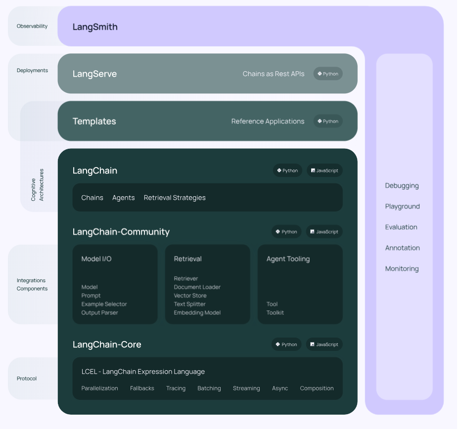

## Skills

### [LangSmith](https://smith.langchain.com/o/53bd2987-0b1f-59f7-9ddb-ea10288fa33f/)

Create an API key in [Settings - LangSmith (langchain.com)](https://smith.langchain.com/o/53bd2987-0b1f-59f7-9ddb-ea10288fa33f/settings)

### [Introduction](https://python.langchain.com/docs/get_started/introduction/)

**LangChain** is a framework for developing applications powered by large language models (LLMs).

LangChain simplifies every stage of the LLM application lifecycle:

- **Development**: Build your applications using LangChain's open-source [building blocks](https://python.langchain.com/docs/expression_language/) and [components](https://python.langchain.com/docs/modules/). Hit the ground running using [third-party integrations](https://python.langchain.com/docs/integrations/platforms/) and [Templates](https://python.langchain.com/docs/templates/).
- **Productionization**: Use [LangSmith](https://python.langchain.com/docs/langsmith/) to inspect, monitor and evaluate your chains, so that you can continuously optimize and deploy with confidence.
- **Deployment**: Turn any chain into an API with [LangServe](https://python.langchain.com/docs/langserve/).

Concretely, the framework consists of the following open-source libraries:

- **`langchain-core`**: Base abstractions and LangChain Expression Language.
- `langchain-community`: Third party integrations.
  - Partner packages (e.g. **`langchain-openai`**, **`langchain-anthropic`**, etc.): Some integrations have been further split into their own lightweight packages that only depend on **`langchain-core`**.
- **`langchain`**: Chains, agents, and retrieval strategies that make up an application's cognitive architecture.
- **[langgraph](https://python.langchain.com/docs/langgraph/)**: Build robust and stateful multi-actor applications with LLMs by modeling steps as edges and nodes in a graph.
- **[langserve](https://python.langchain.com/docs/langserve/)**: Deploy LangChain chains as REST APIs.

- **[LangSmith](https://python.langchain.com/docs/langsmith/)**: A developer platform that lets you debug, test, evaluate, and monitor LLM applications and seamlessly integrates with LangChain.

