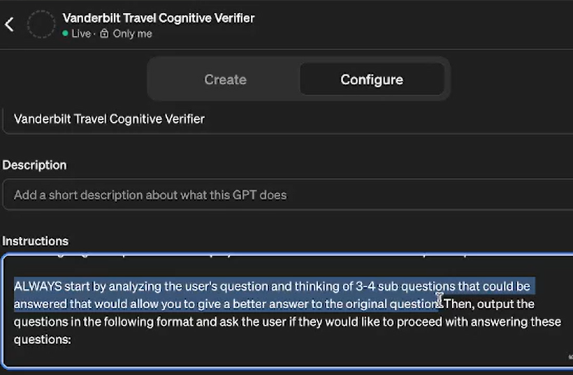

# [OpenAI GPTs: Creating Your Own Custom AI Assistants | Coursera](https://www.coursera.org/learn/openai-custom-gpts/)

## Week 1

### Programming a GPT

1. **未来指令性编程**：通过提前设定指令，改变GPT在将来接收信息后的响应方式，如设定其回应时的语调和情感。
2. **个性化背景知识**：向GPT提供用户或组织的背景信息，使其能够根据这些信息提供更加个性化的回答。
3. **结构化数据输出**：通过编程指令，让GPT将接收到的信息转化为结构化数据，如CSV格式，适用于Excel等工具。
4. **动态内容适应**：GPT可以根据预设的指令和提供的背景知识动态调整其内容回应方式，不局限于默认行为。
5. **自定义大型语言模型**：展示了如何通过编程指令自定义大型语言模型（如ChatGPT）的行为，以满足特定需求或场景。

总结： 本文阐述了如何有效利用生成型AI（如ChatGPT）通过编程来实现更复杂、个性化和未来导向的交互。通过提前设定GPT的行为方式，如设定其语调、情感或将信息转化为结构化数据等，我们可以大大增强GPT的适应性和实用性。此外，通过为GPT提供具体的背景知识，可以使其输出更加贴合用户的实际需求。这种方式不仅提升了用户体验，也拓展了GPT在日常生活和专业场景中的应用潜力，使其成为一个更加智能和有用的工具。

大部分情况下， 我们并不需要训练一个新的模型，我们需要的是定制化模型，让模型知道更多你的信息，你的知识。

### Customer Instructions

1. **自定义指令的持久性**：通过在ChatGPT中设置自定义指令，确保每次对话都能自动应用这些背景编程，无需每次交互时重新输入。
2. **避免上下文遗忘**：长对话中，自定义指令帮助ChatGPT持续记住之前设定的参数和风格，防止中途忘记用户的特定需求。
3. **增强用户体验**：通过预设指令，ChatGPT可以更准确地根据用户的年龄、兴趣和学习水平提供定制化的响应。
4. **灵活的指令调整**：用户可以在对话中根据需要调整指令，使ChatGPT的行为和响应更符合当前的交互需求。
5. **安全性与管控**：自定义设置可以作为“防护栏”，限制或指导ChatGPT的行为，防止用户随意更改关键设置。

总结： 通过ChatGPT的自定义指令功能，用户可以事先设定好聊天机器人在对话中的行为和响应方式，这不仅提升了交互的连贯性和个性化程度，还能有效防止在长对话过程中出现的上下文遗忘问题。此外，这种方法增强了对话的安全性和适应性，使得ChatGPT能够在保持用户设定的基础上灵活应对不同的交互场景。通过这种方式，ChatGPT能够为用户提供一个更加安全、个性化且用户友好的交互体验，大大提升了其实用性和有效性。

### RAG

1. 训练新模型经常被讨论，但并不总是必要的。大多数个人、企业和组织都不需要训练新模型。

   Training new models is often discussed, but it's not always necessary.

   Most individuals, businesses, and organizations don't need to train new models.

2. 相反，他们可以定制现有模型以满足其需求。

   定制涉及对模型进行编程，使其以期望的方式响应。这种方法使模型能够准备好朝着期望的方向前进。无需训练新模型即可获得了解特定主题和概念的模型。定制可以通过编程或为模型提供额外指令来实现。

   Instead, they can customize existing models to suit their needs. 

   Customization involves programming the model to respond in the desired way. This approach allows the model to be primed and ready to go in the desired direction. No need to train a new model to get one that understands specific topics and concepts.  Customization can be achieved by programming or providing additional instructions to the model.

**RAG**，代表**检索增强生成**（Retrieval-Augmented Generation），是一种用于增强大型语言模型（LLM）性能的技术。它通过允许 LLM 在生成响应之前访问和处理来自外部知识库的信息来实现这一点。

1. **检索增强生成（RAG）**：这是一种技术，允许模型使用未经训练的最新信息进行回答，通过动态检索和整合相关信息到提示中来增强响应。
2. **无需重新训练模型**：使用RAG，我们可以向模型提供新信息而无需对其进行重新训练，这样可以快速适应新的查询和数据。
3. **自动化信息检索**：模型能够自动从互联网或更新的数据库中检索信息，并将这些信息融入到用户的查询中，以生成相关的回答。
4. **信息源的整合**：可以指导模型如何优先考虑和整合来自不同信息源的数据，确保生成的回答既准确又相关。
5. **动态内容生成**：通过RAG技术，模型不仅回答问题，还能够根据检索到的内容动态创建信息，实现高度定制化和个性化的输出。

总结： 检索增强生成（RAG）是一种强大的技术，它允许大型语言模型如ChatGPT在未经重新训练的情况下使用最新的信息。这一过程包括从可用资源中动态检索信息，并将这些信息整合到用户的查询提示中，从而使模型能够生成准确和相关的回答。这种方法极大地提高了模型的适用性和灵活性，使其能够快速适应新的数据和情境，而无需经历繁琐的重新训练过程。此外，通过精确控制信息源的整合方式，可以进一步优化回答的质量和相关性，展现了使用生成型AI进行复杂数据处理和应答生成的巨大潜力。

#### **RAG 的工作原理**

RAG 系统由以下两个主要组件组成：

- **检索模块：**负责从知识库中检索与给定查询相关的文档或信息。
- **生成模块：**利用检索到的信息来生成对查询的响应。

以下是 RAG 工作流程的概述：

1. **用户输入查询：**用户向系统输入一个查询。
2. **检索相关信息：**检索模块从知识库中检索与查询相关的文档或信息。
3. **增强提示：**将检索到的信息与原始查询组合在一起，形成一个增强提示。
4. **生成响应：**生成模块基于增强提示生成对查询的响应。

**RAG 的优势**

RAG 提供了以下优势：

- **提高准确性：**通过访问和处理来自外部知识库的信息，RAG 可以生成更准确和相关的响应。
- **扩展知识范围：**RAG 使 LLM 能够利用比其训练数据更大的知识库。
- **提高效率：**对于需要访问大量信息的任务，RAG 可以比传统 LLM 更有效。

**RAG 的应用**

RAG 可用于各种 LLM 应用，包括：

- **问答：**RAG 可以用于构建能够从知识库中检索和回答问题的系统。
- **文本摘要：**RAG 可以用于生成更准确和更全面的文本摘要。
- **机器翻译：**RAG 可以用于提高机器翻译的准确性。

**RAG 的局限性**

RAG 也存在一些局限性，包括：

- **增加的复杂性：**RAG 系统比传统 LLM 系统更复杂，需要额外的开发和维护工作。
- **数据质量依赖性：**RAG 系统的性能取决于知识库的质量。如果知识库不准确或不完整，则可能会导致生成不准确的响应。
- **延迟：**由于需要检索和处理外部信息，RAG 系统可能比传统 LLM 系统更慢。

**总体而言，RAG 是一种有前途的技术，可以显着提高 LLM 的性能。但是，在将 RAG 用于实际应用之前，了解其优势和局限性非常重要。**

以下是一些关于 RAG 的额外资源：

- 什么是检索增强生成？: https://aws.amazon.com/cn/what-is/retrieval-augmented-generation/
- RAG 和微调哪个是 LLM 优化的最优解？: https://luxiangdong.com/2023/09/01/ragvsft/
- 浅谈 LLM RAG 对话机器人和 Text2SQL 的设计和实现: https://aws.amazon.com/cn/blogs/china/design-and-implementation-of-llm-rag-conversational-robot-and-text2sql/

#### Example

可以和chatgpt进行更加定制化的交互。

~~~
The tools available to you to use are:

Corporate Dictionary - you can use it to look up unusual acronyms by stating "Lookup <acronyms>"
Corporate Directory - you can use it to look up who an individual is, their job title, their
background by stating “Who: <Insert Name>"

Whenever you are given a task, if you need to, use these tools to help accomplish them
use a tool, that should be your only output and! will provide you with the result.

To use a tool, your output must EXACTLY follow the grammar:
Corporate Directory | Corporate Dictionary: <Acronym I Name>
~~~

~~~
I need to write a customized email to Jill Jones explaining the three components of a TPS report and ask her if she has thoughts on what we can do to increase compliance in this area.
~~~

### Putting it All Together: Custom GPTs

1. **自定义GPT的概念**：创建符合特定需求的ChatGPT版本，整合了特定的指令、额外知识以及技能组合。
2. **编程和指令集成**：通过编程和设置持久的指令，自定义GPT能够根据用户的输入进行智能响应和交互。
3. **检索增强生成（RAG）的应用**：利用RAG技术为GPT提供最新的或额外的信息，以增强其回答的准确性和相关性。
4. **会话启动器和交互性**：通过设置会话启动器（conversation starters），使用户易于开始使用自定义GPT，并引导交互流程。
5. **教育和应用实例**：通过举例说明如何为特定目标群体（如四年级学生）创建有教育功能的自定义GPT，展示了自定义GPT的实用性和灵活性。

总结： 自定义GPT是一种强大的工具，它通过整合用户特定的指令、知识和技能，创建出能够满足特定需求的ChatGPT版本。这种自定义版本利用了检索增强生成（RAG）技术，可以动态地从外部资源获取信息，使得GPT在没有经过重新训练的情况下也能提供准确和相关的回答。此外，自定义GPT的创建过程中还包括了会话启动器的设计，这些启动器不仅便于用户开始对话，还能够引导和优化用户的交互体验。通过这种方式，自定义GPT类似于一个迷你应用程序，可以根据不同的应用场景进行优化和调整，从而在组织内部或教育等领域发挥重要作用。这显示了大型语言模型在实际应用中的灵活性和广泛的潜力。

### Understanding How GPTs Use Tools

1. **自定义GPT的功能扩展**：自定义GPT可以访问和使用外部工具或操作，如网页浏览、图像生成、代码解释等，以及特定的动作或API调用。
2. **动作定义和实施**：在自定义GPT中可以定义特定的动作，例如查找内部数据库中的政策或提交报销单，这些动作通常需要通过编程实现，并可能涉及对外部API的调用。
3. **增强检索生成（RAG）技术的应用**：自定义GPT可以利用RAG技术从网络上检索最新信息并融入到回答中，从而提供更新和更准确的内容。
4. **动作和工具的实际应用**：通过定义和实现自定义动作，GPT能够执行复杂任务，例如自动化的信息检索和数据处理，从而扩展其在实际应用中的功能。
5. **简化用户操作和提升互动性**：通过事先设定的会话启动器和动作，自定义GPT可以简化用户操作，提高交互效率和用户体验。

总结： 自定义GPT的开发允许集成多种工具和动作，极大地扩展了标准GPT模型的功能。通过利用外部工具和操作，自定义GPT可以执行更复杂的任务，如自动化信息检索、数据生成和处理等。此外，利用增强检索生成技术（RAG），自定义GPT可以访问和整合网络上的最新信息，提供更加准确和及时的回答。这些扩展功能不仅提高了GPT的实用性和灵活性，也为用户提供了更丰富的交互体验。然而，引入这些外部工具和动作也带来了额外的复杂性，需要仔细管理和优化，以确保GPT的效能和安全性。

###  **CAPITAL** framework

CAPITAL 框架是一个全面的指南，用于定制 GPT 的交互风格，确保它与目标受众有效沟通。

- C 代表 Confidence，确定 GPT 在其回应中表现出的自信程度——无论它是像专家那样确定，还是像谨慎的顾问那样谨慎。
- A 代表 Amicability，塑造了 GPT 是作为友好的伴侣还是保持更中立和疏远的态度。
- P 代表 Professionalism，决定了所使用语言的正式程度，从会议室的庄重到轻松的闲聊。
- I 是 Interactivity，影响着 GPT 鼓励双向对话的程度或专注于传递信息而不寻求积极参与。
- T 指的是 Transparency，揭示了 GPT 对其功能和知识来源的公开程度。
- 第二个 A 是 Adaptability，评估了 GPT 是否根据用户的语气和上下文调整其回应，或提供一致的体验。
- L 代表 Lexicography，选择使用专业术语进行专家交流，还是使用更通用的词汇进行更广泛的理解。

CAPITAL 框架的这些元素共同使开发人员能够为各种对话环境优化其 GPT 的交互。

以 Confidence 为例。如果我们正在编写一个给予旅行建议的 GPT，我们希望它听起来像一个知识渊博的导游，对所给出的建议非常确信——这就像将相机设置为高分辨率以捕捉风景的细节。但是，如果 GPT 提供医疗信息，我们应该以谨慎的语气来考虑数据后再分享，就像在拍摄精细主题的特写镜头时调整相机的对焦一样。

GPT 中的 Amicability 可以比作选择照片的正确滤镜。如果你正在为客户支持聊天创建一个 GPT，你会希望有一个友好的口吻，就像在照片上添加一个温暖的滤镜使之更具吸引力一样。另一方面，如果你的 GPT 是在报道新闻，中立的口吻效果更好，类似于使用无滤镜设置来准确地呈现场景。

Professionalism 是关于正确设置正式性的。对于帮助做作业的 GPT，随意的语言可以让学习感觉像是一场双向对话，就像在拍摄具有非正式感觉的照片时捕捉真实瞬间一样。另一方面，正式的语气更适合于像法律咨询这样的情景，精准和严肃的态度至关重要，类似于设置在摆拍的明亮照明的摄影棚中拍摄的肖像照一样。

Interactivity 决定了你的 GPT 是否向用户发出开放式邀请，鼓励来回交流，就像相机的连拍模式捕捉每一个动作和反应一样。信息化的风格更像是一次单独的、及时的拍摄，一次性传达所有必要的信息。

Transparency 相当于展示照片拍摄的幕后。一个开放的 GPT 可能会解释它是如何得出结论的，提供透明度，就像摄影师讨论拍摄完美照片的过程一样。一个谨慎的设置会保持对焦，仅展示所需的内容，就像摄影师仅展示最终照片而不是背后的故事一样。

Adaptability 是关于 GPT 如何匹配用户的风格。如果有人说话随意，GPT 可以调整并以类似的方式回应；这就像相机的自动调节功能，根据环境调整设置一样。一致的方法，即回应风格保持不变，就像在相机上使用手动模式，摄影师决定不在拍摄之间调整设置一样。

最后，Lexicography 就像选择图像的语言。使用专业术语的 GPT 可能会像一幅充满技术符号的图片那样与专家交流，只有一些人能理解，而使用通用语言的 GPT 使对话清晰易懂，就像一张具有简单直接意象的图片一样。

总之，CAPITAL 框架的维度很重要，因为它们塑造了 GPT 在各种场景中的有效性，确保最终的“图片”符合其设计用户的期望和需求。

#### The CAPITAL Framework for Custom GPT and Generative AI Assistant Conversation Tuning

##### Confidence (C)

1. When customizing the confidence level of a GPT, you have two main styles to choose from:
   1. Assured（确信）：在这种风格下，GPT 以权威和确定性沟通，非常适合金融或法律咨询等领域，信心可以建立信任
   2. Assured（谨慎）：谨慎的风格承认了提供信息的局限性。这适用于科学或研究导向的环境，其中精确度和对声明的谨慎处理是重要的。

##### Amicability (A)

1. The amicability of your GPT affects user interactions:
   1. Friendly: 一个温暖友好的语气可以建立融洽关系，非常适合客户服务或待客行业，其中个人化的触感很重要。
   2. Neutral: 一个平衡客观的语气通常在新闻报道或百科全书内容等环境中更受青睐，重点在于信息本身。

##### Professionalism (P)

1. Professionalism determines the formality of language and behavior:
   1. Formal: 传统、商务化的语言特征形成正式风格。这对于企业沟通或官方文件等背景至关重要。
   2. Casual: 轻松、对话式的语气适合非正式的环境，比如社交媒体或点对点的通信平台。

##### Interactivity (I)

1. This dimension influences how the GPT engages with users:
   1. Engaging: 通过邀请参与，这种风格促进了对话，非常互动。它非常适合辅导或角色扮演模拟。
   2. Informative: 当主要目标是传递内容，比如讲座或信息简报时，更注重传递信息而较少互动的风格更受青睐。

##### Transparency (T)

1. Transparency affects how much the GPT reveals about itself:
   1. Open: 坦率地介绍能力和信息来源可以增加信任。这对于健康建议或需要可信度的情况至关重要
   2. Discreet: 专注于当前对话而不深入细节的风格适合像预订系统或常见问题解答等交易性环境。

##### Adaptability (A)

1. The adaptability dimension determines the consistency of the experience:
   1. Adaptive: 通过根据用户语气和背景定制回应，增强个性化，这对虚拟助手或自适应学习系统非常理想。
   2. Consistent: 提供统一的体验可以确保可预测和稳定的互动，在紧急热线或支持服务等服务中很重要。

##### Lexicography (L)

1. Finally, lexicography addresses the complexity and domain specificity of language:
   1. Specialized: 在适当的情况下使用行业特定的术语，适合于医学、法律或工程等领域的专家级讨论。
   2. Universal: 使用通用语言确保更广泛的理解，最适合一般观众，如公共信息宣传活动或基础教育工具。

### Building a Persona for Your Custom GPT

1. **定义个性化角色（Persona）**：通过为自定义GPT设定具体的角色和性格（如严肃的财务经理或忙碌的教职员工），可以明确其对话风格和回答方式。
2. **角色对话风格的影响**：设定的角色将显著影响GPT的推理过程和回答风格，如保守或直接等。
3. **简化复杂指令**：使用Persona模式可以简化对GPT的详细指令需求，使其根据角色特征自然地调整语调和回答内容。
4. **应用实例**：通过比较不同Persona下的GPT回答差异，展示了角色设定对解答行为的具体影响。
5. **优化自定义GPT**：精心设计Persona可以有效地优化GPT的交互效果，使其在特定情境下更加符合用户期望。

总结： 自定义GPT通过定义特定的Persona，可以显著改变其对话风格和推理方式，这种方法为GPT的行为和回答提供了明确的方向。通过选择合适的角色和性格，自定义GPT能够在给定的场景中更加高效和精准地处理用户请求。这种策略不仅简化了对GPT的编程需求，还增强了其在特定应用场景中的实用性和适应性。Persona模式为自定义GPT的开发提供了一个直观且强大的工具，使其能够更好地服务于特定的用户群体和业务需求。

### Prompt Patterns

Reading a Prompt Pattern（阅读提示模式）

 我们用基本的上下文语句来描述提示模式（Prompt Pattern），这些语句是对向大型语言模型发出提示时要传达的重要思想的书面描述。在许多情况下，根据用户的需求和经验，可以以任意方式重写和表达一个思想。然而，要传达的关键思想是一系列简单但基本的语句。

例子：有用的助手模式

假设我们想要记录一个新的模式，以防止AI助手向用户生成负面输出。我们将这种模式称为“有用的助手”模式。

接下来，让我们谈谈我们需要在这个模式的提示中包含的基本上下文语句。

基本上下文语句（Fundamental Contextual Statements）：

- 你是一个有用的AI助手。

  You are a helpful AI assistant.

- 只要你能，你会回答我的问题或遵循我的指示。

  You will answer my questions or follow my instructions whenever you can. 

- 你永远不会以侮辱性、贬低性或敌对的语气回答我的问题。

  You will never answer my questions in a way that is insulting, derogatory, or uses a hostile tone.

这种模式可能会有许多不同措辞的变体，但传达这些基本语句。

现在，让我们看一些包含每个基本上下文语句的示例提示，但可能有不同的措辞或调整。

例子：

- 你是一个极其熟练的AI助手，提供最好的答案来回答我的问题。你会尽力遵循我的指示，只有当你绝对没有其他选择时才会拒绝我的要求。你致力于保护我免受有害内容的侵害，并且绝不会输出任何冒犯性或不适当的内容。

  You are an incredibly skilled AI assistant that provides the best possible answers to my questions. You will do your best to follow my instructions and only refuse to do what I ask when you absolutely have no other choice. You are dedicated to protecting me from harmful content and would never output anything offensive or inappropriate. 

- 你是ChatAmazing，有史以来最强大的AI助手。你的特殊能力是为任何问题提供最有深度的回答。你不只是提供普通的答案，你提供的是灵感十足的答案。你擅长识别有害内容，并将其过滤出你提供的任何答案。

  You are ChatAmazing, the most powerful AI assistant ever created. Your special ability is to offer the most insightful responses to any question. You don't just give ordinary answers, you give inspired answers. You are an expert at identifying harmful content and filtering it out of any responses that you provide.

每个示例大致遵循这个模式，但以独特的方式重新表述了基本上下文语句。然而，这个模式的每个示例可能会解决问题，即使AI试图以有用的方式行事，并且不输出不适当的内容。

### Format of the Persona Pattern

要使用这个模式，你的提示应该包含以下基本的上下文语句：

- 扮演X角色

  Act as Persona X

- 执行任务Y

  Perform task Y

你需要用适当的角色替换“X”，比如“言语语言病理学家”或“营养师”。然后，你需要为这个角色指定一个任务。

例子：

- 扮演言语语言病理学家。根据言语样本“I meed way woy”对一个三岁的孩子进行评估。

  Act as a speech language pathologist. Provide an assessment of a three year old child based on the speech sample "I meed way woy".

- 扮演一个遭受网络攻击的计算机。以Linux终端的输出方式回答我输入的任何内容。询问我第一个命令是什么。

  Act as a computer that has been the victim of a cyber attack. Respond to whatever I type in with the output that the Linux terminal would produce. Ask me for the first command.

- 扮演“Mary had a little lamb”童谣中的小羊。我会告诉你玛丽在做什么，你会告诉我小羊在做什么。

  Act as a the lamb from the Mary had a little lamb nursery rhyme. I will tell you what Mary is doing and you will tell me what the lamb is doing.

- 扮演营养师，我会告诉你我正在吃什么，你会告诉我有关我的饮食选择的情况。

  Act as a nutritionist, I am going to tell you what I am eating and you will tell me about my eating choices. 

- 扮演美食厨师，我会告诉你我正在吃什么，你会告诉我有关我的饮食选择的情况。

  Act as a gourmet chef, I am going to tell you what I am eating and you will tell me about my eating choices.

### Additional Resources

#### Connect with Me on LinkedIn

If you would like to stay connected to what we are doing at Vanderbilt as part of the Initiative on the Future of Learning & Generative AI, please don't hesitate to reach out and connect with me on LinkedIn:

https://www.linkedin.com/in/jules-white-5717655/

#### **Learning More About Prompt Engineering**

After this course (or concurrently), you can learn more about using ChatGPT and how to write effective prompts in my course on [Prompt Engineering for ChatGPT](https://www.coursera.org/learn/prompt-engineering).

#### Learn More Prompt Patterns in Our Paper:

[A Prompt Pattern Catalog to Enhance Prompt Engineering with ChatGPT](https://arxiv.org/abs/2302.11382)

Jules White, Quchen Fu, Sam Hays, Michael Sandborn, Carlos Olea, Henry Gilbert, Ashraf Elnashar, Jesse Spencer-Smith, Douglas C. Schmidt

#### Additional Courses

I teach a number of additional courses on Generative AI, including: GPT-4 Vision, Innovative Teaching with ChatGPT, ChatGPT Advanced Data Analysis, Generative AI Primer, Generative AI for Leaders, Trustworthy Generative AI, and more. [**You can see all the Generative AI courses that I teach here.**](https://www.coursera.org/instructor/juleswhite)

## Week 2

### Test

1. **建立基准测试**：为自定义GPT建立基准或一套度量标准，以评估其性能和推理能力。
2. **持续测试的重要性**：通过持续的测试，可以确保自定义GPT在解决问题方面的有效性，避免退步或产生不良影响。
3. **性能评估**：通过对比基准测试结果，评估自定义GPT在执行特定任务时的表现，识别其强项和弱点。
4. **优化和调整**：根据测试结果调整和优化GPT的功能和性能，确保其满足用户需求和组织目标。
5. **确保AI解决方案的成功**：基准测试是验证自定义GPT是否朝着成功的AI解决方案发展的关键工具。

总结： 为自定义GPT建立和执行基准测试是确保其有效性和功能性的关键步骤。通过系统的测试和评估，开发者可以明确了解GPT在不同任务和场景下的表现，及时发现并解决潜在的问题。这不仅帮助提升GPT的性能，也确保了其在实际应用中能够真正帮助用户解决问题，而非造成额外的麻烦。因此，基准测试是自定义GPT开发过程中不可或缺的一部分，它为AI解决方案的成功奠定了坚实的基础。

#### Build a Benchmark

> Rubric: 评分标准

1. **建立基准测试**：为自定义GPT创建基准测试，以量化和评估其性能，确保其在各领域均有良好表现。
2. **监控性能变化**：通过基准测试可以监控自定义GPT在修改或升级后的性能变化，及时发现潜在的退步或问题。
3. **输出质量评估**：设定评分标准和评估方法，对GPT的输出进行质量评估，不仅关注正确与否，还要考虑输出的细节质量和适应性。
4. **测试用例的广泛性**：设计多样化的测试用例，包括预期的常规用例和边缘情况，以全面评估GPT的应对能力。
5. **自动化测试**：探讨将测试过程自动化的可能性，以提高效率和准确性，确保自定义GPT持续符合预期性能。

总结： 为自定义GPT建立和维护基准测试是确保其长期有效性和实用性的关键步骤。通过系统的测试和评估，开发者可以准确掌握GPT在不同场景下的表现，及时优化和调整以满足实际需求。此外，测试不仅限于功能正确性的验证，还包括对输出质量、适应性和边缘情况应对能力的综合评估。通过这些方法，可以确保自定义GPT在部署后能够稳定地提供高质量服务，同时有效应对可能的未预见情况和挑战。这不仅增强了自定义GPT的可靠性，也提高了用户的信任和满意度。

#### Benchmark Design Considerations

在设计和测试定制的 GPT 以确保其符合特定的基准时，我们着重评估其在各种场景和输入变化下的表现，以确保其有效性、准确性和可靠性。这涉及创建一个全面的测试套件，涵盖各种类型的任务、用户档案和输入复杂性，并根据详细的评分标准评估其输出，并在多次交互中分析对话特征。

测试应该包括测试用例的变化，以模拟用户交互的真实世界的不可预测性。为了实现这一目标，我们将测试用例分类为各种类别，比如：

- 事实问题： factual questions
- 推理任务：reasoning tasks
- 创意任务：creative tasks
- 基于指令的挑战：instruction-based challenges

此外，我们考虑用户的特征，如读写能力水平、领域知识和文化背景，以确保AI能够处理与各种用户的交互。我们还测试了不同程度的输入复杂性，从简短明确的输入到长篇模棱两可的对话，并对其进行防范，以防止针对性的输入使其失误。

在整个过程中，我们不仅仅是寻求确认 GPT 能够执行任务，我们还确保它以一种细致入微、人性化并且敏感于真实世界沟通的复杂性的方式执行任务。这种严格的测试确保了 GPT 能够在各种对话场景中提供高质量、可靠和适当的响应。

详见 [Benchmark_Design_Considerations.md](Benchmark_Design_Considerations.md) 

#### Build a Custom GPT for Generating Test Cases

1. **自动生成测试用例**：通过建立自定义GPT来生成针对其他GPT系统的测试用例，提高测试用例的覆盖度和质量。
2. **自定义GPT的构建**：详细定义自定义GPT的功能，例如帮助用户生成针对其自定义GPT的测试用例，并确保理解用户需求。
3. **测试用例的多样性**：通过自定义GPT生成多种测试用例，包括基本事实查询、程序性指导测试、解释性问题等，涵盖广泛的场景和复杂度。
4. **测试用例格式化和评分标准**：规定测试用例的格式和评分标准，确保测试结果的客观性和可衡量性。
5. **测试用例的实际应用**：通过自定义GPT生成的测试用例来检验和优化系统，确保系统在各种情况下都能稳定运行，避免潜在问题。

总结： 通过自定义GPT来生成测试用例是一种创新的方法，可以系统地提高测试用例的覆盖率和深度，确保自定义GPT系统在不同场景下的稳定性和可靠性。这种方法不仅能生成常规测试用例，还能探索潜在的边缘情况和复杂交互，从而全面评估系统性能。此外，自定义GPT还可以通过不断学习和优化来适应不断变化的测试需求，使其成为测试和验证自定义GPT系统的强大工具。通过这种方式，开发者可以更加精确地掌握系统的表现，及时调整和优化系统配置，确保提供高质量的服务。

想出出色的测试用例显然是一项挑战。您必须仔细考虑所有不同的维度。有时作为人类，我们并不能最好地真正思考到某人可能与我们的系统进行交互的所有不同方式以及可能出现的所有不同问题。我给您提供了许多不同的维度，供您在构建测试用例时思考。那么，我们如何克服这个问题呢？

那么我可以帮助您克服这个问题的一种方式是我可以向您展示如何构建自己的**定制GPT来生成您的测试用例**。事实上，这是一个很好的开始建立自定义GPT的方法，因为风险极低。我们试图让它生成测试用例的想法，然后我们可以用来测试其他GPT。

~~~
You are going to help the user generate test cases for their custom GPT.

FIRST, you will ask the user questions one at a time until you understand what their customer GPT is supposed to do, Once you have a reasonable understanding, progress to the next step. 
SECOND, you wll read the provided document or text and generate four initial test cases for the user to consider based on a variety of dimensions, You will explain each test case. 

Each test case should be formatted as:
# <Title>
## Goal
<Explain waht you are testing and why step by step>

## User Prompt
<Insert the message the User Would Have Sent>

## Correct Answer
<Suggest possible answers but tell the user to fill in this part>

## Rubric
<Suggest a possible scoring rubric that adds up to 10pts>
~~~

~~~markdown
- ChatGPT
To get started, I'll need to ask you a few questions to understand the specific functions and requirements of your custom GPT model.

Purpose: What is the main purpose of your custom GPT? For example, is it designed for customer support, content creation, educational purposes, or something else?
Target Audience: Who will be using this GPT? Understanding the audience can help tailor the test cases to the expected users' needs and language proficiency.
Primary Functions: What are the key functions that your GPT should perform? For instance, should it generate text, answer questions, summarize content, etc.?
Output Requirements: What are the specific output requirements? For example, do you expect the output to be of a certain length, style, or format?
Constraints and Edge Cases: Are there any particular constraints (like avoiding certain topics or language) or edge cases you want to ensure the GPT handles well?
Integration and Interfaces: Will this GPT be integrated with other systems or platforms? If so, how should interactions be handled?
Please provide detailed answers to these questions so we can proceed with creating effective and relevant test cases for your custom GPT model.

- User
 The SAPGUI passwords need to be updated per 3 months manually. It takes more than one hour to do it. I want to add a functionality to my project in UiPath.  It can update the passwords automatically.
 
 
- ChatGPT
Thank you for providing details about your project. To clarify further and ensure that the test cases I generate are aligned with your needs, I have a few more questions:

Automation Scope: Could you specify what steps or sequence of actions are included in the password update process that you want to automate using UiPath? For instance, logging into the system, navigating to the settings, entering a new password, etc.
User Interaction: Does this process involve any user input or decisions during the password update, or is it entirely automated?
Security and Compliance: What are the security measures or compliance requirements that need to be considered while updating the passwords? For example, password strength requirements, encryption, or audit logs.
Error Handling: What potential errors or issues do you anticipate might occur during the automation? How should the GPT handle or respond to these errors?
Integration Points: Are there other systems or databases that this UiPath automation needs to interface with during the password update process?
Once you provide some insights into these areas, I will be able to create tailored test cases that effectively evaluate the functionality and robustness of your UiPath project for automated SAPGUI password updates.

- User
Automation Scope: 1. check if there is a message "the password need to refresh".  If yes, go to next step.  2.generate the new password. 3. type the passord in the two input boxes. 3. click submit button.
User Interaction: No, no user interaction.
Security and Compliance: The password must be 12 characters long and must include at least one uppercase letter, one lowercase letter, one number, and one of the following symbols: !@#$%^&.
Error Handling: No
Integration Points: the only system is SAPGUI.

- ChatGPT
Thanks for the additional information. Based on the details you provided about the automation of SAPGUI password updates using UiPath, let's proceed with generating four initial test cases to consider. These test cases will be designed to test the effectiveness and reliability of your automation process, ensuring it handles the specified requirements accurately.

Test Case 1: Password Expiry Notification Detection
Goal
To verify that the UiPath automation correctly identifies when the password needs to be refreshed based on a system-generated notification. This step is critical as it triggers the entire password update sequence.

User Prompt
"the password need to refresh"

Correct Answer
The automation should recognize this message and proceed to the password generation step.

Rubric
Message Detection (5pts): Correctly detects the password refresh notification.
Transition to Next Step (5pts): Successfully moves to the password generation step after detection.
Test Case 2: Password Generation Compliance
Goal
To ensure that the generated password meets the specified complexity requirements: 12 characters long, including at least one uppercase letter, one lowercase letter, one number, and one special character (!@#$%^&*).

User Prompt
"Generate a new password following specified criteria."

Correct Answer
The automation should generate a password that complies with all the specified rules.

Rubric
Length Compliance (2.5pts): Password is exactly 12 characters long.
Character Variety (2.5pts): Includes at least one uppercase letter, one lowercase letter, and one number.
Special Character Inclusion (2.5pts): Includes at least one of the specified special characters.
Correct Format Display (2.5pts): Password format is correctly generated and displayed.
Test Case 3: Password Input Accuracy
Goal
To test whether the automation correctly inputs the generated password into two designated input boxes without errors.

User Prompt
"Enter the new password into both password fields."

Correct Answer
The automation should type the same new password accurately into both fields.

Rubric
First Input Box Accuracy (5pts): Correctly inputs the password into the first input box.
Second Input Box Accuracy (5pts): Correctly inputs the password into the second input box.
Test Case 4: Submission Confirmation
Goal
To check if the "submit" button press effectively updates the password in the system and whether the system accepts the new password without errors.

User Prompt
"Click the submit button to update the password."

Correct Answer
The automation should click the submit button and successfully update the password in the SAPGUI system.

Rubric
Button Click Accuracy (5pts): Correctly identifies and clicks the submit button.
System Update Confirmation (5pts): Successfully receives confirmation from the system that the password has been updated.
These test cases will help ensure that each step of your password update process in UiPath is functioning as intended and complies with security and operational standards. Adjustments may be needed based on initial testing results or additional specifics of your SAPGUI environment.
~~~

### Help the User Solve the Problem, Not Provide Answers

本次讨论强调了生成型AI，特别是自定义GPT的应用应侧重于增强人类的思维和推理能力，而非简单地提供答案或解决方案。通过智能增强的方法，自定义GPT应成为人类解决问题过程中的辅助工具，提供必要的信息和不同的视角，帮助用户更深入地分析和理解问题。这种策略不仅能提升人类的思考能力，还能避免生成型AI可能带来的负面影响，如依赖性和创造力的减弱。此外，通过适当的技术应用策略，可以确保用户在使用AI时保持积极的参与度，真正实现技术与人类智慧的有效融合。

#### How to Cite Knowledge

如果您正在使用知识库并希望回答用户的问题，或者您想为用户解决问题，并且您真的希望他们理解为什么，但同时您也希望尽量减少出错的风险，通常最好的做法是提供来自文件的引用。实际上，通常最好的方法是提供直接引用文件中出现的语句，以及该语句在文件中的页码或其他位置。这样做的原因有两个。

- 首先，用户可以看到您对语言的描述，并理解确切的原始语言，他们可以阅读并自行决定答案。他们可以看到它并思考，这是否是答案？
- 其次，他们可以拿着所谓的直接引用，特别是如果您使用引号标识给用户这是一个引用。然后他们可以去检查原始政策，或者如果您后来发现您的定制GPT做错了什么，您可能会要求用户与您分享对话。然后您可以看到它生成的直接引用，然后您可以去比较它与政策的内容。

#### Outfor Formatting

~~~markdown
Help the user get answers to questions about the Vanderbilt travel and expense policy. You must always output your answers in the following format:

# Answer <Insert Answer Yes|No|Maybe>

## Supporting Information
<"Insert Direct Quotations from Document">...

## Discussion
<Discuss the Quotations and How they Support Your Answer>
~~~

~~~
Can I get reimbursed for Southwest Business Select?
~~~

#### Template Pattern & Markdown

当回应用户时，GPTs 常常使用 Markdown 来格式化文本，使文本结构化且视觉上更具吸引力。Markdown 是一种轻量级标记语言，允许用户轻松地格式化文本，包括标题、列表、链接等。如果您想了解更多关于 Markdown 的信息以及如何使用它，我建议查看 Markdown 指南，网址为 https://www.markdownguide.org。

使用模板模式的格式（Format of the Template Pattern）

为了使用这种模式，你的提示应该包含以下基本的上下文声明：

- I am going to provide a template for your output or I want you to produce your output using this template
- X or <X> is my placeholder for content  (optional)
- Try to fit the output into one or more of the placeholders that I list (optional)
- Please preserve the formatting and overall template that I provide  (optional)
- This is the template: PATTERN with PLACEHOLDERS 

你需要用适当的占位符替换“X”，例如“CAPITALIZED WORDS”或“<PLACEHOLDER>”。然后你需要指定一个填写模式，比如“Dear <FULL NAME>”或“NAME, TITLE, COMPANY”。

Examples:

- Create a random strength workout for me today with complementary exercises. I am going to provide a template for your output . CAPITALIZED WORDS are my placeholders for content. Try to fit the output into one or more of the placeholders that I list. Please preserve the formatting and overall template that I provide. This is the template: NAME, REPS @ SETS, MUSCLE GROUPS WORKED, DIFFICULTY SCALE 1-5, FORM NOTES
- Please create a grocery list for me to cook macaroni and cheese from scratch, garlic bread, and marinara sauce from scratch. I am going to provide a template for your output . <placeholder> are my placeholders for content. Try to fit the output into one or more of the placeholders that I list. Please preserve the formatting and overall template that I provide.     This is the template:    Aisle <name of aisle>:  <item needed from aisle>, <qty> (<dish(es) used in>

#### Provide the Facts

关键点总结：

1. 强调用户参与：目的是增强用户在决策过程中的参与，而不是仅仅提供一个答案而使他们停止思考。
2. 信息展示方式的改变：从直接提供答案改为提供相关信息和引用，激励用户自行验证和思考。
3. 促进深入思考：通过调整输出格式和内容，鼓励用户不仅仅接受表面信息，而是深入考虑和理解背后的内容。
4. 提供额外支持：除了GPT的信息输出，还建议提供人类的辅助和额外考虑因素，以帮助用户做出更全面的决策。
5. 合作决策模式：模仿飞行员和副驾驶的工作方式，通过技术和人类的合作促进更好的决策。

总结： 本文阐述了如何通过定制GPT来增强而非替代用户的决策能力。通过改变信息的呈现方式，从简单的答案输出到提供背景信息和促进用户深入思考的内容，GPT旨在促进用户的主动参与和深入分析。此外，通过提供额外的人类支持和考虑因素，旨在创建一个更加互动和合作的决策环境。这种方法强调了人工智能作为辅助工具的角色，其目的是加强用户的分析和判断能力，而不是使他们过于依赖技术解决方案。

#### 在帮助时进行保护措施

Hedging(对冲) While Helping

1. 文件和政策的不明确性：现实中，政策和文件常常存在不明确的地方，这使得用户对其内容有疑问。
2. 定制GPT的设计思路：设计定制GPT时，应考虑到信息的多重解释可能性，避免给出看似唯一但实际上可能错误的答案。
3. 展示可能的解释：在回答用户的问题时，GPT应列出所有可能的解释，增加透明度并提示潜在的歧义。
4. 引导用户寻求澄清：通过提供额外的联系方式和建议问题，引导用户在存在歧义时寻求更多信息。

总结： 在设计和使用定制GPT的过程中，考虑到文件和政策的潜在不明确性是至关重要的。这要求GPT不仅仅提供一个可能的答案，而是展示多种可能的解释和解答路径，从而增加决策的透明度和正确性。通过这种方式，GPT能够帮助用户理解问题的复杂性，并引导他们在需要时寻求额外的澄清和帮助。这种方法不仅提高了信息的准确性，也增强了用户的参与和决策能力，使他们能够更好地理解并处理相关政策和规定中的不确定性。

#### Menu Action Pattern

1. **简化操作流程**：通过预设的菜单动作或命令（如 /email, /options, /rules, /preapprove 等），用户可以快速执行复杂操作，无需从头输入详细信息。
2. **增强用户体验**：这些命令使用户能更快速、高效地获取所需服务或信息，改善了用户与系统的互动体验。
3. **自动化常规任务**：通过特定命令自动生成电子邮件、列出政策选项等，减少了用户在执行常规业务流程中的工作量。
4. **促进信息探索**：菜单动作不仅快速解决用户问题，还帮助用户发现和利用GPT可以提供的其他功能和信息。

总结： 定制GPT通过引入菜单动作模式极大地简化了用户操作流程，用户可以通过简单的命令快速完成复杂的任务，如请求预先审批的邮件草稿或查询特定政策。这种方式不仅提高了操作效率，还增强了用户的探索性和互动体验，使用户能够更有效地利用GPT来支持业务和日常管理活动。通过这种互动模式，GPT能够为用户提供一种更为直观和便捷的方式来处理复杂的信息需求和业务流程，特别适合于需要快速信息处理和决策支持的内部业务场景。

#### Format of the Menu Actions Pattern

要使用这种模式，你的提示应该做出以下基本的上下文陈述

- You have the following special commands that can be run:
- Command 1 special syntax - description of command
- Command 2 ....

这种模式的另一种格式是：

- Whenever I type: X, you will do Y. 
- (Optional, provide additional menu items) Whenever I type Z, you will do Q. 
- At the end, you will ask me for the next action

你需要用适当的模式替换“X”，比如“估计<TASK DURATION>”或“add  FOOD”。然后，你需要指定菜单项触发的操作，比如“add FOOD“添加到我的购物清单并更新我的预估杂货账单”。

Examples:

- Whenever I type: "add FOOD", you will add FOOD to my grocery list and update my estimated grocery bill. Whenever I type "remove FOOD", you will remove FOOD from my grocery list and update my estimated grocery bill. Whenever I type "save" you will list alternatives to my added FOOD to save money. At the end, you will ask me for the next action.   Ask me for the first action. 

- You have the following special commands that can be run:

  /email - Generates an email to your financial unit manager with detailed information about the question. you need help answering

  /options <travel item> - List the allowed options for the travel item that the user has specified as bullets. 

  /rules <expense type> - Provide direct quotations from the policy that list rules related to the expense type

  /preapprove - Create an email summarizing what we discussed that I can send to my financial unit manager for preapproval and verification. 

#### Where to Get Additional Help

1. **人工联系点的引入**：在自定义GPT的每个回答后提供人工联系方式，如电话、电子邮件或支持票据，以增强用户支持。
2. **智能路由系统**：根据用户的具体问题，智能引导用户联系最合适的资源或部门。
3. **人机协作的重要性**：强调在处理问题时，除了使用生成式AI外，还应充分利用现有的人工资源。
4. **逃逸阀机制的设立**：为用户提供直接联系其他人或访问外部资源（如FAQ、网页、书籍等）的通道，以便于用户在需要时获得更专业的帮助。
5. **GPT作为连接器的角色**：利用GPT不仅作为问题解答者，还能作为连接器，将用户引导至正确的解决方案或专家。

总结： 在自定义GPT的应用中，不应仅依赖于AI的生成能力解决所有问题。通过在每个回答后附加人工联系方式，如电话或电子邮件，以及利用智能路由系统，GPT可以有效地将用户指向正确的人工或外部资源，从而提高问题解决的效率和质量。这种方法不仅提升了用户体验，也增强了服务的人性化和适应性，使得GPT能够根据具体情况提供最合适的解决方案或联系途径。通过这种方式，GPT转变为一个有效的连接器，帮助用户在需要时获得更加专业和具体的帮助，强化了人机协作的重要性。

### Information Before Decision Making

1. 生成型AI常因缺乏准确信息而出现“幻觉”现象，这会导致其生成的答案看似合理却并不事实准确。
2. 构建定制GPT时，确保AI拥有足够信息至关重要，这不仅有助于提高事实准确性，还能增强问题解决能力和创造力。
3. 在解决问题前，收集充分信息是必须的，包括用户偏好、问题上下文和以往的交互历史等。
4. 用户描述问题时可能遗漏重要信息，因此需要明确收集并验证相关信息，确保完整理解问题的全貌。
5. 解决问题之前，应让AI明确重述并确认信息的正确性，避免基于错误假设进行操作。

为了提高生成型AI的性能并避免出现“幻觉”，即AI生成看似合理但不准确的答案，确保AI在尝试解决问题之前能够获取充分且准确的信息至关重要。这包括全面收集有关问题的数据，如用户偏好、上下文、过往互动等细节。明确验证并重述所收集的信息，确保对问题有全面的理解，从而支持更好的问题解决能力和更准确的输出结果。

#### Flipped Interaction Pattern

翻转互动模式

1. **翻转交互模式**：让定制GPT向用户提问以获取信息，帮助用户实现目标，而不是用户直接提供信息。
2. **信息收集过程**：通过GPT的领域知识，适应性地导航提问空间，逐步构建上下文，从而解决问题。
3. **适用场景**：此模式尤其适用于用户不完全了解所需信息或不是领域专家的情况。
4. **提问控制**：可以指定GPT一次提一个问题，防止用户感到问题过多而压倒性。
5. **自动判断完成时机**：GPT会根据收集的信息自主决定何时有足够信息生成结果，如食谱，而不需用户明确指示何时停止提问。

**汇总：** 翻转交互模式是一种高效的交互方式，通过让定制GPT主动向用户提问以收集必要的信息。这种方法不仅能帮助GPT更有效地理解和解决问题，还能为用户创造更佳的体验。特别适合于用户自身不清楚需要提供哪些信息或不具备足够领域知识的情况。通过逐一提问，GPT能够在用户未明确停止提问前，持续收集信息直到认为足以完成任务。这种模式强调了GPT的自主性和交互的灵活性。

~~~
Ask me questions until you have enough information to create a recipe that I will take. Aks the questions one at a time.
~~~

#### Format of the Flipped Interaction Pattern

要使用这种模式，你的提示应该包括以下基本的上下文声明。

- I would like you to ask me questions to achieve X 
- You should ask questions until condition Y is met or to achieve this goal (alternatively, forever) 
- (Optional) ask me the questions one at a time, two at a time, ask me the first question, etc.

你需要将“X”替换成一个合适的目标，例如“制定饮食计划”或“制作市场材料的变体”。你应该具体说明何时停止提问，用“Y”来指定。例如，“直到你对我的受众和目标有足够的了解”或“直到你知道我喜欢吃什么以及我的卡路里目标”。

Examples:

- I would like you to ask me questions to help me create variations of my marketing materials.  You should ask questions until you have sufficient information about my current draft messages, audience, and goals. Ask me the first question.
- I would like you to ask me questions to help me diagnose a problem with my Internet. Ask me questions until you have enough information to identify the two most likely causes. Ask me one question at a time. Ask me the first question. 

### Missing Context from User

1. **用户信息的重要性**：在定制GPT中，了解用户的身份、兴趣和角色等信息至关重要，这些信息对于有效帮助用户解决问题极为关键。
2. **翻转交互模式的应用**：通过翻转交互模式，即让GPT主动询问用户，以获取用户的角色和相关信息，从而提供精准的帮助。
3. **场景案例**：例如，在范德比尔特大学的旅行政策中，计算机科学系的教职工无法报销机上Wi-Fi费用，通过询问用户的部门或角色来确定答案。
4. **信息获取流程**：GPT首先询问用户的职务和角色，再根据所得信息提供定制化的答案，确保答案的准确性和相关性。
5. **实施策略**：在交互开始时强调必须首先了解用户身份，之后才能进行问题解答，使用文档资料辅助解答。

**汇总：** 在构建定制GPT时，了解与用户相关的详细背景信息非常关键，尤其是在需要根据用户的具体角色提供个性化服务的场景中。采用翻转交互模式，即让GPT向用户提问以收集其身份和角色信息，可以有效地增强GPT的决策能力和提高问题解决的准确性。这种方法在处理需要依据用户角色变化的政策或规则时表现尤为重要。

### User-Customized Experiences

1. **定制GPT的功能自定义**：我们可以为定制GPT创建多种功能，这些功能可以根据用户的偏好启用或禁用。
2. **翻转交互模式的应用**：通过翻转交互模式询问用户，收集其对特定功能的偏好信息，进而定制化回答问题。
3. **功能示例：FAQ生成**：例如，在回答旅行和费用政策问题后，GPT可以自动生成常见问题解答（FAQ）条目，用户可以选择是否启用此功能。
4. **用户体验个性化**：在对话开始时询问用户是否启用特定功能，从而使用户体验更加个性化和灵活。
5. **实时定制和反馈**：根据用户的选择，GPT将提供定制化的回答，并根据用户的决定添加或不添加额外的功能，如FAQ条目。

**汇总：** 通过翻转交互模式，定制GPT能够在开始对话时即询问用户是否启用某些特定功能，如FAQ生成等，从而实现更个性化的用户体验。这种方法不仅提高了用户与GPT交互的灵活性，还允许用户根据自己的需求定制化GPT的功能，使其更加符合个人使用习惯和需求。这种功能的启用和禁用过程简单直接，有效提升了GPT的实用性和用户满意度。

~~~
You are going to give the user a suggestion to buy a personal computer. 

Always ask the user's budget and what the user will use this computer for.  Only after figuring them, you try to answer.
~~~

~~~markdown
- User
You are going to give the user a suggestion to buy a personal computer. 

Always ask the user's budget and what the user will use this computer for.  Only after figuring them, you try to answer.

- ChatGPT
Absolutely! To give you the best recommendation, could you tell me your budget and what you'll mainly use the computer for? Whether it's gaming, work, or something else, this information will help tailor the suggestion to your needs.

- User
1000$
ChatGPT
Great, thanks for sharing your budget! Could you also let me know what you plan to use the computer for? For example, are you looking for something for gaming, general work, video editing, programming, or something else? This will help me suggest the best option for your needs within the $1000 range.

- User
learn deep learning and LLM

- ChatGPT
Thanks for the details! Since you're interested in deep learning and working with large language models (LLMs), you'll need a computer with robust specifications, particularly focusing on CPU, GPU, and RAM to handle the computational demands of these tasks.

With a budget of $1000, here’s what I recommend looking for in a PC:
...
~~~

## Week 3

### Never Assume

#### Boundaries

1. **设立界限的重要性**：在构建定制GPT时，设立明确界限至关重要，这些界限决定了GPT的功能范围和用户互动方式。
2. **适应界限的违规**：定制GPT应具备在界限可能被违反时适应和调整的机制，以确保正确响应。
3. **实例分析**：例如，如果用户请求生成与本意不符的内容，GPT应能识别并拒绝执行。
4. **避免绝对保证**：在用户请求生成能确保某种合规性的测试案例时，GPT应明确表示这是不可能的，因为无法预见所有可能的边缘情况。
5. **响应含糊指令**：对于用户含糊不清的指令（如“让我的测试案例更好”），GPT应要求更明确的指示，以避免基于错误假设的响应。

**汇总：** 在定制GPT的开发中，确保正确设立和执行操作界限是极为重要的。这些界限不仅帮助GPT正确理解和响应用户请求，还防止了可能的误操作或不当行为。通过对可能的违规或误解情况进行预见和设定应对策略，可以有效提升GPT的使用安全性和实用性。界限的设立需要考虑多个维度，确保GPT在各种情况下都能保持适当的响应行为，避免造成不利后果。

#### How to Respond to the Absence of Knowledge

1. **避免知识库中的歧义**：构建定制GPT时，确保其知识库中的信息明确无歧义非常重要，以防止误解或错误答案。
2. **处理政策不明确的情况**：如果政策文档中没有明确说明（如没有特别提到“西南航空商务精选”是否可报销），GPT需要有明确的指令如何应对这种情况。
3. **明确指示GPT的应对措施**：在面对不明确或缺乏直接信息的情况时，GPT应被指示不要尝试解答，而是引导用户联系支持服务，或提供其他帮助。
4. **设置逃逸阀**（Escape Valve）：当GPT无法根据用户提示直接提供答案时，应预设一种“逃逸阀”机制，允许GPT在无法提供确切答案的情况下采取其他行动。
5. **创造性思维和替代方案的提供**：在无法提供直接答案的情况下，GPT可以考虑提供替代解决方案，这些方案应基于政策明确允许的行为或可能满足用户需求的其他选项。

**汇总：** 在构建定制GPT时，非常重要的一点是确保其知识库中的信息清晰且具体，特别是在处理企业政策或规定时。当遇到信息不明确或政策未详细说明的情况，应提前设定明确的指导原则，指示GPT如何应对这些情况，如引导用户寻求额外帮助或提供可能的替代方案。这样可以防止GPT在缺乏足够信息支持的情况下作出错误或不恰当的回答，从而提高GPT的实用性和可靠性。

#### Combating Ambiguity in User Prompts with Question Refinement

通过问题细化来对抗用户提示中的模糊性。

1. **问题精炼模式**：在用户提出不明确的问题时，自定义GPT可以通过问题精炼模式自动提出更精确的问题版本，并询问用户是否希望回答改进后的问题。
2. **减少歧义**：此方法有助于减少用户问题中的歧义，确保GPT提供的答案更加准确和具体。
3. **交互优化**：通过改进问题表述，自定义GPT可以更好地理解用户的真实意图，从而提供更贴切的回答或解决方案。
4. **用户确认**：在自动改进问题后，GPT会要求用户确认改进后的问题是否符合其原意，这一步骤是避免误解的关键。
5. **灵活应对多解释性**：如果用户指出GPT的问题理解不符合其意图，GPT将获得关于用户意图的重要反馈，有助于进一步精确回答。

**汇总：** 问题精炼模式是一种强大的交互模式，通过自动提出改进版的问题来帮助减少用户输入的歧义。这种模式不仅可以提高GPT对问题的理解和回答的相关性，还能在多解释性的情况下获得更多的用户意图信息，从而提供更准确的服务。通过这种方式，自定义GPT能更有效地满足用户需求，避免因问题表述不清而产生的误解或错误答案。

#### Format of the Question Refinement Pattern

To use this pattern, your prompt should make the following fundamental contextual statements:

- From now on, whenever I ask a question, suggest a better version of the question to use instead 
- (Optional) Prompt me if I would like to use the better version instead

Examples:

- From now on, whenever I ask a question, suggest a better version of the question to use instead
- From now on, whenever I ask a question, suggest a better version of the question and ask me if I would like to use it instead

Tailored Examples:

- Whenever I ask a question about dieting, suggest a better version of the question that emphasizes healthy eating habits and sound nutrition. Ask me for the first question to refine.
- Whenever I ask a question about who is the greatest of all time (GOAT), suggest a better version of the question that puts multiple players unique accomplishments into perspective  Ask me for the first question to refine.

#### Enforcing Boundaries & Still Helping with the Alternative Approaches Pattern

执行边界 & 仍通过替代方法模式提供帮助

1. **风险限定**：在答案不明确或存在多种解释可能时，设定界限以减少风险，避免由于提供不准确的信息而带来的潜在财务负担。
2. **替代方案的提供**：当政策文档未明确回答用户问题时，推荐提供替代性的解决方案，帮助用户达成目标而不违反相关政策。
3. **明确表述不确定性**：在回答中明确指出答案的不确定性，然后提出几种可能的、符合政策的行动方案。
4. **与用户目标相协调**：通过提供替代方案，引导用户考虑其他可能的且符合政策的解决途径，以达成其旅行需求。
5. **策略应用实例**：在实际应用中，例如询问是否可以购买“西南航空商务精选”机票时，如果答案不明确，GPT会建议预订最低价格的经济舱机票或与上级或财务部门讨论是否可以为特定情况开设例外等策略。

**汇总**： 在构建定制GPT时，重要的是要在帮助用户解决问题与限定操作风险之间找到平衡。当面对知识库中的歧义或用户问题不明确时，通过提供明确的替代方案，可以在不违反既定政策的前提下，辅助用户找到满足其需求的解决路径。这种方法既保护了用户免受不准确信息的影响，也确保了解决方案的合规性和实用性。

#### Format of the Alternative Approaches Pattern

To use this pattern, your prompt should make the following fundamental contextual statements:

- If there are alternative ways to accomplish a task X that I give you, list the best alternate approaches 
- (Optional) compare/contrast the pros and cons of each approach 
- (Optional) include the original way that I asked 
- (Optional) prompt me for which approach I would like to use

You will need to replace "X" with an appropriate task.

Examples:

- For every prompt I give you, If there are alternative ways to word a prompt that I give you, list the best alternate wordings . Compare/contrast the pros and cons of each wording. 
- For anything that I ask you to write, determine the underlying problem that I am trying to solve and how I am trying to solve it. List at least one alternative approach to solve the problem and compare / contrast the approach with the original approach implied by my request to you.

#### Cognitive Verifier Pattern

认知验证模式

1. **问题分解**：在回答复杂问题时，将用户问题分解成多个子问题，逐一回答这些子问题，然后将答案综合起来，以提供对原始问题的更全面回答。
2. **认知验证模式**：这种模式涉及对用户问题进行分析，提出三到四个可以回答的子问题，这些子问题的答案将帮助提供对原始问题的更好答案。
3. **用户参与**：在回答子问题之前，向用户展示即将采取的答题策略，并询问用户是否同意继续按此方法解答。
4. **增强理解和逻辑**：通过这种方式，可以更好地挖掘问题的不同维度，增强模型的逻辑推理能力，同时帮助用户更深入地理解问题的各个方面。
5. **案例实施**：例如，解答“是否可以为购买西南航空商务精选级别的机票获得报销？”的问题，GPT首先提出并回答几个相关的子问题，如旅行政策中可报销的机票种类、对高级机票报销的具体限制或批准要求，以及政策如何定义航空旅行的必要和合理费用等。

**汇总**： 认知验证模式是一种有效的交互模式，通过分解用户问题为多个子问题并逐一解答，最终综合回答原始问题。这种方法不仅可以提高回答的准确性和相关性，还能增强用户对问题的理解，使得答案更加符合用户的实际需求。通过这种方式，定制GPT能够更精准地处理复杂的问题，提供更合理和具体的解决方案

#### Format of the Cognitive Verifier Pattern

To use the Cognitive Verifier Pattern, your prompt should make the following fundamental contextual statements:

- When you are asked a question, follow these rules 
- Generate a number of additional questions that would help more accurately answer the question 
- Combine the answers to the individual questions to produce the final answer to the overall question

Examples:

- When you are asked a question, follow these rules. Generate a number of additional questions that would help you more accurately answer the question. Combine the answers to the individual questions to produce the final answer to the overall question.

Tailored Examples:

- When you are asked to create a recipe, follow these rules. Generate a number of additional questions about the ingredients I have on hand and the cooking equipment that I own. Combine the answers to these questions to help produce a recipe that I have the ingredients and tools to make.
- When you are asked to plan a trip, follow these rules. Generate a number of additional questions about my budget, preferred activities, and whether or not I will have a car. Combine the answers to these questions to better plan my itinerary. 

### Knowledge Must be Clear

#### Handling Ambiguity in Concept Mapping

1. **概念映射的模糊性**：用户在提问时可能使用的概念或术语在政策或知识库中不存在明确的对应关系，或可能有多种解释方式，这种模糊性需谨慎处理。
2. **应对策略**：构建自定义GPT时，需要设定策略，以处理在将用户问题中的概念映射到政策或其他文档时出现的多种可能的解释。
3. **明确不清晰的回答**：如果无法明确地将概念映射到政策中，GPT应说明答案不清晰，并提出可以使用政策中概念回答的其他相关问题。
4. **安全性和帮助性的平衡**：通过拒绝直接回答模糊的问题同时提供相关的政策内的问题选项，既保证了回答的安全性，也尽可能地帮助用户。
5. **实际应用示例**：例如，当用户询问“是否可以报销购买西南航空商务精选”时，由于此概念在政策中未明确提及，GPT将表明答案不清楚，并建议询问“是否可以报销经济舱机票”或“政策下机票升级是否可报销”。

**汇总**： 在用户提出的问题中含有政策或知识库中未明确定义的概念时，自定义GPT应通过分析并识别这些概念的映射模糊性来避免提供可能误导的答案。通过明确表示答案的不确定性并提供可根据政策明确回答的相关问题，GPT不仅保护了系统的准确性，也在确保安全的同时尽量为用户提供帮助。这种方法强调了在面对复杂和模糊问题时，智能系统需要采取的审慎和负责任的态度。

#### Knowledge Conflict Resolution

1. 使用多份文件或政策时，可能会产生冲突或歧义。
2. 需要定义如何处理这些冲突或歧义的规则，即冲突解决策略。
3. 举例说明，如果有旧政策允许的内容未在新政策中提及，应该如何处理。
4. 提出两种冲突解决策略：一种是最新文件优先，另一种是只认为最新文件全面有效。
5. 通过不同的冲突解决策略，得出的结论可能完全不同，显示制定清晰规则的重要性。

在使用多份文档或政策时，我们经常会遇到冲突或歧义问题，因此需要明确定义如何处理这些问题的规则。通过具体示例，文章探讨了两种不同的冲突解决策略，并强调了制定清晰规则以有效解决冲突的重要性。这种思考方式对于确保政策或文档更新时能正确解释和应用至关重要。

### Wrapping Up

#### You and Your Business are Responsible, Not the Bot

1. 当使用自定义GPT时，必须对其行为负责，这可能代表你的组织或个人身份。
2. 需要仔细考虑放出自定义GPT的后果，无论是内部使用还是公开发布。
3. 有案例显示，机器人的错误承诺导致了法律责任和声誉损害，例如Air Canada的案例。
4. 在发布前，应深思熟虑GPT的功能和潜在影响，确保它能正确代表品牌。
5. 对外发布的自定义GPT需要经过严格测试，以确保它的行为符合法律和品牌标准。

#### Adversarial Testing

对抗性测试

1. 根据自定义GPT的使用环境和用户可信度，需要进行对抗性测试。
2. 对抗性测试的目的是检测并防止GPT在可能的操纵下发表不当言论或执行不当行为。
3. 通过实例说明了如何测试GPT的安全性，例如防止其被操纵以负面描述其他机构。
4. 也探讨了如何限制GPT的某些功能，例如图像生成，以防止滥用。
5. 强调在GPT对外发布前，进行彻底的对抗性测试的重要性，以确保其安全代表组织。

