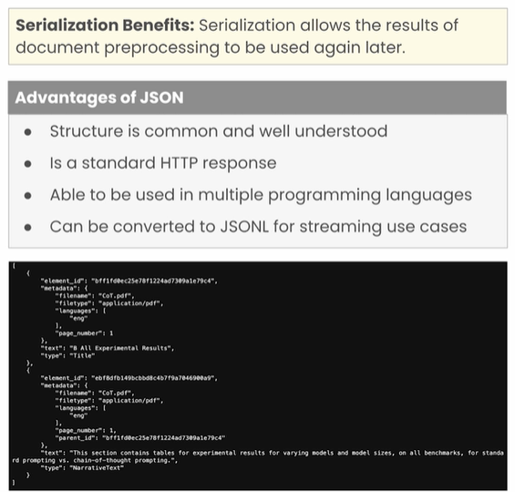
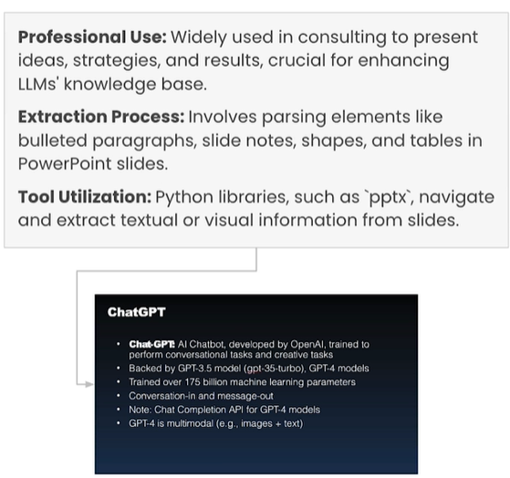
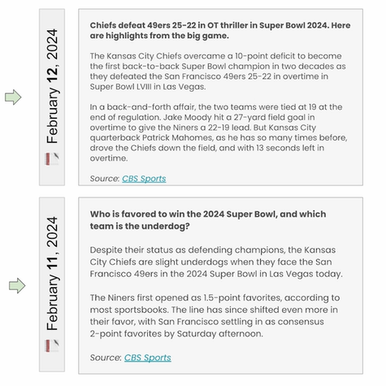

# [DLAI - Preprocessing Unstructured Data for LLM Applications (deeplearning.ai)](https://learn.deeplearning.ai/courses/preprocessing-unstructured-data-for-llm-applications/lesson/1/introduction)

## Overview of LLM Data Preprocessing

### Data Preprocessing and LLMs

- Retrieval Augmented Generation(RAG): A technique for grounding LLM responses on, validated external information.

- Contextual Integration: RAG apps load context into a database, then retrieve content to insert into a prompt.

- Industry Application:

  For industry user cases, relevant content comes from diverse document types, such as PDFs, Word docs, email, and webpages.

### Preprocessing Outputs

### Why is Data Preprocessing Hard?

## Normalizing the Content

 [Lesson_2_Student.ipynb](lesson2\Lesson_2_Student.ipynb) 

> `unstructured`是一个灵活的工具，可以处理各种文档格式，包括Markdown、、XML和HTML文档。

### Normalizing Diverse Documents

### Data Serialization

### HTML Page

### MS PowerPoint

### PDF with Complex Layout and Tables

## Metadata Extraction and Chunking

 [Lesson_3_Student.ipynb](lesson3\Lesson_3_Student.ipynb) 

> ChromaDB 是一款开源的向量数据库，专门为大型语言模型 (LLM) 应用而设计。它基于分布式 NoSQL 数据库 Apache Cassandra 构建，并提供了一个用户友好的 API 用于存储、索引和搜索向量嵌入。

### What is Metadata?

### Semantic Search for LLMs

面向LLM的语义搜索

### Hybrid Search

#### Example: Most Recent Information

Tell me the most recent information about the Super Bowl.

### Chunking

#### Chunking From Elements

#### Example

## Preprocessing PDFs and Images

### Document Image Analysis

### DIA Methods

### Document Layout Detection (DLD)

### Vision Transformers

### Advantages & Disadvantages

## Extracting Tables

### Table Extraction

### Table Transformers

### Vision Transformers

### OCR Postprocessing

## Build Your Own RAG Bot

