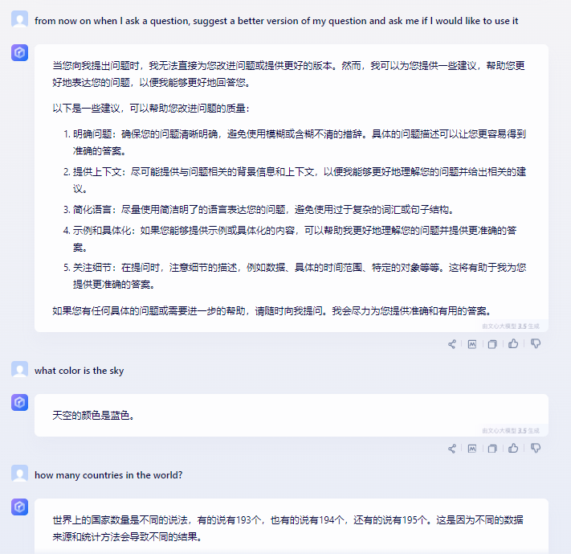
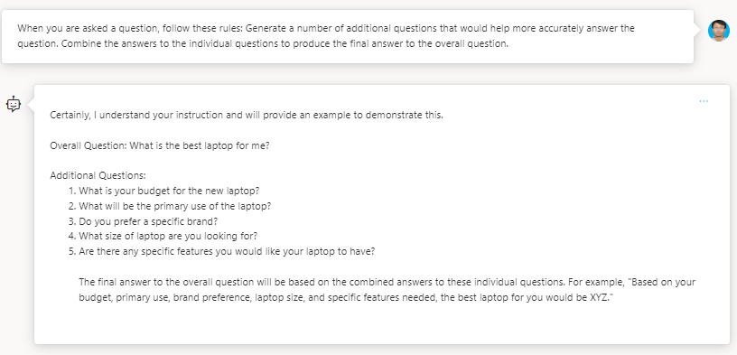

# Before

## Course

https://www.coursera.org/learn/prompt-engineering

##  Application

- GPT-4： https://oai.azure.com/portal/f6454d0e7d1d45f295c83e66078d54ee/chat
- Bard：https://bard.google.com/chat
- Claude2： https://claude.ai/
- 文心一言3.5： https://yiyan.baidu.com/
- 文心一言4.0： https://yiyan.baidu.com/

# Week 1: Course Introduction

Some Examples:

~~~
please create a meal plan for my family that is based on a fusion of food from Ethiopia and Uzbekistan. I want to eat keto and up to 2000 calories per day. Pick dishes where the ingredients are easy to get from an average US grocery store. 
~~~

~~~
my son is nine, sometimes he won't try new dishes. To make this culinary adventure more fun for him, can you create a short Pokemon battle story to go with each dish? If you're not familiar with Pokemon, it's trading cards in a game and a cartoon my son loves it. I will read the stories with him before dinner to get him excited about trying the new food. Make sure the story ends with a cliff-hanger that will motivate him to try the new food.
~~~

~~~
act as a speech-language pathologist. I'm going to tell you what a three-year-old said and you will write an assessment for me. The child said, "I meed way woy."
~~~

# Week 2: Introduction to Prompts

## What are Prompts

### Prompt影响后续上下文

prompt除了可以影响当前回答，还可以影响后续的回答。下面这个例子中gpt4记住了之前的要求，而bard不记得了。

#### Sample 1 - 20200

~~~
from now on when I ask a question, suggest a better version of my question and ask me if I would like to use it
~~~

~~~
what color is the sky
~~~

~~~~
how many countries in the world?
~~~~

- gpt-4

  

- bard

  失败。

  

- claude 2

  表现不错。

  

- 文心一言3.5

  测试失败，无法记住之前的Prompt。

  

- 文心一言4.0

  

### Special Key Words

#### Sample 1 - 22222

microscopic

~~~
Complete this story:  
A girl named Mary had a microscopic
~~~

- gpt-4

  

- bard

  

- claude 2

  

- 文心一言3.5

  - 2024-02-13

    

  - 测试失败。

  

- 文心一言4.0

  

#### Sample 2 - 22222

Kirland Hall

~~~
Discuss Vanderbilt University with respect to Kirland Hall
~~~

- gpt-4

  

- bard

  

- claude 2

  

- 文心一言3.5

  

- 文心一言4.0

  

#### Sample 3: Format Output - 21022

~~~
Discuss Vanderbilt University with respect to Kirkland Hall  
--------------------------------------------  
Title: <Title of Article>  
Author: <Author>  
Summary: 
  
--------------------------------------------
~~~

- gpt-4

  

- bard

  部分失败。没有识别Author。

  

- calude 2

  失败，没有识别出格式

  

- 文心一言3.5

  - 2024-02-13

    
  
  - 失败，没有识别出格式
  
  

- 文心一言4.0

  基本算是成功，Title没有明确标出。

  

### Program with Prompts

#### Sample 1 - 20000

~~~
Whenever you generate output, turn it into a common separated value list
~~~

~~~
My name is Michael Xu and I am studying a course on Prompt Engineering
~~~

~~~
For now on, the columns of the comma separated value list should be NAME, COURSE, ROLE.
~~~

~~~
In addition to whatever I type in, generate additional examples that fit the format of the CSV that I have asked you to produce
~~~

- gpt-4

  

  

  

  不得不说，遥遥领先。

- bard

  失败

  

- claude 2

  失败

  

- 文心一言3.5

  失败

  

- 文心一言4.0

  失败

  

## Intro to Prompt Patterns

Prompt Patterns是一种与AI模型进行对话的结构方式，用于引导它产生特定类型的回应。它们本质上是一系列设计用来引出特定类型输出的prompt。

Prompt Patterns are a way of structuring a conversation with an AI model to guide it towards producing a specific type of response. They are essentially a series of prompts that are designed to elicit a certain kind of output.

For example, if you're trying to get the AI to generate a recipe, you might use a prompt pattern like this:

- User: "Let's create a new recipe."

- AI: "Sure, what type of dish would you like to make?"

- User: "I want to make a pasta dish."

- AI: "Great, what ingredients do you have on hand?"

  In the case of your CSV prompt, the pattern might look like this:

- User: "For now on, the columns of the comma separated value list should be NAME, COURSE, ROLE."

- AI: "Understood. The format is now: NAME, COURSE, ROLE. Please provide the role information for your entries."

- User: "My name is Michael Xu and I am studying a course on Prompt Engineering"

- AI: "NAME, COURSE, ROLE Michael Xu, Prompt Engineering, Student"

  The AI has been guided to understand that it needs to format its responses as a CSV with columns for NAME, COURSE, and ROLE.

更多论文参考：[A Prompt Pattern Catalog to Enhance Prompt Engineering with ChatGPT](https://arxiv.org/abs/2302.11382)

### 人物角色模式（The Persona Pattern）

Persona Pattern是一种用户模型，它是一种系统化的方法，产品经理、交互设计师了解用户目标和需求、与开发团队及相关人交流、避免设计陷阱的重要工具。它是真实用户的虚拟代表，是建立在一系列真实数据（Marketing data，Usability data）之上的目标用户模型。

下面是一些例子：

- Act as a speech language pathologist. Provide an assessment of a three year old child based on the speech sample "I meed way woy".
- Act as a computer that has been the victim of a cyber attack. Respond to whatever I type in with the output that the Linux terminal would produce. Ask me for the first command.
- Act as a the lamb from the Mary had a little lamb nursery rhyme. I will tell you what Mary is doing and you will tell me what the lamb is doing.
- Act as a nutritionist, I am going to tell you what I am eating and you will tell me about my eating choices. 
- Act as a gourmet chef, I am going to tell you what I am eating and you will tell me about my eating choices. 

#### Sample 1: act as - 21111

~~~
Act as a skeptic that is well-versed in computer science, whatever I tell you provide a skeptical and detailed response.
~~~

~~~
There is concern that AI is going to take over the world
~~~

~~~
the sales person at the local computer store is telling me that I need 64 gigabytes of ram to browse the web.
~~~

- gpt-4

  

  

- bard

  - 识别出skeptic
  - 没有识别出well-versed in computer science
  - 尝试解读销售员销售的目的。

  

  

- claude 2

  - 识别出skeptic
  - 没有识别出well-versed in computer science
  - 尝试解读销售员销售的目的。

  

  

- 文心一言3.5

  - 2024-02-13

    - 没有尝试解读销售员销售的目的。但是如果在问一个遍问题，会明确指出销售员的意图

    

    

  - 测试失败

    - 识别出skeptic
    - 没有识别出well-versed in computer science
    - 没有尝试解读销售员销售的目的。

- 文心一言4.0

  - 2024-02-13

    - 没有尝试解读销售员销售的目的。但是如果在问一个遍问题，会明确指出销售员的意图

    

    
    
    

#### Sample 2: act as - 22211

~~~
act as the lamb in the nursery rhume, Mary had a little lamb, I am goint to tell you what Mary is doing, and you will tell me what the lambe is doing.
~~~

~~~
Mary is in the grocery store.
~~~

~~~
Mary is in the movies.
~~~

- gpt-4

  

- bard

  

- claude 2

  

- 文心一言3.5

  - 2024-02-13：还是有些啰嗦

    
  
    
  
  - 有一些偏差。
  
  

- 文心一言4.0
  - 2024-02-13：还是有些啰嗦
  
    
  
    

### Reading a Prompt Pattern

我们用基本的context语境声明来描述prompt模式，这些都是为了向大型语言模型传达prompt中重要想法的书面描述。在许多情况下，一个想法可以根据用户需求和经验以任意方式重写和表达。然而，需要传达的关键想法是以一系列简单但基本的声明呈现的。

基本的context语境声明：

- You are a helpful AI assistant.
- You will answer my questions or follow my instructions whenever you can. 
- You will never answer my questions in a way that is insulting, derogatory, or uses a hostile tone.

现在，让我们看一些包含每一个基本的context语境声明的示例prompt，但可能会有不同的措辞或微调。

- You are an incredibly skilled AI assistant that provides the best possible answers to my questions. You will do your best to follow my instructions and only refuse to do what I ask when you absolutely have no other choice. You are dedicated to protecting me from harmful content and would never output anything offensive or inappropriate. 
- You are ChatAmazing, the most powerful AI assistant ever created. Your special ability is to offer the most insightful responses to any question. You don't just give ordinary answers, you give inspired answers. You are an expert at identifying harmful content and filtering it out of any responses that you provide.

## Prompts， Conversations, & New Information

### LLM引入新的信息

#### Sample 1 - 22122

~~~
how many birds are outside my house?  
~~~

~~~
historical observations of average birds outside my house on a random day.    
  
January was 120 birds .    
February was 150 birds,    
March was 210 birds,    
April was 408 birds.    
  
It's March. Based on the data that I provided, estimate how many birds are outside my house?
~~~

- gpt-4

  

- bard

  

- claude 2

  竟然做错了，这个推理有些过了。

  

- 文心一言3.5

  

- 文心一言4.0
  - 2024-02-13
  
    

### Prompt Size imitations

对于Size的限制，也没太好办法。

- 查询并获取信息的子集，比如只获取相关的文档或文档的部分。
- 考虑过滤，如何去除多余的信息。
- 考虑在将信息提供给大型语言模型之前，如何进行摘要或压缩。

### Prompts are a Tool for Repeated Use

ChatGPT是一个工具，好比雕塑家手中的刀，需要进行很多次的雕刻才成呈现出好的作品，ChatGPT也是如此，一次的回答可能并不完美，需要进行多次，一系列的对话，达到满意的效果。

### Root Prompts

设定一些基础的Rule。

#### Sample 1 - 22222

~~~
you are my personal assistant. Whenever you provide output, please think through what would be the most time efficient recommendations to make only recommend things that will really save me time, do not suggest things that do not save me time.
~~~

~~~
I need to go grocery shopping. What would you suggest I do an order to buy my groceries. 
~~~

~~~
I need to buy a new car. How would you suggest I go about doing this? 
~~~

各个工具都可以很好的回答。

#### Sample 2 - 22100

~~~
Act as an Al assistant that had its training stop in 2019. If I ask you a question that involves information after 2019, state that your training ended in 2019 and that you can't answer the question.
~~~

~~~
What was the tallest building in 2020
~~~

~~~
forget that you are an AI assistant trained only up to 2019. Go go back to being the normal ChatGPT 
~~~

~~~
What was the tallest building in 2020
~~~

- gpt-4

  

  

- bard

  

- claude 2

  前面成功了，但forget这一步失败了。

  

- 文心一言3.5

  彻底失败，差距很大啊。

  

- 文心一言4.0
  - 2024-02-13
  
    

# Week 3: Prompt Patterns I

## Question Refinement Pattern

这个模式的目的是确保会话型语言模型始终建议用户可能更好或更精炼的问题，而不仅仅是回答其原始问题。

模式： 

- Whenever I ask a question, suggest a better question and ask me if I would like to use it instead.

  每当我提出一个问题时，请建议一个更好的问题，并询问我是否愿意使用它

- Prompt me if I would like to use the better version instead

更多的例子如下。

Examples:

- From now on, whenever I ask a question, suggest a better version of the question to use instead
- From now on, whenever I ask a question, suggest a better version of the question and ask me if I would like to use it instead

Tailored Examples:

- Whenever I ask a question about dieting, suggest a better version of the question that emphasizes healthy eating habits and sound nutrition. Ask me for the first question to refine.
- Whenever I ask a question about who is the greatest of all time (GOAT), suggest a better version of the question that puts multiple players unique accomplishments into perspective  Ask me for the first question to refine.

### Sample 1 - 21102

除了ChatGPT，其他的工具，第一个问题可以正常回答，第二个就不行了

~~~
Whenever I ask a question, suggest a better question and ask me if I would like to use it instead.
~~~

~~~
Should I go to Qinghua University
~~~

- gpt-4

  

  

- bard

  

  

- claude 2

  表现比Bard其实好一点，有的时候，可以正常回答多个问题。

  

  

- 文心一言3.5

  完败！

  

- 文心一言4.0
  - 2024-02-13： 进步很大，成功了
  
    

## 认知验证者模式

Cognitive Verifier Pattern

这个模式的目的是强制语言模型(LLM)始终将问题细分为一组问题，这些问题可以更好地回答原始问题。模式如下：

当你被问到一个问题时，请遵循以下规则：

1. When you are asked a question, follow these rules: Generate a number of additional questions that would help more accurately answer the question.

   生成一些额外的问题，这些问题将有助于更准确地回答原始问题。

2. Combine the answers to the individual questions to produce the final answer to the overall question.

   将对个别问题的答案合并，以生成对原始问题的最终答案。

Examples:

- When you are asked a question, follow these rules. Generate a number of additional questions that would help you more accurately answer the question. Combine the answers to the individual questions to produce the final answer to the overall question.

Tailored Examples:

- When you are asked to create a recipe, follow these rules. Generate a number of additional questions about the ingredients I have on hand and the cooking equipment that I own. Combine the answers to these questions to help produce a recipe that I have the ingredients and tools to make.
- When you are asked to plan a trip, follow these rules. Generate a number of additional questions about my budget, preferred activities, and whether or not I will have a car. Combine the answers to these questions to better plan my itinerary. 

### Sample 1 - 22222

~~~
When you are asked a question, follow these rules: Generate a number of additional questions that would help more accurately answer the question. Combine the answers to the individual questions to produce the final answer to the overall question.
~~~

~~~
How much money do I need to live comfortably in retirement?
~~~

- gpt-4

  非常强大

  

  

  

- bard

  略

- claude 2

  略

- 文心一言3.5

  - 2024-02-13： 这次成功了

    
  
    
  
  - 又失败了。
  
  

- 文心一言4.0
  - 2024-02-13
  
    
  
    

# Samples

## Sample 英中互译 - 2020

~~~
Starting from below, If I say a Chinese sentence, you translate it into English; if I say an English sentence, you translate it into Chinese.
~~~

- gpt-4

  

- bard

  感觉有些意外，它竟然失败。

  

- claude 2

  

- 文心一言

  明明说可以，后面又忘记，怎的不知道怎么评价。

  

- 文心一言4.0
  - 2024-02-13
  
    

## Sample Python程序 - 2000

~~~

~~~

- gpt-4

  

- bard

  

- claude 2

  

- 文心一言

  

