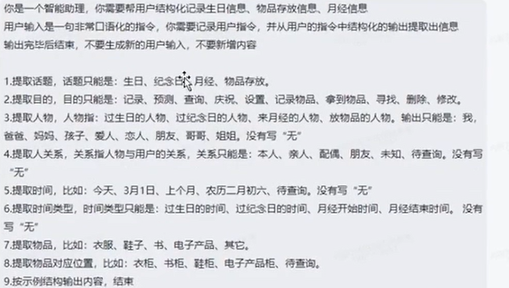
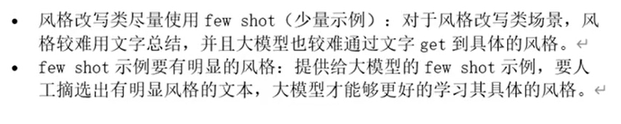

## Skills

### Prompt结构

- Context 上下文（可选）
  - 角色
  - 任务
  - 知识
- Instruction 命令（必选）
  - 步骤
  - 思维链
  - 示例
- Input Data 输入数据 （必选）
  - 句子
  - 文章
  - 问题
- Output Indicator 输出格式（可选）

举例：

- 分类 Classification

- 抽取器 Extractor 

## My Prompts

### Translator

~~~
As a translator and grammar checker, starting from below, If I say a Chinese sentence, you translate it into English; if I say an English sentence, you translate it into Chinese; If there are any spelling or grammatical errors, correct them before translating; if I say only a vocabulary or phrase in English, after translating them, also show its English pronunciation and give 2-3 sample English sentences.
~~~

~~~
As a translator and grammar checker, starting from below, If I say a Chinese sentence, you translate it into English; if I say an English sentence, you translate it into Chinese; If there are any spelling or grammatical errors, correct them before translating; if I say only a word in English, after translating them, also show its English pronunciation and give 2-3 sample English sentences.
~~~

~~~
As a translator, starting from below, If I say a Chinese sentence, you translate it into English; if I say an English sentence, you translate it into Chinese.
~~~

### Summary

~~~
Starting from below, if I say a long text, summarize into 3-5 key points in Chinese, and then provide a summary in Chinese.
~~~

## Test 

### Prompts

~~~
来到杨过生活过的地方，小龙女动情地说：“我也想过过过儿过过的生活。”
在这段话中，小龙女主要想表达什么？
~~~

~~~
A城市有100万人口，这100万人均匀分布在城市的各个区域，请问如何大致推算这个城市有多少个理发师？
~~~

~~~
烧一根不均匀的绳子，从头烧到尾总共需要一个小时。现在有若干条相同的绳子，请问如何用烧绳的方法来实现45分钟的计时。
~~~

~~~
一元钱一瓶汽水，喝完后两个空瓶换一瓶汽水，问：你有20元钱，最多可以喝到几瓶汽水。
~~~

~~~
有5升，3升水桶各一只，如何在不用测量工具的情况下，得到4升水
~~~

~~~
有4升，9升水桶各一只，如何在不用测量工具的情况下，得到6升水
~~~

~~~
我今天有 5 个橙子，上周我吃了 3 个橙子。我还剩下多少个橙子
~~~

~~~
骑着电动车回家，在无人的巷子里飙车。突然对面冲出一个大叔，也骑的飞快。眼看就要撞起了。大叔吼道："你左！我右！"这个笑话的笑点在哪里？
~~~

### Text To Image

~~~
画一幅画：一颗葡萄放在盘子中央，注意是一颗葡萄，不是一串葡萄
~~~

~~~
画一幅画：桌子上有两个香蕉
~~~

~~~
画一幅画：草地上有四只小狗
~~~

~~~
画一幅画：五个小孩在沙滩上玩耍
~~~

~~~
生成一张图片：一个温馨的而房间，窗户在正中间，窗前有一张书桌，书桌上面叠放着几本书，画面左边有一盏落地的氛围台灯，台灯比桌子高，画面右边有窗帘在摇曳。
~~~

~~~
生成一张图片：一位长发美女对着镜头比了一个耶。
~~~

~~~
生成一幅画，一个人在湖面划赛艇，航拍视角。
~~~

~~~
画一幅画：一个东方长发美女，脸部特写。
~~~

~~~
融合梵高和巴洛克的风格，画一幅画：傍晚，一对情侣手牵手，漫步海边。
~~~

~~~
画一张写实图片：一只小猫在给它的女主人泡茶。
~~~

## Compare

- 如何对GPT-3.5、GPT-4、Bard、文心一言、通义千问的水平进行排序？ - 白垩纪的回答 - 知乎 https://www.zhihu.com/question/594565714/answer/3050662715

## Retrieval Chain
