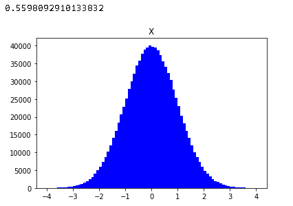
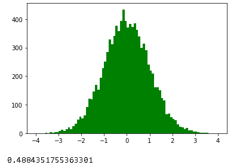

Box-Muller变换是一种采样方法，它是通过服从均匀分布的随机变量，来构建服从高斯分布的样本。

## 定义

假设两个随机变量$U_1, U_2$服从$[0,1]$上均匀分布的，随机变量$X, Y$满足下面公式：
$$
X = \cos (2\pi U_1) \sqrt{-2\ln U_2} \\
Y = \cos (2\pi U_2) \sqrt{-2\ln U_1}
$$
则$X$与$Y$服从均值为0，方差为1的高斯分布。

## 证明

下面来证明Box-Muller变换。

假定$X、Y$服从均值为0，方差为1的高斯分布，且相互独立，它们的概率密度如下。
$$
p(X) = \frac 1 {\sqrt {2 \pi}} e^{-\frac {X^2} 2} \\
p(Y) = \frac 1 {\sqrt {2 \pi}} e^{-\frac {Y^2} 2}
$$
由于$X、Y$相互独立，则它们的联合概率密度满足
$$
p(X, Y) = \frac 1 {2 \pi} e^{-\frac {X^2+Y^2} 2}
$$
然后进行极坐标变换，$X= R\cos\theta, Y = R\sin\theta$，则概率密度变成：
$$
p(R, \theta) = \frac 1 {2\pi} e^{-\frac {R^2} 2}R
$$

然后分别得到$r, \theta$的累积分布函数，首先看$\theta$：
$$
F(\phi) = P( \theta <= \phi) =  \int_0^{\phi}  \int_0^{+\infty} \frac 1 {2\pi} e^{-\frac {R^2} 2}R  \ dR d\theta = \frac \phi {2 \pi}
$$
很明显，$\phi $服从$[0, 2\pi]$上的均匀分布。再令$U_1 = \frac \phi {2\pi}$，则$U_1$服从$[0, 1]$上的均匀分布。

再看$r$：
$$
P( R \leq r) = \int_0^r \int_0^{2\pi} \frac 1 {2\pi} e^{-\frac {R^2} 2}R\  d\theta  dR =1- e^{-\frac {r^2} 2}
$$
令$z = P(R \leq r) $，其反函数为：
$$
r = F^{-1}(z)  = \sqrt {-2\ln(1-z)} \tag 1
$$
然后根据 *逆变换采样* 定理，只要令$z$服从上的$[0, 1]$均匀分布，便可以生成$r$的分布。再令$U_2=1-z$，很明显$U_2$也服从上的$[0, 1]$均匀分布。

再根据$X= R\cos\theta, Y = R\sin\theta$，把公式$(1),以及$$U_1=\frac \theta {2\pi}, U_2=1-z$带入，可得：
$$
X = \cos (2\pi U_2) \sqrt{-2\ln U_1} \\
Y = \sin (2\pi U_2) \sqrt{-2\ln U_1}
$$
根据原定义，$X, Y$都符合正态分布，由此，可以通过均匀分布产生正态分布了。

## 代码

~~~python
import matplotlib.pyplot as plt
import numpy as np
from scipy import stats

def box_muller(SampleSize=1000000):
    U1 = np.random.uniform(0,1,SampleSize)
    U2 = np.random.uniform(0,1,SampleSize)
    X = np.cos(2*np.pi*U1)*np.sqrt(-2*np.log(U2))
    return X

X = box_muller()
plt.hist(X, bins=np.linspace(-4,4,81),facecolor="blue")
plt.title('X')
 
# 检验分布是否符合正态分布
x_test = stats.kstest(X, 'norm')
# 大多数情况下，p值>>0.05，证明不能拒绝X是正态分布。
print(x_test.pvalue)
~~~

实际上，python中random包的gauss方法采用了Box-Muller变换生成高斯分布。

~~~shell
import matplotlib.pyplot as plt
import numpy as np
import random
from scipy import stats

X = [ random.gauss(0, 1) for _ in range(10000)]
plt.hist(X, bins=np.linspace(-4,4,81),facecolor="green")
plt.show()

x_test = stats.kstest(X, 'norm')

# p值>>0.05，证明不能拒绝X是正态分布。
print(x_test.pvalue)
~~~

## 参考

- [漫谈正态分布的生成](https://cosx.org/2015/06/generating-normal-distr-variates/)
- [蒙特卡洛采样之拒绝采样（Reject Sampling）](http://www.twistedwg.com/2018/05/30/MC-reject-sampling.html)
- [Box-Muller变换原理详解](https://zhuanlan.zhihu.com/p/38638710)