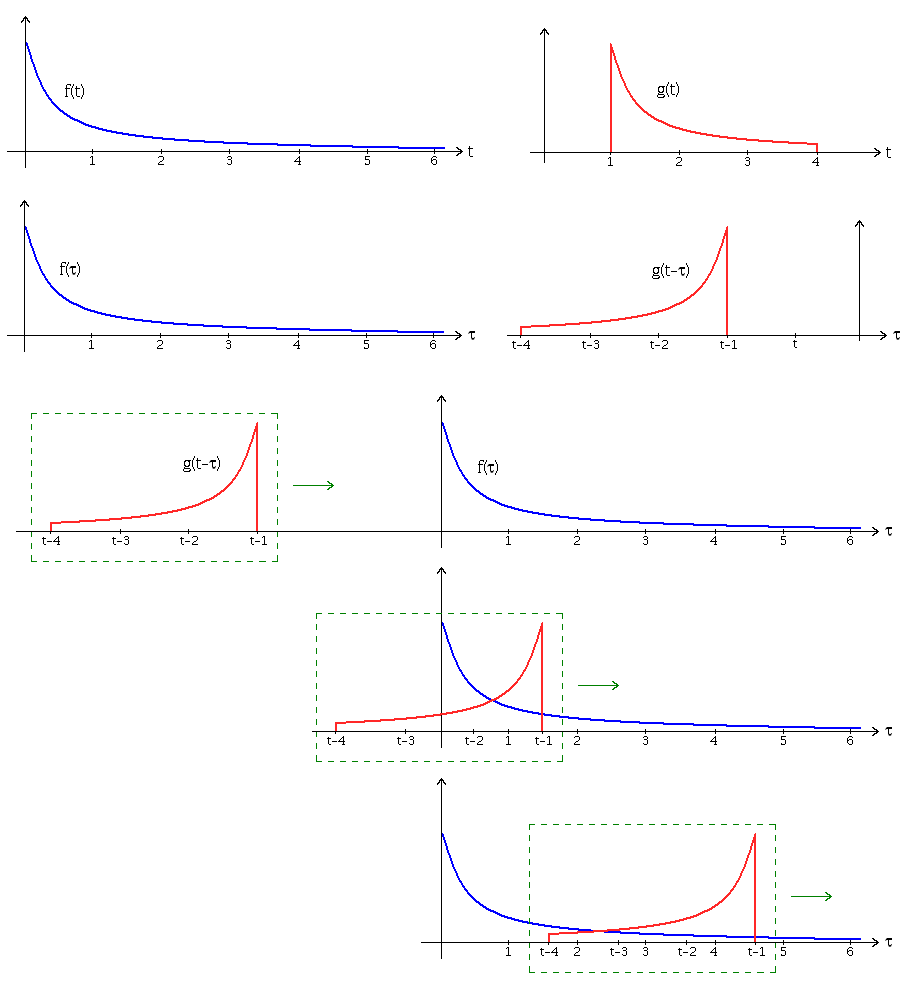
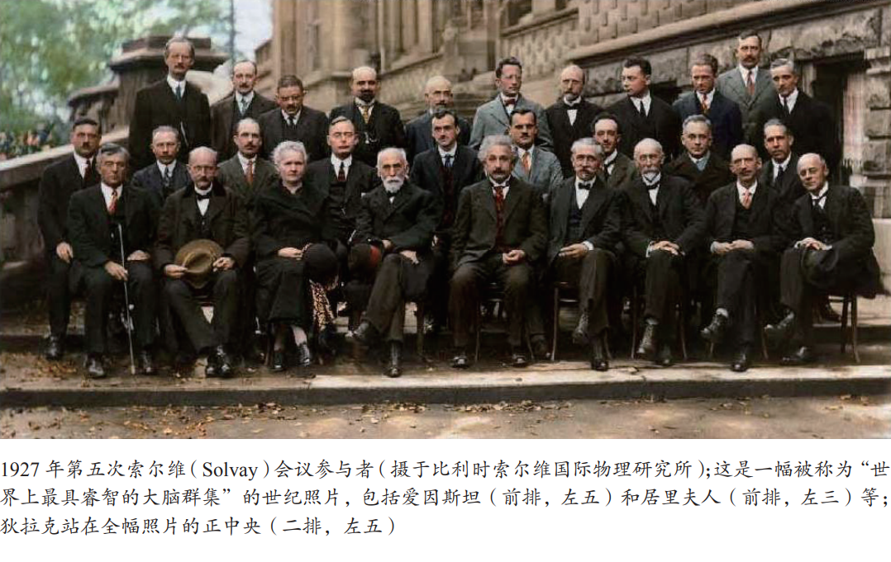

## 卷积（Convolution）

函数$ f,g$ 是定义在$ \mathbb {R} ^{n}$上的[可测函数](https://zh.wikipedia.org/wiki/可测函数)（measurable function），$f$与$g$的卷积记作$ f*g$，它是其中一个函数翻转，并平移后，与另一个函数的乘积的积分，是一个对平移量的函数，也就是：
$$
(f*g)(t)=\int _{\mathbb {R} ^{n}}f(\tau )g(t-\tau )\,d\tau
$$

### 图解卷积

1. 上图第一行两图分别为$f(t)$和$g(t)$。
2. 首先将两个函数都用$ \tau $来表示，从而得到$f( \tau )$和$g( \tau )$。将函数$g( \tau )$向右移动$t$个单位，得到函数$g( \tau -t)$的图像。将$g( \tau -t)$翻转至纵轴另一侧，得到$g(-( \tau -t))$即$g(t- \tau )$的图像。
3. 当时间变量（以下简称“时移”）取不同值时，$ g(t-\tau )$能沿着$ \tau $轴“滑动”。上图第三四五行可理解为“滑动”。
4. 让*$ \tau $*从$-\infty$滑动到$+\infty$。两函数交会时，计算交会范围中两函数乘积的积分值。换句话说，我们是在计算一个滑动的的加权总和(weighted-sum)。也就是使用$ g(t-\tau )$当做加权函数，来对$ f(\tau )$取加权值。

上面时维基百科的解释，看起来还是有些不好懂啊。其实可以这样理解。

$(f*g)(t)$ 是关于$t$的函数，需要计算每个时刻$g$对$f$的加权

- $(f*g)(0) = \int _{\mathbb {R} ^{n}}f(\tau )g(-\tau )\,d\tau$
- $(f*g)(1) = \int _{\mathbb {R} ^{n}}f(\tau )g(1-\tau )\,d\tau$
- ...
- $(f*g)(t) = \int _{\mathbb {R} ^{n}}f(\tau )g(t-\tau )\,d\tau$
- ...

以上每一段计算，都是计算两个函数重合的部分的乘积，然后进行累加（积分）。下面一个非常形象的例子。

小明每天赚到钱是$f(t)$，每天他都把当天赚到的钱存银行，存款利息是$0.0001$，如果存$t$天，本金加利息是$g(t)=(1+0.0001)^{t }$，现在要计算这一年中，小明每一天拥有的钱是多少？

- 第1天，小明拥有$(f*g)(1) = \sum_{\tau=1}^1 f(\tau )g(1-\tau )\ = f(1) $

- 第2天，小明拥有$(f*g)(2) = \sum_{\tau=1}^2 f(\tau)g(2-\tau )=f(1)*(1+0.0001)+f(2) $

- ...

- 第365天，小明拥有
  $$
  \begin{align}
  (f*g)(365) =& \sum_{\tau=1}^{365} f(\tau)g(365-\tau ) 
  \\=& f(1)*(1+0.0001)^{364} + 
  \\ & f(2)*(1+0.0001)^{363} +
  \\ & ... + 
  \\ & f(364)*(1+0.0001) + 
  \\ & f(365) 
  \end{align}
  $$

还可以这样理解。
$$
(f*g)(t)=\int _{\mathbb {R} ^{n}}f(\tau )g(t-\tau )\,d\tau
$$
设$\delta =t-\tau$，意思是$t$时刻和$\tau$的时间差。
$$
(f*g)(t)=\ \int _{\mathbb {R} ^{n}}f(\tau )g(\delta)\,d\tau
$$

- $g(\delta)$：看成是一个信号，随着时间变化的增加或衰减的函数。
- $f(\tau )g(\delta)$：表示$\tau$时刻的一个信号，经过$\delta $时间后，在当前时刻$t$的一个状态。
- $\int _{\mathbb {R} ^{n}}f(\tau )g(\delta)\,d\tau$：表示把所有历史时刻的信号在当前时刻的状态累加起来，这样就得到了当前信号的状态。

### 卷积定理

### 参考

- [卷积](https://zh.wikipedia.org/zh/卷积)
- [如何通俗易懂地解释卷积？](https://www.zhihu.com/question/22298352)
- [一分钟看完漫画搞懂卷积](https://zhuanlan.zhihu.com/p/79196130)
- [“卷积”其实没那么难以理解](https://zhuanlan.zhihu.com/p/41609577)：里面介绍狄拉克的$\delta$函数介绍的很好。
- [理解卷积 Convolution](https://www.qiujiawei.com/convolution/)：非常精彩，推导了卷积公式的三种由来。
- 

## Great Guys

