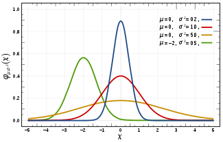
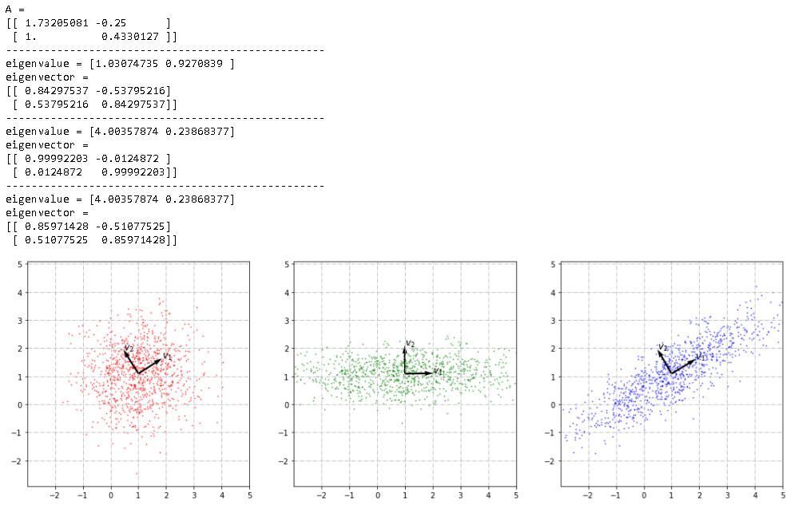
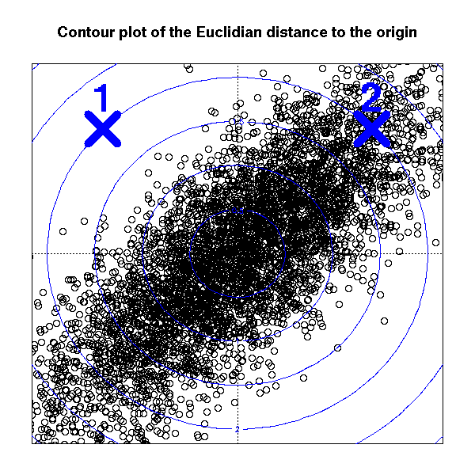
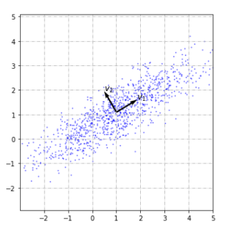

协方差矩阵（Covariance Matrix）非常的有用重要，本文介绍了协方差矩阵以及如下几个方面的应用，希望能够帮助大家理解它。

- 正态分布
- 马氏距离
- 主成分分析

## 协方差矩阵

在统计学与概率论中，协方差矩阵的每个元素是各个向量元素之间的协方差，是从标量随机变量到高维度随机向量的自然推广。它的公式如下：
$$
\Sigma = 
\begin{bmatrix}
\sigma(x_1,x_1) & \sigma(x_1,x_2) & \cdots & \sigma(x_1,x_n) \\
\sigma(x_2,x_1) & \sigma(x_2,x_2) & \cdots & \sigma(x_2,x_n)  \\
\vdots & \vdots & \ddots & \vdots  \\
\sigma(x_n,x_1) & \sigma(x_n,x_2) & \cdots  & \sigma(x_n,x_n)\\
\end{bmatrix}
$$
其中 $$x = \left[ \begin{matrix} x_{1}, x_{2},\cdots,x_{n}\end{matrix}\right]^\mathrm{T}$$，表示$$n$$个随机变量，$$\sigma(x_i,x_j)$$表示协方差，$$\sigma(x_i, x_j)=E[(x_i-E(x_i))(y_j-E(y_j))]$$。

协方差矩阵还可以用向量的方式来表达，形式如下：
$$
\Sigma = \frac 1 {m-1} \begin{bmatrix} x_1-\mu & x_2-\mu & \cdots & x_m-\mu \end{bmatrix}\begin{bmatrix} x_1-\mu & x_2-\mu & \cdots & x_m-\mu\end{bmatrix}^\mathrm{T}  \tag{1}
$$
其中$m$表示样本的个数， $x_i$表示一个样本，是一个长度为$n$的向量。

## 正态分布

接下来看看协方差在正态分布里面的应用。对于最常用的一元正态分布，我们几何看不到它（协方差）的样子，直到多元正态分布，协方差才姗姗出场。下面先来复习一下一元正态分布。

### 一元正态分布

它的密度函数如下。
$$
f(x) = \frac{1}{\sqrt{2π}σ}e^{-\frac{(x-μ)^2}{2σ^{2}}}
$$

> 根据[中心极限定理](https://zh.wikipedia.org/zh-hans/%E4%B8%AD%E5%BF%83%E6%9E%81%E9%99%90%E5%AE%9A%E7%90%86)，任何分布的一系列独立同分布的变量，它们的均值呈正态分布。这时高斯分布运用如此广泛的原因之一。

### 多元正态分布

$n$元正态分布概率密度函数如下：
$$
\begin{align}
f(x) &= \frac{1}{(\sqrt{2π})^{n}\left|\Sigma_{}^{}\right|^\frac{1}{2}}e^{-\frac{ 1}{2} (x\  -\  μ)^\mathrm{T}\  \Sigma^{-1}\  (x\  -\  μ)}
\end{align}
$$

其中 $$x = \left[ \begin{matrix} x_{1}, x_{2},\cdots,x_{n}\end{matrix}\right]^\mathrm{T}$$，表示$$n$$个随机变量，这些变量都服从正态分布，其均值$$u = \left[ \begin{matrix} \mu_{1}, \mu_{2},\cdots,\mu_{n}\end{matrix}\right]^\mathrm{T}$$， 方差 $$\sigma = \left[ \begin{matrix} \sigma _{1}, \sigma _{2},\cdots,σ_{n}\sigma \end{matrix}\right]^\mathrm{T}$$，$$\Sigma$$表示协方差矩阵（Covariance Matrix），$$\Sigma^{-1}$$表示协方差矩阵的逆矩阵，$$\left|\Sigma_{}^{}\right|^\frac{1}{2}$$表示协方差矩阵的行列式的平方根。

说起来，上面的公式还真的抽象，为了简化，首先看独立的多元正态分布。

#### 独立多元正态分布

如果$n$个随机变量相互独立，根据联合概率密度公式可以得到：
$$
\begin{align}
f(x) &= p(x_{1},x_{2}....x_{n}) 
\\&= p(x_{1})p(x_{2})....p(x_{n}) 
\\&= \frac{1}{(\sqrt{2π})^nσ_{1}σ_{2}\cdotsσ_{n}}e^{-\frac{(x_{1}-μ_{1})^2}{2σ_{1}^2}-\frac{(x_{2}-μ_{2})^2}{2σ_{2}^2}\cdots-\frac{(x_{n}-μ_{n})^2}{2σ_{n}^2}}
\end{align}
$$

令$$z^{2} = \frac{(x_{1}-μ_{1})^2}{σ_{1}^2}+\frac{(x_{2}-μ_{2})^2}{σ_{2}^2}\cdots+\frac{(x_{n}-μ_{n})^2}{σ_{n}^2}$$$，$$$σ_{z}= σ_{1}σ_{2}\cdotsσ_{n}$$，公式可以简化为：

$$
f(x) = \frac{1}{(\sqrt{2π})^nσ_{z}}e^{-\frac{z^2}{2}}  \tag 2
$$ { }

于是可以把$z^{2}$转换成矩阵的形式。
$$
\begin{align}
z^2 &=  \left[ \begin{matrix} x_{1} - μ_{1}, x_{2} - μ_{2}, \cdots,x_{n} - μ_{n}\end{matrix}\right] \left[ \begin{matrix} \frac{1}{σ_{1}^2}&0&\cdots&0\\ 0&\frac{1}{σ_{2}^2}&\cdots&0\\ \vdots&\vdots&\ddots&\vdots\\ 0&0&\cdots&\frac{1}{σ_{n}^2}  \end{matrix}\right]\left[ \begin{matrix} x_{1} - μ_{1}\\x_{2} - μ_{2}\\ \vdots \\x_{n} - μ_{n}\end{matrix}\right]
\end{align}  \tag 3
$$
然后，由于这些变量是相互独立的，不同变量之间的协方差为0，可以得到协方差矩阵和它的逆矩阵。
$$
\Sigma = \left[ \begin{matrix} σ_{1}^2&0&\cdots&0\\ 0&σ_{2}^2&\cdots&0\\ \vdots&\vdots&\ddots&\vdots\\ 0&0&\cdots&σ_{n}^2  \end{matrix}\right] \tag 4
$$

$$
\Sigma{}^{-1} = \left[ \begin{matrix} \frac{1}{σ_{1}^2}&0&\cdots&0\\ 0&\frac{1}{σ_{2}^2}&\cdots&0\\ \vdots&\vdots&\ddots&\vdots\\ 0&0&\cdots&\frac{1}{σ_{n}^2}  \end{matrix}\right]  \tag 5
$$

由此很容易得到如下公式。
$$
σ_{z}= \left|\Sigma_{}^{}\right|^\frac{1}{2} =σ_{1}σ_{2}.....σ_{n}   \tag 6
$$
把公式$3 - 6$代入公式 $ 2$，可以推得：
$$
\begin{align}
f(x) &= \frac{1}{(\sqrt{2π})^nσ_{z}}e^{-\frac{z^2}{2}} 
\\&= \frac{1}{(\sqrt{2π})^{n}\left|\Sigma_{}^{}\right|^\frac{1}{2}}e^{-\frac{ 1}{2} (x\  -\  μ)^\mathrm{T}\  \Sigma^{-1}\  (x\  -\  μ)}
\end{align}  \tag 7
$$

由此证明完毕，当随机变量相互独立时，公式成立。

#### 非独立多元正态分布

我们知道，协方差矩阵是一个实对称矩阵。而如果对实对称矩阵进行特征值分解，会发现其特征向量矩阵是一个正交矩阵（相关证明详见[正交矩阵](https://eipi10.cn/linear-algebra/2019/12/07/eigenvalue_and_eigenvector/#%E6%AD%A3%E4%BA%A4%E7%9F%A9%E9%98%B5)），也就是：
$$
\mathbf{\Sigma} =  \mathbf{V} \mathbf {\Lambda} \mathbf{V^T} \tag 8
$$
其中$\mathbf V$是正交矩阵，$\mathbf {\Lambda} = diag(\mathbf {\lambda_1}, \mathbf {\lambda_2}, \cdots,  \mathbf {\lambda_n})$，是一个对角矩阵，对角线的值代表特征值。

然后，根据正交矩阵的性质$$ \mathbf{V^T} \mathbf V =1$$，可以对上面公式进行分解，可以得到。
$$
\begin{align}
\mathbf{V^T}\ \mathbf{\Sigma}\ \mathbf{V}  &=  \mathbf {\Lambda}  \\
 \frac 1 {m-1} \mathbf{V^T}\begin{bmatrix} x_1-\mu & x_2-\mu & \cdots & x_m-\mu \end{bmatrix}\begin{bmatrix} x_1-\mu & x_2-\mu & \cdots & x_m-\mu\end{bmatrix}^\mathrm{T} \mathbf{V } &=  \mathbf {\Lambda} \\
 \frac 1 {m-1} \mathbf{V^T}\begin{bmatrix} x_1-\mu & x_2-\mu & \cdots & x_m-\mu \end{bmatrix}  \left(  \mathbf{V^T}   \begin{bmatrix} x_1-\mu & x_2-\mu & \cdots & x_m-\mu \end{bmatrix}  \right)^\mathrm{T} &=  \mathbf {\Lambda} \\
\end{align}
$$
再设$x^{'}_i =\mathbf{V^T} x_i$，$ \mu^{'} = \mathbf{V^T} \mu $，上式可以简化为：
$$
\begin{align}
 \frac 1 {m-1} \begin{bmatrix} x_1^{'}-\mu^{'} & x_2^{'}-\mu^{'} & \cdots & x_m^{'}-\mu^{'} \end{bmatrix}      \begin{bmatrix} x_1^{'}-\mu^{'} & x_2^{'}-\mu^{'} & \cdots & x_m^{'}-\mu^{'} \end{bmatrix}  ^\mathrm{T} &=  \mathbf {\Lambda} \\
\end{align}
$$
上面的式子的左边，看起来有点和公式$2.1$非常象，分明它就是对于$x^{'}$的协方差矩阵。即：
$$
\begin{align}
 \mathbf{\Sigma}^{'} = \frac 1 {m-1} \begin{bmatrix} x_1^{'}-\mu^{'} & x_2^{'}-\mu^{'} & \cdots & x_m^{'}-\mu^{'} \end{bmatrix}      \begin{bmatrix} x_1^{'}-\mu^{'} & x_2^{'}-\mu^{'} & \cdots & x_m^{'}-\mu^{'} \end{bmatrix}  ^\mathrm{T} &=  \mathbf {\Lambda} \\
\end{align}
$$
观察上面公式，不难发现，$$\mathbf {\Lambda} $$是一个对角矩阵，除了对角线外，其它地方都为0，这说明变量之间相互独立，而这刚好符合独立多元正态分布的条件，于是套用上一章的公式$1.6$，可以得到。
$$
\begin{align}
f(x^{'}) = \frac{1}{(\sqrt{2π})^{n}\left|\Sigma_{}^{'}\right|^\frac{1}{2}}e^{-\frac{ 1}{2} (x^{'}\  -\  μ^{'})^\mathrm{T}\  {\Sigma^{'}}^{-1}\  (x^{'}\  -\  μ^{'})}
\end{align}
$$
接下来，把$x^{'} =\mathbf{V^T} x$，$ \mu^{'} = \mathbf{V^T} \mu $， $ \mathbf{\Sigma}^{'}=\mathbf {\Lambda}$带入上式。
$$
\begin{align}
f(x) = \frac{1}{(\sqrt{2π})^{n}\left|\mathbf {\Lambda}\right|^\frac{1}{2}}e^{-\frac{ 1}{2} (x\  -\  μ)^\mathrm{T}\ \mathbf{V}  {\mathbf {\Lambda}}^{-1}  \mathbf{V^T}\  (x\  -\  μ)}  
\end{align}
$$
接着，由于$\mathbf {\Lambda}$是对角矩阵，显然$$\left|\mathbf {\Lambda}\right| =  \prod\lambda_i  $$ ，可得：
$$
\begin{align}f(x) = \frac{1}{(\sqrt{2π})^{n}\left( \prod\lambda_i \right)^\frac{1}{2}}e^{-\frac{ 1}{2} (x\  -\  μ)^\mathrm{T}\ \mathbf{V}  {\mathbf {\Lambda}}^{-1}  \mathbf{V^T}\  (x\  -\  μ)}  \tag 9\end{align}
$$
然后，根据公式而$8$，很容易计算其协方差矩阵的逆矩阵，即：
$$
\mathbf{\Sigma}^{-1} =  \mathbf{V} \mathbf {\Lambda}^{-1} \mathbf{V^T}  \tag {10}
$$
而且，由于[方阵的行列式等于特征值之积](https://eipi10.cn/linear-algebra/2019/12/07/eigenvalue_and_eigenvector/#%E6%96%B9%E9%98%B5%E7%9A%84%E8%BF%B9%E5%92%8C%E8%A1%8C%E5%88%97%E5%BC%8F)，也就是：
$$
\left|\Sigma_{}\right| =  \prod\lambda_i  \tag {11}
$$
最后把公式$10$和$11$带入公式$9$，可得：
$$
\begin{align}
f(x) &=  \frac{1}{(\sqrt{2π})^{n}\left|\Sigma_{}^{}\right|^\frac{1}{2}}e^{-\frac{ 1}{2} (x\  -\  μ)^\mathrm{T}\  \Sigma^{-1}\  (x\  -\  μ)}
\end{align}
$$
证毕。显见，当只有一个变量时，公式会退化到简单的一元正态分布的公式。

### 正态分布的几何意义

下面来梳理上面的证明过程，以二元正态分布为例。

- 独立标准二元分布

  如上面左图所示，两个随机变量相互独立，方差都是1。

- 独立二元正态分布

  如上面中图所示，两个随机变量相互独立，但方差在X轴是4，在Y轴是0.5。从图形上看，中图是对左图在轴方向的拉伸和缩放。

- 非独立二元正态分布

  如上面右图所示，两个随机变量不相互独立。从图形上看，右图是中图的旋转30度，所以方差不变，分别还是4和0.5。

从独立标准二元正态分布到非独立二元正态分布，经历了伸缩和旋转的的线性变换过程，相关代码如下：

~~~python
import numpy as np
import math
import matplotlib.pyplot as plt
import random

def rotate(theta, alpha, center=True):
    A = np.array([[math.cos(theta), -math.sin(theta)],
                  [math.sin(theta), math.cos(theta)]])
    if center==True:     
        center = np.mean(alpha, axis=1, keepdims=True)
        beta = A.dot(alpha - center) + center
    else:
        beta = A.dot(alpha)
    return beta, A

def scale(s, alpha, center=True):
    A = np.diag(s)
    if center==True:     
        center = np.mean(alpha, axis=1, keepdims=True)
        beta = A.dot(alpha - center) + center
    else:
        beta = A.dot(alpha)
    return beta, A

def circle(center, radius, num=100, seed=2009):
    np.random.seed(seed)
    angles = np.linspace(0, 2*math.pi, num=num)
    x0, y0 = center
    x = np.random.normal(x0, 1, num)
    y = np.random.normal(y0, 1, num)
    return x, y

def eig(X):
    row, col = X.shape
    X_new = X - np.mean(X, axis=0)
    cov = 1/row*(X_new).T @ X_new
    eigenvalue, eigenvector = np.linalg.eig(cov)    
    return eigenvalue, eigenvector
    
def plot_scatter(x, y, color):
    plt.scatter(x, y, color=color, alpha=0.5, s=1) 
    
    # 计算协方差矩阵的特征向量
    X = np.array([x, y]).T
    eigenvalue, eigenvector = eig(X)

    print('-'*50)
    print('eigenvalue = {}'.format(eigenvalue))
    print('eigenvector = \n{}'.format(eigenvector))
    center = np.mean(X, axis=0)
    B = eigenvector 

    plt.quiver([center[0],center[0]], [center[1],center[1]], B[0,:], B[1,:], angles='xy', scale_units='xy',  scale=1)
    plt.text(*B[:,0]+center, '$v_1$', size=12, color='black')
    plt.text(*B[:,1]+center, '$v_2$', size=12, color='black')
    
    plt.xlim([center[0]-4, center[0]+4])
    plt.ylim([center[1]-4, center[1]+4])
    plt.grid(linestyle='-.')    
    

# 1. 构造数据1000个点。这些点来自于一个圆里的点
x, y = circle([1, 1], 1, num=1000) 
alpha = np.array([x, y])  

# 2. 伸缩 [2, 0.5]
beta1, A1 = scale([2, 0.5], alpha, center=True)

# 3. 旋转30度
theta = 30/180*math.pi
beta2, A2  = rotate(theta, beta1, center=True)

# 得到线性变换的矩阵
A = A2.dot(A1)
print('A = \n{}'.format(A))

# 4. 图形展示
plt.figure(figsize=(18, 5.5))

plt.subplot(131)
plot_scatter(x, y, color='red')

plt.subplot(132)
plot_scatter(beta1[0,:], beta1[1,:], color='green')

ax3 = plt.subplot(133)
plot_scatter(beta2[0,:], beta2[1,:], color='blue')

plt.show()
~~~

上一节的证明过程，刚好是上面线性变换的反向操作，从图形上看，就是先把右图旋转为中图，然后再伸缩到左图。再来看分布密度函数公式$9$，还可以进行如下推导。
$$
\begin{align}
f(x) &= \frac{1}{(\sqrt{2π})^{n}\left( \prod\lambda_i \right)^\frac{1}{2}}e^{-\frac{ 1}{2} (x\  -\  μ)^\mathrm{T}\ \mathbf{V}  {\mathbf {\Lambda}}^{-1}  \mathbf{V^T}\  (x\  -\  μ)}  \\
f(x) &= \frac{1}{(\sqrt{2π})^{n}  }  e^{-\frac{ 1}{2} \left( {\mathbf {\Lambda}}^{-\frac 1 2} \mathbf{V^T}(x\  -\  μ) \right)^\mathrm{T}\   {\mathbf {\Lambda}}^{-\frac 1 2} \mathbf{V^T}\  (x\  -\  μ)}   \frac 1 {\sqrt \lambda_1} \frac 1 {\sqrt \lambda_2} \cdots \frac 1 {\sqrt \lambda_n}  
\end{align}
$$
其中$${\mathbf {\Lambda}}^{-\frac 1 2}  = diag(\mathbf {\frac 1 {\sqrt \lambda_1}},\mathbf {\frac 1 {\sqrt \lambda_2}}, \cdots,  \mathbf {\frac 1 {\sqrt \lambda_n}})$$，然后在两边求积分，可得：
$$
\begin{align}
\int \cdots \int f(x)  \mathbf d x_1 \mathbf d x_2  \cdots \mathbf d x_n &= \int \cdots \int \frac{1}{(\sqrt{2π})^{n}  }  e^{-\frac{ 1}{2} \left( {\mathbf {\Lambda}}^{-\frac 1 2} \mathbf{V^T}(x\  -\  μ) \right)^\mathrm{T}\   {\mathbf {\Lambda}}^{-\frac 1 2} \mathbf{V^T}\  (x\  -\  μ)}  \mathbf d \frac {x_1 - \mu_1} {\sqrt \lambda_1}  \mathbf d \frac {x_2- \mu_2}  {\sqrt \lambda_2} \cdots \mathbf d  \frac {x_n- \mu_n}  {\sqrt \lambda_n}  \\

\int \cdots \int f(x)  \mathbf d x_1 \mathbf d x_2  \cdots \mathbf d x_n &= \int \cdots \int \frac{1}{(\sqrt{2π})^{n}  }  e^{-\frac{ 1}{2} \left(  \mathbf{V^T} \frac {x\  -\  μ} {\mathbf {\sqrt \lambda}} \right)^\mathrm{T}\    \mathbf{V^T} \frac {x\  -\  μ} {\mathbf {\sqrt \lambda}}}  \mathbf d \frac {x_1 - \mu_1} {\sqrt \lambda_1}  \mathbf d \frac {x_2- \mu_2}  {\sqrt \lambda_2} \cdots \mathbf d  \frac {x_n- \mu_n}  {\sqrt \lambda_n}
\end{align}
$$
其中${\sqrt \lambda} = \left[ \begin{matrix} \mathbf {\frac 1 {\sqrt \lambda_1}} &\mathbf {\frac 1 {\sqrt \lambda_2}} &  \cdots & \mathbf {\frac 1 {\sqrt \lambda_n}} \end{matrix}\right]^\mathrm{T}$，于是显见。

- $\mathbf{V^T} \frac {x\  -\  μ} {\mathbf {\sqrt \lambda}} $表示对坐标进行缩放，然后进行线性变换，相当于把上面图片中，右图的椭圆变成了左图的圆了。
- $\left( \prod\lambda_i \right)^\frac{1}{2}$表示微分变换时的系数之积。通俗的理解，既然前方进行了伸缩，要保持平衡的话，就要把缩放的比例反向除回去。

## 马氏距离

马氏距离（Mahalanobis distance）是由印度统计学家马哈拉诺比斯(P. C. Mahalanobis)提出的，是欧氏距离的一种推广。它通过协方差来计算两点之间距离，是一种有效的计算两个未知样本集的相似度的方法。与欧氏距离不同的是它考虑到各种特性之间的相关性。它的定义如下：

对于一个均值为$$\mu =(\mu _{1},\mu _{2},\mu _{3},\dots ,\mu _{n})^{T}$$，协方差矩阵为Σ的多变量向量$$x=(x_{1},x_{2},x_{3},\dots ,x_{n})^{T}$$，其马氏距离为：

$$
D_{M}(x)={\sqrt {(x-\mu )^{T}\Sigma ^{-1}(x-\mu )}}
$$

从形式上看，马氏距离和正态分布公式的其中一部分完全相同。于是，正如上节分析所示，可以把马氏纪录理解为，把样本点缩放（$\frac {x\  -\  μ} {\mathbf {\sqrt \lambda}} $），然后进行线性变换到特征矩阵所在空间$$\mathbf{V^T} \frac {x\  -\  μ} {\mathbf {\sqrt \lambda}} $$，最后求再这个空间的欧氏距离，也就说是马氏距离考虑了样本相关性的欧式距离。

对于下面图中的数据，分别计算点1和点2到中心的距离，它们的欧式距离是相等的。但很明显，根据正态分布公式，点1出现的概率比点2要小，即认为点1距离中心点的距离要更远，马氏距离考虑到了这一点，所以它比欧式距离更合理。

同理，马氏距离也可以定义为两个服从同一分布并且其协方差矩阵为$\Sigma$的随机变量${\vec {x}}$ 与${\vec {y}}$的差异程度：
$$
d({\vec {x}},{\vec {y}})={\sqrt {({\vec {x}}-{\vec {y}})^{T}\Sigma ^{-1}({\vec {x}}-{\vec {y}})}}
$$

## 主成分分析

主成分分析（Principal Component Analysis），简称PCA，是最重要的降维算法之一。PCA的思想是对数据进行线性变换，然后在新的坐标系中，选取那些占据了绝大部分方差的维度，这些维度就称为主成分。PCA常用于用于数据压缩，噪音消除，运用及其广泛。

PCA所使用的线性变换就是协方差矩阵的特征向量矩阵，特征向量矩阵是一个正交变换，正交变换的几何意义是旋转，对数据之间的关系没有改变。

下面来进行证明PCA的数学原理，即特征向量矩阵是方差最大化的线性变换。为了简化，先对协方差矩阵做一些简化。

设$\mathbf X = \begin{bmatrix} x_1-\mu & x_2-\mu & \cdots & x_m-\mu \end{bmatrix}$ ，即中心化的矩阵，协方差矩阵可以简化为：
$$
\Sigma = \frac 1 {m-1} \mathbf X \cdot \mathbf X^{\mathbf T}
$$

其中$\mathbf X$是$$n\times m$$矩阵，$n$表示随机变量个数，$m$表示样本个数。

设$\mathbf U = \begin{bmatrix} u_1 & u_2 & \cdots & u_n \end{bmatrix} $是要求解的正交矩阵，其中$u_1$是方差最大的维度，$u_2$是第二大的，以此类推。

再设$u$是$\mathbf U$其中任意一个维度向量，则$u^{\mathbf T} \mathbf X$ 表示在样本点在维度$u$中的投影（坐标），于是在这个维度上的方差可以表示如下：
$$
\begin{align}
\sigma &= \frac 1 {m-1} u^{\mathbf T} \mathbf X(u^{\mathbf T} \mathbf X)^{\mathbf T}  \\
 &= \frac 1 {m-1} u^{\mathbf T} \mathbf X\mathbf X^{\mathbf T} u  \\
 &=  u^{\mathbf T}  \left(\frac 1 {m-1} \mathbf  X \mathbf X^{\mathbf T} \right) u  \\
 &=  u^{\mathbf T}  \Sigma  u  \\
\end{align}
$$
然后带入$\mathbf{\Sigma} =  \mathbf{V} \mathbf {\Lambda} \mathbf{V^T} $，可得：
$$
\begin{align}
\sigma &=  u^{\mathbf T} \mathbf{V} \mathbf {\Lambda} \mathbf{V^T} u  \\
\end{align}
$$
由于协方差矩阵是对称矩阵，其特征值非负，设$\lambda_1\geq \lambda_2 \geq \cdots \geq \lambda_n \geq 0$，$z = \mathbf{V^T} u$，带入上式可得：
$$
\begin{align}
\sigma &=  z^{\mathbf T}  \mathbf {\Lambda}z  \\
	   &=  z_1^2\lambda_1 + z_2^2\lambda_2 + \cdots +  z_n^2\lambda_n \tag {12} \\  
	   & \leq z_1^2\lambda_1 + z_2^2\lambda_1 + \cdots +  z_n^2\lambda_1 \\
	   & \leq (z_1^2 + z_2^2 + \cdots +  z_n^2)\lambda_1
\end{align}
$$

由于$z^{\mathbf T}z=1$，即$z_1^2 + z_2^2 + \cdots +  z_n^2=1$，可以推得：
$$
\begin{align}
\sigma & \leq   \lambda_1
 
\end{align}
$$
不难看出，上面不等式相等的条件是$z_1=1, \ z_2=z_3= \cdots =z_n=0$，可以推出：
$$
\begin{align}
z &= \mathbf{V^T} u \\
\begin{bmatrix} 1 \\ 0  \\ \vdots \\ 0 \end{bmatrix} &=\mathbf{V^T} u \\
 u &= \mathbf{v_1}
\end{align}
$$
由此，证明了方差最大的维度，刚好就是最大特征值所对应的特征向量，也就是说$u_1=v_1$。下面，继续来证明$u_2=v_2$。
$$
\begin{align}
z_1 &= v_1^{\mathbf T} u \\
z_1 &= u_1^{\mathbf T} u \\
\end{align}
$$

$$
z_1 = \begin{equation}  
\left\{  
\begin{array}{lcl}  
 1        &  & if\ u=u_1\\  
 0 &  & if\ u \neq u_1 
\end{array}  
\right.
\end{equation}
$$

把上面结果带入公式$12$，当$\ u \neq u_1$，推得：
$$
\begin{align}
\sigma &=  z_1^2\lambda_1 + z_2^2\lambda_2 + \cdots +  z_n^2\lambda_n  \\  
	   &=   0 + z_2^2\lambda_2 + z_3^2\lambda_3+ \cdots +  z_n^2\lambda_n  \\
	   & \leq  z_2^2\lambda_2 + \cdots +  z_n^2\lambda_2 \\
	   & \leq (0 + z_2^2 + \cdots +  z_n^2)\lambda_2  \\
	   & \leq (z_1^2 + z_2^2 + \cdots +  z_n^2)\lambda_2  \\
	   & \leq \lambda_2
\end{align}
$$
要满足等式成立，条件是$z_1=0, \ z_2=1， z_3= z_4= \cdots =z_n=0$，可以推得：
$$
\begin{align}
z &= \mathbf{V^T} u \\
\begin{bmatrix} 0 \\ 1  \\ 0 \\ \vdots \\ 0 \end{bmatrix} &=\mathbf{V^T} u \\
 u &= \mathbf{v_2}
\end{align}
$$
由此得证$$u_2=v_2$$。

同理可以证明其它维度依次等于对应的特征向量，即$\mathbf U = \mathbf V $，证毕。

## 总结

通过协方差矩阵在正态分布，马氏距离和主成分分析中的应用，我们可以看到方差代表距离的叠加，距离可以转化为概率，协方差矩阵本质上代表了一个线性变换，即特征向量矩阵，这就是它的意义。

## 参考

- [协方差矩阵](https://baike.baidu.com/item/%E5%8D%8F%E6%96%B9%E5%B7%AE%E7%9F%A9%E9%98%B5)
- [多元高斯分布（The Multivariate normal distribution）](https://www.cnblogs.com/bingjianing/p/9117330.html)
- [马哈拉诺比斯距离](https://zh.wikipedia.org/wiki/%E9%A9%AC%E5%93%88%E6%8B%89%E8%AF%BA%E6%AF%94%E6%96%AF%E8%B7%9D%E7%A6%BB)
- [关于Mahalanobis距离的笔记](https://www.cnblogs.com/chaosimple/p/4153178.html)
- [机器学习之距离与相似度计算](https://www.biaodianfu.com/distance.html)
- [主成分分析（PCA）原理总结](https://www.cnblogs.com/pinard/p/6239403.html)