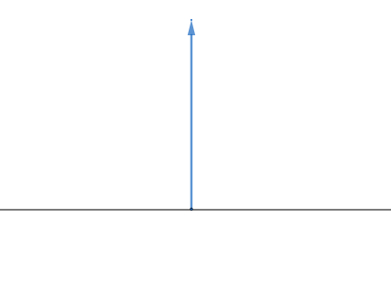
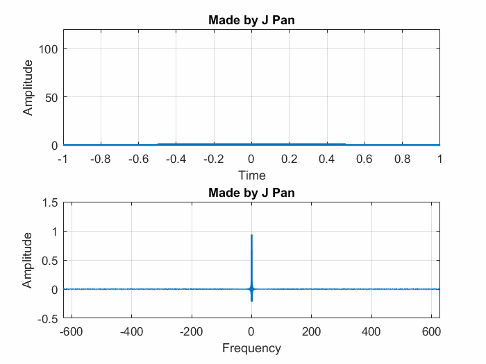
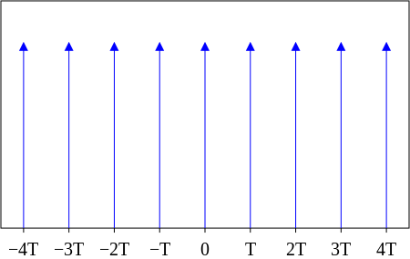

## 狄拉克$\delta $函数

**狄拉克$\delta $函数**是一个广义函数，在物理学中常用其表示质点、点电荷等理想模型的密度分布，该函数在除了零以外的点取值都等于零，而其在整个定义域上的积分等于1。

### 定义

$$
\delta\left(x\right)=\left\{
\begin{split}
+\infty \quad& \text{if  } x=0\\
0\quad &\text{if  } x\neq 0
\end{split}
\right.
$$

满足：
$$
\int_{-\infty}^{\infty}\delta\left(x\right)dx=1
$$

### 性质

- 对称
  $$
  \begin{eqnarray*} \delta(x)=\delta(-x) \end{eqnarray*}
  $$
  
- 缩放
  $$
  \begin{eqnarray*} \delta(ax)=\frac 1  {|a|} \delta(x)  \end{eqnarray*}
  $$
  
- 筛选
  $$
  \int_{-\infty}^{\infty}f\left(x\right)\delta\left(x-\mu\right)dx=f\left(\mu\right)
  $$
  

### 应用

以下函数都满足$\delta$函数的定义。

$\delta(x)=\left\{
\begin{split}
\frac 1 {\tau} \quad & &  \text{if  } | x|\leq \frac \tau 2\\
0\quad & & others
\end{split}
\right.$， 当$\tau \to 0$

当这个信号瘦到一定程度的时候，它的频域反而变得简单了，变成了一条直线

$ \delta(x)=\lim_{\sigma \to +\infty} \frac 1 {\sigma  \sqrt{{\pi}}}e^{ \frac {-x^2}  {\sigma ^2}}$  , 即$\mu=0, \sigma \to0$正态分布的概率密度。

$ \delta(x)=\frac{1}{\pi} \lim_{a \to +0}\frac{a}{x^2+a^2}$

$ \delta(x)= \frac 1 {\pi} \lim_{k \to \infty} \frac {sin(kx)} {x}$

特别是傅里叶变换中的用到的，

$\delta(x)=\frac{1}{2\pi} \int_{-\infty}^{\infty} e^{i \omega x}d\omega$ 

### 频域

根据傅里叶变换公式：
$$
\begin{align}
F(\omega) 
  &= \frac 1 {2\pi} \int_{-\infty}^{\infty} f(x) e^{-\mathbf i\omega x} dx 
\\&= \frac 1 {2\pi} \int_{-\infty}^{\infty} \delta(x)e^{-\mathbf i\omega x} dx
\\&= \frac 1 {2\pi} 
\end{align}
$$

## 狄拉克梳状函数（Dirac Comb）

在电子工程中称为脉冲序列（impulse train）或采样函数（sampling function）。有些文章会把它叫做Shah function。

它其实就是关于狄拉克$\delta $函数的用周期$T$间隔的无穷级数。

### 定义

$$
III_{T}(t) = \sum _{k=-\infty }^{\infty }\delta (t - kT)
$$

### 频域

根据傅里叶级数公式：
$$
f(x) =  \sum_{n=-N}^{N} c_n \cdot e^{\mathbf i\omega nx} \\
c_n= \frac 1 T \int_{x_0}^{x_0+T} f(x) e^{-\mathbf i\omega nx} dx
$$
可以计算：
$$
\begin{align}
c_n = \frac 1 T \int_{x_0}^{x_0+T} III_{T}(t) e^{-\mathbf i\omega nx} dx
\end{align}
$$

## 采样定理

## 参考

- [wiki: Dirac delta function](https://en.wikipedia.org/wiki/Dirac_delta_function)
- [wiki:Dirac_comb](https://en.wikipedia.org/wiki/Dirac_comb)
- [狄拉克δ函数和狄拉克梳状函数](https://www.qiujiawei.com/shah-function/)
- [如何理解不确定性原理—不确定or测不准？](https://zhuanlan.zhihu.com/p/41548628)
- [狄拉克函数（Dirac delta function）](https://blog.csdn.net/lanchunhui/article/details/54293415)

