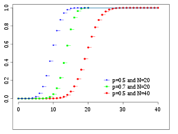
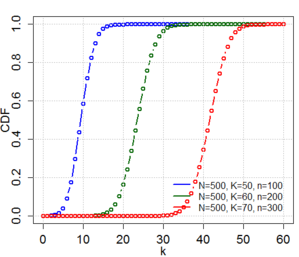
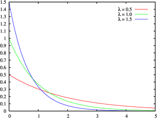
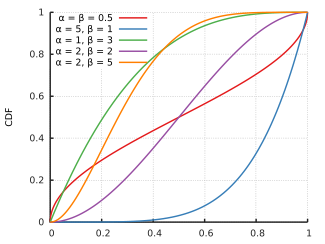
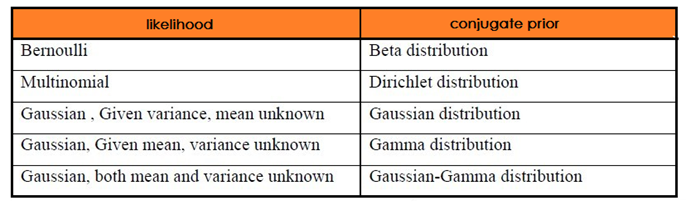

## 1. 伯努利分布

伯努利分布就是我们常见的0-1分布，即它的随机变量只取0或者1，各自的频率分别取$1−p$和$p$，当$x=0$或者$x=1$时，数学定义为： 

$$
p(x)=p^x(1-p)^{1-x}
$$

### 数学期望和方差

$$
E(X) = p \\
D(X) = p(1-p)
$$

## 2. 二项分布

二项分布(*Binomial distribution*)是**n重伯努利试验**成功次数的离散概率分布。

$$
f(k|n, p)=\binom{n}{k}*p^k*(1-p)^{n-k}
$$

  

概率密度函数（Probability density function）                                   累计分布函数（Cumulative distribution function）

### 数学期望和方差

$$
E(X) = np \\
D(X) = np(1-p)
$$

## 3. 多项分布

## 3. 几何分布和负二项分布

参见[伯努利分布、二项分布、几何分布、超几何分布、泊松分布](https://blog.csdn.net/zlbflying/article/details/47777943)

几何分布: 随机变量$X$表示第一次成功所进行试验的次数。

$$
p(k)=P(X=k)=p*(1-p)^{k-1},k=1,2,3,...
$$

负二项分布：几何分布的一般形式，随机变量$X$表示达到$r$个成功，所进行试验的次数。在实际生活中，我们可以使用负二项分布描述某种机器在坏掉前，能够工作的天数的分布。此时，“成功”的事件可以指机器正常工作一天，“失败”的事件可以指机器故障的一天。

$$
P(X=k)=\binom{k-1}{r-1}p^r*(1-p)^{k-r}
$$

### 数学期望和方差

**几何分布**

$$
E(X) = \frac 1 p \\
D(X) = \frac {1-p} {p^2}
$$

**负二项分布**

$$
E(X) = \frac r p \\
$$

## 4. 超几何分布

参见[超几何分布](https://zlearning.netlify.com/math/probability/hypergeometric-distribution.html)

设一个坛子里一共有$N$个球，其中$K$个白球，$N−K$个黑球，从中随机的（无放回）取出$n$个球，令X表示取出来的白球数，那么：

$$
\begin{equation}
P\{X = k\} = \frac{\binom{K}{k} \binom{N-K}{n-k}}{\binom{N}{n}},\quad i = 0,1,\ldots ,n
\end{equation}
$$

    

### 通俗理解和应用

栖息于某个地区的动物个体总数为$N$，为了得到这个N的大致估计，生物学家常常做这样的试验：先捉住$m$个，然后打上标签，放回大自然。过一段时间，等这$m$个动物充分分散到其他动物中的时，再捕捉$n$个。假设X为第二批捕捉的$n$个动物中带标记的个数。如果前后两次捕捉过程中动物的总数没有发生变化，而且捉住每一只动物的可能性是一样的，那么X满足几何分布。详见[超几何分布](https://zlearning.netlify.com/math/probability/hypergeometric-distribution.html)

$$
\begin{equation}
N \leq \frac{mn}{i}
\end{equation}
$$

### 数学期望和方差

$$
E(X) = n\frac K N \\
D(X) = n\frac K N  \frac {N-K} N \frac {N-n} {N-1}
$$

当N，M都非常大的情况下，可以认为$p=\frac K N$，这时二项分布和超几何分布完全等效.

## 5. 多项分布

## 6. Poisson分布

泊松分布适合于描述一段时间内随机事件发生的次数的概率分布。如客服电话接入的次数、汽车站台的候客人数、机器出现的故障数、[自然灾害](https://zh.wikipedia.org/wiki/自然灾害)发生的次数、DNA序列的变异数等等。一般来说，Poisson分布需要满足以下条件。

- 事件是小概率事件
- 事件是相互独立的
- 事件的概率是稳定的。

### 概率密度函数

$$
P(X=k) = \frac {\lambda^k} {k!} e^{-\lambda}
$$

其中$\lambda$是一段时间事件平均发生的平均次数， $k$是事件发生的次数。下图中，可以看到当$\lambda$越大，泊松分布约接近于正态分布，当$\lambda $≥50，泊松分布基本上就等于正态分布了。

  c

概率密度函数（Probability density function）                                   累计分布函数（Cumulative distribution function）

> $k$是整数。连接线是只为了美观一些。

### 和二项分布的关系

Poisson分布和二项分布关系紧密，推导过程如下。

1. 可以把单位时间分成$n$份，n非常大，则可以认为每一份时间中事件发生的概率$p=\frac \lambda n$
2. 根据二项分布的原理 ，可以得出

### 数学期望和方差

$$
E(X) = \lambda \\
D(X) = \lambda
$$

### 泊松过程

泊松过程是随机过程的一个经典模型，是一种累积随机事件的发生次数的独立增量过程。也就是说，每次事件的发生是相互独立的。泊松分布是描述稀有事件的统计规律，即可以描述一段时间内发生某个次数的概率。而泊松过程呢，就适合刻画“稀有事件流”的概率特性。

1.独立增量。任何两段不相交的时间区间内，事件发生的次数互不影响

2.平稳增量。时间区间 ![[公式]](images/equation-1565153500234.svg) 内，事件发生的次数只与区间长度 ![[公式]](images/equation-1565146874578.svg) 有关，而与时间区间的起点 ![[公式]](images/equation-1565146873921.svg) /终点 ![[公式]](images/equation-1565146874625.svg) 无关

3.稀疏性。在泊松过程的时间t趋于0的时候，发生次数大于1的概率远小于发生次数为1的概率。定量表示为 ![[公式]](images/equation-1565153637828.svg) 。其中， ![[公式]](images/equation-1565146873790.svg) 表示长度为t的时间区间内，事件发生次数等于1的概率， ![[公式]](images/equation-1565153500207.svg) 表示长度为t的时间区间内，事件发生次数大于1的概率

只要满足上述三个性质的随机过程，都是泊松过程。相应地，也满足泊松分布。

**严格的数学描述**

 随机过程 ![[公式]](images/equation-1565153637815.svg) 表示 ![[公式]](images/equation-1565147121827.svg) 到 ![[公式]](images/equation-1565147121838.svg) 时间内事件 ![[公式]](images/equation-1565147121839.svg) 发生的次数，满足 ![[公式]](images/equation-1565153500208.svg) 且取值为整数，当 ![[公式]](https://www.zhihu.com/equation?tex=s%3Ct) 时， ![[公式]](https://www.zhihu.com/equation?tex=N%28s%29%5Cleq+N%28t%29) 且 ![[公式]](https://www.zhihu.com/equation?tex=N%28t%29-N%28s%29) 表示 ![[公式]](https://www.zhihu.com/equation?tex=%28s%2Ct%5D) 时间内事件 ![[公式]](images/equation-1565147121839.svg) 发生的次数，那么 ![[公式]](images/equation-1565153637815.svg) 是一个**计数过程**。

随机过程![[公式]](images/equation-1565147121837.svg) 满足以下三条件：

1. ![[公式]](images/equation-1565153637979.svg) 是计数过程，且 ![[公式]](https://www.zhihu.com/equation?tex=N%280%29%3D0) 
2. 平稳独立增量过程
3. 存在 ![[公式]](https://www.zhihu.com/equation?tex=%5Clambda%3E0) 使 
         ![[公式]](https://www.zhihu.com/equation?tex=P%28N%28t%2Bh%29-N%28t%29%3D1%29%3D%5Clambda+h%2Bo%28h%29%2C+P%28N%28t%2Bh%29-N%28t%29%5Cgeq+2%29%3Do%28h%29) 
         或者 3. 存在 ![[公式]](https://www.zhihu.com/equation?tex=%5Clambda%3E0) 使 ![[公式]](images/equation-1565153637982.svg) 
         那么 ![[公式]](images/equation-1565147121837.svg) 是一个**泊松过程。**  

### 参考

- [关于泊松过程的理解](http://www.cosmozhang.com/2016/12/17/understanding-poisson-process.html)
- [随机过程 笔记2泊松过程](https://zhuanlan.zhihu.com/p/59746161)
- [泊松过程是个什么玩意？](https://blog.csdn.net/ibelieve8013/article/details/80251822)

## 7. 指数分布

 指数分布可以用来表示独立随机事件发生的时间间隔，比如旅客进入机场的时间间隔、打进客服中心电话的时间间隔、中文维基百科新条目出现的时间间隔等等。 指数分布描述泊松过程中的事件之间的时间的概率分布，即事件以恒定平均速率连续且独立地发生的过程。 这是[伽马分布](https://baike.baidu.com/item/伽马分布/7245468)的一个特殊情况。 它是几何分布的连续模拟，它具有无记忆的关键性质。

无记忆性：$P(T>s+t|T>t)=p(T>s)$。如果T是某一元件的寿命，已知元件使用了t小时，它总共使用至少s+t小时的条件概率，与从开始使用时算起它使用至少s小时的概率相等.（注意：指数分布的这种特性，与机械零件的疲劳、磨损、腐蚀、蠕变等损伤过程的实际情况是完全矛盾的，它违背了产品损伤累积和老化这一过程。所以，指数分布不能作为机械零件功能参数的分布形式。）

### 概率密度函数

$$
f(x;\lambda) = \begin{equation}  
\left\{  
\begin{array}{lcl}  
 \lambda e^{-\lambda x}        &  & if\ x>0 \\  
 0 &  & if\ x=0  
\end{array}  
\right.  
\end{equation}
$$

  

概率密度函数（Probability density function）                                   累计分布函数（Cumulative distribution function）

$\lambda$表示事件发生的频次，假设事件发生一次的平均时间是50000小时，$\lambda$=1/50000。

### 累计分布函数

$$
P(X \le x) = F(x;\lambda) = 1 - e^{-\lambda x}, x \ge 0
$$

### 数学期望和方差

$$
E(X) = \frac 1 \lambda \\
D(X) = \frac 1 {\lambda^2}
$$

## 8. [Gamma分布]([https://zh.wikipedia.org/wiki/%E4%BC%BD%E7%8E%9B%E5%88%86%E5%B8%83](https://zh.wikipedia.org/wiki/伽玛分布))

Gamma分布解决的问题是：要等到n个随机事件都发生，需要经历多长的时间。

### Gamma函数

$$
\Gamma(\alpha) = \int_0^{+\infty} e^{-x} x^{\alpha-1} \mathbf dx \\
\Gamma(\alpha) = (\alpha-1)! \\
\Gamma(\alpha+1) = s\Gamma(\alpha) \\
\Gamma(\frac 1 2) = \sqrt \pi
$$

### 概率密度函数

伽玛分布在概率统计领域也是一个万人迷，众多统计分布和它有密切关系。指数分布和 $\chi^2$ 分布都是特殊的伽玛分布。另外伽玛分布是一个很强大的先验分布，在贝叶斯统计分析中被广泛的用作其它分布的先验。如果把统计分布中的共轭关系类比为人类生活中的情侣关系的话，那指数分布、泊松分布、正态分布、对数正态分布都可以是伽玛分布的情人。

$$
Gamma(t|\alpha, \beta) = \frac{\beta^\alpha t^{\alpha-1}e^{-\beta t}}{\Gamma(\alpha)} .
$$

可以由下面的两个公式推出：

- $Gamma(x|\alpha) = \frac{x^{\alpha-1}e^{-x}}{\Gamma(\alpha)} $
- $x=\beta t$

      

概率密度函数（Probability density function）                                   累计分布函数（Cumulative distribution function）

当$\beta=1$，并且$\alpha = k + 1$的时候，

$$
Gamma(\lambda|\alpha=k+1)  
= \frac{\lambda^ke^{-\lambda}}{\Gamma(k+1)}= \frac{\lambda^k e^{-\lambda}}{k!}
$$

> 上面的公式就是泊松分布啊。

### 数学期望和方差

$$
E(X) = \frac \alpha \lambda \\
D(X) = \frac \alpha {\lambda^2}
$$

### 通俗理解和应用

可以这样理解Gamma分布。

### 参考

- [神奇的伽玛函数 (下)](https://cosx.org/2014/07/gamma-function-2/)
- [Gamma 分布密度函数的一种推导*](doc/Gamma%20分布密度函数的一种推导.pdf)

## 9. [Beta分布](https://en.wikipedia.org/wiki/Beta_distribution)

### Beta函数

$$
B(\alpha,\beta) = \int_0^1x^{\alpha-1}(1-x)^{\beta-1} \mathbf dx  \\
B(\alpha,\beta)  = \frac   {\Gamma(\alpha)  \Gamma(\beta)} {\Gamma(\alpha + \beta)}
$$

我们可以这样理解：

假设你有$n+1$个球，其中一个是红球，其它是白球，把这些球（首先扔红球，然后扔白球）扔到长度为$1$的桌子上，很明显，红球左边可能有$0,1,2,3, \cdots, n$个球，总共有$n+1$种可能，每种可能的概率是一样的，也就是：
$$
P(K=k) = \frac 1 {n+1} \tag {1}
$$
下面换一种计算思路，假设红球扔的位置是$x$，扔一个白球在红球左边的概率是$x$（右边是$1-x$），则$k$个白球在红球左边的概率服从二项分布，即：
$$
P(K=k|x)=\begin{pmatrix}n\\k\\ \end{pmatrix}x^k(1-x)^{n-k}
$$
由于$x$是未知的，假设其服从$[0,1]$ 上的均匀分布，则：
$$
P(K=k)=\int_0^1 \begin{pmatrix}n\\k\\ \end{pmatrix}x^k(1-x)^{n-k}\mathbf dx
=\begin{pmatrix}n\\k\\ \end{pmatrix}\int_0^1 x^k(1-x)^{n-k}\mathbf dx\tag{2}
$$
根据公式$(1),(2)$可以推得：
$$
\begin{align}
\begin{pmatrix}n\\k\\ \end{pmatrix}\int_0^1 x^k(1-x)^{n-k}\mathbf dx &={1\over n+1} 
\\ \int_0^1 x^k(1-x)^{n-k}\mathbf dx&={{k!(n-k)!}\over (n+1)!}  
\end{align}
$$
设$k=\alpha-1, n-k=\beta-1$，可得：
$$
\begin{align}
 \int_0^1 x^{\alpha-1}(1-x)^{\beta-1}\mathbf dx&={{(\alpha-1)!(\beta-1)!}\over (\alpha+\beta-1)!} 
\end{align}
$$

然后再根据$\Gamma$函数公式$\Gamma(\alpha+1) = (\alpha-1)! \\$，最后可以得到：
$$
B(\alpha,\beta) = {\Gamma(\alpha)\Gamma(\beta)\over\Gamma(\alpha+\beta)}
$$
参考[认识Beta函数](https://blog.csdn.net/lucien_zong/article/details/50041341)

### 概率密度函数

$$
\begin{align}
Beta(x\vert \alpha,\beta) &={x^{\alpha-1}(1-x)^{\beta-1} \over \int_0^1x^{\alpha-1}(1-x)^{\beta-1} \mathbf dx}
\\&={x^{\alpha-1}(1-x)^{\beta-1} \over \int_0^1u^{\alpha-1}(1-u)^{\beta-1} \mathbf du} 
\\&={x^{\alpha-1}(1-x)^{\beta-1} \over B(\alpha,\beta)}
\end{align}
$$

   

概率密度函数（Probability density function）                累计分布函数（Cumulative distribution function）

### 数学期望和方差

$$
E(X) = \frac {\alpha} {\alpha + \beta}  \\
D(X) = \frac {\alpha \beta} {(\alpha + \beta)^2(\alpha + \beta+1)}
$$

### 通俗理解和应用

用一句话来说，beta分布可以看作一个概率的概率分布，当你不知道一个东西的具体概率是多少时，它可以给出了所有概率出现的可能性大小。

- Beta和Gammar函数的关系推导。参见[认识Beta函数](https://blog.csdn.net/lucien_zong/article/details/50041341)  

- 棒球击球率和beta分布。参见[贝塔分布和共轭先验](https://zhuanlan.zhihu.com/p/33348118)

- [贝塔分布（Beta Distribution）简介及其应用](https://www.datalearner.com/blog/1051505532393058): 假设亚马逊上有三家旧货商，其评价结果分别如下：

  商家一：85193个评论，94%的正向
  商家二：20785个评论，98%的正向
  商家三：840个评论，99%的正向

  那么这三个商家中，哪一家的服务质量最好呢？假设这三家的服务质量分别是$\theta_X$、$\theta_Y$和$\theta_Z$。假设我们对三家旧货商的信息一无所知，那么这些参数的先验可以认为是一个均匀分布，也可以等同于$beta(1,1)$。根据之前的知识，我们知道，最终这三家旧货商的服务质量应当服从三个不同参数的Beta分布，即$beta(80082,5113)$、$beta(20370,417)$和$beta(833,9)$（把正向的和负向的评论书算出来，分别加1就是参数了，参考上面公式）。注意，当Beta分布的参数很大的时候，我们可以使用相同均值和方差的正态分布代替这个beta分布。因此，最终这三家供货商，商家3的服务质量的标准差是0.003，是最大的。其他两家的标准差比这个还小。因此，我们可以认为这三家供货商的服务质量都高度聚焦于他们的均值。因此，从第一个或第二个分布中抽取的样本不太可能比第三个样本的值高。也就是说前两个服务商不太可能质量比第三个高。

### 共轭分布

Beta分布和二项分布是共轭分布，其中$\beta$分布作为先验分布，二项分布作为似然函数。证明如下：

假设先验分布符合Beta分布，即：
$$
Beta(p|\alpha,\beta) = \frac{\Gamma(\alpha + \beta)}{\Gamma(\alpha)\Gamma(\beta)}p^{\alpha-1}(1-p)^{{\beta-1}}
$$
再设，根据样本的观测，得出的似然函数(likelihood)符合二项分布，即：
$$
Binom(k|n,p)=\binom{n}{k}p^k(1-p)^{n-k}
$$
根据贝叶斯公式，可以计算后验概率：
$$
\begin{align}
P(p|n,k,\alpha,\beta)  &=  \frac {P(k|n,p)P(p|\alpha,\beta)}   {\int_{0}^{1} P(k|n,p)P(p|\alpha,\beta) dp } 
\\ &= \frac {Binom(k|n,p)Beta(p|\alpha,\beta)}   {\int_{0}^{1} Binom(k|n,p)Beta(p|\alpha,\beta) dp } 
\tag 1
\end{align}
$$
首先来看分子：
$$
\begin{align}
Binom(k|n,p)Beta(p|\alpha,\beta) 
&= \binom{n}{k}p^k(1-p)^{n-k} \frac{\Gamma(\alpha + \beta)}{\Gamma(\alpha)\Gamma(\beta)}p^{\alpha-1}(1-p)^{{\beta-1}}
\\ &=\binom{n}{k}\frac{\Gamma(\alpha + \beta)}{\Gamma(\alpha)\Gamma(\beta)}p^{\alpha+k-1}(1-p)^{\beta+n-k-1}
\end{align}
$$
把上式带入公式$(1)$，其中$\binom{n}{k}\frac{\Gamma(\alpha + \beta)}{\Gamma(\alpha)\Gamma(\beta)}$，分子分母都有，可以约掉，则：
$$
\begin{align}
P(p|n,k,\alpha,\beta)  &=  \frac {p^{\alpha+k-1}(1-p)^{\beta+n-k-1}}   {\int_{0}^{1} p^{\alpha+k-1}(1-p)^{\beta+n-k-1} dp } 
\tag 2
\end{align}
$$
根据$\beta$分布定义，$B(\alpha+k,\beta+n-k) = \int_0^1x^{\alpha+k-1}(1-x)^{\beta+n-k-1} \mathbf dx $，带入公式$(2)$，则
$$
\begin{align}
P(p|n,k,\alpha,\beta)  &=  \frac {p^{\alpha+k-1}(1-p)^{\beta+n-k-1}}   {B(\alpha+k,\beta+n-k)  } 
\tag 3
\end{align}
$$
显然，最后得到的后验概率的公式也是$\beta$分布。由此得证。

> 基于共轭还可以这么来看Beta分布。假设有一块不均匀的硬币，其抛出正面的概率为$p$，抛了$m$次，其中正面，反面的次数分别是$m_1, m_2$，按照传统频率学派的观点，$p$的概率应该是$\hat p = \frac {m_1} m$。
>
> 然而，从贝叶斯学派的观点来看，由于对硬币的不均匀性一无所知，应该假定$p \sim Uniform(0, 1)$，然后再进行二项分布的计算，则
> $$
> \begin{align}
> P(p\vert m_1, m_2) & = \frac {P(p) \cdot P(m_1, m_2 \vert p)} {P(m_1, m_2)}
> \\ &= \frac {1 \cdot P(m_1, m_2 \vert p)} {\int_0^1 P(m_1, m_2 \vert t)dt}
> \\ &= \frac {\binom{m}{m_1} p^{m_1}(1-p)^{m_2}} {\int_0^1 \binom{m}{m_1} t^{m_1}(1-t)^{m_2}dt} 
> \\ &=  \frac {\binom{m}{m_1} p^{m_1}(1-p)^{m_2}} {B(m_1+1,m_2+1)}
> \\ &=  Beta(p \vert m_1+1,m_2+1)
> \end{align}
> $$

### 参考

- [文本主题模型之LDA(一) LDA基础](https://www.cnblogs.com/pinard/p/6831308.html)
- [LDA数学八卦](https://bloglxm.oss-cn-beijing.aliyuncs.com/lda-LDA%E6%95%B0%E5%AD%A6%E5%85%AB%E5%8D%A6.pdf)

## 10. Dirichlet分布

### Dirichlet函数

Beta分布在每次选择有两种可能，如果有第三种，这就变成了Dirichlet分布（）。
$$
Dirichlet(p_1,p_2,p_3|\alpha_1,\alpha_2, \alpha_3) = \frac{\Gamma(\alpha_1+ \alpha_2 + \alpha_3)}{\Gamma(\alpha_1)\Gamma(\alpha_2)\Gamma(\alpha_3)}p_1^{\alpha_1-1}(p_2)^{\alpha_2-1}(p_3)^{\alpha_3-1}
$$
更加通用的表达形式如下：
$$
Dirichlet(\vec p| \vec \alpha) = \frac{\Gamma(\sum\limits_{k=1}^K\alpha_k)}{\prod\limits_{k=1}^K\Gamma(\alpha_k)}\prod_{k=1}^Kp_k^{\alpha_k-1}
$$

设$ \triangle(\vec \alpha) = \frac {\prod\limits_{k=1}^K\Gamma( \alpha_k)} {\Gamma(\sum\limits_{k=1}^K \alpha_k)}$，上面公式可以写成：
$$
Dirichlet(\vec p| \vec \alpha) = 
\frac 1 {\triangle(\vec \alpha)}
\prod_{k=1}^Kp_k^{\alpha_k-1}
$$

### 数学期望

$$
E(Dirichlet(\vec p|\vec \alpha)) = (\frac{\alpha_1}{\sum\limits_{k=1}^K\alpha_k}, \frac{\alpha_2}{\sum\limits_{k=1}^K\alpha_k},...,\frac{\alpha_K}{\sum\limits_{k=1}^K\alpha_k})
$$

### 共轭分布

Dirichlet分布和多项分布是共轭分布
$$
Dirichlet(\vec p|\vec \alpha) + MultiCount(\vec m) = Dirichlet(\vec p|\vec \alpha + \vec m)
$$

## 11. 正态分布

## 12. 卡方分布

假设有$n$个服从$\mathbf N(0,1)$的随机变量$Y_i$，$X = \sum Y_i^2$，则$X$服从卡方分布。

## 14. t分布

t分布：实际工作中，往往总体方差未知，常用样本方差s作为总体方差的估计值，为了与u变换区别，称为t变换

## 14. F分布

对两个相互独立的样本分开大量抽样，看它们的卡方分布的比值。

## 16. 共轭分布

简单来说，如果先验分布 $p(\theta) $和后验分布$ p(\theta|X)$ 有相同的形式，那么就称先验分布与似然函数是共轭分布。

$$
p(\theta|X) = \frac{p(\theta) \cdot p(X|\theta)  }{p(X)} \Leftrightarrow \mathbf{ posterior = \frac{prior \cdot likelihood}{evidence}}
$$

**共轭的意义**在于是共轭特性可以使得先验分布和后验分布的形式相同，这样一方面合符人的直观（它们应该是相同形式的）另外一方面是可以形成一个先验链，即现在的后验分布可以作为下一次计算的先验分布，如果形式相同，就可以形成一个链条，后验又可以作为下一次的先验分布。

## 99. 其它

### 中心极限定理

设$X_1,X_2,\cdots ,X_n$为独立同分布的随机变量序列，均值为 $\mu$，方差为 $\sigma^2$，则
$$
Z_n=\frac{X_1+X_2+\cdots+X_n-n\mu}{\sigma \sqrt n}
$$
具有渐近分布 $N(0,1)$，也就是说当 $n \rightarrow \infty$ 时，
$$
P\left \{\frac{X_1+X_2+\cdots+X_n-n\mu}{\sigma \sqrt n} \leq x \right \} \rightarrow \frac{1}{\sqrt{2\pi} } \int_{-\infty }^{x} e^{ -\frac{t^2}{2} } \, dt
$$
换句话说，$n$个相互独立同分布的随机变量之和的分布近似于正态分布，$n$越大，近似程度越好。

## 参考

- [认识Beta函数](https://blog.csdn.net/lucien_zong/article/details/50041341)                         
- [如何理解贝叶斯推断和beta分布？](https://www.matongxue.com/madocs/910.html)
- [LDA总结 (一) 共轭分布](https://www.cnblogs.com/ooon/p/5845917.html): 描述了共轭分布的特性。
- [文本主题模型之LDA(一) LDA基础](https://www.cnblogs.com/pinard/p/6831308.html)

  