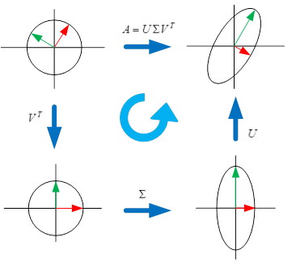

本文将描述一下特征值和特征向量，主成分分析（PCA），奇异值分解等内容。

# 1. 特征值和特征向量

$ AP = P\lambda $

这是$P$是特征向量矩阵，是一个正交矩阵。$\lambda$是特征值矩阵，是一个对角矩阵。

## 特征值和特征向量的意义

有一个非常形象的解释： [线性代数中，特征值与特征向量在代数和几何层面的实际意义是什么](https://www.zhihu.com/question/20507061) , 下面有一个抽象一点的理解。

对于线性变换$T(x) = Ax$， 可以替换成$T(x) = P\lambda P^\mathrm{T}x$。

首先来看$P^\mathrm{T}x$的意义， 由于$ P^\mathrm{T}x = P^{-1}x$，它可以理解为向量$x$在以$P$为基的向量空间中的坐标，可以记为$[x]_P$。由于$P$是正交矩阵，所以向量的长度并没有什么变化。上式可以变成：

$T(x) = P\lambda [x]_P$

再看，$\lambda [x]_P$。

设$ \lambda = diag(\lambda_1, \lambda_2, \ldots, \lambda_n) , [x]_P = \begin{bmatrix}
[x_1]_p \\ [x_2]_p \\ \ldots \\ [x_n]_p
\end{bmatrix}$， 则
$\lambda [x]_P = \begin{bmatrix}
\lambda_1[x1]_p \\ \lambda_2[x2]_p \\ \ldots \\ \lambda_n[x_n]_p
\end{bmatrix}$ 

这可以理解成根据$\lambda$， 对$[x]_P$进行了各个维度的伸缩。

最后，再看$P \cdot \lambda [x]_P$, 这可以理解把$P$为基的空间中的一个坐标变换成当前向量空间的向量。

总结起来，线性变换$T(x) = Ax$的几何意义是：先把x映射到$P$为基的空间中，然后根据$\lambda$进行伸缩，然后再从这个空间，映射回当前的空间的过程。上述过程中，在两个空间之间先后转换了两次。在两次转换之间，根据$\lambda$进行伸缩，是这个过程中最核心的动作。由于$P$是正交矩阵，每次转换，又可以理解为旋转，也可以说是，先旋转，然后伸缩，然后再旋转。可以想象一下，如果是一个圆，在经过$T(x)$这个线性变化后，圆会被旋转，然后伸缩，然后再旋转，最后变成一个椭圆。

### $PP^{-1}x$

下面来解释一下$PP^{-1}x$, 可以理解为先把$x$映射为$P$为基的向量空间中的向量，然后再从那个空间转换回当前空间，这中间没有进行任何伸缩，所以$x$也没有任何变化，即$PP^{-1}x = x$。写到这，不禁想起智齿的小说$\href {http://www.ximalaya.com/7712455/album/244443} {文明} $里面提到的空闪战术，大概意思是指战斗机在格斗的时候，跳跃到第四空间（超光速空间），然后再从第四空间跳跃回三维空间。在三维空间来看，这个战斗机瞬间消失了，然后瞬间出现在另外一个有利的攻击位置。

### 正交矩阵

特征矩阵是一个正交矩阵，正交矩阵有许多神奇的特性。
* $PP^\mathrm{T}=1$      
* $P^\mathrm{T}=P^{-1}$    
* $\lVert {Px} \rVert = \lVert x \rVert = \lVert x^{\mathrm T}P^{\mathrm T} \rVert  $ ， 正交矩阵不会改变向量的长度和相互角度，它只会按照相同的方式旋转向量。

最后一条尤为重要。因为在做矩阵处理的时候，我们非常关心各个向量之间的关系，采用旋转的方式，不会改变它们之间的特性。就象旋转地球仪，旋转后看到的东西不同，但地球仪本身没有发生任何的变化，没有变形和拉伸。现在我们再来看特征值分解的公式，尝试从另外一个角度来理解它 。

$ AP = P\lambda $

我们想知道A这个矩阵究竟长什么样，如果是二维，可以很方便作图，如果是三维，可以勉强作图，如果是高维，我们无能为力。现在对公式做一个小的变形。

$ P^{\mathrm T}A = P^{-1}A = \lambda P^{\mathrm T}$

$P^{\mathrm T}A $是对$A$进行了旋转，并没有改变它的形状。 $P^{-1}A $可以理解为$P$为基的向量空间中的矩阵。转换后的矩阵是$\lambda P^{\mathrm T}$， 这可以看成对$\lambda$做了一些旋转，也就是说本质上矩阵A可以看成是$\lambda$矩阵的一系列旋转。

# 2. 奇异值分解（SVD）

$  A=USV^\mathrm {T} $

$S$是奇异值矩阵，是一个对角矩阵。 $V$是一个正交矩阵, $U$是也是一个正交矩阵。而且： 

$ V = [v_1, v_2, \ldots, v_n ] $

$ S = diag(\lVert Av_1  \rVert ,  \lVert Av_2  \rVert, \ldots , \lVert Av_n  \rVert ) = diag(\delta_1, \delta_2, \ldots, \delta_n) $

$ U = AVS^{-1} = [\frac {Av_1} {\lVert Av_1  \rVert} , \frac {Av_2} {\lVert Av_2  \rVert}, \ldots,  \frac {Av_n} {\lVert Av_n  \rVert}   ] $

## 线性变换$T(x)=Ax$的意义

如果理解了特征值分解，再来看奇异值分解，其实基本思想完全相同。

$T(x) = USV^\mathrm {T}x$

$V^\mathrm {T}x$ 是对x进行旋转，也可理解为x在$V$为基的空间中的坐标。

$S \cdot (V^\mathrm {T}x)$ 是对新的坐标进行了伸缩。

$U \cdot (S V^\mathrm {T}x)$ 指再旋转，也可理解为把$U$为基的空间中的一个向量变换成当前向量空间的向量。

总结起来，也是先旋转，然后伸缩，然后再旋转。

## $X$的意义



上图来自$\href {https://www.zhihu.com/question/22237507} {奇异值的物理意义是什么} $， 里面有很有意思的分析。

$X$的意义的分析可以和特征值分解分析相似。

$ U^{\mathrm T}A = U^{-1}A = SV^{\mathrm T} $

$U^{\mathrm T}A$ 是对$A$进行了旋转，$U^{-1}A$可以理解为$U$为基的向量空间中的矩阵。转换后的矩阵是$SV^{\mathrm T}$，这可以看成对$S$做了一些旋转。比起特征值分解，奇异值分解具有更深的意义。由于$A$并不一定是方阵，$U^{-1}A$这一个变换，是把A转换到了一个$U$这个空间，而这个空间是当前空间的子空间。从这个意义上说，空间的转换才是奇异值分解的真正意义。

还可以有这样的差不多类似的理解:$U^{-1}A$理解为，在$U^{-1}$为基的空间里， 有一个矩阵$A$。这个矩阵等价于在当前空间的矩阵$S$做了一些旋转的矩阵。

目前这种转换是线性转换，如果是非线性的，应该会产生更多奇妙的东西。

# 3. 主成分分析（PCA）

很多描述来自$\href {https://www.zhihu.com/question/30094611} {主成分分析PCA算法...} $。

如果理解了奇异值分解，PCA的理解就很很简单了。PCA的思想是将数据降维，降到哪些维上呢，就是使得数据分布方差最大的那些维上。主成分的意思就是，那些使得数据分布方差最大的那些维就是主成分。通俗一点说，PCA 用来的降维的本质应该是线性空间坐标系的转换，从原始的空间坐标系，转换到一个“合适的”的坐标系来表达，在这个坐标系中，主要信息都集中在了某几个坐标轴上，所以只保留这个“关键”的坐标系上的表达，就能很大程度approximate原信号。

先看协方差矩阵的定义: 

设$A \in R^{m\times n\ \ }(m个样本，每个样本是n维)$ 

$ A = [a_1-\mu_1, a_2-\mu_2, \ldots, a_n-\mu_n ],  \mu=[\mu_1, \mu_2, \ldots, \mu_n] =  [\frac 1 m \sum a_1, \frac 1 m \sum a_2, \ldots, \frac 1 m \sum a_n ]$

$C = \frac 1 m A^\mathrm{T}A$

从奇异值分解的公式$  A=USV^\mathrm {T} $中，

$C = \frac 1 m VS^2V^\mathrm {T}  $ 

$V^\mathrm {T}C V = V^\mathrm {T}A^\mathrm{T}A V = (AV)^\mathrm{T}AV= \frac 1 mS^2 $

$V^\mathrm {T}C V $是对C进行了多次旋转，其向量之间在新的坐标系下相互关系不变。经过多次旋转后，$\frac 1 mS^2$是最后的矩阵，由于它是对角矩阵，其对角值（奇异值得平方）代表了$A$在各个方向方差的最大值。

# 4. 相似矩阵的意义

参考$\href {http://kexue.fm/archives/1777/} {《新理解矩阵4》：相似矩阵的那些事儿} $， $\href {https://www.zhihu.com/question/21931863} {如何形象的理解矩阵的相似与合同？}$。

相似的矩阵是同一个线性变换在不同基/坐标系下的的不同描述。如何来理解这句话呢？

- 有两个基$\alpha, \beta$，其中$\beta = \alpha \cdot P$
- $x_1, x_2$分别是基$\alpha, \beta$下的坐标。  
$  \alpha \cdot x_1 = \beta \cdot x_2   \\
  \alpha \cdot x_1 = \alpha \cdot P \cdot x2  \\
  可以得到： x_1 = P \cdot x_2  ， 或者  x2 = P^{-1} \cdot x_1
$   
- 有一个线性变换，它在$\alpha, \beta$下对应的矩阵分别是$A, B$ 。这里把一个矩阵看成是一个线性变换。  
$y_1 = A \cdot x_1 \\
y_2 = B \cdot x_2
$
- 由于$y1, y2$也是各自基上的坐标，则  
$\begin{align} y_1 &= P \cdot y_2  \\
  A \cdot x_1 &= P \cdot B \cdot x_2 \\
 A \cdot x_1 &=   P \cdot B \  P^{-1} \cdot x_1 \\
 A &= P \cdot B \  P^{-1} \\
 A \cdot P &= P \cdot B 
\end{align}
$

# 5. 协方差和相关系数矩阵的意义

协方差的几何意义是X和Y在中心化后的两个向量之间的内积的平均。物理上认为内积是两个向量的功。

$Cov(X,Y)=E{[X−E(X)][Y−E(Y)]}  $  

协方差矩阵：变量在中心化后，两两之间的向量内积。

相关系数矩阵：变量在中心化后，向量之间的夹角余弦。

$\href {https://www.zhihu.com/question/36339816} {多维高斯分布是如何由一维发展而来的？}$ 这篇文章很好的推导了多元高斯分布的形成。

$\href {http://blog.csdn.net/u010182633/article/details/45937051} {协方差矩阵的几何解释}$ 

理解以上两篇文章，也能够很轻松理解马氏距离。其实这些东西根本上就是一个东西。

```python
import numpy as np
def my_cov(x):
    x1 = x - np.mean(x, axis = 1, keepdims = True)
    return np.dot(x1, x1.T)/(x.shape[1]-1)

def my_corrcoef(x):
    x1 = x - np.mean(x, axis = 1, keepdims = True)
    x2 = np.sqrt(np.sum(np.power(x1, 2), axis = 1, keepdims = True))
    x = x1/x2
    return np.dot(x, x.T)

x = np.array([[0, 2], [1, 1], [2, 0]]).T 
print(x)
print(np.cov(x))
print(my_cov(x))
print(np.corrcoef(x))
print(my_corrcoef(x))
```

    [[0 1 2]
     [2 1 0]]
    [[ 1. -1.]
     [-1.  1.]]
    [[ 1. -1.]
     [-1.  1.]]
    [[ 1. -1.]
     [-1.  1.]]
    [[ 1. -1.]
     [-1.  1.]]

```python

```

