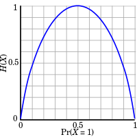
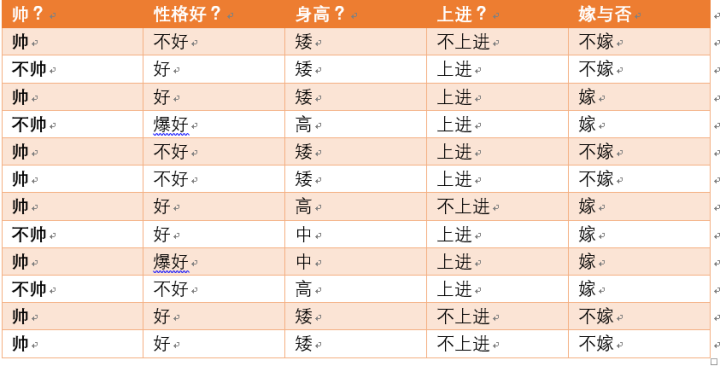
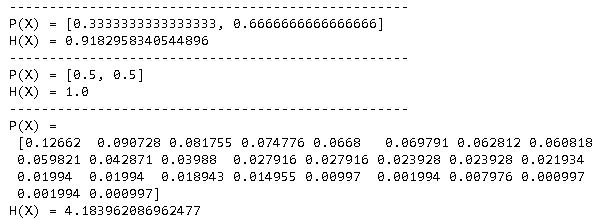
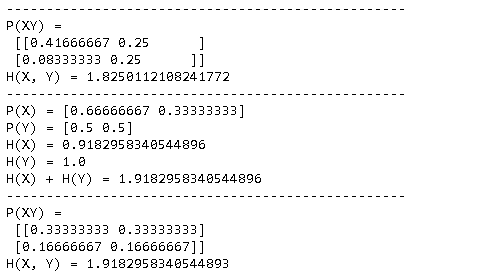
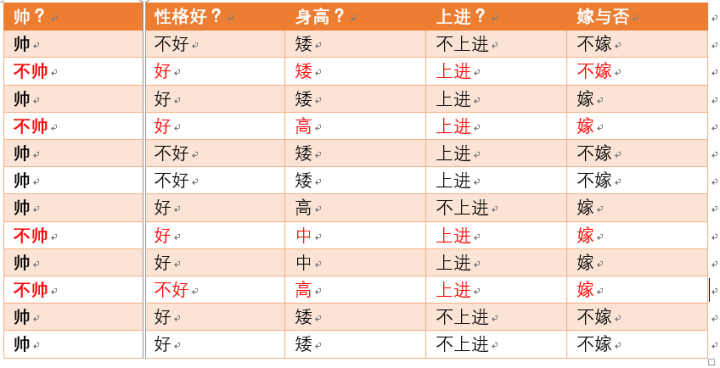
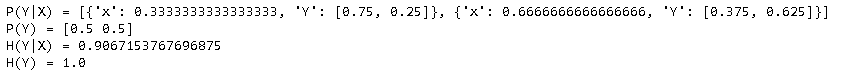
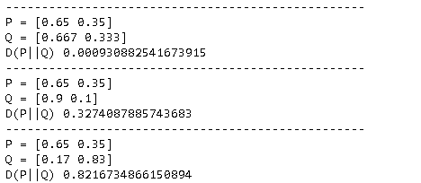

熵 (entropy) 这一词最初来源于热力学。1948年，香农将热力学中的熵引入信息论，所以也被称为香农熵 (Shannon entropy)，信息熵 (information entropy)。既然是信息熵，首先来看信息。

## 信息量

信息量用于度量信息的不确定性，信息量和事件发生的概率有关，事件发生的概率越小，其信息量越大。某个事件$x$发生的信信息量为：

$$
I(x) = −\log(p(x))
$$

以下三个事件中, 信息量逐渐递减。

1. 中国足球队获得了世界冠军：概率太小了，信息量很大。
2. 荷兰足球队获得了世界冠军
3. 中国乒乓球队获得了世界冠军

当$x, y$是相互独立的事件， 可以得出：

$$
I(x, y)  = I(x) + I(y)
$$

## 信息熵 (information entropy)

再来看熵的公式：

$$
H(X) =  - \sum_{i=1}^n {p({x_i})} \log (p({x_i}))~~~~(i = 1,2, \ldots ,n)
$$

其中$X$ 表示的是随机变量，随机变量的取值为 $({x_1},{x_2}, \ldots ,{x_n})$，$p({x_i}) $表示事件发生的概率，且有$\sum {p({x_i})}  = 1$ 。熵可以理解为信息的不确定程度，是随机变量不确定性的度量.  熵越大，随机变量不确定性越大，系统越混乱（无序）。同样看之前的三个事件，事件2熵最大。

### 信息量和熵

信息量是描述某一个事件发生的不确定性，而熵是描述整个系统的不确定性。比如，对于一个六面的骰子，每一个面相当于一个事件，而骰子的所有面构成了一个系统。从公式上，也可以看出**熵是对系统中所有事件发生的信息量的加权平均(数学期望)**。下面看看实际的例子, 假设我们从某婚介网站拿到以下数据. 

设随机变量$X=\{帅, 不帅\}$,  $Y=\{嫁, 不嫁\}$ 

- $H(X) = -\frac 1 3\log\frac 1 3-\frac 2 3\log \frac 2 3 = 0.918 $
- $H(Y) = -\frac 1 2\log\frac 1 2-\frac 1 2\log \frac 1 2 = 1$

相关代码如下。

~~~python
import numpy as np
from math import log

def entropy(X, base=None):    
    h = sum([-x*log(x) for x in X]) if base is None else sum([-x*log(x, base) for x in X])
    return h

print('-'*50)
X = [1/3, 2/3]
print("P(X) =", X)
print("H(X) =", entropy(X, base=2))    

print('-'*50)
X = [1/2, 1/2]
print("P(X) =", X)
print("H(X) =", entropy(X, base=2))    

print('-'*50)
X = [12.7, 9.1, 8.2, 7.5, 6.7, 7.0, 6.3, 6.1, 6.0, 4.3, 4.0, 
             2.8, 2.8, 2.4, 2.4, 2.2, 2.0, 2.0, 1.9, 1.5, 1.0, 0.2,
             0.8, 0.1, 0.2, 0.1]
X = [x/sum(X) for x in X ]   
print("P(X) =\n", np.around(X, 6))
print("H(X) =",  entropy(X, base=2))
~~~

上面的结果，可以看到，不确定体现在：

- 概率是否均匀分布
- 不确定项的数量

## 联合熵（joint entropy）

对于服从联合分布为$p(x,y)$的一对离散随机变量$(X,Y)$ ,其**联合熵**定义为：

$$
H(X,Y) =  - \sum_{x \in X,y \in Y} {p(x,y)} \ln (p(x,y))
$$

当$X, Y$是相互独立的系统，即$p(x, y) = p(x)p(y)$， 可以得出：

$$
H(X,Y) =  H(X) + H(Y)
$$

 当$X, Y$非相互独立， 可以得出：

$$
H(X,Y) < H(X) + H(Y）
$$

基本的含义是，既然$X, Y$既然相互有关系，系统的不确定性降低了。比方：足球比赛如果有假球发生，结果内定了,  悬念没了，大家都不愿看了。相关代码如下：

~~~python
def joint_entropy(XY, base=None):
    xy = [p for xY in XY for p in xY ]
    return entropy(xy, base)

print('-'*50)    
XY = np.array([[5/12,3/12], [1/12,3/12]])
print("P(XY) =\n", XY)
print("H(X, Y) =", joint_entropy(XY, base=2)) 

print('-'*50)  
X = np.sum(np.array(XY), axis=1)
Y = np.sum(np.array(XY), axis=0)

print("P(X) =", X)
print("P(Y) =", Y)
print("H(X) =",  entropy(X, base=2))
print("H(Y) =",  entropy(Y, base=2))

# 当X，Y并不独立的时候，联合熵（即整体X，Y的熵）小于X，Y的熵之和。
print("H(X) + H(Y) =",  entropy(Y, base=2) + entropy(X, base=2))

print('-'*50)  
# 当X，Y独立的时候，联合熵等于X，Y的熵之和
XY = X.reshape((2, 1)) @ Y.reshape((1, 2))
print("P(XY) =\n", XY) 
print("H(X, Y) =", joint_entropy(XY, base=2)) 
~~~

## 条件熵 (conditional entropy)

若$(X,Y)\sim p(x,y)$，条件熵定义为：

$$
\begin{array}{l}
H(Y|X) &= \sum_{x \in X} {p(x)H(Y|X = x)} \\ 
       &=  - \sum_{x \in X} {p(x)} \sum_{y \in Y} {p(y|x)\log p(y|x)} \\ 
       &=  - \sum_{x \in X} {\sum_{y \in Y} {p(x,y)\log p(y|x)} }  \end{array}
$$

其物理意义：$X$给定条件下, $Y$ 的条件概率分布的熵对 X 的数学期望。

而且

$$
H(Y|X) <= H(Y)
$$

其含义是， 当在一个系统中，知道了$X$的信息，则整个系统的熵是变小的。

继续看上面的例子。

设随机变量$Y=\{嫁, 不嫁\}$, 可以算得：

$H(Y) = -\frac 1 2\log\frac 1 2-\frac 1 2\log \frac 1 2 = 1$

再设随机变量$X=\{帅, 不帅\}$, 如果我们知道了一个人的长相是帅还是不帅, 再来计算$Y$的熵, 这就是条件熵.

下面看一下计算过程:

- $X = 不帅$  

  $H(Y|X = 不帅) = - \frac 3 4 \log \frac 3 4- \frac 1 4 \log \frac 1 4 = 0.811\\ 
  p(X = 不帅) = 4/12 = 1/3$

- $X = 帅$

  $H(Y|X = 帅) = - \frac 3 8 \log \frac 3 8- \frac 5 8 \log \frac 5 8 = 0.954\\ 
  p(X = 帅) = 8/12 = 2/3$

再来计算条件熵:

$$
\begin{array}{l}
H(Y|X) &= \sum_{x \in X} {p(x)H(Y|X = x)} \\ 
       &= p(X = 不帅)H(Y|X = 不帅) + p(X = 帅)H(Y|X = 帅)  \\ 
 &= \frac 1 3 *  0.811+ \frac 2 3 *  0.954   \\ 
 &= 0.907 <1= H(Y)
 \end{array}
$$

0.907小于1, 也就是当知道了一些信息后, 整个系统不确定性降低了, 也就是熵降低了。相关代码如下：

~~~python
def conditional_entropy(Y_X, base=None):
    h = sum([ Y_x['x'] * entropy(Y_x['Y'], base) for Y_x in Y_X])
    return h
            
Y_X = [{'x':1/3, 'Y':[3/4, 1/4]},
       {'x':2/3, 'Y':[3/8, 5/8]}]
print("P(Y|X) =", Y_X)

Y = np.sum(np.array([ Y_x['x'] * np.array(Y_x['Y']) for Y_x in Y_X]), axis=0)
print("P(Y) =", Y)
print("H(Y|X) =", conditional_entropy(Y_X, 2))print("H(Y) =", entropy(Y, 2))
~~~

### 联合熵和条件熵的关系

$$
H(X,Y) = H(X) + H(Y|X) =  H(Y) + H(X|Y)
$$

$$
\begin{array}{l}
H(X,Y) &=  - \sum_{x \in X} {\sum_{y \in Y} {p(x,y)\log p(x,y)} } \\
 &=  - \sum_{x \in X} {\sum_{y \in Y} {p(x,y)\log p(x)p(y|x)} } \\
&=  - \sum_{x \in X} {\sum_{y \in Y} {p(x,y)\log p(x)} }  - \sum_{x \in X} {\sum_{y \in Y} {p(x,y)\log p(y|x)} } \\
&=  - \sum_{x \in X} {p(x)\log p(x)}  - \sum_{x \in X} {\sum_{y \in Y} {p(x,y)\log p(y|x)} } \\
&= H(X) + H(Y|X)
\end{array}
$$

上面公式可以理解为：描述$ X$ 和 $Y$ 所需的信息是描述 X 自己所需的信息, 加上给定 $X$ 的条件下具体化 $Y $所需的额外信息。可以通俗的理解, 当系统不可知的变量越多, 整个系统越混乱 也就是熵越大.

如果做一点儿变化: 

$$
H(Y|X) = H(X,Y) - H(X)
$$

条件熵可以表示为$ (X, Y)$ 发生所包含的熵，减去 $X$ 单独发生包含的熵，即在 $X $发生的前提下， $Y $发生 “新” 带来的熵 。

## 信息增益(Information gain)

$$
IG(Y,X) = H(Y) - H(Y|X) = H(X) - H(X|Y) = IG(X,Y) \\
IG(Y,X) = IG(X,Y) = H(X) + H(Y) - H(X, Y)
$$

>  上面公式可以用$H(X,Y) = H(X) + H(Y\vert X) =  H(Y) + H(X \vert Y)$推出. 

信息增益是对称的, 也就是两个事件相互的信息增益是相同的，所以信息增益也叫相互信息(Mutual Information).

上面公式可以得出：

- 当$X$和$Y$相互独立，信息增益为0，即$H(Y) = H(Y\vert X) $， 也就是说X的信息，没啥作用，不能减少熵。
- 当$X$和$Y$相同时，$H(Y\vert X)=0$，也就是说，都告诉答案了，没信息了，熵为0。

**应用**

- 在决策树算法中, 经常采用信息增益来进行特征选择. 
- 在文本挖掘中，经常采用信息增益来发现Syntagmatic关系的词汇。

## KL散度，相对熵 (relative entropy)

假设$p(x),q(x)$ 是随机变量$X$中取不同值时的两个概率分布，那么 $p$的$q$的相对熵是： 

$$
D_{KL}\left( {p||q} \right) = \sum_x {p\left( x \right)\log \frac{{p\left( x \right)}}{{q\left( x \right)}}}  = {E_{p\left( x \right)}}\log \frac{{p\left( x \right)}}{{q\left( x \right)}}
$$

相对熵又称互熵，鉴别信息，KL 散度（Kullback–Leibler divergence， KLD），Kullback 熵。它是两个随机分布之间距离的度量.  当两个分布相同的时候，KL散度为0，越是不同，KL散度越大。相关代码如下：

~~~python
def KL(P,Q):
    sum = P*(np.log2(P/Q))#计算KL散度
    all_value= [x for x in sum if str(x) != 'nan' and str(x)!= 'inf']#除去inf值
    return np.sum(all_value)

#P和Q是两个概率分布，np.array格式
print('-'*50)
P = np.array([0.65, 0.35])
Q = np.array([0.667,0.333])
print("P =", P)
print("Q =", Q)
print("D(P||Q)", KL(P,Q))

print('-'*50)
P = np.array([0.65, 0.35])
Q = np.array([0.9,0.1])
print("P =", P)
print("Q =", Q)
print("D(P||Q)", KL(P,Q))

print('-'*50)
P = np.array([0.65, 0.35])
Q = np.array([0.17,0.83])
print("P =", P)
print("Q =", Q)
print("D(P||Q)", KL(P,Q))
~~~

### 散度总是大于0

首先构造一个函数$g(x)=x-1-\log x$，其二阶导数$g^{''}(x) = \frac 1 {x^2}$大于0，所以它是一个凸函数，所以其必定有极小值，于是求其一阶导数。
$$
g^{'}(x) = 1 - \frac 1 x =0 \\
x =1
$$
当$x =1$时，函数取最小值，即$g(x)\geq g(1) = 0$。也就是说：
$$
\begin{align}
x-1-\log x & \geq 0
\\ 
- \log x & \geq x-1
\end{align}
$$
设$f(x) = -\log \frac {q(x)} {p(x)}$，根据上面的不等式，可以得到：
$$
-\log \frac {q(x)} {p(x)} \geq \frac {q(x)} {p(x)} -1
$$
然后，把上面的不等式带入散度公式中，
$$
\begin{align}
D_{KL}\left( {p||q} \right) 
& 
= \sum_x {p\left( x \right)\log \frac{{p\left( x \right)}}{{q\left( x \right)}}}
\\ & 
= \sum_x {p\left( x \right) \left( -\log \frac {q( x )} {p( x )}   \right)}
\\ & 
\geq  \sum_x p\left( x \right) \left( \frac {q(x)} {p(x)} -1 \right)
\\ & 
= \sum_x q\left( x \right)  - \sum_x p\left( x \right) 
\\ & 
= 1-1
\\ & 
= 0
\end{align}
$$

### 信息增益和KL散度

$$
\begin{array}{l}
IG(X,Y) &=H(X)-H(X|Y)\\
&=-\sum_xp(x)logp(x)+\sum_y\sum_xp(x,y)log\frac{p(x,y)}{p(y)}\\
&=-\sum_x\sum_yp(x,y)logp(x)+\sum_y\sum_xp(x,y)log\frac{p(x,y)}{p(y)}\\
&=\sum_y\sum_xp(x,y)log\frac{p(x,y)}{p(y)p(x)} \\
&=D_{KL}(p(x,y)||p(x)p(y))
\end{array}
$$

从上面推导可以看到，信息增益也是一种KL散度，如果$p(x), p(y)$相互独立，分布$p(x,y)$和分布$p(x)p(y)$相同，则信息增益为0。从这个意义上说，信息增益是描述分布是否相互独立的度量。下面是两个应用。

- [浅谈KL散度（相对熵）在用户画像中的应用](https://www.cnblogs.com/charlotte77/p/5392052.html?from=timeline&isappinstalled=0): 主要使用散度来计算消费群体对不同商品的喜好

- [KL 散度（从动力系统到推荐系统）](https://chuansongme.com/n/2759305)

  

## 交叉熵（cross entropy）

交叉熵本质上可以看成,用一个猜测的分布的编码方式去编码其真实的分布,得到的平均编码长度或者信息量。其中$p(x)$是真实的分布，而$q(x)$是猜测的分布. 在机器学习中，经常采用交叉熵来作为损失函数。而且交叉熵的公式和最大似然估计（MLE）推导出来的公式相同，不得不说，信息论这里和概率论在这里融合了。

$$
H(p, q) = - \sum_x p(x)\log\left({q(x)}\right)
$$

### 交叉熵和散度的关系

下面推导中，由于$H(p)$是常量, 所以可以看到交叉熵和散度的是等价。
$$
\begin{align*}
D\left( {p||q} \right) &= \sum_x {p\left( x \right)\log \frac{{p\left( x \right)}}{{q\left( x \right)}}} \\
&=  \sum_x p\left( x \right) \log \left(p\left( x \right)\right) - \sum_x p\left( x \right) \log \left(q\left( x \right)\right)  \\
&=  H(p, q) - H(p)
 \end{align*}
$$

## 进阶

仔细体会一下几句话。

- 熵的意义是对p分布进行编码所需的最小字节数。

- KL散度的意义是“额外所需的编码长度”如果我们用q的编码来表示p。

- 交叉熵指的是当你用q作为密码本来表示p时所需要的“平均的编码长度”。

