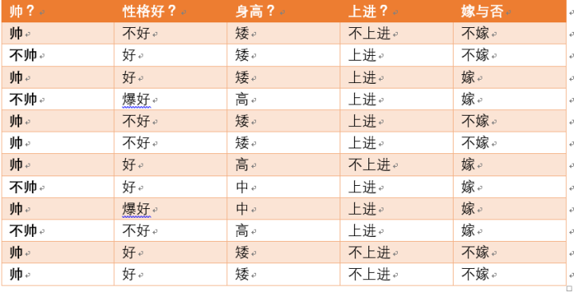

# 熵（Entropy）

## 概念

### 信息量

信息量用于度量信息的不确定性，信息量和事件发生的概率有关，事件发生的概率越小，其信息量越大。某个事件$x$发生的信信息量为：

$$

I(x) = −\log(p(x))

$$

以下两个事件中, 显然事件1的信息量非常大. 

1. 中国足球队获得了世界冠军
2. 中国乒乓球队获得了世界冠军

当$x, y$是相互独立的事件， 可以得出：

$$

I(x, y)  = I(x) + I(y)

$$

### 信息熵 (information entropy)

熵 (entropy) 这一词最初来源于热力学。1948年，香农将热力学中的熵引入信息论，所以也被称为香农熵 (Shannon entropy)，信息熵 (information entropy)。

$$

H(X) =  - \sum_{i=1}^n {p({x_i})} \log (p({x_i}))~~~~(i = 1,2, \ldots ,n)

$$

其中$X$ 表示的是随机变量，随机变量的取值为 $({x_1},{x_2}, \ldots ,{x_n})$，$p({x_i}) $表示事件发生的概率，且有$\sum {p({x_i})}  = 1$ 。熵可以理解为信息的不确定程度，是随机变量不确定性的度量.  熵越大，随机变量不确定性越大，系统越混乱（无序）。

**信息量和熵**

信息量是描述某一个事件发生的不确定性，而熵是描述整个系统的不确定性。比如，对于一个六面的骰子，每一个面相当于一个事件，而骰子的所有面构成了一个系统。从公式上，也可以看出熵是对系统中所有事件发生的信息量的加权平均(数学期望)。下面看看实际的例子, 假设我们从某婚介网站拿到以下数据. 

设随机变量$X=\{帅, 不帅\}$,  $Y=\{嫁, 不嫁\}$ 

$H(X) = -\frac 1 3\log\frac 1 3-\frac 2 3\log \frac 2 3 = 0.918 $

$H(Y) = -\frac 1 2\log\frac 1 2-\frac 1 2\log \frac 1 2 = 1$

~~~python
from math import log

# 熵
def entropy(X):
    h = sum([-x*log(x, 2) for x in X])
    return h

print('-'*50)
print(entropy([1/3, 2/3]))    
print(entropy([1/2, 1/2]))
~~~

### 联合熵（joint entropy）

对于服从联合分布为$p(x,y)$的一对离散随机变量$(X,Y)$ ,其**联合熵**定义为：

$$

H(X,Y) =  - \sum_{x \in X,y \in Y} {p(x,y)} \ln (p(x,y))

$$

当$X, Y$是相互独立的系统， 可以得出：

$$

H(X,Y) =  H(X) + H(Y)

$$

> 上面公式可以通过$p(x, y) = p(x)p(y)$推出

~~~python
# 联合熵
def joint_entropy(XY):
    xy = [p for xY in XY for p in xY ]
    return entropy(xy)
  
print('-'*50)    
XY = [[5/12,3/12], [1/12,3/12]]
print(joint_entropy(XY)) 
~~~

 当$X, Y$非相互独立， 可以得出：

$$

H(X,Y) < H(X) + H(Y）

$$

基本的含义是，既然$X, Y$既然相互有关系，系统的不确定性降低了。比方：有两场比赛，如果有假球发生，既然结果内定了,  没悬念了，大家都不愿看了。

### 条件熵 (conditional entropy)

若$(X,Y)\sim p(x,y)$，条件熵定义为：

$$

\begin{array}{l}
H(Y|X) &= \sum_{x \in X} {p(x)H(Y|X = x)} \\ 
       &=  - \sum_{x \in X} {p(x)} \sum_{y \in Y} {p(y|x)\log p(y|x)} \\ 
       &=  - \sum_{x \in X} {\sum_{y \in Y} {p(x,y)\log p(y|x)} }  \end{array}

$$

其物理意义：$X$给定条件下, $Y$ 的条件概率分布的熵对 X 的数学期望。

而且

$$

H(Y|X) <= H(Y)

$$

其含义是， 当在一个系统中，知道了$X$的信息，则整个系统的熵是变小的。

再看具体的例子：

设随机变量$Y=\{嫁, 不嫁\}$, 可以算得：

$H(Y) = -\frac 1 2\log\frac 1 2-\frac 1 2\log \frac 1 2 = 1$

再设随机变量$X=\{帅, 不帅\}$, 如果我们知道了一个人的长相是帅还是不帅, 再来计算$Y$的熵, 这就是条件熵.

下面看一下计算过程:

- $X = 不帅$  

  $H(Y|X = 不帅) = - \frac 1 4 \log \frac 1 4- \frac 3 4 \log \frac 3 4 = 0.811\\ 
  p(X = 不帅) = 4/12 = 1/3$

- $X = 帅$

  $H(Y|X = 帅) = - \frac 3 8 \log \frac 3 8- \frac 5 8 \log \frac 5 8 = 0.954\\ 
  p(X = 帅) = 8/12 = 2/3$

再来计算条件熵:

$$

\begin{array}{l}
H(Y|X) &= \sum_{x \in X} {p(x)H(Y|X = x)} \\ 
       &= p(X = 不帅)H(Y|X = 不帅) + p(X = 帅)H(Y|X = 帅)  \\ 
 &= \frac 1 3 *  0.811+ \frac 2 3 *  0.954   \\ 
 &= 0.907 <1= H(Y)
 \end{array}

$$

0.907小于1, 也就是当知道了一些信息后, 整个系统不确定性降低了, 也就是熵降低了. 

~~~python
# 条件熵
def conditional_entropy(Y_X):
    h = sum([ Y_x['x'] * entropy(Y_x['Y']) for Y_x in Y_X])
    return h
            

print('-'*50)
Y_X = [{'x':1/3, 'Y':[1/4, 3/4]},
       {'x':2/3, 'Y':[3/8, 5/8]}]
print(conditional_entropy(Y_X))
~~~

#### 联合熵和条件熵的关系

$$

H(X,Y) = H(X) + H(Y|X) =  H(Y) + H(X|Y)

$$

$$

\begin{array}{l}
H(X,Y) &=  - \sum_{x \in X} {\sum_{y \in Y} {p(x,y)\log p(x,y)} } \\
 &=  - \sum_{x \in X} {\sum_{y \in Y} {p(x,y)\log p(x)p(y|x)} } \\
&=  - \sum_{x \in X} {\sum_{y \in Y} {p(x,y)\log p(x)} }  - \sum_{x \in X} {\sum_{y \in Y} {p(x,y)\log p(y|x)} } \\
&=  - \sum_{x \in X} {p(x)\log p(x)}  - \sum_{x \in X} {\sum_{y \in Y} {p(x,y)\log p(y|x)} } \\
&= H(X) + H(Y|X)
\end{array}

$$

上面公式可以理解为：描述$ X$ 和 $Y$ 所需的信息是描述 X 自己所需的信息, 加上给定 $X$ 的条件下具体化 $Y $所需的额外信息。可以通俗的理解, 当系统不可知的变量越多, 整个系统越混乱 也就是熵越大.

如果做一点儿变化: 

$$

H(Y|X) = H(X,Y) - H(X)

$$

条件熵可以表示为$ (X, Y)$ 发生所包含的熵，减去 $X$ 单独发生包含的熵，即在 $X $发生的前提下， $Y $发生 “新” 带来的熵 。

### 信息增益(Information gain)

$$

IG(Y,X) = H(Y) - H(Y|X) = H(X) - H(X|Y) = IG(X,Y) \\
IG(Y,X) = IG(X,Y) = H(X) + H(Y) - H(X, Y)

$$

>  上面公式可以用$H(X,Y) = H(X) + H(Y|X) =  H(Y) + H(X|Y)$推出. 

信息增益是对称的, 也就是两个事件相互的信息增益是相同的，所以信息增益也叫相互信息(Mutual Information).

上面公式可以得出：

- 当$X$和$Y$相互独立，信息增益为0，即$H(Y) = H(Y|X) $， 也就是说X的信息，没啥作用，不能减少熵。
- 当$X$和$Y$相同时，$H(Y|X)=0$，也就是说，都告诉答案了，没信息了，熵为0。

**应用**

- 在决策树算法中, 经常采用信息增益来进行特征选择. 
- 在文本挖掘中，经常采用信息增益来发现Syntagmatic关系的词汇。

### KL散度，相对熵 (relative entropy)

假设$p(x),q(x)$ 是随机变量$X$中取不同值时的两个概率分布，那么 $p$的$q$的相对熵是： 

$$

D\left( {p||q} \right) = \sum_x {p\left( x \right)\log \frac{{p\left( x \right)}}{{q\left( x \right)}}}  = {E_{p\left( x \right)}}\log \frac{{p\left( x \right)}}{{q\left( x \right)}}

$$

相对熵又称互熵，鉴别信息，KL 散度（Kullback–Leibler divergence， KLD），Kullback 熵。它是两个随机分布之间距离的度量.  当两个分布相同的时候，KL散度为0，越是不同，KL散度越大。

**信息增益和KL散度**

$$

 {\begin{array}{l}
IG(X,Y) =H(X)-H(X|Y)\\
=-\sum_xp(x)logp(x)+\sum_y\sum_xp(x,y)log\frac{p(x,y)}{p(y)}\\
=-\sum_x\sum_yp(x,y)logp(x)+\sum_y\sum_xp(x,y)log\frac{p(x,y)}{p(y)}\\
=\sum_y\sum_xp(x,y)log\frac{p(x,y)}{p(y)p(x)} 
=KL(p(x,y)||p(x)p(y))

$$

 {\end{array}

从上面推导可以看到，信息增益也是一种KL散度，如果$p(x), p(y)$相互独立，分布$p(x,y)$和分布$p(x)p(y)$相同，则信息增益为0。从这个意义上说，信息增益时描述分布是否相互独立的度量。

**应用**

- [浅谈KL散度（相对熵）在用户画像中的应用](https://www.cnblogs.com/charlotte77/p/5392052.html?from=timeline&isappinstalled=0): 主要使用散度来计算消费群体对不同商品的喜好

- [KL 散度（从动力系统到推荐系统）](https://chuansongme.com/n/2759305)

  

### 交叉熵（cross entropy）

交叉熵本质上可以看成,用一个猜测的分布的编码方式去编码其真实的分布,得到的平均编码长度或者信息量。其中$p(x)$是真实的分布，而$q(x)$是猜测的分布. 在机器学习中，经常采用交叉熵来作为损失函数。而且交叉熵的公式和最大似然估计（MLE）推导出来的公式相同，不得不说，信息论这里和概率论在这里融合了。

$$

H(p, q) = - \sum_x p(x)\log\left({q(x)}\right)

$$

**交叉熵和散度的关系**
下面推导中，由于$H(p)$是常量, 所以可以看到交叉熵和散度的是等价。

$$

 \begin{align*}
D\left( {p||q} \right) &= \sum_x {p\left( x \right)\log \frac{{p\left( x \right)}}{{q\left( x \right)}}} \\
&=  \sum_x p\left( x \right) \log \left(p\left( x \right)\right) - \sum_x p\left( x \right) \log \left(q\left( x \right)\right)  \\
&=  H(p, q) - H(p)
 \end{align*}

$$

### 进阶

仔细体会一下几句话。

- 熵的意义是对p分布进行编码所需的最小字节数。

- KL散度的意义是“额外所需的编码长度”如果我们用q的编码来表示p。

- 交叉熵指的是当你用q作为密码本来表示p时所需要的“平均的编码长度”。

## 代码

[熵的手工计算](http://aa00:18888/notebooks/eipi10/xuxiangwen.github.io/03.ipynb#1.47-%E7%86%B5%E7%9A%84%E6%89%8B%E5%B7%A5%E8%AE%A1%E7%AE%97)

