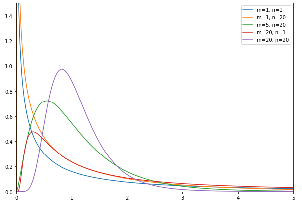
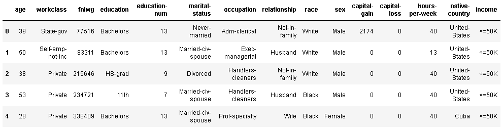
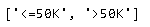
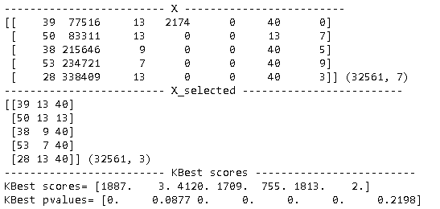
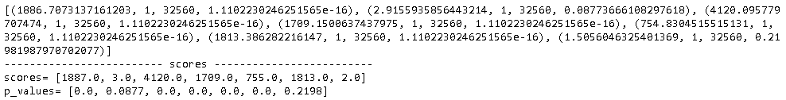
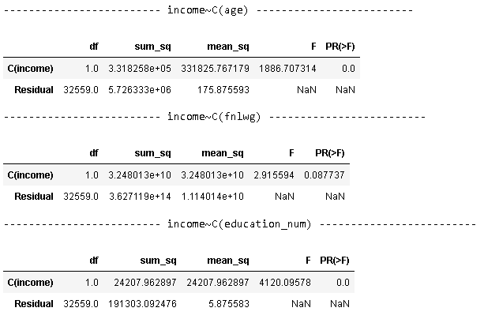
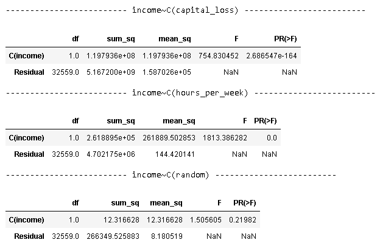

在统计学里，方差分析（Analysis of Variance, ANOVA）一般用于检测不同组之间是否有显著性差异，它是由英国著名的统计学家是[Ronald Aylmer Fisher](https://baike.baidu.com/item/%E8%B4%B9%E5%B8%8C%E5%B0%94/8763421)首先提出。本文将会描述方差分析及其理论基础，然后描述机器学习中如何使用方差分析进行特征筛选。

## 方差分析

方差分析的理论基础是F分布，让我们首先来看一看。

 设$X\sim \chi^2(m),Y\sim\chi^2(n)$, 且$X, Y$相互独立，可以计算随机变量：
$$
Z=\frac{X/m}{Y/n}
$$
则，随机变量$Z$服从第一自由度为$m$、第二自由度为$n$的$F$分布，记$Z \sim F(m,n)$。其概率密度图如下。

有了F分布的理论，下面我们来看看它和方差分析是怎么建立关系的。

我们知道，在科学研究和商业分析中，经常要比较若干个因素对业务指标的影响。比如，为了比较药物A,B,C对治疗某疾病的疗效，将实验对象分成三组，分别记录服用三种药物的治疗效果，得到三组样本：
$$
y_{11},y_{12}, \dots,y_{1n_i}  \\
y_{21},y_{22}, \dots,y_{2n_i}  \\
y_{31},y_{32}, \dots,y_{3n_i}
$$
通过这些数据，希望回答：这三种药物对治疗该疾病有没有显著差异。首先我们假设这三种药物没有任何差异，也就说它们来自一个相同的正态分布。三组药物实验，可以看成从这个正态分布中分别做三组抽样。这样无疑满足了如下条件。

- 每个样本来自同一个正太分布。
- 三组样本的方差相同。

上诉条件满足了F分布的条件，由此可以构造如下统计量。明显可以看到，当​MSR​越小，F值越小，这表示这些样本更加可能来自于同一分布。

| 来源  | 自由度 | 平方和                                                   | 均方和             | F值                                 |
| ----- | ------ | -------------------------------------------------------- | ------------------ | ------------------------------------ |
| 因子 | $ r −1$ | $$SSR$$ | $MSR=\frac {SSR} {r-1}$ | $\frac {MSR} {MSE}$ |
| 误差  | $n−r$ | $SSE$   | $MSE=\frac {SSE} {n-r}$ |  |
| 总和  | $n−1$  | $SST$                                                   | $MST=\frac {SST} {n-1}$ |                                      |

- SSR（Sum of Squares Regression）：回归平方和，也称组件平方和。
  $$
  SSR = \sum_{i=1}^r n_i(\bar y_{i\cdot} -\bar y)^2
  $$

  - $r$：总共由$r$组样本。
  - $n_i$ ：第$i$组的样本个数。
  - $\bar y_{i\cdot}$ ：第$i$组的平均值
  - $\bar y$： 总体平均值。

- SSE（Sum of Squares Error）：残差平方和，也称组内平方和。
  $$
  SSE= \sum_{i=1}^r\sum_{j=1}^{n_i}(y_{ij}-\bar y_{i\cdot} )^2
  $$

  - $y_{ij}$：第$i$组的第$j$个样本值

- SST（Sum of Squares Total）：离差平方和，也称总平方和。
  $$
  SST = \sum_{i=1}^r\sum_{j=1}^{n_i}(y_{ij}-\bar y )^2
  $$
  不难证明如下公式。
  $$
  SSA = SSR + SSE
  $$

- $R^2 $ ：当组间差异越大，说明不同组对样本的影响越大。可以用这个指标来衡量变量的关系强度。
  $$
  R^2 = \frac {SSR} {SST}
  $$

在机器学习分类任务，可以运用方差分析来筛选特征，以二分类（Positive和Negative）为例，可以把某一个特征的值分成两组，一组是Positive，一组是Negative，由此可以采用方差分析的方法。

## 实例分析

数据是来自于[1994年美国的人口普查数据](https://www.kaggle.com/uciml/adult-census-income?select=adult.csv)，其包含了人们的年龄，工作类型，教育，婚姻，人种，性别，每周工作时长，国家，收入等信息。我们的目标是根据这些信息预测收入（income），在建模之前，需要剔除找出那些和收入无关的特征。

### 数据

引入要使用的包。

~~~python
def aduit_census_download(target_path, source_url="http://archive.ics.uci.edu/ml/machine-learning-databases/adult", http_proxy=None):
    if http_proxy is not None:
        proxy_handler = urllib.request.ProxyHandler({'http': http_proxy, 'https': http_proxy})
        opener = urllib.request.build_opener(proxy_handler)
    else:
        opener = urllib.request.build_opener()

    urllib.request.install_opener(opener)

    def maybe_download(file_name):
        if not os.path.exists(target_path):
            os.makedirs(target_path)
        file_path = os.path.join(target_path, file_name)
        if not os.path.exists(file_path):
            source_file_url = os.path.join(source_url, file_name)
            logging.info(source_file_url)
            filepath, _ = urllib.request.urlretrieve(source_file_url, file_path)
            statinfo = os.stat(filepath)
            logging.info('Successfully downloaded {} {} bytes.'.format(file_name, statinfo.st_size))
        return file_path
    
    csv_file = 'adult.data'
    data_path= maybe_download(csv_file)
    
    extract_path = os.path.join(target_path, csv_file)
    return extract_path

local_path = os.path.join('.', 'data/adult_census')
data_path = aduit_census_download(local_path)

cols = ['age', 'workclass', 'fnlwg', 'education', 'education-num', 
       'marital-status','occupation','relationship', 'race','sex',
       'capital-gain', 'capital-loss', 'hours-per-week', 'native-country', 'income']
df_census = pd.read_csv(data_path, names=cols, sep=', ', engine='python')
df_census.head(5)
~~~

收入有两个值，一个是`<=50K`，一个是`>50K`。

~~~python
list(df_census.income.unique())
~~~

### 连续特征选取

根据前面的定义，可知方差分析的方法只适用于选择连续特征。下面使用[sklearn.feature_selection.SelectKBest](https://scikit-learn.org/stable/modules/generated/sklearn.feature_selection.SelectKBest.html)对这些特征进行特征选取。其中最后一列是随机数，我们希望采用方差分析的方法剔除这个列。

~~~python
# 添加一个随机数列，下面将验证这个列的卡方统计值
np.random.seed(1229)
df_census['random'] = np.random.randint(0, 10, (len(df_census),1))

continuous_columns = ['age', 'fnlwg', 'education-num', 'capital-gain', 'capital-loss', 'hours-per-week', 'random']

X = df_census[continuous_columns].to_numpy()
y = df_census[['income']].to_numpy().ravel()

print('-'*25, 'X', '-'*25)
print(X[0:5], X.shape)

print('-'*25, 'X_selected', '-'*25)
select_kbest = SelectKBest(f_classif, k=3)
X_selected = select_kbest.fit_transform(X, y)

print(X_selected[0:5], X_selected.shape)

print('-'*25, 'KBest scores', '-'*25)
print('KBest scores=', np.round(select_kbest.scores_, 0))
print('KBest pvalues=', np.round(select_kbest.pvalues_, 4)) 
~~~

上面的结果可以看到，`fnlwg`列和最后一列（随机列）的F统计量最小，而且p值超过0.05，这样我们可以接受这两列和收入之间的关系是独立的，也就是说，可以剔除这两列。上面代码中函数`f_classif`实现了方差分析的功能，为了验证，我们可以手工计算一遍。

~~~python
def split(X, y):
            
    # 根据y对X进行分组    
    index = y.argsort()
    X = X[index]
    y = y[index]
            
    groups = np.split(X, np.unique(y, return_index=True)[1][1:])     
    return groups
        
def anova_score(groups, significant=0.05):   
    def square_of_sums(a, axis=0):
        s = np.sum(a, axis=0)
        return s.astype(float) * s

    def sum_of_squares(a, axis=0):
        return np.sum(a*a, axis=axis)     
    
    sse = np.sum([sum_of_squares(g) - square_of_sums(g)/len(g) for g in groups])
    a = np.concatenate(groups)
    n = len(a)
    l = len(groups)
    s = np.sum(a)
    sst = sum_of_squares(a) - square_of_sums(a)/n
    ssa = sst - sse
    mse = sse/(n-l)
    msa = ssa/(l-1)
    f = msa/mse
    p_value = 1-stats.f.cdf(f, l-1, n-l)
    return f, l-1, n-1, p_value
       
scores = [ anova_score(split(X[:,j], y)) for j in range(X.shape[1])] 
print(scores)
print('-'*25, 'scores', '-'*25)
print('scores=', [round(f, 0) for f, _, _, _ in scores])
print('p_values=', [round(p_value, 4) for _, _, _, p_value in scores]) 
~~~

可以看到scores和p_values和SelectKBest的结果完全相同。除了上面两种方法，我们还可以采用[statsmodels.stats.anova.anova_lm](https://www.statsmodels.org/stable/generated/statsmodels.stats.anova.anova_lm.html)实现相同的效果。

~~~python
df_census.columns = [name.replace('-', '_') for name in df_census.columns]
continuous_columns = [name.replace('-', '_') for name in continuous_columns]

for column in continuous_columns:
    formula = 'income~C({})'.format(column)
    print('-'*25, formula, '-'*25)
    lm = ols('{}~C(income)'.format(column) , data=df_census).fit()
    display(anova_lm(lm))
~~~

## 参考

- [方差分析](https://wh136.github.io/anova/anova.pdf)
- [如何理解方差分析和F分布？](https://blog.csdn.net/ccnt_2012/article/details/109815989)
- [如何理解t检验、t分布、t值？](https://www.matongxue.com/madocs/580/)
- [数理统计讲义](https://bookdown.org/hezhijian/book/)
- [scipy.stats.f_oneway](https://docs.scipy.org/doc/scipy/reference/generated/scipy.stats.f_oneway.html)
- [统计学原理实验教程（Python）](https://github.com/SharkFin-top/Statistics_Python_Codes/)

## 历史

- 2020-12-30：初始版本。

  

