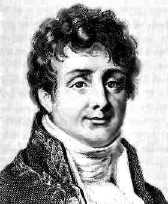
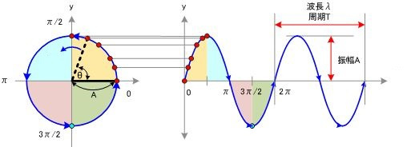
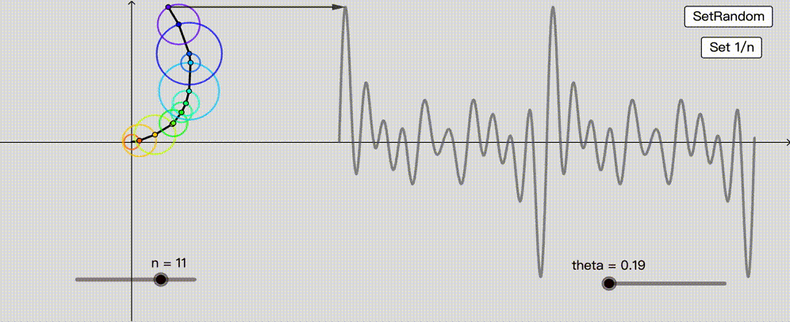
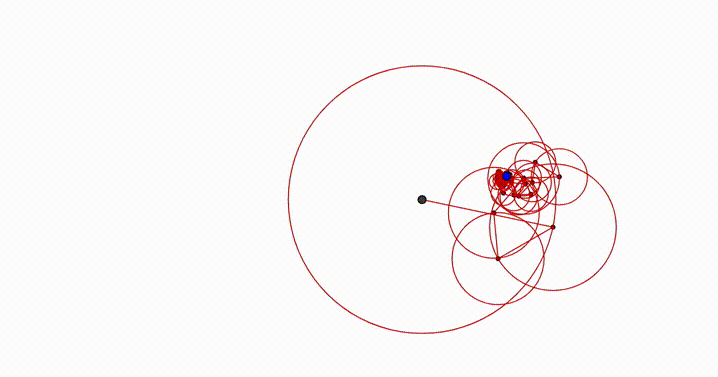

# 理解傅里叶变换

傅里叶变换（Fourier Transform）是一种线性积分变换，用于信号在时域和频域之间的转换。其基本事项首先由法国学者[约瑟夫·傅里叶](https://zh.wikipedia.org/wiki/约瑟夫·傅里叶)系统地提出。傅里叶变换在物理学和工程学上的应用非常广泛，而且在机器学习中也有很多运用，尤其是时间序列上。

$$
约瑟夫·傅里叶男爵（1768 －1830）
$$

## 通俗理解

下面通过一些现实生活中的例子来理解傅里叶变换后面的基本原理。

- 光的色散：初中物理，大家学过三棱镜的折射后可呈现彩色光，称之为色散。这说明白色的光波可以被分解为七色光波（实际应该是无数种颜色的光波）。

  

- 乐谱和音乐

  这是乐谱。

  

  而下面是上面乐谱演奏后的声音。

  

既然光和声音都可以由不同的基本成分（波）组合而成，那么推而广之，是不是任何的运动，也可以由基本的成分组合而成呢？再回答这个问题之前，首先来看欧拉公式。

## 欧拉公式

最美的数学公式如下：
$$
e^{\mathbf i \theta} = \cos \theta+ \mathbf i \sin \theta
$$
在[理解欧拉公式](./euler_formula.md)一文中谈到，欧拉公式体现就是一种复平面的圆周运动。

上图中， $\theta $表示时间（右图中X轴），则复平面的圆周运动在时间轴（+虚数轴）的投影就是$\sin \theta$。如果有多个（周期和振幅不同）圆周运动组合起来，会发生什么呢？见下图。

上面的四行图，对应的函数分别是：
$$
\begin{align}
y &= \frac {4\sin \theta } \pi  \\
y &= \frac {4\sin \theta } \pi + \frac {4\sin {3\theta} } {3\pi} \\
y &= \frac {4\sin \theta } \pi + \frac {4\sin {3\theta} } {3\pi} + \frac {4\sin {5\theta} } {5\pi} \\
y &= \frac {4\sin \theta } \pi + \frac {4\sin {3\theta} } {3\pi} + \frac {4\sin {5\theta} } {5\pi} + \frac {4\sin {7\theta} } {7\pi}
\end{align}
$$
可以看到，在复平面组合不同的（周期和振幅不同）圆周运动在时间轴(也称为时域)上投影可以非常呈现丰富的图形。下面是更加牛逼的例子。

模拟心电图

甚至可以画恐龙，下面这张图是由50个频率的傅里叶级数组成。

上面的例子不难看出，

1. 复杂的周期函数都可以由多种基本周期函数组合而成。
2. 基本的周期函数就是复平面匀速圆周运动。
3. 复平面匀速圆周运动在时间轴上的投影，就是正弦或余弦函数。

综合这三点，可以推出，复杂的周期函数可以由多个三角函数线性组合而成。

## 参考

- [如何通俗地理解傅立叶变换？](https://www.matongxue.com/madocs/473.html)
- [傅里叶分析之掐死教程](https://zhuanlan.zhihu.com/p/19763358)
- [如何理解傅里叶变换公式？](https://www.zhihu.com/question/19714540/answer/1119070975)

