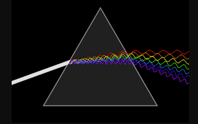
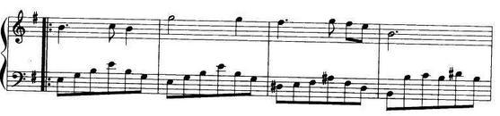
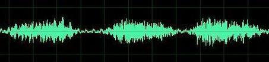
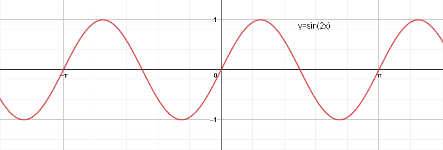
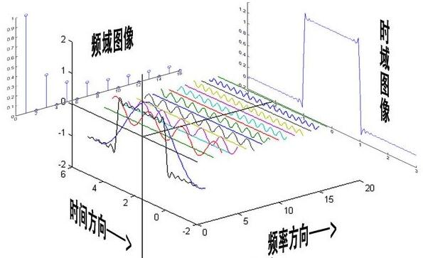
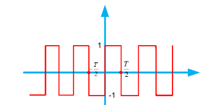
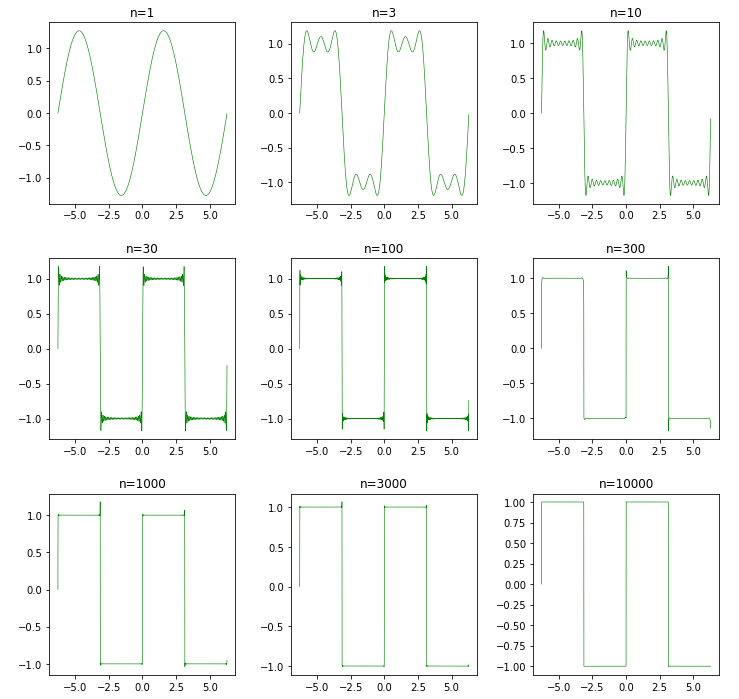

[傅里叶变换](https://zh.wikipedia.org/zh-hans/%E5%82%85%E9%87%8C%E5%8F%B6%E5%8F%98%E6%8D%A2)（Fourier Transform）是一种线性积分变换，用于信号在时域和频域之间的转换。傅里叶变换在物理学和工程学上的应用非常广泛，在机器学习中也有很多运用。

$$
约瑟夫·傅里叶男爵（1768 －1830）
$$

1807年，[约瑟夫·傅里叶](https://zh.wikipedia.org/wiki/约瑟夫·傅里叶)在法国科学学会上发表了一篇论文，论文里描述运用正弦曲线来描述温度分布，论文里有个在当时具有争议性的决断：任何连续周期信号都可以由一组适当的正弦曲线组合而成。

当时审查这个论文的大数学家[约瑟夫·拉格朗日](https://zh.wikipedia.org/wiki/%E7%BA%A6%E7%91%9F%E5%A4%AB%C2%B7%E6%8B%89%E6%A0%BC%E6%9C%97%E6%97%A5)坚决反对此论文的发表，而后在近50年的时间里，拉格朗日坚持认为傅立叶的方法无法表示带有棱角的信号，如在方波中出现非连续变化斜率。直到拉格朗日死后15年这个论文才被发表出来。

谁是对的呢？拉格朗日是对的：正弦曲线无法组合成一个带有棱角的信号。但是，我们可以用正弦曲线来非常逼近地表示它，逼近到两种表示方法不存在能量差别，基于此，傅立叶是对的。在详细探究之前，我们先来通俗的理解傅里叶变换。

## 通俗理解

下面是两个现实生活中的例子。

- 光的色散：初中物理，大家学过三棱镜的折射后可呈现彩色光，称之为色散。这说明白色的光波可以被分解为七色光波（实际应该是无数种颜色的光波）。

  

- 乐谱和音乐

  同理，乐谱和音乐也是这样。这是乐谱。

  

  而下面是根据乐谱演奏后的声音。

  

既然光和声音都可以由不同的基本成分（波）组合而成，那么推而广之，是不是任何的运动，也可以由基本的成分组合而成呢？

## 傅里叶级数

要理解傅里叶变换，首先要看傅里叶级数。下图中，函数$ s(x) $（红色）是六个不同幅度的正弦函数的和，呈现出接近方波的周期运动。这说明上节的猜想的确有可能啊，而这就是[傅里叶级数](https://zh.wikipedia.org/wiki/%E5%82%85%E9%87%8C%E5%8F%B6%E7%BA%A7%E6%95%B0)所要表达的。

假设，$f(x)$是周期为$T$的函数，并且满足[傅立叶级数的收敛条件](https://zh.wikipedia.org/wiki/%E5%82%85%E9%87%8C%E5%8F%B6%E7%BA%A7%E6%95%B0#%E5%82%85%E9%87%8C%E5%8F%B6%E7%BA%A7%E6%95%B0%E7%9A%84%E6%94%B6%E6%95%9B%E6%80%A7)，那么可以写成如下表达形式。
$$
f(x) = \frac {a_0} 2 + \sum_{n=1}^{N} \left( a_n\cos(\frac {2\pi nx} {T}) +  b_n\sin(\frac {2\pi nx} {T})\right )
$$
其中:
$$
a_n = \frac 2 T \int_{x_0}^{x_0+T} f(x)\cos(\frac {2\pi nx} {T})  dx \\
b_n = \frac 2 T \int_{x_0}^{x_0+T} f(x)\sin(\frac {2\pi nx} {T})  dx
$$
> 可以这样来记忆或理解上面的公式：如果把$\cos(\frac {2\pi nx} {T})，\sin(\frac {2\pi nx} {T})$看成特定频率的信号，$a_n，b_n$看成是信号的强度，而要求解信号强度，只要把$f(x)$ 乘于一个**过滤器**，就可以把相应的信号提取出来，而奇妙的是，这个过滤器就是特定信号（$\cos(\frac {2\pi nx} {T})，\sin(\frac {2\pi nx} {T})$）本身。

下面来求解$a_n$，$b_n$。

###  积分

首先可以采用积分求解。首先看三角函数在（若干个）周期内的积分。
$$
\int_{0}^{{2\pi}} \cos (nx) dx = \int_{0}^{{2\pi}} \sin (nx) dx =0
$$

上面的公式显而易见，从图形（沿着X轴对称）上就能直接看出来。进一步，看三角函数的正交。
$$
\int_{0}^{{2\pi}} \sin(mx)\cos (nx) dx = 0  \\
\int_{0}^{{2\pi}} \sin(mx)\sin (nx) dx =0   \ \ (m \neq n)\\
\int_{0}^{{2\pi}} cos(mx)\cos (nx) dx =0  \ \ (m \neq n) \\

\int_{0}^{{2\pi}} \cos^2 (nx) dx =\int_{0}^{{2\pi}}  \sin^2  (nx) dx =\pi
$$
以上公式的证明参见[三角函数正交性](https://www.zhihu.com/question/38841975/answer/396326348)。根据上面的公式，不难推出。
$$
\int_{x_0}^{{x_0+T}} \cos (\frac {2\pi nx} {T}) dx = \int_{x_0}^{{x_0+T}} \sin (\frac {2\pi nx} {T})dx =0 \\
\int_{x_0}^{{x_0+T}} \sin(\frac {2\pi n_1x} {T})\cos (\frac {2\pi n_2x} {T}) dx = 0  \\
\int_{x_0}^{{x_0+T}} \sin(\frac {2\pi n_1x} {T})\sin (\frac {2\pi n_2x} {T}) dx =0   \ \ (n_1 \neq n_2)\\
\int_{x_0}^{{x_0+T}} cos(\frac {2\pi n_1x} {T})\cos (\frac {2\pi n_2x} {T}) dx =0  \ \ (n_1 \neq n_2) \\

\int_{x_0}^{{x_0+T}} \cos^2 (\frac {2\pi nx} {T}) dx = \int_{x_0}^{{x_0+T}} \sin^2  (\frac {2\pi nx} {T}) dx =\frac T 2
$$
知道了这些公式，可以根据下面等式开始求解了。
$$
f(x) = \frac {a_0} 2 + \sum_{n=1}^{N} \left( a_n\cos(\frac {2\pi nx} {T}) +  b_n\sin(\frac {2\pi nx} {T})\right )
$$

- $a_0$：在等式两边直接求积分
  $$
  \begin{align}
  \int_{x_0}^{{x_0+T}} f(x) dx &= 
  \int_{x_0}^{{x_0+T}}  \frac {a_0} 2 dx + \int_{x_0}^{{x_0+T}}  \sum_{n=1}^{n} \left( a_n\cos(\frac {2\pi nx} {T}) +  b_n\sin(\frac {2\pi nx} {T})\right ) dx\\
  a_0 &= \frac 2 T \int_{x_0}^{{x_0+T}} f(x) dx
  \end{align}
  $$
  
- $a_n$：在等式两边乘于$cos(\frac {2\pi nx} {T}) $，然后再积分。
  $$
  \begin{align}
  \int_{x_0}^{{x_0+T}} cos(\frac {2\pi nx} {T}) f(x) dx = &
  \int_{x_0}^{{x_0+T}} cos(\frac {2\pi nx} {T}) \frac {a_0} 2 dx + \\ & \int_{x_0}^{{x_0+T}}  cos(\frac {2\pi nx} {T})\sum_{n=1}^{n} \left( a_n\cos(\frac {2\pi nx} {T}) +  b_n\sin(\frac {2\pi nx} {T})\right ) dx \\
  \int_{x_0}^{{x_0+T}} cos(\frac {2\pi nx} {T}) f(x) dx =& a_n \int_{x_0}^{{x_0+T}}  cos^2(\frac {2\pi nx} {T})  dx\\
  a_n =& \frac 2 T \int_{x_0}^{{x_0+T}}  f(x) cos(\frac {2\pi nx} {T}) dx
  \end{align}
  $$

  > 很明显，上面公式当$n=0$的就是$a_0$。
  
- $b_n$：同理，在等式两边乘于$sin(\frac {2\pi nx} {T}) $，然后再积分。
  $$
  b_n = \frac 2 T \int_{x_0}^{{x_0+T}} f(x) sin(\frac {2\pi nx} {T})  dx
  $$
### 线性方程组
还可以使用线性方程组求解。和一般的线性方程组不同，这次要从有限维扩充到无限维。采用这个方法，把线性代数和微积分联系起来了。其核心思想是：两个函数的内积（下面等号左边部分）等于这两个函数的积分（下面等号右边部分）。即
$$
< f,  g >= \int_{ \mathbb{R}} f(x)g(x) dx
$$
> 把积分看成是无数条线（$f(x)g(x)$）的累加，这样其定义就完全和向量内积的定义相同了。详细的解释见[如何理解函数可以看成是一个无限维的向量？](https://www.zhihu.com/question/39890018)

1. 构建线性方程组。$x$看成是一个无限维向量，则$f(x)$也是一个无限维向量，然后对于一个具体的$n$， 可以把$\cos(\frac {2\pi nx} {T})$，$\sin(\frac {2\pi nx} {T})$看成是一个无限维向量。

     假设

$$
x = \begin{bmatrix} x_1 \\ x_2 \\ \vdots \end{bmatrix}, 
  f(x) = \begin{bmatrix} f(x_1) \\ f(x_2) \\ \vdots  \end{bmatrix}, \\
  \cos(\frac {2\pi nx} {T}) = \begin{bmatrix} \cos(\frac {2\pi nx_1} {T})  \\ \cos(\frac {2\pi nx_2} {T}) \\ \vdots  \end{bmatrix},
  \sin(\frac {2\pi nx} {T}) = \begin{bmatrix} \sin(\frac {2\pi nx_1} {T})  \\ \sin(\frac {2\pi nx_2} {T}) \\ \vdots   \end{bmatrix},
$$

  	根据上面的向量，可以构建一个的$ \infin \times (2N+1)$阶矩阵。
$$
\mathbf D=\begin{bmatrix}
  \frac 1 2 & 
  \cos(\frac {2\pi x} {T}) & \cos(\frac {4\pi x} {T}) & \cdots  & 
  \cos(\frac {2n\pi x} {T}) & 
  \sin(\frac {2\pi x} {T})  & 
  \sin(\frac {4\pi x} {T}) & \cdots & \sin(\frac {2n\pi x} {T}) 
  \end{bmatrix}
$$
  	所有要求的参数可以构成一个$2n+1$维向量。
$$
d = \begin{bmatrix} a_0 \\ a_1 \\ a_2 \\ \vdots \\ a_n \\ b_1 \\ b_2 \\ \vdots \\ b_n  \end{bmatrix}
$$
​		由此可以构建线性方程组：
$$
  \mathbf D \cdot d = f(x)
$$

2. 求解[线性方程组](https://eipi10.cn/linear-algebra/2019/12/06/linear-equations/)。可以得到
    $$
    d = \mathbf {(D^{T}D)^{-1}D^{T}}f(x)
    $$
    
    为了计算准确，实际$n$会取的很大，所以直接求解方程组的计算工作量很大。如何简化计算呢？再次祭出大杀器了——三角函数正交性。
    $$
    \int_{x_0}^{{x_0+T}} \cos (\frac {2\pi nx} {T}) dx = \int_{x_0}^{{x_0+T}} \sin (\frac {2\pi nx} {T})dx =0 \\
          \int_{x_0}^{{x_0+T}} \sin(\frac {2\pi n_1x} {T})\cos (\frac {2\pi n_2x} {T}) dx = 0  \\
          \int_{x_0}^{{x_0+T}} \sin(\frac {2\pi n_1x} {T})\sin (\frac {2\pi n_2x} {T}) dx =0   \ \ (n_1 \neq n_2)\\
          \int_{x_0}^{{x_0+T}} cos(\frac {2\pi n_1x} {T})\cos (\frac {2\pi n_2x} {T}) dx =0  \ \ (n_1 \neq n_2) \\
    \int_{x_0}^{{x_0+T}} \cos^2 (\frac {2\pi nx} {T}) dx = \int_{x_0}^{{x_0+T}} \sin^2  (\frac {2\pi nx} {T}) dx =\frac T 2
    $$

  	根据上面的公式，我们可以发现矩阵$\mathbf D$任意两个不同的列向量都是正交的，则
$$
\begin{align}
          \mathbf {D^{T}D } &=
          \begin{bmatrix} 
          \int_{x_0}^{{x_0+T}} (\frac 1 2)^2 dx & 0  & \cdots & 0 \\
          0 & \int_{x_0}^{{x_0+T}} \cos^2(\frac {2\pi x} {T}) dx & \vdots & 0 \\
          0 &  \cdots & \ddots & \vdots \\
          0  & 0  & \cdots &  \int_{x_0}^{{x_0+T}} \sin^2(\frac {2\pi n x} {T}) dx
          \end{bmatrix} \\
          \mathbf {D^{T}D } &= \begin{bmatrix} 
          \frac T 4 & 0 & \cdots & 0 \\
          0 & \frac T 2  & \vdots  &0 \\
          0 & \cdots & \ddots   &  \vdots \\
          0    &0 & \cdots & \frac T 2 \\
          \end{bmatrix}
          \end{align}
$$
  	很容易得到:
$$
\begin{align}
          d &= \mathbf {(D^{T}D)^{-1}D^{T}}f(x) \\
          d &= {\begin{bmatrix} 
          \frac T 4 & 0 & \cdots & 0 \\
          0 & \frac T 2  & \vdots  &0 \\
          0 & \cdots & \ddots   &  \vdots \\
          0    & 0 & \cdots & \frac T 2 \\
          \end{bmatrix}}^{-1} \cdot \begin{bmatrix}
          \frac 1 2 & 
          \cos(\frac {2\pi x} {T})   & 
          \cdots  & 
          \sin(\frac {2\pi nx} {T}) 
          \end{bmatrix}^Tf(x) \\
          d &= \frac 2 T \begin{bmatrix}
           1  & 
          \cos(\frac {2\pi x} {T})   & 
          \cdots  & 
          \sin(\frac {2\pi nx} {T}) 
          \end{bmatrix}^Tf(x) 
          \end{align}
$$
  	也就是：
$$
a_n = \frac 2 T \int_{x_0}^{x_0+T} f(x)\cos(\frac {2\pi nx} {T})  dx \\
b_n = \frac 2 T \int_{x_0}^{x_0+T} f(x)\sin(\frac {2\pi nx} {T})  dx
$$

## 正弦曲线

上一节，已经把一个周期函数转化成了一组正弦曲线和余弦曲线的组合。然而当年傅里叶爵士可说的是，任何连续周期信号都可以由一组适当的正弦曲线组合而成。好吧，我们再做一些改变。

设已经计算得到$a_n, b_n$
$$
\begin{align}
f(x) = \frac {a_0} 2 + \sum_{n=1}^{N} \left( a_n\cos(\frac {2\pi nx} {T}) +  b_n\sin(\frac {2\pi nx} {T})\right )  \\
\end{align}
$$
再设$A_0=\frac {a_0} 2, \  A_n = \sqrt {a_n^2 + b_n^2}, \ {A_n}\sin(\phi_n) =  {a_n} , \ {A_n}\cos(\phi_n) = {b_n}  $，可以得到
$$
\begin{align}
A_n\sin(\frac {2\pi nx} {T} + \phi_n) &= A_n\sin(\phi_n)\cos(\frac {2\pi nx} {T}) + A_n\cos(\phi_n)\sin(\frac {2\pi nx} {T})  \\
&=  a_n\cos(\frac {2\pi nx} {T}) + b_n\sin(\frac {2\pi nx} {T}) 
\end{align}
$$
则，公式可以简化为：
$$
\begin{align}
f(x) =  {A_0}  + \sum_{n=1}^{N} A_n\sin(\frac {2\pi nx} {T} + \phi_n)  \\
\end{align}
$$
其中$\phi$指正弦函数的相位，也就是正弦函数初始的位置。

> 个人感觉，比起余弦和正弦的组合，正弦函数的组合，似乎更加简单啊。

## 频域和时域

由于周期不同，可以把三角函数看成是不同频率的函数，傅里叶级数就把一个周期函数转化成了不同频率的函数。就好像一个三棱镜，三棱镜是可以将光分成不同颜色成分，每个成分的颜色由波长（或频率）决定。傅里叶级数可以看作是“数学的三棱镜”，将函数基于频率分成不同的成分。由此，我们可以得到一下概念。

- 时域：横轴是时间，纵轴是信号的变化。即$f(x)$
- 频域：横轴是频率，纵轴是该频率的幅度，也就是通常说的频谱图。即$F(\omega) $

## 方波的频域

前文谈到，多个不同幅度的正弦正弦函数，可以呈现出方波，下图中，函数$ s(x) $（红色）是六个不同幅度的正弦函数的和，呈现出接近方波的周期运动。

现在我们来真正求解方波的频域。

如上图所示，方波周期为$T$，而且是一个奇函数。当$=\frac T 2  \leq x \leq \frac T 2$
$$
f\left(x\right)=\left\{
\begin{split}
1 \quad &  0 \leq x \leq \frac T 2\\
-1 \quad  & -\frac T 2 \leq x \leq 0
\end{split}
\right.
$$
根据傅里叶级数，当$x_0=- \frac T 2$，则：
$$
a_n = \frac 2 T \int_{-\frac T 2}^{\frac T 2} f(x)\cos(\frac {2\pi nx} {T})  dx \\
b_n = \frac 2 T \int_{-\frac T 2}^{\frac T 2} f(x)\sin(\frac {2\pi nx} {T})  dx
$$
把$f(x)$带入上面两个式子。首先看$a_n$。
$$
\begin{align}
a_n &= \frac 4 T \frac T {2\pi n} \int_{0}^{\frac T 2} \cos(\frac {2\pi nx} {T})  dx
\\&= \frac 4 T \frac T {2\pi n} sin(\frac {2\pi nx} {T}) |_{0}^{\frac T 2}
\\&=  0
\end{align}
$$
再看$b_n$。
$$
\begin{align}
b_n &= \frac 4 T \frac T {2\pi n} \int_{0}^{\frac T 2} \sin(\frac {2\pi nx} {T})  dx
\\&= -\frac 4 T \frac T {2\pi n} cos(\frac {2\pi nx} {T}) |_{0}^{\frac T 2}
\\&=  
\left\{
\begin{split}
\frac 4 {\pi n} \quad& n=1,3,5,7,\cdots\\
0\quad & n=2,4,6,8,\cdots\\
\end{split}
\right.
\end{align}
$$
也就是，
$$
f(x) = \frac 4 \pi \left( \sin(\frac {2\pi x} {T}) + \frac 1 3 \sin(\frac {6\pi x} {T}) + \frac 1 5 \sin(\frac {10\pi x} {T}) + \cdots + \frac 1 n \sin(\frac {2n\pi x} {T}) + \cdots \right)
$$
当$t=2\pi$，则

$$
f(x) = \frac 4 \pi \left( \sin( {x}) + \frac 1 3 \sin( {3 x} ) + \frac 1 5 \sin( {5 x} )  + \cdots + \frac 1 n \sin( {n x} ) + \cdots \right)
$$
下面代码将把上面函数的图形打印出来。

~~~python
import numpy as np
import matplotlib.pyplot as plt

x = np.mgrid[-2*np.pi:2*np.pi:0.01]  

def sin_square(n):
    y2 = 0
    for i in range(0, n):
        y2 = np.sin((2*i+1)*x)/(2*i+1)*4/np.pi + y2       
    plt.plot(x,y2,'g',linewidth=0.6)
    plt.title('n={}'.format(n))

N = [1, 3, 10, 30, 100, 300, 1000, 3000, 10000]  
columns = 3
rows = int((len(N)-1)/columns)+1

plt.rcParams['figure.figsize'] = (12.0, 12.0) 
plt.subplots_adjust(hspace=0.3, wspace=0.3)

for i in range(len(N)):
    plt.subplot(rows, columns, i+1)
    sin_square(N[i])
    
plt.show()    
~~~

上图中可以发现，随着$k$原来越大，越接近方波，当$k=10000$，完全看上去就是方波了。

## 参考

- [傅里叶分析之掐死教程](https://zhuanlan.zhihu.com/p/19763358)

- [如何理解傅立叶级数公式？](https://www.matongxue.com/madocs/619.html)

- [如何给文科生解释傅里叶变换？](https://www.jianshu.com/p/73f0ab14828a)

- [【直观详解】让你永远忘不了的傅里叶变换解析](https://charlesliuyx.github.io/2018/02/18/%E3%80%90%E7%9B%B4%E8%A7%82%E8%AF%A6%E8%A7%A3%E3%80%91%E8%AE%A9%E4%BD%A0%E6%B0%B8%E8%BF%9C%E5%BF%98%E4%B8%8D%E4%BA%86%E7%9A%84%E5%82%85%E9%87%8C%E5%8F%B6%E5%8F%98%E6%8D%A2%E8%A7%A3%E6%9E%90/)

- [傅里叶级数的系数是怎么得到的？](https://www.zhihu.com/question/38841975)

- [从傅里叶变换进阶到小波变换（一）](https://zhuanlan.zhihu.com/p/66189212)

- [周期方波信号频谱图](https://blog.csdn.net/ouening/article/details/53199215)

  

