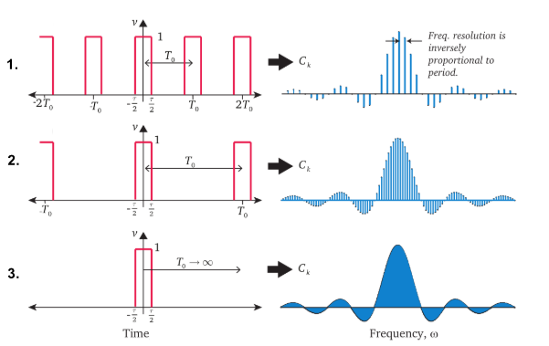
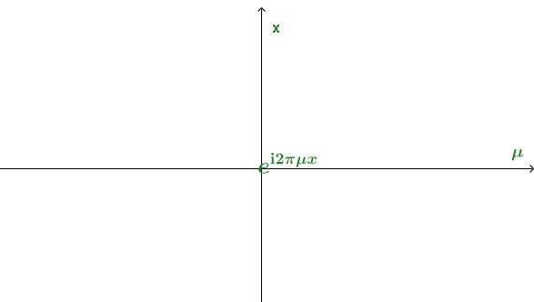
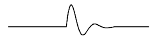
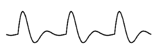
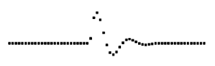
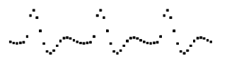

前文中详细描述了傅里叶级数，它把一个周期函数分解成一组正交函数（三角函数或者匀速圆周运动​）的线性组合，它是傅里叶变换的基础，理解了它，傅里叶变换的理解就不难了。傅里叶变换和傅里叶级数的不同在于，前者只能处理周期函数的，而后者可以处理非周期函数。

## 从有限到无限

傅立叶级数是基于周期函数的，如果把周期推广到$\infty$，那么也就变为了非周期函数，这就是傅立叶变换。

首先来看之前的公式：
$$
f(x) =  \sum_{n=-N}^{N} c_n \cdot e^{\mathbf i\omega nx} \tag 1
$$
其中：
$$
c_n= \frac 1 T \int_{x_0}^{x_0+T} f(x) e^{-\mathbf i\omega nx} dx \tag 2
$$

$$
\frac 1 T = \frac {\omega} {2\pi}  \tag 3
$$

> 上面公式中$N$，表示一个正整数，趋近于$\infty$。

公式$ (3) $带入公式$(2)$，然后带入公式$(1)$，可以得到
$$
\begin{align}
f(x) &= \sum_{n=-N}^{N} \frac w {2\pi}  \int_{x_0}^{x_0+T} f(x) e^{-\mathbf i\omega nx} dx\cdot e^{\mathbf i\omega nx} \\
f(x) &=  \sum_{n=-N}^{N} \left ( \frac 1 {2\pi} \int_{x_0}^{x_0+T} f(x) e^{-\mathbf i\omega nx} dx \right)\cdot e^{\mathbf i\omega nx}  w\\
\end{align}
$$
令$F(\omega) =  \frac 1 {2\pi} \int_{x_0}^{x_0+T} f(x) e^{-\mathbf i\omega nx} dx $，则
$$
\begin{align}
f(x) = \sum_{n=-N}^{N} \mathcal  F(w) \cdot e^{\mathbf i\omega nx}  w\\
\end{align}
$$
当$T \to \infty $，设$w^{'} =nw $，则
$$
\begin{align}
\mathcal  F(\omega{'}) =  \frac 1 {2\pi} \int_{-\infty}^{\infty} f(x) e^{-\mathbf i\omega^{'}x} dx  \\
\end{align}
$$

$$
\begin{align}
f(x) &= \sum_{n=-N}^{N}  \mathcal F(w^{'}) \cdot e^{\mathbf iw^{'}x}  w
\end{align}
$$

当$w\to 0， N \to \infty$， 令$dw^{'}= (n+1)\omega - n\omega$，可以把累加转化为积分的形式，则
$$
\begin{align}f(x) &=   \int_{-\infty}^{\infty}  \mathcal  F(w^{'}) \cdot e^{\mathbf iw^{'}x}  dw{'}\end{align}
$$
令$w = w^{'}$，则
$$
\begin{align}
f(x) &=   \int_{-\infty}^{\infty}  \mathcal   F(w) \cdot e^{\mathbf iwx}  dw \tag 4
\end{align}
$$

$$
\begin{align}
\mathcal  F(\omega) =\frac 1 {2\pi} \int_{-\infty}^{\infty} f(x) e^{-\mathbf i\omega x} dx \tag 5
\end{align}
$$

其中$\omega$代表匀速圆周运动的角速度（每秒转过多少弧度）。公式$(5)$称为傅里叶变换（Fourier transform)，从时域到频域，而公式$(4)$称为傅里叶逆变换（inverse Fourier transform），从频域到时域。

至此我们把傅里叶级数转化为了傅里叶变换。经过转换，任意（符合限定的）函数都可以由无数个不同速率$\omega$的匀速圆周构成。

> 上面公式中，傅里叶变换中基$ e^{\mathbf iwx}$中$\omega $的取值是连续的，所以又称之为**连续傅里叶变换**，而傅里叶级数的基$e^{\mathbf i\omega nx}$中$\omega n$是离散的，这是它们的根本区别。下图描述了这种变化的过程。
>
> 
>
> 1. 周期函数，可以通过傅立叶级数画出频域图
>
> 2.  随着周期$T$变大，频域图变得越来越密集
>
>    从公式$f(x) =  \sum_{n=-N}^{N} c_n \cdot e^{\mathbf i\omega nx}$可以看到，当$T$变大，$\omega$会变小，这使得相邻频率之间的间隔变小，这使得频域图上看上去显得更密集。
>
> 3. 当$T \to \infty$，频域图变为连续的曲线，得到傅立叶变换。
>
>    设
>    $$
>    f(x) = \begin{equation}  
>    \left\{  
>    \begin{array}{lcl}  
>    \frac 1 \tau        &  &  -\frac \tau 2 \leq x \leq \frac \tau 2  \\  
>    0        &  & others  
>    \end{array}  
>    \right.  
>    \end{equation}
>    $$
>    进行傅里叶变换。
>    $$
>    \begin{align}
>    \mathcal  F(\omega) &=\frac 1 {2\pi} \int_{-\infty}^{\infty} f(x) e^{-\mathbf i\omega x} dx 
>    \\ &= 
>    \frac 1 {2\pi} \int_{-\frac \tau 2}^{\frac \tau 2} \frac 1 \tau e^{-\mathbf i\omega x} dx 
>    \\ &= 
>    \frac 1 {2\pi} \int_{-\frac \tau 2}^{\frac \tau 2} \frac 1 \tau \left [\cos(-\omega x) + \mathbf i \sin(-\omega x) \right ] dx  & & 根据欧拉公式
>    \\ &= 
>    \frac 1 {2\pi} \int_{-\frac \tau 2}^{\frac \tau 2} \frac 1 \tau \cos(\omega x)   dx & & (6)
>    \\ &= 
>    \frac 1 {2\pi} \frac {\sin (\frac {\omega\tau} 2)} {\frac {\omega\tau}  2}
>    \end{align}
>    $$
>    公式$(6)$的转化，来自$F(\omega)$是一个关于实数轴对称的函数，其虚数的值刚好抵消。
>
>    当$\tau \to 0$，则
>    $$
>    \mathcal  F(\omega) =\lim_{\tau \to 0} \frac 1 {2\pi} \frac {\sin (\frac {\omega\tau} 2)} {\frac {\omega\tau}  2} = \frac 1 {2\pi}
>    $$
>    所有的频率的固定振幅都是$\frac 1 {2\pi}$，从频域图上看，就是一条直线了。这是$f(x)$就被称之为[狄拉克$\delta$函数](https://zh.wikipedia.org/wiki/%E7%8B%84%E6%8B%89%E5%85%8B%CE%B4%E5%87%BD%E6%95%B0)。它的一样在于，$\delta $函数包含了所有频率的分量，天然的最理想的试验函数啊！只用一个函数就可以把系统的所有频率分量的响应激发出来。
>

上面公式$(4),(5)$其实还可以进一步简化。设$\omega = 2\pi \mu $，$\omega$表示每秒钟能够完成的弧度，而$\mu$代表了频率，也就是一秒钟能够完成多少次周期。一个周期就是运动一个圆周，弧度是$2\pi $。带入上面的公式，可以得到
$$
\begin{align}f(x) &=   \int_{-\infty}^{\infty}   \mathcal  F(\mu) \cdot e^{\mathbf i2\pi\mu x}  d\mu \end{align}
$$

$$
\begin{align}\mathcal  F(\mu) =\int_{-\infty}^{\infty} f(x) e^{-\mathbf i2\pi\mu x} dx \end{align}
$$

很明显，上面的公式更加简洁了，优美了。

##  傅里叶变换的本质

下面我们从线性代数的角度上，再来看傅里叶变换。

1. $e^{\mathbf i2\pi\mu x}$看成是一个矩阵$\mathbf Q$，行列方向都是无限维的，其列方向是频率$\mu$，行方向是时间$x$。

   

   由于$\mathbf Q$是一个[酉矩阵]([https://zh.wikipedia.org/wiki/%E9%85%89%E7%9F%A9%E9%98%B5](https://zh.wikipedia.org/wiki/酉矩阵))，即
   $$
   \mathbf Q^* \mathbf Q = \mathbf {I}
   $$

   > $\mathbf {I}$是单位矩阵，$\mathbf Q^* $表示[共轭转置](https://zh.wikipedia.org/wiki/%E5%85%B1%E8%BD%AD%E8%BD%AC%E7%BD%AE)，也就是$(e^{-\mathbf i2\pi\mu x})^T$。

2. $  \mathcal  F(\mu) $ 可以看成一个向量，也是是基于矩阵$\mathbf Q$列向量的坐标。

3. $f(x) = \int_{-\infty}^{\infty}   \mathcal  F(\mu) \cdot e^{\mathbf i2\pi\mu x}  d\mu = \mathbf Q \mathcal F(\mu)$，相当于通过$\mathbf Q$， 对向量$  \mathcal  F(\mu) $进行线性变换。
   $$
   \begin{align}
   f(x) &= \mathbf Q \mathcal F(\mu)  \\
   \mathbf Q^{T} f(x) &= \mathbf Q^{*} \mathbf Q \mathcal F(\mu) \\
   \mathcal F(\mu)  &= \mathbf Q^{*} f(x) \\
   \mathcal F(\mu)  &= \int_{-\infty}^{\infty} f(x) e^{-\mathbf i2\pi\mu x} dx 
   \end{align}
   $$

一句话，**傅里叶变换就是这个向量空间中的一个幺正变换**！

## 卷积定理(Convolution Theorem)

[卷积定理](https://zh.wikipedia.org/wiki/%E5%8D%B7%E7%A7%AF%E5%AE%9A%E7%90%86)是傅里叶变换的非常重要性质之一。在详细介绍之前，首先我们来看看是什么是卷积。

### 什么是卷积

假设函数$ f,g$ 是定义在$ \mathbb {R} ^{n}$上的[可测函数](https://zh.wikipedia.org/wiki/可测函数)（measurable function），$f$与$g$的卷积记作$ f*g$，它是其中一个函数翻转，并平移后，与另一个函数的乘积的积分，是一个对平移量的函数，也就是：
$$
(f*g)(t)=\int _{\mathbb {R} ^{n}}f(\tau )g(t-\tau )\,d\tau
$$

这个定义还是比较的抽象，下面来看一个非常形象的例子。

小明是一个大学生，为了能买心爱的iPhone手机，决定开始做家教赚钱。假设，小明每天（除去开销后）赚到钱是$f(t)$，每天他都把当天赚到的钱存银行，存款利息是$0.0001$，如果一块钱存$t$天，本金加利息是$g(t)=(1+0.0001)^{t }$，现在要计算这一年中，小明每一天拥有的钱是多少？

- 第1天，小明拥有：$(f*g)(1) = \sum_{\tau=1}^1 f(\tau )g(1-\tau )\ = f(1) $

- 第2天，小明拥有：$(f*g)(2) = \sum_{\tau=1}^2 f(\tau)g(2-\tau )=f(1)*(1+0.0001)+f(2) $

- ...

- 第365天，小明拥有
  $$
  \begin{align}
  (f*g)(365) =& \sum_{\tau=1}^{365} f(\tau)g(365-\tau ) 
  \\=& f(1)*(1+0.0001)^{364} + 
  \\ & f(2)*(1+0.0001)^{363} +
  \\ & ... + 
  \\ & f(364)*(1+0.0001) + 
  \\ & f(365) 
  \end{align}
  $$

总结起来，可以这样来看：$(f*g)(t)$ 是关于$t$的函数，需要计算每个时刻$g$对$f$的加权

- $(f*g)(0) = \int _{\mathbb {R} ^{n}}f(\tau )g(-\tau )\,d\tau$
- $(f*g)(1) = \int _{\mathbb {R} ^{n}}f(\tau )g(1-\tau )\,d\tau$
- ...
- $(f*g)(t) = \int _{\mathbb {R} ^{n}}f(\tau )g(t-\tau )\,d\tau$
- ...

卷积可以理解为一个系统（函数）对另外一个系统（函数）在时间上累积作用。比如，上面小明的例子可以理解为，一个是赚钱的系统，一个是储蓄系统，赚钱系统产生的钱在储蓄系统上时间的累积的效果。

### 什么是卷积定理

卷积定理是指函数卷积的傅立叶变换是函数傅立叶变换的乘积，即一个域中的卷积对应于另一个域中的乘积，例如[时域](https://zh.wikipedia.org/wiki/時域)中的卷积对应于[频域](https://zh.wikipedia.org/wiki/频率)中的乘积，也就是：
$$
\mathcal {F}[(g*f)(s)] = \mathcal {F}[g(s)] \mathcal {F}[f(s)]
$$

## 傅立叶变换的类型

 根据原信号的不同类型，可以把傅立叶变换分为四种类别：。

1. 非周期性连续信号： 傅立叶变换（Fourier Transform）

   

2. 周期性连续信号： 傅立叶级数（Fourier Series）

   

3. 非周期性离散信号： 离散时间傅立叶变换（Discrete Time Fourier Transform）

   

4. 周期性离散信号： 离散傅立叶变换（Discrete Fourier Transform）

   

前文中已经详细描述了傅立叶级数和傅立叶变换，下面来看看离散信号的傅立叶变换。由于

##  离散傅立叶变换（Discrete Fourier Transform）

前面两个我们已经详细描述了，下面我们来看第三个。

在现实的处理中，通常我们只能对连续函数$f(x)$进行一个离散的采样，得到离散的值。

由于$f(t)$是一个周期函数，因此通常只需采样一个周期的样本即可。设$x=0,1,2,3,…,N−1$是采样点，采样间隔为ΔxΔx，相应的f(x)f(x)是采样得到的离散信号，则其离散傅里叶正变换和反变换换定义如下：

### 时域的卷积等于频域的乘积

傅里叶变换的意义在于，把复杂周期函数变成无数个匀速圆周运动的组合，这些匀速圆周运动体现的是函数

##  DFT

## DTFT

## 傅里叶变换的运用

#### ABCD

## 参考

- [如何通俗地理解傅立叶变换？](https://www.matongxue.com/madocs/473.html)
- [如何理解傅立叶级数公式？](https://www.matongxue.com/madocs/619.html)
- [如何理解傅里叶变换公式？](https://www.zhihu.com/question/19714540/answer/1119070975)
- [从傅立叶级数到傅立叶变换](https://www.matongxue.com/madocs/712.html)
- [频域处理Frequency domain processing：傅里叶变换](https://yangwc.com/2019/10/24/FFT/)
- [傅里叶系列（二）傅里叶变换的推导](https://zhuanlan.zhihu.com/p/41875010)
- [傅里叶系列（三）离散傅里叶变换（DFT）](https://zhuanlan.zhihu.com/p/75521342)
- [深入理解傅里叶变换](https://tracholar.github.io/math/2017/03/12/fourier-transform.html)
- [卷积定理](https://zh.wikipedia.org/wiki/%E5%8D%B7%E7%A7%AF%E5%AE%9A%E7%90%86)
- [理解卷积 Convolution](https://www.qiujiawei.com/convolution/)
- [“卷积”其实没那么难以理解](https://zhuanlan.zhihu.com/p/41609577)
- [狄拉克δ函数(Dirac delta)和狄拉克梳状函数(Dirac comb)](https://www.qiujiawei.com/shah-function/)

