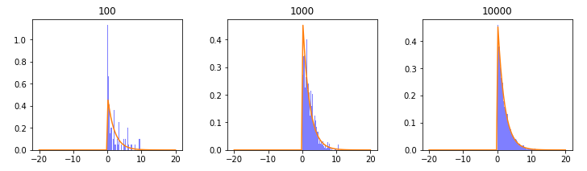
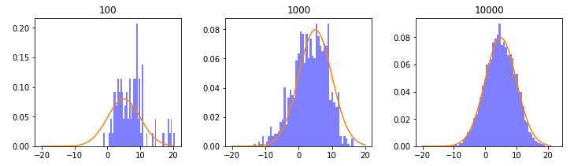
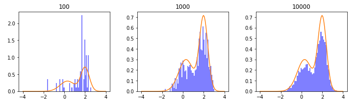

## Metropolis-Hastings算法

假设$p(x)$是概率密度分布。

1. 初始化：选取一个随机点 $x_0$，作为初始状态。并设$t=0$
2. 迭代过程。 每次生成一个样本。
   1. 从某一容易抽样的分布$q(x^{'}\vert x_t)$中随机生成候选状态$x^{'}$
   
   2. 计算候选状态的概率，$A(x^{'} \vert x) = \min (1, \frac {p(x{'}) q(x|x^{'})} {p(x)q(x^{'}|x)} )$
   
   3. 从$[0, 1]$均匀分布中生成随机数$u$
      $$
      x_{t+1} = 
      \left\{
      \begin{split}
      x^{'} \quad    & \text {if  } u < A(x^{'} \vert x) \\
      x_t   \quad    & others 
      \end{split}
      \right.
      $$
   
   4. $t = t+1$

下面代码中，$p(x)$是一个指数分布，$q(x)$是以$x_i$为中心的正态分布。

~~~python
import numpy as np
import matplotlib.pyplot as plt
from scipy import stats

def metropolis(p_pdf, q_sample, init_x, steps=10000):
    samples = []
    samples.append(init_x)
    for i in range(steps-1):
        x = samples[i]
        x1 = q_sample(x) # 根据老的样本，产生新的样本
        # 假定 q(x|x1) = q(x1|x) , 所以下面公式没有体现
        alpha = min(1, p_pdf(x1)/p_pdf(x))
        u = np.random.rand(1)
        if u<alpha:
            samples.append(x1)
        else:
            samples.append(x)
    return samples

def plot_compare(x, y, samples):
    plt.hist(samples, 50, density=1, facecolor='blue', alpha=0.5)
    plt.plot(x, y)
    plt.title(len(samples))
 
 
def show(p_pdf, x, y, test_steps = [100, 1000, 10000]):
    columns = 3
    rows = int((len(test_steps)-1)/columns)+1

    plt.rcParams['figure.figsize'] = (12.0, 3.0) 
    plt.subplots_adjust(hspace=0.3, wspace=0.3)

    for i in range(len(test_steps)):
        samples = metropolis(p_pdf=p_pdf, q_sample=q, init_x=1, steps=test_steps[i])
        plt.subplot(rows, columns, i+1)
        plot_compare(x, y, samples)

    plt.show()    
    
np.random.seed(99)

# 实际分布
dist = stats.expon(scale=2)
x = np.linspace(-20, 20, 100)
y = dist.pdf(x)

# q分布是Norm(v, 2)
q = lambda v:stats.norm.rvs(loc = v, scale = 2, size = 1)[0]
# 相同的写法 q = lambda v:v + np.random.normal(0, 2)

show(dist.pdf,  x, y)
~~~

可以看到，随着抽样数量的提高，越来越符合原来的真实分布了。在

下面是$p(x)$是要一个正态分布。

~~~python
dist = stats.norm(5, 5)
x = np.linspace(-20, 20, 100)
y = dist.pdf(x)

show(dist.pdf,  x, y)
~~~

下面是$p(x) = 0.3 e^{-(x-0.3)^2} + 0.7e^{-3(x-2)^2}$。

~~~python
def p(x):
    return 0.3*np.exp(-(x-0.3)**2) + 0.7* np.exp(-3*(x-2.)**2) 

x = np.linspace(-4, 4, 100)
y = p(x)
show(p,  x, y)
~~~

## Gibbs Sampling

Gibbs Sampling 实际上是 MH 算法的一个变种。具体思路如下：假设在一定温度下一定量的分子在容器里做无规则的热运动，如何统计系统的能量呢？

可以采用 Monte Carlo 的思想进行统计计算。我们假设所有的分子静止在某一个时刻，这是初识状态。固定其他的分子，根据分子间的作用力对其中一个分子进行移动，也就是说在该分子以一定的概率移动到领域的某一个地方，移动完了之后再静止。然后基于移动后的状态对下一个分子进行同样的移动操作...直到所有的分子移动完毕，那么现在的状态就是 Monte Carlo 采样的第二个样本。依照这样的顺序采样下去，我们对于这个系统就能计算一个统计意义上的能量了。从条件分布的角度来看，算法过程如下：

## 参考

- [wiki: Metropolis–Hastings algorithm](https://zh.wikipedia.org/wiki/%E6%A2%85%E7%89%B9%E7%BD%97%E6%B3%A2%E5%88%A9%E6%96%AF%EF%BC%8D%E9%BB%91%E6%96%AF%E5%BB%B7%E6%96%AF%E7%AE%97%E6%B3%95)
- [从随机过程到马尔科夫链-蒙特卡洛方法](https://github.com/dailiang/cnblogs/blob/master/MCMC/MCMC.md)
- [MCMC(三)MCMC采样和M-H采样](https://www.cnblogs.com/pinard/p/6638955.html)

