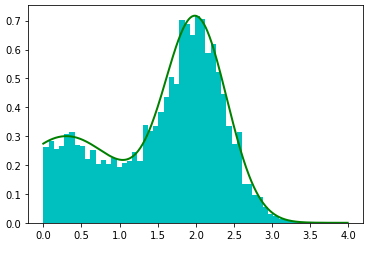

和其它采样方法不同，重要性采样（Importance Sampling）并不是为了生成符合某个分布的样本，而是求解某一个分布的数学期望：
$$
E[f(x)] = \int_D f(x)p(x) dx
$$
## 详解

当符合$p(x)$分布的样本不太好生成的时候，可以引入另外一个分布$q(x)$，使得：
$$
\begin{align}
E[f(x)] &= \int_D f(x)p(x) dx
\\ &= \int_D f(x) \frac {p(x)} {q(x)} q(x)dx
\end{align}
$$
设$g(x) = f(x) \frac {p(x)} {q(x)}, w(x)=\frac {p(x)} {q(x)} $，则：
$$
\begin{align}
E[f(x)] &= \int_D g(x)q(x)dx
\end{align}
$$
这样，我们将问题转化为了求$g(x)$在$q(x)$分布下的期望。其中$w(x)$也称重要性权重（Important Weight）。

接下来根据*蒙特卡罗积分*：
$$
\begin{equation} \int_D {f(x){\rm{d}}x}  = \mathop {\lim }\limits_{N \to \infty } \frac{1}{N}\sum\limits_{i = 1}^N {\frac{{f(x_i )}}{{p(x_i )}}}  \end{equation}
$$
可以计算生成样本来计算了。
$$
\begin{align}
E[f(x)] &= \int_D g(x)q(x)dx 
\\  &= \int_D f(x)w(x)q(x)dx 
\\ &= \lim_{N \to \infty} \frac{1} {N} \sum\limits_{i = 1}^N  {f(x_i )} {w(x_i )}
\end{align}
$$

重要性采样，很好的解决了当我们没办法从$p(x)$取样，如何取样的问题。而且它还可以优化原来的取样结果。下图中，$p(x)$和$f(x)$的分布差异很大。

![[图sample from q and p]](images/20181214092328197.jpg)

假设直接从$p(x)$进行采样，而大部分样本对应的$f(x)$都很小，当采样数量有限的情况下，很有可能都无法获得$f(x)$值较大的样本，这样评估出来的期望偏差会较大。

如果我们找到一个$q(x)$分布，使得它能在$f(x)∗p(x)$较大的地方采集到样本，则能更好地逼近$E[f(x)]$。而如何能找到这样的$q(x)$成为关键的难点。

## 采样

- 从简单分布$q(x)$中采样N个样本。

- 计算归一化的重要性权重
  $$
  w_i =\frac{\frac {p(x_i)} {q(x_i)}}   {\sum_j \frac {p(x_j)} {q(x_j)}}
  $$
  
- 在所有样本中，按照$w$为概率进行采样。

## 代码

下面例子中：$p(x) = 0.3 e^{-(x-0.3)^2} + 0.7e^{-3(x-2)^2}$，而$q(x)$是$[0, 4]$之间的均匀分布。

~~~python
import numpy as np
import matplotlib.pyplot as plt

def qsample():
    return np.random.rand()*4

def p(x):
    return 0.3*np.exp(-(x-0.3)**2) + 0.7* np.exp(-3*(x-2.)**2) 

def q(x):
    return 1/4

def importance(nsamples):    
    samples = np.zeros(nsamples, dtype=float)
    w = np.zeros(nsamples, dtype=float)
    
    for i in range(nsamples):
        samples[i] = qsample()
        w[i] = p(samples[i])/q(samples[i])
                
    return samples, w

def sample_discrete(vec):
    u = np.random.rand()
    start = 0
    for i, num in enumerate(vec):      
        if u > start:
            start += num
        else:
            return i-1
    return i

def multinomial_sample_slow(samples, w):
    new_samples = np.zeros(len(samples), dtype=float)
    for j in range(len(samples)):
        new_samples[j] = samples[sample_discrete(w)]
    return new_samples
    
# 手工实现多项分布抽样
def multinomial_sample(samples, w):
    probs = np.cumsum(w)
    new_samples = np.zeros(len(samples), dtype=float)
    for j in range(len(samples)):
        u = np.random.rand()
        for i, prob in enumerate(probs):      
            if u < prob:
                new_samples[j] = samples[i]
                break
    return new_samples

def multinomial_sample_fast(samples, w):
    indexes = np.random.multinomial(len(samples), w)
    cum_indexes = np.cumsum(indexes)
    new_samples = np.zeros(len(samples), dtype=float)
    start = 0   
    for i, index in enumerate(cum_indexes):
        new_samples[start:index] = samples[i]
        start = index
    return new_samples

def importance_sampling(nsamples):
    samples, w = importance(nsamples)
    w = w / w.sum()
    return multinomial_sample_fast(samples, w)

x = np.arange(0, 4, 0.01)
y = p(x)
plt.plot(x, y, 'g', lw=2)

final_samples = importance_sampling(10000)
plt.hist(final_samples, 50, density=1, fc='c')
plt.show()
~~~

> 上面代码中，以下三个函数都实现了在所有样本中，按照$w$为概率进行采样。这个取样相当于多项式取样。
>
> - multinomial_sample_slow：完全手工编写，性能很差
> - multinomial_sample：做了一点优化。
> - multinomial_sample_fast：调用numpy的多项式抽样，所以非常快

上面代码的过程概括如下：

1. 用均匀分布$q(x)$，生成大量样本
2. 分别计算这些样本在$p(x)$中的概率（由于$q(x)$是均匀分布，概率密度相同，所以可以忽略）。
3. 把上步的概率归一化，计算出每个样本出现的概率。
4. 根据上一步的概率，采用多项式抽样获取生成的样本。

## 参考

- [重要性采样](https://zh.wikipedia.org/wiki/%E9%87%8D%E8%A6%81%E6%80%A7%E9%87%87%E6%A0%B7)
- [Importance Sampling (重要性采样)介绍](https://mathpretty.com/12375.html)
- [采样方法](https://blog.csdn.net/Dark_Scope/article/details/70992266)
- [从随机过程到马尔科夫链-蒙特卡洛方法](https://github.com/dailiang/cnblogs/blob/master/MCMC/MCMC.md)

