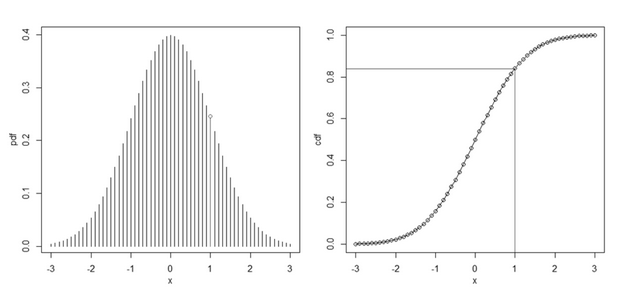

逆变换采样（Inverse Transform Sampling）是一种采样方法。如果我们知道一个随机变量的累积分布函数 (CDF - Cumulative Distribution Function)，而且还可以计算出反函数，则可以使用`逆变换采样`来产生符合该分布的样本。

## 定义

假设 $u=F(x)$是一个CDF函数，$F^{-1}$是它的反函数，若 $u$是一个服从$ (0,1)$均匀分布的随机变量，则 $F^{−1}(U)$服从函数 $F$给出的分布。

比如：指数分布的CDF函数  为$F(x)=1 – e^{ – \lambda x}$，其反函数是$F^{-1}(x) = -\frac{\ln (1-x)}{\lambda}$， 所以只要不断生成服从$ (0,1)$均匀分布的随机变量，代入到反函数中即可生成指数分布。

可以这样来通俗理解逆变换定理。

![[图ab，映射关系]](images/20181214092241164.jpg)

上图是指数分布的CDF和PDF（概率密度函数）。如果对$y$轴均匀取样，可以获得对应的$x$值，很明显，当CDF曲线越陡的地方，取样越密集，反之，则取样稀疏。这正好符合了实际的$F$的分布。

## 参考

- [漫谈正态分布的生成](https://cosx.org/2015/06/generating-normal-distr-variates/)
- [蒙特卡洛采样之拒绝采样（Reject Sampling）](http://www.twistedwg.com/2018/05/30/MC-reject-sampling.html)
- [Box-Muller变换原理详解](https://zhuanlan.zhihu.com/p/38638710)