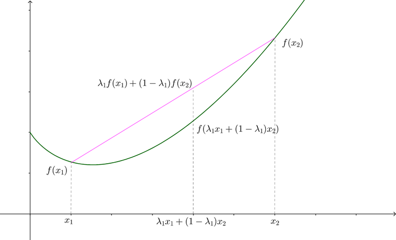

Jensen不等式（Jensen's inequality），以丹麦数学家Johan Jensen命名，它给出积分的凸函数值和凸函数的积分值间的关系，它在概率论、机器学习、测度论、统计物理等领域都有相关应用。

## 定义

对于任意点集${x_i}$，若$\lambda_i \geq 0 $，且$\sum_{i=1}^{m} \lambda_{i}=1$，则凸函数$f(x)$满足下面的公式。
$$
f\left(\sum_{i=1}^{m} \lambda_{i} x_{i}\right) \leq \sum_{i=1}^{m} \lambda_{i} f\left(x_{i}\right)
$$
在概率论中，如果把 $\lambda_i$ 看成概率分布，那么公式就可以写成：
$$
f(E[x]) \leq E[f(x)]
$$

反之，如果$f(x)$是凹函数，则：
$$
f\left(\sum_{i=1}^{m} \lambda_{i} x_{i}\right) \geq \sum_{i=1}^{m} \lambda_{i} f\left(x_{i}\right) \\
f(E[x]) \geq E[f(x)]
$$

## 证明

可以使用数学归纳法来证明Jessen不等式。

### 当$i=2$

由于$\lambda_2=1-\lambda_1$，所以公式可以写成：
$$
f\left(\lambda_1x_1+(1-\lambda_1)x_2\right) \leq \lambda_1f(x_1)+(1-\lambda_1)f(x_2) \tag 1
$$

如下图所示，当$f(x)$时凸函数（二阶导数大于等于0），上面的公式显然成立。

### 当$i=m$

假设公式成立，即
$$
f\left(\sum_{i=1}^{m} \lambda_{i} x_{i}\right) \leq \sum_{i=1}^{m} \lambda_{i} f\left(x_{i}\right)   \tag 2
$$
下面我们来证明$i=m+1$的情况下，公式依然成立，即
$$
f\left(\sum_{i=1}^{m+1} \lambda_{i} x_{i}\right) \leq \sum_{i=1}^{m+1} \lambda_{i} f\left(x_{i}\right)
$$
首先把$m+1$个数分成两部分，即
$$
\begin{align}
\sum_{i=1}^{m+1} \lambda_{i} x_{i} 
& = 
 \sum_{i=1}^{m} \lambda_{i} x_{i} + \lambda_{m+1}x_{m+1}
\\ & = 
 (1-\lambda_{m+1}) \sum_{i=1}^{m} \frac {\lambda_{i} } {1-\lambda_{m+1}}x_{i} + \lambda_{m+1}x_{m+1}
\end{align}
$$
设$x^*=\sum_{i=1}^{m} \frac {\lambda_{i}} {1-\lambda_{m+1}}  x_{i}$，则：
$$
\begin{align}
f\left(\sum_{i=1}^{m+1} \lambda_{i} x_{i}\right) = f((1-\lambda_{m+1})x^*+\lambda_{m+1}x_{m+1})
\end{align}
$$
然后根据公式$(1)$，则：
$$
\begin{align}
f\left(\sum_{i=1}^{m+1} \lambda_{i} x_{i}\right) 
&= f((1-\lambda_{m+1})x^*+\lambda_{m+1}x_{m+1})
\\ & \leq
 (1-\lambda_{m+1})f(x^*)+\lambda_{m+1}f(x_{m+1}) 
\\ & = 
(1-\lambda_{m+1})f\left(\sum_{i=1}^{m} \frac {\lambda_{i} } {1-\lambda_{m+1}} x_{i} \right)  + \lambda_{m+1}f(x_{m+1})  \tag 3
\end{align}
$$
然后，由于$\sum_{i=1}^{m} \frac {\lambda_{i} } {1-\lambda_{m+1}}=1$，根据公式$(2)$，可以得到：
$$
f\left(\sum_{i=1}^{m} \frac {\lambda_{i} } {1-\lambda_{m+1}} x_{i} \right) \leq \sum_{i=1}^{m} \frac {\lambda_{i} } {1-\lambda_{m+1}} f\left(x_{i}\right)
$$
把上面公式带入公式$(3)$，可以得到：
$$
\begin{align}
f\left(\sum_{i=1}^{m+1} \lambda_{i} x_{i}\right) 
& \leq
(1-\lambda_{m+1})f\left(\sum_{i=1}^{m} \frac {\lambda_{i} } {1-\lambda_{m+1}} x_{i} \right)  + \lambda_{m+1}f(x_{m+1})  
\\ f\left(\sum_{i=1}^{m+1} \lambda_{i} x_{i}\right)  & \leq 
(1-\lambda_{m+1})\sum_{i=1}^{m} \frac {\lambda_{i} } {1-\lambda_{m+1}} f\left(x_{i}\right)
+ \lambda_{m+1}f(x_{m+1}) 
\\ f\left(\sum_{i=1}^{m+1} \lambda_{i} x_{i}\right)  & \leq
\sum_{i=1}^{m+1} \lambda_if(x_i)
\end{align}
$$
证毕。

## 相等

对于任意的$\lambda_1, \lambda_2, \cdots, \lambda_m$，在什么情况下，Jensen不等式左右两边相等呢？

- 当$x_1=x_2=\cdots =x_m$时，等式显然成立

- 当$f(x)$是一条直线（线性关系）时，等式成立。

  

  当等式成立，则满足
  $$
  f\left(\lambda_1x_1+(1-\lambda_1)x_2\right) = \lambda_1f(x_1)+(1-\lambda_1)f(x_2)
  $$
  如上图所示，很明显，$f(x)$必然是直线。

## 参考

- [Jensen's inequality](https://en.wikipedia.org/wiki/Jensen's_inequality)