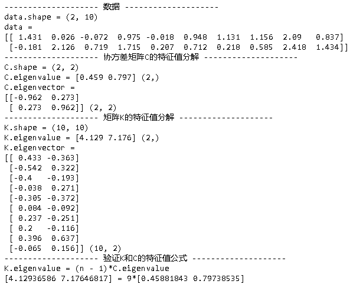
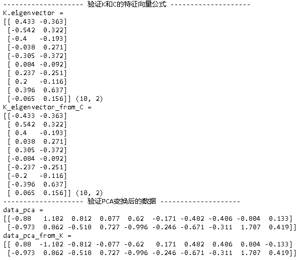
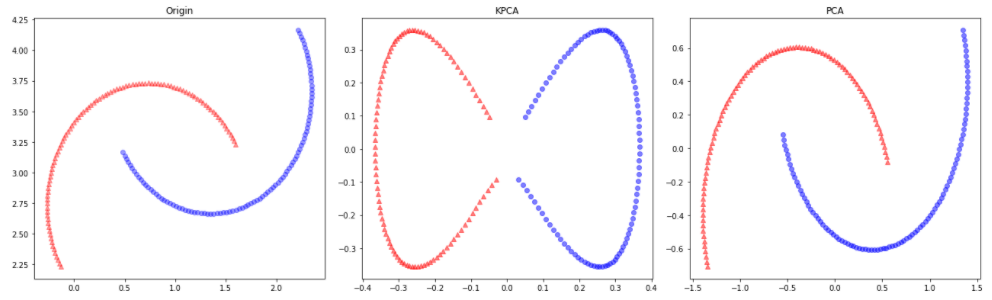
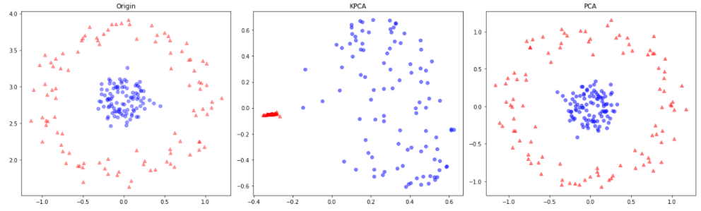
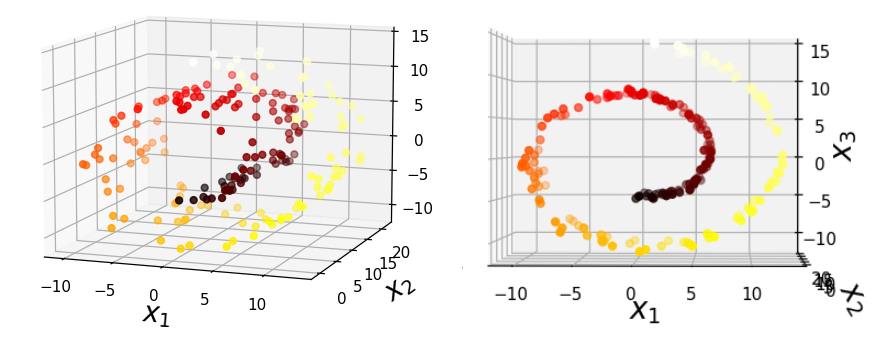
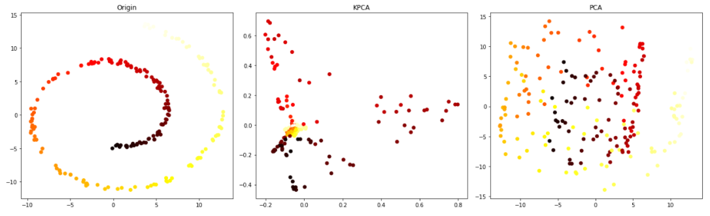
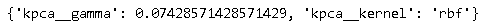

核主成分分析（Kernel Principal Component Analysis）简称KPCA，它是对[主成分分析（PCA）](https://eipi10.cn/mathematics/2021/05/12/covariance_matrix/#%E4%B8%BB%E6%88%90%E5%88%86%E5%88%86%E6%9E%90)的扩展，PCA通过把线性变换把数据旋转到特征矩阵所在向量空间，消除了随机变量之间的线性相关，然而这些操作对于高阶的相关性就无能为力，而KPCA可以解决这个问题。

KPCA假设，样本数据是高维到低维的投影，这种投影会带来信息的丢失，正如：一棵大树在正午的投影是一个椭圆，我们很难区分哪里是树干，哪里是树冠，也就是说，在低维空间无法区分很多信息，基于此，KPCA通过映射函数把数据映射到高维空间，然后再进行PCA操作，这样的操作可以更大程度的对变量的相关性进行消除，从而获取更有意义的主成分。

本文将对KPCA进行详细的推导，并示例比较KPCA和PCA，帮助大家更加深刻的理解它们。

## 从低维到高维

KPCA通过映射函数把数据映射到高维空间，这带来两个问题：

- 映射函数如何选取呢？
- 高维空间要多少维才合适呢？

对于第一个问题没有确定答案，因为数学上的相关函数太多了。那我们先看看第二个问题，由于我们只看到低维的样本数据，很难想象高维数据的特征，换句话说，高维数据有无限的可能，正如上面的例子，一个二维椭圆投影，在三维空间，可以是一棵树，也可以是一个球，而在四维空间，可能性就更多了。由此，如果映射后的高维空间维数越多，或许更加能够反应这种多样的可能性，也就是说，我们希望高维空间的维度高一些。

然而，选用维度很高的映射，又带来计算的问题。下面是常规的计算步骤：

1. 函数映射。

   设

   - $\mathbf X=[\begin{matrix} x_1 & x_2 & \dots & x_n]\end{matrix}$是一个$d\times n $矩阵，代表有$n$个样本，每个样本维度是$d$ 。
   - 映射函数为$\Phi$，映射后的矩阵是$\Phi(\mathbf X) $，它是$$D \times n $$矩阵，$D（D\gg d）$。
   - 一个样本的转换时间是$t_\Phi $。

   则所有样本的转换时间是$n \times t_\Phi$。

2. 计算协方差矩阵。

   设中心化的数据记为$\tilde\Phi(\mathbf X)$，即
   $$
   \tilde\Phi(  \mathbf X)=\Phi(\mathbf X)-\bar\Phi \tag 1
   $$
   其中$\bar\Phi$表示均值，是一个$D$维向量。由此，协方差矩阵$\mathbf C$表示为：
   $$
   \mathbf C = \frac{1}{n-1}\tilde\Phi(\mathbf X)\tilde\Phi(\mathbf X)^T
   $$
   
   要计算这个协方差矩阵，需要执行$D^2n^2$次乘法，$D^2(n-1)$次加法。
   
3. 特征值分解。

   特征值分解是一个矩阵对角化的过程，其时间复杂度是$D^3$。

4. 选取top k个特征值，及其特征向量，计算新的样本。

   需要执行$kD^2n$次乘法，$D^2(n-1) $次加法。

从上面的步骤可以看出，$D$对性能的影响很大，当$D$变的很大时，计算的空间和时间复杂度急剧上升，这无疑和我们希望$D$尽可能大一些构成矛盾。有何破解之法吗？

## 协方差矩阵的性质

在破解之前，让我们来看一个推导特征值分解的性质。

根据特征值分解的定义，可知：
$$
\begin{align}
\mathbf{C} &=  \mathbf{V} \mathbf {\Lambda} \mathbf{V^T} \\
\mathbf{C} \mathbf{V} &=  \mathbf{V} \mathbf {\Lambda}  \\
\frac{1}{n-1}\tilde\Phi(\mathbf X)\tilde\Phi(\mathbf X)^{\mathbf T} \mathbf{V} &=  \mathbf{V} \mathbf {\Lambda} 
\end{align}
$$
然后，使用$\tilde\Phi(\mathbf X)^T$乘以等式两边，可得：
$$
\begin{align}
\frac{1}{n-1}\tilde\Phi(\mathbf X)^{\mathbf T}\tilde\Phi(\mathbf X)\tilde\Phi(\mathbf X)^{\mathbf T} \mathbf{V} &=  \tilde\Phi(\mathbf X)^{\mathbf T}\mathbf{V} \mathbf {\Lambda}  
\end{align}
$$
设$ \tilde {\mathbf K} = \tilde\Phi(\mathbf X)^{\mathbf T}\tilde\Phi(\mathbf X)$， $\mathbf U = \tilde\Phi(\mathbf X)^{\mathbf T} \mathbf{V}$，$\tilde {\mathbf \Lambda}= (n-1) \mathbf  \Lambda $，上面公式可以变成。
$$
\begin{align}
\tilde {\mathbf K} \mathbf{U} &=  \mathbf U \tilde {\mathbf {\Lambda}}   \tag 2
\end{align}
$$
可以发现，上面的式子和[特征值分解](https://eipi10.cn/linear-algebra/2019/12/07/eigenvalue_and_eigenvector/)的公式完全一致。下面来验证一下$\mathbf U$是不是正交矩阵，设$u_i, u_j$为其中任意两个向量。
$$
\begin{align}
u_i^{\mathbf T}u_j &=  \left(\tilde\Phi(\mathbf X)^{\mathbf T} v_i \right)^{\mathbf T}\tilde\Phi(\mathbf X)^{\mathbf T} v_j \\
&=  v_i^{\mathbf T}\tilde\Phi(\mathbf X)\tilde\Phi(\mathbf X)^{\mathbf T} v_j \\
&= v_i^{\mathbf T} (n-1)\mathbf C v_j \\
&=  v_i^{\mathbf T} (n-1) \mathbf{V} \mathbf {\Lambda} \mathbf{V^T}   v_j \\
&=  v_i^{\mathbf T} \mathbf{V} (n-1) \mathbf {\Lambda} \mathbf{V^T}   v_j \\
&= v_i^{\mathbf T} \mathbf{V} \tilde {\mathbf {\Lambda}} \mathbf{V^T}   v_j \\
\end{align}
$$
设$ \tilde {\mathbf {\Lambda}} = diag(\tilde \lambda_1, \tilde \lambda_2, \cdots, \tilde \lambda_D)$，不难得出如下公式：
$$
u_i^{\mathbf T}u_j  = \begin{equation}  
\left\{  
\begin{array}{lcl}  
 \tilde \lambda_i      &  & if\ i=j\\  
 0 &  & if\  i \neq j
\end{array}  
\right.
\end{equation}
$$
接下来还需要把$\mathbf U$变成一个单位向量，也就是设$\tilde {\mathbf V}  = \frac {\mathbf U }   {\sqrt {\tilde {\mathbf \Lambda}}}$，即$\tilde {\mathbf V} = \frac {\tilde\Phi(\mathbf X)^{\mathbf T} \mathbf{V}} { \sqrt {\tilde {\mathbf \Lambda }}} $，公式$(2)$可以推得。
$$
\begin{align}
\tilde {\mathbf K} \tilde {\mathbf{V}} &= \tilde {\mathbf V} \tilde {\mathbf \Lambda} 
\end{align}
$$
其中

- $\tilde {\mathbf K} = \tilde\Phi(\mathbf X)^{\mathbf T}\tilde\Phi(\mathbf X)$，是一个$n \times n$矩阵。
- $\tilde {\mathbf {\Lambda}}= (n-1) \mathbf  \Lambda $，是一个$D\times D$对角矩阵，其对角线是$\tilde {\mathbf K} $特征值。
- $\tilde {\mathbf V} = \frac {\tilde\Phi(\mathbf X)^{\mathbf T} \mathbf{V}} { \sqrt {\tilde {\mathbf \Lambda }}} $，是一个$n\times D$正交矩阵，是$\tilde {\mathbf K} $特征向量矩阵。
- $$\begin{align}
  \Phi(\mathbf X)_{pca} &= \frac 1 { \sqrt {\tilde {\mathbf \Lambda }}} \tilde {\mathbf V}^{\mathbf T} \tilde {\mathbf K}
  \end{align}$$。得到了$\tilde {\mathbf V} $，便可以直接求解协方差PCA变换后的数据。推导过程如下：
  $$
    \begin{align}
    \tilde {\mathbf V} &= \frac {\tilde\Phi(\mathbf X)^{\mathbf T} \mathbf{V}} { \sqrt {\tilde {\mathbf \Lambda }}}  \\
    1 &=  \frac {\tilde {\mathbf V}^{\mathbf T} \tilde\Phi(\mathbf X)^{\mathbf T} \mathbf{V}} { \sqrt {\tilde {\mathbf \Lambda }}}  \\
    { \sqrt {\tilde {\mathbf \Lambda }}} &=   {\tilde {\mathbf V}^{\mathbf T} \tilde\Phi(\mathbf X)^{\mathbf T} \mathbf{V}}   \\
    { \sqrt {\tilde {\mathbf \Lambda }}} \mathbf{V}^{\mathbf T} &=   {\tilde {\mathbf V}^{\mathbf T} \tilde\Phi(\mathbf X)^{\mathbf T} }   \\
    \mathbf{V}^{\mathbf T} &= \frac 1 { \sqrt {\tilde {\mathbf \Lambda }}} \tilde {\mathbf V}^{\mathbf T} {\tilde\Phi(\mathbf X)^{\mathbf T} } 
  
    \end{align}
  $$
    把上式，带入$\Phi(\mathbf X)_{pca} = \mathbf{V}^{\mathbf T}\tilde\Phi(\mathbf X)$，可得：
  $$
  \begin{align}
  \Phi(\mathbf X)_{pca} &= \frac 1 { \sqrt {\tilde {\mathbf \Lambda }}} \tilde {\mathbf V}^{\mathbf T} {\tilde\Phi(\mathbf X)^{\mathbf T} } \tilde\Phi(\mathbf X) \\
  \Phi(\mathbf X)_{pca} &= \frac 1 { \sqrt {\tilde {\mathbf \Lambda }}} \tilde {\mathbf V}^{\mathbf T} \tilde {\mathbf K} \tag 3
  \end{align}
  $$

当$\Phi(\mathbf X) = \mathbf X $，也就是对原始数据不做任何的改变，且$D=d$，上面的几个定义变成：

- $\tilde {\mathbf K} = (\mathbf X - \mathbf {\bar X})^{\mathbf T}(\mathbf X - \mathbf {\bar X})$，是一个$n \times n$矩阵。
- $\tilde {\mathbf {\Lambda}}= (n-1) \mathbf  \Lambda $，是一个$D\times D$对角矩阵，其对角线是$\tilde {\mathbf K} $特征值。
- $\tilde {\mathbf V} = \frac {(\mathbf X - \mathbf {\bar X})^{\mathbf T} \mathbf{V}} { \sqrt {\tilde {\mathbf \Lambda }}} $，是一个$n\times D$正交矩阵，是$\tilde {\mathbf K} $特征向量矩阵。
- $$\begin{align}
  \Phi(\mathbf X)_{pca} &= \frac 1 { \sqrt {\tilde {\mathbf \Lambda }}} \tilde {\mathbf V}^{\mathbf T} \tilde {\mathbf K}
  \end{align}$$，直接求解协方差PCA变换后的数据。

下面的代码展示了这些计算逻辑。

~~~python
import matplotlib
import numpy as np
import math
import matplotlib.pyplot as plt
import random

def normal(center, radius, num=100, seed=2009):
    np.random.seed(seed)
    angles = np.linspace(0, 2*math.pi, num=num)
    x0, y0 = center
    x = np.random.normal(x0, 1, num)
    y = np.random.normal(y0, 1, num)    
    return np.array([x, y])

def transfer(m, data, center=True):
    if center==True:     
        center = np.mean(data, axis=1, keepdims=True)
        transfer_data = m.dot((data - center)) + center
    else:
        transfer_data = m.dot(data)
    return transfer_data, m    

def rotate(theta, data, center=True):
    m = np.array([[math.cos(theta), -math.sin(theta)],
                  [math.sin(theta), math.cos(theta)]])
    return transfer(m, data, center)

def scale(s, data, center=True):
    m = np.diag(s)
    return transfer(m, data, center)

def get_data(num, scale_rate=[2, 0.5], rotate_angle=30, seed=2009):
    # 1. 生成样本。每个样本坐标来自独立分布的正态分布
    data = normal([1, 1], 1, num=num, seed=seed) 
    print('data.shape =', data.shape)
    # 2. 伸缩 
    scale_data, scale_m = scale(scale_rate, data, center=True)
    # 3. 旋转
    theta = 30/180*math.pi
    rotate_data, rotate_m  = rotate(rotate_angle/180*math.pi, scale_data, center=True)       
    return data, scale_data, rotate_data

print('-'*20, '数据', '-'*20)
data, scale_data, rotate_data = get_data(10) 
k, n = data.shape
print(f'data = \n{np.round(data,3)}')  

print('-'*20, '协方差矩阵C的特征值分解', '-'*20)
C = np.cov(data) 
print(f'C.shape = {C.shape}')
C_eigenvalue, C_eigenvector = np.linalg.eigh(C) 
print(f'C.eigenvalue = {np.round(C_eigenvalue, 3)} {C_eigenvalue.shape}')  
print(f'C.eigenvector = \n{np.round(C_eigenvector, 3)} {C_eigenvector.shape}')  

print('-'*20, '矩阵K的特征值分解', '-'*20)
centered_data = data - np.mean(data, axis=1, keepdims=True)
K = centered_data.T @ centered_data

print(f'K.shape = {K.shape}')
K_eigenvalue, K_eigenvector = np.linalg.eigh(K) 

# 取top 2的特征值和特征矩阵
index = K_eigenvalue.argsort()[-k:]
K_eigenvalue = K_eigenvalue[index]
K_eigenvector = K_eigenvector[:, index]
print(f'K.eigenvalue = {np.round(K_eigenvalue, 3)} {K_eigenvalue.shape}')  
print(f'K.eigenvector = \n{np.round(K_eigenvector, 3)} {K_eigenvector.shape}')  

print('-'*20, '验证K和C的特征值公式', '-'*20)
K_eigenvalue_from_C = (n - 1)*C_eigenvalue
np.testing.assert_array_almost_equal(K_eigenvalue, K_eigenvalue_from_C)
print(f'K.eigenvalue = (n - 1)*C.eigenvalue')
print(f'{K_eigenvalue} = {n - 1}*{C_eigenvalue}')

print('-'*20, '验证K和C的特征向量公式', '-'*20)
K_eigenvector_from_C = centered_data.T @ C_eigenvector / np.sqrt(K_eigenvalue)  
print(f'K.eigenvector = \n{np.round(K_eigenvector, 3)} {K_eigenvector.shape}')  
print(f'K_eigenvector_from_C = \n{np.round(K_eigenvector_from_C, 3)} {K_eigenvector_from_C.shape}')  
# 向量数值相同，方向可能相反。
np.testing.assert_array_almost_equal(np.abs(K_eigenvector), np.abs(K_eigenvector_from_C))

print('-'*20, '验证PCA变换后的数据', '-'*20)
data_pca = C_eigenvector.T @ centered_data
data_pca_from_K = np.diag(1 / np.sqrt(K_eigenvalue)) @ K_eigenvector.T @ K 
# 向量数值相同，方向可能相反。
print(f'data_pca = \n{np.round(data_pca, 3)}')  
print(f'data_pca_from_K = \n{np.round(data_pca_from_K, 3)}')  
np.testing.assert_array_almost_equal(np.abs(data_pca), np.abs(data_pca_from_K))
~~~

可以看到，协方差矩阵的这种转换的目的在于，把对协方差矩阵$\mathbf C$的特征值求解问题，变成了对$\tilde {\mathbf K} $进行特征值求解。大家或许会好奇，这样还是很复杂啊，别着急，且看下节分解。

## 核函数和核技巧

为了简化$\tilde {\mathbf K}$特征值分解的计算量，可以用到核函数（Kernel Function）和核技巧（Kernel Trick）。下面再来看$\tilde {\mathbf K}$。
$$
\tilde {\mathbf K}= 
\begin{bmatrix}
\tilde\Phi_1^{\mathbf T}\tilde\Phi_1 &  \tilde\Phi_1^{\mathbf T}\tilde\Phi_2 & \cdots & \tilde\Phi_1^{\mathbf T}\tilde\Phi_n \\
\tilde\Phi_2^{\mathbf T}\tilde\Phi_1 & \tilde\Phi_2^{\mathbf T}\tilde\Phi_2 & \cdots & \tilde\Phi_2^{\mathbf T}\tilde\Phi_n  \\
\vdots & \vdots & \ddots & \vdots  \\
\tilde\Phi_n^{\mathbf T}\tilde\Phi_1 & \tilde\Phi_n^{\mathbf T}\tilde\Phi_2 & \cdots  & \tilde\Phi_n^{\mathbf T}\tilde\Phi_n\\
\end{bmatrix}
$$
其中$$\tilde\Phi(\mathbf X)= \begin{bmatrix}
\tilde\Phi_1 &  \tilde\Phi_2 & \cdots & \tilde\Phi_n \end{bmatrix}= \begin{bmatrix}
\tilde\Phi(x_1) &  \tilde\Phi(x_2) & \cdots & \tilde\Phi(x_n) \end{bmatrix}$$。

可以看到矩阵$\tilde {\mathbf K}$中每一个成员，都是样本之间的内积。前面我们说到，映射函数和协方差矩阵的计算都需要耗费大量的时间和空间，如果我们能找到如下函数，它可以直接计算内积，这无疑将大大减少计算的开销。
$$
\tilde {\kappa_{ij}} = \tilde {\kappa} (x_i, x_j) = \tilde\Phi_i^{\mathbf T}\tilde\Phi_j
$$
由此，不再需要调用映射函数，可以直接通过$\tilde {\kappa} $函数来计算$\tilde {\mathbf K}$，即。
$$
{\tilde {\mathbf K}}= 
\begin{bmatrix}
\tilde \kappa_{11} & \tilde \kappa_{12} & \cdots & \tilde \kappa_{1n} \\
\tilde \kappa_{21} & \tilde \kappa_{22} & \cdots & \tilde \kappa_{2n}\\
\vdots & \vdots & \ddots & \vdots  \\
\tilde \kappa_{n1} & \tilde \kappa_{n2}  &  \cdots & \tilde \kappa_{nn}\\
\end{bmatrix}\tag 4
$$
以上这种简化计算的方法被称为**核技巧**，而函数$\tilde {\kappa}$就是**核函数**。

### 推导

下面把所有需要计算的内容都转化成核函数的形式，先看${\tilde {\mathbf K}}$。

由于$\tilde\Phi(  \mathbf X)=\Phi(\mathbf X)-\bar\Phi$，是中心化的数据，需要求解$\bar\Phi$，这无疑非常耗时。为了避免这个计算，我们做一些处理，下面看$\tilde {\kappa_{ij}} $。
$$
\begin{align}
\tilde {\kappa_{ij}} &= \tilde\Phi_i^{\mathbf T}\tilde\Phi_j \\
&= (\Phi_i-\bar\Phi)^{\mathbf T}(\Phi_j-\bar\Phi) \\
&= (\Phi_i-\frac 1 n \sum^l_k \Phi_k)^{\mathbf T}(\Phi_j-\frac 1 n \sum^l_l \Phi_l) \\
&= \Phi_i\Phi_j - \frac 1 n \sum^l_l \Phi_i^{\mathbf T}\Phi_l - \frac 1 n \sum^l_k \Phi_k^{\mathbf T}\Phi_j    + \frac 1 {n^2}\sum^l_k \sum^l_l \Phi_k \Phi_l  \tag 5
\end{align}
$$

设$ {\kappa_{ij}} = {\kappa} (x_i, x_j) = \Phi_i^{\mathbf T}\Phi_j $，即
$$
{{\mathbf K}}= 
\begin{bmatrix}
\kappa_{11} & \kappa_{12} & \cdots & \kappa_{1n} \\
\kappa_{21} & \kappa_{22} & \cdots & \kappa_{2n}\\
\vdots & \vdots & \ddots & \vdots  \\
\kappa_{n1} & \kappa_{n2}  &  \cdots & \kappa_{nn}\\
\end{bmatrix}
$$
把上式，带入公式$(5)$，可得：
$$
\begin{align}
\tilde {\kappa_{ij}} &=  \Phi_i\Phi_j - \frac 1 n \sum^l_l \Phi_i^{\mathbf T}\Phi_l - \frac 1 n \sum^l_k \Phi_k^{\mathbf T}\Phi_j    + \frac 1 {n^2}\sum^l_k \sum^l_l \Phi_k \Phi_l   \\
&= {\kappa_{ij}} - \frac 1 n \sum^l_l {\kappa_{il}} - - \frac 1 n \sum^l_k {\kappa_{kj}} + \frac 1 {n^2}\sum^l_k \sum^l_l {\kappa_{kl}}
\end{align}
$$
把上面的公式带入矩阵${\tilde {\mathbf K}}$，可得。
$$
\begin{align}
\tilde {\mathbf K} &= {{\mathbf K}}  - {\mathbf K}\begin{bmatrix} 
\frac 1 n \\ \frac 1 n \\  \vdots \\  \frac 1 n   
\end{bmatrix} -  \begin{bmatrix} 
\frac 1 n & \frac 1 n&  \ldots&  \frac 1 n  
\end{bmatrix} {\mathbf K} + 
\begin{bmatrix} 
\frac 1 n & \frac 1 n&  \ldots&  \frac 1 n  
\end{bmatrix} {\mathbf K}\begin{bmatrix} 
\frac 1 n \\ \frac 1 n \\  \vdots \\  \frac 1 n   
\end{bmatrix} \\
&= 
{{\mathbf K}} -  \frac 1 n sum(\mathbf K, \ axis=1)  
-  \frac 1 n sum(\mathbf K, \ axis=0)
+ \frac 1 n^2 sum(\mathbf K)
\end{align}
$$
接下来，对${\tilde {\mathbf K}}$进行特征值分解，可以得到$\tilde {\mathbf V}$，然后根据如下公式（即公式$(3)$），计算$\Phi(\mathbf X)经过$PCA变换后的数据。
$$
\begin{align}
\Phi(\mathbf X)_{pca} &= \frac 1 { \sqrt {\tilde {\mathbf \Lambda }}} \tilde {\mathbf V}^{\mathbf T} \tilde {\mathbf K}
\end{align}
$$

由此，所有的计算步骤归纳如下：

1. 根据${\kappa_{ij}}  = \Phi_i^{\mathbf T}\Phi_j $，计算${\mathbf K} $。它是一个$n \times n$矩阵。

2. 接着计算$${\tilde {\mathbf K}}$$。它是一个$n \times n$矩阵。
   $$
   \begin{align}
   \tilde {\mathbf K} &= 
   {{\mathbf K}} -  \frac 1 n sum(\mathbf K, \ axis=1)  
   -  \frac 1 n sum(\mathbf K, \ axis=0)
   + \frac 1 n^2 sum(\mathbf K)
   \end{align}
   $$

3. 对${\tilde {\mathbf K}}$进行特征值分解，计算特征值$\tilde {\mathbf \Lambda }$和特征向量矩阵$\tilde {\mathbf V}$（$n\times D$正交矩阵）。实际计算中，只需要计算前$d$个特征值和特征向量便可，即$\tilde {\mathbf \Lambda }[0:d]$和$\tilde {\mathbf V}[0:d] $。

4. 根据前$d$个特征向量和特征值来计算PCA变换后的数据。
   $$
   \begin{align}
   \Phi(\mathbf X)_{pca \ } &= \frac 1 { \sqrt {\tilde {\mathbf \Lambda } [0:d]}} {\tilde {\mathbf V}[0:d]}^{\mathbf T} \tilde {\mathbf K}
   \end{align}
   $$

> 核函数可以很大程度上简化计算量，这是因为计算量的关键参数从$D$（可能是无限维）变到了$n$。然后这带来新的问题，当$n$非常大的时候，计算量会急剧增加，所以一般KPCA更加适用于样本数不是很大的数据集。同理，运用核函数的SVM算法，也是适合小样本数据，当样本数据量比较大的时候，非常的慢。

### 常用核函数

常用核函数的主要有以下几种：

- 线性核，其实就是没有映射
  $$
  \kappa \left ( x,y \right ) = x^{\mathbf T}y
  $$

- 多项式核函数，它能把数据映射到$C_{n+d}^{n}$维。
  $$
  \kappa \left ( x,y \right ) = \left ( ax^{\mathbf T}y   +b\right )^{d}
  $$

- 径向基核函数（Radial Basis Function）简称RBF，也称高斯核函数，使用最为广泛，**它能够把原始特征映射到无穷维。**
  $$
  \kappa \left ( x, y \right ) = e^{ - \gamma \lVert x-y \lVert^{2}}  \ , \gamma>0
  $$

下面以高斯核函数为例，看看它是如何把原始数据映射到无穷维的，换句话说，看一看它的映射函数长啥样。
$$
\begin{align}
\kappa \left ( x, y \right ) &= e^{ - \gamma \lVert x-y \lVert^{2}}  \\
&= e^{ - \gamma (x-y)^{\mathbf T}(x-y) } \\
&= e^{ - \gamma \left( x^{\mathbf T} x+y^{\mathbf T}y - 2x^{\mathbf T}y   \right)}  \\
&= e^{ - \gamma x^{\mathbf T} x} e^{-\gamma y^{\mathbf T}y}  e^{2\gamma x^{\mathbf T}y   } \tag 6
\end{align}
$$
接下来，来分解$e^{2\gamma x^{\mathbf T}y   }$。根据泰勒公式$e^x = \sum\limits_{m=0}^{\infty}\frac {x^n} {m!}$，可得。
$$
\begin{align}
e^{2\gamma x^{\mathbf T}y} &= \sum\limits_{m=0}^{\infty}\frac {\left( 2\gamma x^{\mathbf T}y \right)^m} {m!} \\
 &= \sum\limits_{m=0}^{\infty} \left( 2\gamma \right)^m\frac { \left(x^{\mathbf T}y \right)^m} {m!} \\
 &= \sum\limits_{m=0}^{\infty} \left( 2\gamma \right)^m\frac { \left( \sum\limits_{i=0}^{d} x_iy_i \right)^m} {m!} \\
  &= \sum\limits_{m=0}^{\infty} \frac { \left( 2\gamma \right)^m} {m!} \left( x_1y_1+x_2y_2+ \cdots + x_dy_d \right)^m  \tag 7
\end{align}
$$
然后根据[多项式定理](https://zh.wikipedia.org/wiki/%E5%A4%9A%E9%A1%B9%E5%BC%8F%E5%AE%9A%E7%90%86)可知。
$$
(x_1+x_2+\cdots+x_d)^m = \sum_{l=1}^L \frac {m!} {m^l_1!m^l_2! \cdots m^l_d!} x_1^{m^l_1}x_2^{m^l_2}\cdots x_d^{m^l_d} 
$$
其中$m^l_1+m^l_2+\cdots+m^l_d=m$，$m^l_1,m^l_2,\cdots,m^l_d$表示满足前面等式所有的非负数组合，共有$L =\frac {(m+d-1)!}{m!(d-1)!}$个组合，$l$表示其中的一个。

把上式带入公式$(7)$，可得：
$$
\begin{align}
e^{2\gamma x^{\mathbf T}y} 
  &= \sum\limits_{m=0}^{\infty} \frac { \left( 2\gamma \right)^m} {m!} \left( x_1y_1+x_2y_2+ \cdots + x_dy_d \right)^m  \\
  &= \sum\limits_{m=0}^{\infty} \frac { \left( 2\gamma \right)^m} {m!}  \sum_{l=1}^L \frac {m!} {m^l_1!m^l_2!\cdots m^l_d!} (x_1y_1)^{m^l_1}(x_2y_2)^{m^l_2}\cdots (x_dy_d)^{m^l_d} \\
  &= \sum\limits_{m=0}^{\infty} \sum_{l=1}^L \frac   { \left( 2\gamma \right)^m}  {m^l_1!m^l_2!\cdots m^l_d!} \left( x_1^{m^l_1} x_2^{m^l_2} \cdots x_d^{m^l_d} \right) \left( y_1^{m^l_1} y_2^{m^l_2} \cdots y_d^{m^l_d} \right)
\end{align}
$$
把上式带入公式$(6)$，可以推得：
$$
\begin{align}
\kappa \left ( x, y \right ) 
&= e^{ - \gamma x^{\mathbf T} x} e^{-\gamma y^{\mathbf T}y}  e^{2\gamma x^{\mathbf T}y   }  \\
&= e^{ - \gamma x^{\mathbf T} x} e^{-\gamma y^{\mathbf T}y}\sum\limits_{m=0}^{\infty} \sum_{l=1}^L \frac   { \left( 2\gamma \right)^m}  {m^l_1!m^l_2!\cdots m^l_d!} \left( x_1^{m^l_1} x_2^{m^l_2} \cdots x_d^{m^l_d} \right) \left( y_1^{m^l_1} y_2^{m^l_2} \cdots y_d^{m^l_d} \right) \\
&=  \sum\limits_{m=0}^{\infty} \sum_{l=1}^L \frac   { \left( 2\gamma \right)^m}  {m^l_1!m^l_2!\cdots m^l_d!} e^{ - \gamma x^{\mathbf T} x}\left( x_1^{m^l_1} x_2^{m^l_2} \cdots x_d^{m^l_d} \right) e^{-\gamma y^{\mathbf T}y}\left( y_1^{m^l_1} y_2^{m^l_2} \cdots y_d^{m^l_d} \right)
\end{align}
$$
设$\varphi_m^l(x) =\sqrt {\frac { \left( 2\gamma \right)^m}  {m^l_1!m^l_2!\cdots m^l_d!}} e^{ - \gamma x^{\mathbf T} x}\left( x_1^{m^l_1} x_2^{m^l_2} \cdots x_d^{m^l_d} \right) $，进一步简化上式，可得：
$$
\begin{align}
\kappa \left ( x, y \right ) 
&=  \sum\limits_{m=0}^{\infty} \sum_{l=1}^L \Phi_m^l(x)\Phi_m^l(\mathbf y)
\end{align}
$$

再设$\Phi_m(x) = \begin{bmatrix}  \varphi_m^1(x) & \varphi_m^2(x) & \cdots & \varphi_m^L(x) \end{bmatrix}^{\mathbf T}$，上式可以简化为：
$$
\begin{align}
\kappa \left ( x, y \right ) 
&=  \sum\limits_{m=0}^{\infty} \Phi_m(x)^{\mathbf T} \Phi_m(y)
\end{align}
$$
最后设$\Phi(x) = \begin{bmatrix}  \Phi_1( x) & \Phi_2( x) & \cdots  & \end{bmatrix}^{\mathbf T}$，最后我们可以简化为：
$$
\begin{align}
\kappa \left ( x, y \right ) 
&=  \Phi(x)^{\mathbf T} \Phi(y)
\end{align}
$$
这样总算把核函数，还原到了向量内积的形式，换句话说，我们终于得到了径向基核函数所对应的映射函数$\Phi(x)$，总结一下。
$$
\Phi(x) = \begin{bmatrix}  \Phi_1( x) & \Phi_2( x) & \cdots  & \end{bmatrix}^{\mathbf T}
$$
其中

- $\Phi_m(x) = \begin{bmatrix}  \varphi_m^1(x) & \varphi_m^2(x) & \cdots & \varphi_m^L(x) \end{bmatrix}^{\mathbf T}$

- $\varphi_m^l(x) =\sqrt {\frac { \left( 2\gamma \right)^m}  {m^l_1!m^l_2!\cdots m^l_d!}} e^{ - \gamma x^{\mathbf T} x}\left( x_1^{m^l_1} x_2^{m^l_2} \cdots x_d^{m^l_d} \right) $

  - $$x= \begin{bmatrix} x_1 & x_2 & \cdots & x_d \end{bmatrix}^{\mathbf T}$$

  - $m^l_1+m^l_2+\cdots+m^l_d=m$

    $m^l_1,m^l_2,\cdots,m^l_d$表示满足上式所有的非负数组合，共有$L =\frac {(m+d-1)!}{m!(d-1)!}$个组合

  可以看出，映射函数生成的向量，包含了$x$各个特征任意幂次的组合，真的是千变万化。

- 映射函数映射后的向量的总长度是$$\sum\limits_{m=0}^{\infty}  \frac {(m+d-1)!}{m!(d-1)!} $$

## 实际应用

下面使用`sklearn.decomposition.pca`和`sklearn.decomposition.kernelpca`对几个经典数据进行PCA和KPCA处理，可以看到KPCA更加的强大。

### Moon

第一个例子是使用对Moon数据的处理。

~~~python
import matplotlib.pyplot as plt
import math
import numpy as np
from sklearn.decomposition import PCA, KernelPCA
from mpl_toolkits.mplot3d import Axes3D
from sklearn.datasets import make_moons, make_circles, make_swiss_roll

def transfer(m, data, center=True):
    if center==True:     
        center = np.mean(data, axis=1, keepdims=True)
        transfer_data = m.dot((data - center)) + center
    else:
        transfer_data = m.dot(data)
    return transfer_data, m    

def rotate(theta, data, center=True):
    m = np.array([[math.cos(theta), -math.sin(theta)],
                  [math.sin(theta), math.cos(theta)]])
    return transfer(m, data, center)

def compare_pca_kpca(X, y, gamma=15):
    n_components = 2
    # KPCA和PCA模型
    kpca = KernelPCA(n_components=n_components, kernel='rbf', gamma=gamma)
    pca = PCA(n_components=n_components)
    X_kpca = kpca.fit_transform(X)
    X_pca = pca.fit_transform(X)
    plt.figure(figsize=(18, 5.5))
    plt.subplot(131)
    plt.scatter(X[y==0, 0], X[y==0, 1], color='red', marker='^', alpha=.4)
    plt.scatter(X[y==1, 0], X[y==1, 1], color='blue', marker='o', alpha=.4)
    plt.title('Origin')
    plt.subplot(132)
    plt.scatter(X_kpca[y==0, 0], X_kpca[y==0, 1], color='red', marker='^', alpha=0.5)
    plt.scatter(X_kpca[y==1, 0], X_kpca[y==1, 1], color='blue', marker='o', alpha=0.5)
    plt.title('KPCA')
    plt.tight_layout()
    plt.subplot(133)
    plt.scatter(X_pca[y==0, 0], X_pca[y==0, 1], color='red', marker='^', alpha=0.5)
    plt.scatter(X_pca[y==1, 0], X_pca[y==1, 1], color='blue', marker='o', alpha=0.5)
    plt.title('PCA')
    plt.tight_layout()
    plt.show()

def get_moon():
    X, y = make_moons(n_samples=200, random_state=2009)
    X = X + np.array([2, 2])
    # 对X做旋转
    X, _ = rotate(30/180*math.pi, X.T, center=False)
    X = X.T
    return X, y

X, y = get_moon()
compare_pca_kpca(X, y, gamma=15) 
~~~

可以看到，KPCA能够把不同类别的数据用一根直线分开，而PCA只是旋转，并不能线性分开。

### 圆环

对于圆环数据，同样可以看到相同的结果，KPCA完美的分开了两类数据。

~~~python
def get_circles():
    X, y = make_circles(n_samples=200, noise=.1, factor=.2, random_state=123)
    X = X + np.array([2, 2])
    # 对X做旋转
    X, _ = rotate(45/180*math.pi, X.T, center=False)
    X = X.T
    return X, y

X, y = get_circles()
compare_pca_kpca(X, y, gamma=15) 
~~~

### 瑞士卷

前面两个例子都是二维数据，下面来看一个三维数据——**瑞士卷数据**。

~~~python
%matplotlib notebook 

X, t = make_swiss_roll(n_samples=200, noise=0.2, random_state=42)
axes = [-11.5, 14, -2, 23, -12, 15]

fig = plt.figure(figsize=(6, 5))
ax = fig.add_subplot(111, projection='3d')
ax.scatter(X[:, 0], X[:, 1], X[:, 2], c=t, cmap=plt.cm.hot)
ax.view_init(10, -70)
ax.set_xlabel('$x_1$', fontsize=18)
ax.set_ylabel('$x_2$', fontsize=18)
ax.set_zlabel('$x_3$', fontsize=18)
ax.set_xlim(axes[0:2])
ax.set_ylim(axes[2:4])
ax.set_zlim(axes[4:6])
plt.show()
~~~

下面看看KPCA和PCA的处理效果。

~~~python
%matplotlib inline 

def compare_pca_kpca_3d(X, y, kernel='rbf', gamma=15):
    n_components = 2
    # KPCA和PCA模型
    kpca = KernelPCA(n_components=n_components, kernel=kernel, gamma=gamma)
    pca = PCA(n_components=n_components)
    X_kpca = kpca.fit_transform(X)
    X_pca = pca.fit_transform(X)
    
    plt.figure(figsize=(18, 5.5))
    plt.subplot(131)
    plt.scatter(X[:, 0], X[:, 2], c=y, cmap=plt.cm.hot)
    plt.title('Origin')
    plt.subplot(132)
    plt.scatter(X_kpca[:, 0], X_kpca[:, 1], c=y, cmap=plt.cm.hot)
    plt.title('KPCA')
    plt.tight_layout()
    plt.subplot(133)
    plt.scatter(X_pca[:, 0], X_pca[:, 1], c=y, cmap=plt.cm.hot)
    plt.title('PCA')
    plt.tight_layout()
    plt.show()
    
compare_pca_kpca_3d(X, y, gamma=0.074)
~~~

上图可以看到，PCA无法把数据进行分开， 而KPCA差不多能把数据能够分开，用于一些聚类算法一定效果不错。

KPCA需要指定$\gamma$的大小，上面例子中使用了$0.074$，它来自超参数调优。虽然KPCA是一个无监督算法，但由于瑞士卷数据中有目标$y$，所以使用网格搜索的方式来找到好的参数。步骤如下：

1. 使用GridSearchCV生成参数。
2. KPCA使用这些参数将数据维度降为2。
3. 使用KPCA变换后的数据，做分类或回归。
4. 比较回归或分类结果，保存错误率最小的那些参数。

~~~python
from sklearn.model_selection import GridSearchCV 
from sklearn.linear_model import LinearRegression 
from sklearn.pipeline import Pipeline

clf = Pipeline([
        ("kpca", KernelPCA(n_components=2)),
        ("linear", LinearRegression())
])
param_grid = [{
        "kpca__gamma": np.linspace(0.01, 0.1, 50),
        "kpca__kernel": ['poly', 'rbf', 'sigmoid', 'cosine']
    }]
grid_search = GridSearchCV(clf, param_grid, cv=3)
grid_search.fit(X, y)

print(grid_search.best_params_)
~~~

## 总结

虽然随着数据量越来越大，维度越来越多，KPCA已经没有那么广泛的运用了，但作为经典的降维方法，其巧妙的思路令人赞叹。

## 参考

- [Kernel Principal Component Analysis](https://shengtao96.github.io/2017/06/09/Kernel-Principal-Component-Analysis/)
- [核技巧（The Kernel Trick）](http://www.fanyeong.com/2017/11/13/the-kernel-trick/)
- [SVM中，高斯核为什么会把原始维度映射到无穷多维？](https://www.zhihu.com/question/35602879)
- [高斯核函数（Gaussian Kernel Function）可隐式计算无限维空间内积的数学推导](https://zhuanlan.zhihu.com/p/58585604)
- [简明KPCA及其python实现（核主成分分析）](https://www.codenong.com/cs105340515/)
- [降维：PCA,KPCA,TSNE参数用法解读](https://ownyulife.top/2019/05/09/dimension-function-all/)
- [从零开始的机器学习实用指南(八)：降维](https://zhuanlan.zhihu.com/p/54151643)

