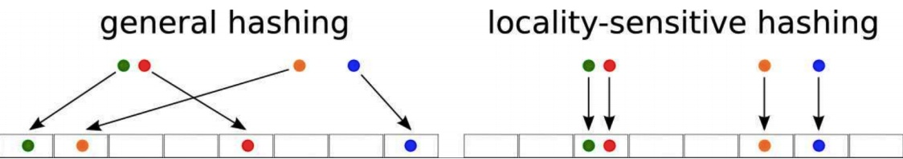
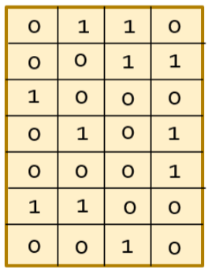
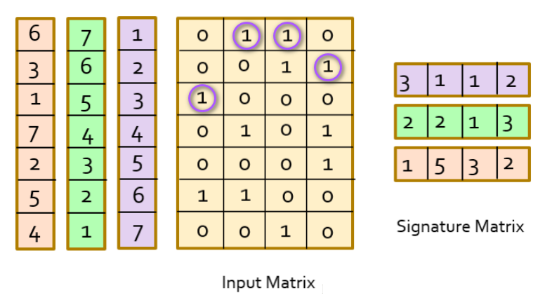
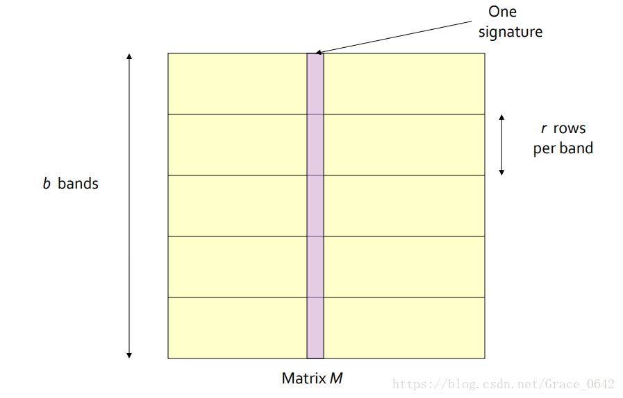
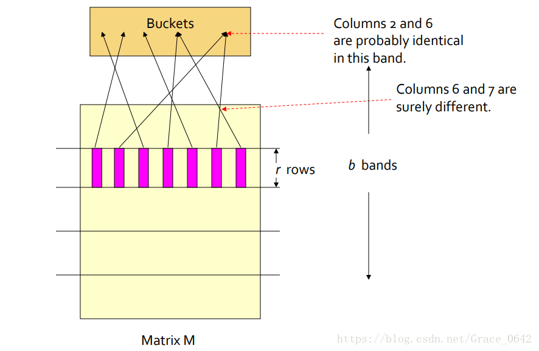
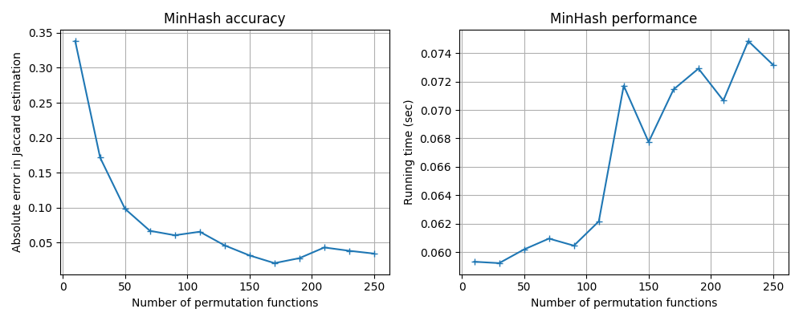
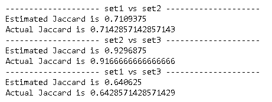
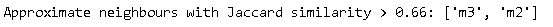
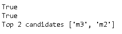

本文主要局部敏感哈希(Locality-Sensitive Hashing, LSH) 的两种实现：MinHash和。

局部敏感哈希是一种解决在海量的高维数据集中查找与查询数据点（query data point）近似最相邻的某个或某些数据点的方法。它的基本思想是：将原始数据空间中的两个相邻数据点通过相同的映射或投影变换（projection）后，这两个数据点在新的数据空间中仍然相邻的概率很大，而不相邻的数据点被映射到同一个桶的概率很小。能够使得原本相邻的两个数据点经过hash变换后会落入相同的桶内的哈希函数需要满足以下两个条件：

- 如果$d(O_1, O_2) < r1$，那么$Pr[h(O_1) = h(O_2)] \geq p_1$
- 如果$d(O_1, O_2) > r1$，那么$Pr[h(O_1) = h(O_2)] \leq p_2$

其中，$O_1, O_2 \in S$表示两个具有多维属性的数据对象，$d(O_1, O_2)$为2个对象的相异程度（距离）。

介绍了基本理论，首先来看MinHash。

## MinHash

Minhash 最开始提出是为了解决搜索引擎中网页库的查重问题，即看两个网页内容是否相似。下面也将用这个例子来解释MinHash。

Minhash 使用 [Jaccard相似度](https://en.wikipedia.org/wiki/Jaccard_index)来度量两个集合的相似度.
$$
J(A, B)=\frac{|A \cap B|}{|A \cup B|} 
\tag 1
$$

Minhash主要解决了如下几个问题：

- 使用最小签名（Min Signature）和哈希（hashing）处理高维。

  词库里面有成千上万的词汇，而且如果采用n-gram，词汇量将会再增加几个数量级，也就说网页的维度可能达到百万，甚至更高。

- 采用Buckets处理超多集合之间的相似度比较。

  搜索引擎需要不到一秒的时间比较亿万个网页，这的确是很大的挑战。

### Min Signature

假设输入的网页数据如下，其中行是词汇，列是网页。1表示词汇在网页中出现，0表示词汇在网页中没有出现。

显然，上面这个矩阵，行是百万级别以上的，列是亿万级别的，要计算相似度，计算量巨大。下面来看看最小签名（Min Signature ）如何减少行的数量。

- 对所有的行进行随机排序。

  下图左边三列是三个不同的排序，第三列是正序，第二列是逆序，第一列是随机排序。

  

- 根据排序对行进行重新排列，然后对于每一列记下第一个为1的（重新排列后的）行号

  上图中间的四个紫色圈圈，是根据左边第三列的排序，各列分别获取第一个为1的行号，得到的数据是$\begin{bmatrix} 3 & 1 & 1 & 2 \end{bmatrix}$，称之为最小签名。根据不同的排序，我们可以得到上图右边的矩阵，称之为签名矩阵（Signature Matrix）。

如果我们采用100次随机排序，便可以得到100行的签名矩阵。从百万级别降到100，再来计算相似度，就轻而易举了。下面来解释其中的数学依据。

设$A^{'},B^{'}$分别$A, B$两个网页签名后的向量，根据 Jaccard相似度（见公式$(1)$），可得。
$$
J(A^{'}, B^{'})=\frac{|A^{'} \cap B^{'}|}{|A^{'} \cup B^{'}|}
$$
可知。

- 从$A^{'},B^{'}$角度看，从$A^{'},B^{'}$随机抽取一行，相等的概率是$J(A^{'}, B^{'})$。
- 从$A, B$角度来看，从中随机抽取一行，值都为1的概率是$J(A, B)$。

以上两个概率，都是签名矩阵行相同的结果，也就是说，它们是一回事，即。
$$
J(A^{'}, B^{'}) = J(A, B)
$$

### Hashing

上面的Min Signature的计算中，需要对行进行重新排序，如果行的数量达到百万，甚至千万以上，这个工作无疑也非常耗时。采用Hashing的技巧，可以简化这个过程。

设输入矩阵是$P$，签名矩阵是$S$。其中$P$的示例如下。

| $r$  | page1 | page2 | page3 | page4 |
| :--: | :---: | :---: | :---: | :---: |
|  1   |   1   |   0   |   0   |   1   |
|  2   |   0   |   1   |   1   |   0   |
|  3   |   0   |   1   |   0   |   1   |
|  4   |   0   |   0   |   1   |   0   |
|  5   |   1   |   0   |   1   |   1   |

执行如下步骤。

1. 把$S$的全部成员初始化为$\infin$。签名矩阵的行是$n$。相当于要做n次重新排序。$S_{ij}$表示其第$i$行，$j$列的值。

   |       |  page1   |  page2   |  page3   |  page4   |
   | :---: | :------: | :------: | :------: | :------: |
   | $h_1$ | $\infin$ | $\infin$ | $\infin$ | $\infin$ |
   | $h_2$ | $\infin$ | $\infin$ | $\infin$ | $\infin$ |

2. 选用$n$个哈希函数$h_1, h_2, \cdots , h_n $。n次重新排序可以用$n$个哈希函数$h_1, h_2, \cdots , h_n $来替代。比如

   - $h_1(x)= ({x+1} \mod  5) + 1$
   - $h_2(x)= ({3x+1} \mod 5) + 1$ 

3. 获取一个随机行号$r$，并计算对应哈希值$h_1(r), h_2(r), \cdots , h_n(r) $，这样相当于得到了该行重新排序后的行号了。

   | $r$  | page1 | page2 | page3 | page4 | $h_1$ | $h_2$ |
   | :--: | :---: | :---: | :---: | :---: | :---: | :---: |
   |  4   |   0   |   0   |   1   |   0   |   1   |   4   |

4. 更新$S$。观察上面各列（page1到page4）的值，把$h_1, h_2$的值更新到$S$。规则如下。
   $$
   S_{ij} = \begin{equation}  
   \left\{  
   \begin{array}{lcl}  
    h_i(r)        &  & if\ S_{ij}>h_i(r)  \ \& \ P_{rj}=1 \\  
    S_{ij} &  & others
   \end{array}  
   \right.
   \end{equation}
   $$
   其中$P_{rj}$表示输入矩阵第$r$行，第$j$列的值。结果如下。

   |       |  page1   |  page2   | page3 |  page4   |
   | :---: | :------: | :------: | :---: | :------: |
   | $h_1$ | $\infin$ | $\infin$ |   1   | $\infin$ |
   | $h_2$ | $\infin$ | $\infin$ |   4   | $\infin$ |

5. 回到第3步，循环往复，直到所有的行都执行完毕。这样就得到了签名矩阵。

下面再演示一轮第3步到第4步的结果。

- 第3步，$r=2$

  | $r$  | page1 | page2 | page3 | page4 | $h_1$ | $h_2$ |
  | :--: | :---: | :---: | :---: | :---: | :---: | :---: |
  |  2   |   0   |   1   |   1   |   0   |   4   |   3   |

- 第4步，更新更新$S$

  |       |  page1   | page2 | page3 |  page4   |
  | :---: | :------: | :---: | :---: | :------: |
  | $h_1$ | $\infin$ |   4   |   1   | $\infin$ |
  | $h_2$ | $\infin$ |   3   |   3   | $\infin$ |

  对于page2，用$h_1$，$h_2$直接替换了，对于page3，只有$h_2$的值更新了。

### MinHash LSH

采用最小签名和哈希函数，减少了行数，对数据进行了降维操作。下面我们来看，如何处理超多集合之间的相似度比较。

对于亿万的网页，我们需要有一种方法，它能够让我们只比较那些相似度可能会很高的网页，而直接忽略过那些相似度很低的网页。具体步骤如下：

1. 把对签名矩阵进行划分，分成$b$个行条（band），每个band有$r$行组成。

   

   每一列可以看成对于一个样本的签名，就是上图中的粉红色的条形的部分，这一列又被分成了$b$个band，每个band中都有$r$行。

2. 对于每一个band，使用一个哈希函数，对于每一列计算Hash值，然后把这些值，映射到长度为$k$（k要设置的尽量的大一些。这样子是为了减少碰撞的发生。）的bucket里面。

   

   如上图说示，相似的样本被映射到了同一个bucket里面。每一个band里面都有$k$个这样的bucket，当用户在进行相似度计算时，先在bucket里面搜寻相似的样本，这样得到的样本数量从亿万可以讲到百千这个级别，然后在这个级别再进行相似度计算，就很快乐。

> 关于Bucket和Band中的数学原理，参见后面参考的文档。

### MinHash实践

下面通过datasketch包里的MinHash, MinHashLSH, MinHashLSHForest来进行实际操作，加深理解。

#### [MinHash](http://ekzhu.com/datasketch/minhash.html)

MinHash最重要的参数是num_perm，它表示随机重新排列哈希函数的个数，当num_perm越大，数据越准确，但性能越差。

实际代码如下：

~~~python
from datasketch import MinHash, MinHashLSH, MinHashLSHForest

def get_actual_jaccard(set1, set2):
    return len(set1.intersection(set2))/len(set1.union(set2))   

def get_minhash(set_, num_perm=128):
    m = MinHash(num_perm=num_perm)
    for d in set_:
        m.update(d.encode('utf8'))  
    return m

def compare_jaccard(set1, set2, num_perm=128):    
    m1 = get_minhash(set_=set1, num_perm=num_perm)
    m2 = get_minhash(set_=set2, num_perm=num_perm)    
        
    print("Estimated Jaccard is", m1.jaccard(m2)) 
    print("Actual Jaccard is", get_actual_jaccard(set1, set2))
        
set1 = set(['minhash', 'is', 'a', 'probabilistic', 'data', 'structure', 'for',
            'estimating', 'the', 'similarity', 'between', 'datasets'])
set3 = set(['minhash', 'is', 'probability', 'data', 'structure', 'for',
            'estimating', 'the', 'similarity', 'between', 'documents'])
set2 = set(['minhash', 'is', 'a', 'probability', 'data', 'structure', 'for',
            'estimating', 'the', 'similarity', 'between', 'documents'])

print('-'*20, 'set1 vs set2', '-'*20)
compare_jaccard(set1, set2)
print('-'*20, 'set2 vs set3', '-'*20)
compare_jaccard(set2, set3)
print('-'*20, 'set1 vs set3', '-'*20)
compare_jaccard(set1, set3)

~~~

#### [MinHash LSH](http://ekzhu.com/datasketch/lsh.html)

MinHash LSH可以查询相似度大于threshold的样本。

~~~python
num_perm = 128
threshold = 0.66
m1 = get_minhash(set_=set1, num_perm=num_perm)
m2 = get_minhash(set_=set2, num_perm=num_perm)  
m3 = get_minhash(set_=set3, num_perm=num_perm)

# Create LSH index
lsh = MinHashLSH(threshold=threshold, num_perm=num_perm)
lsh.insert("m2", m2)
lsh.insert("m3", m3)
result = lsh.query(m1)
print('Approximate neighbours with Jaccard similarity > {}: {}'.format(threshold, result))
~~~

需要注意的是上面的内容未排序。

#### [MinHash LSH Forest](http://ekzhu.com/datasketch/lshforest.html)

和MinHash LSH不同，MinHash LSH Forest返回Top n个样本。

~~~python
# Create a MinHash LSH Forest with the same num_perm parameter
forest = MinHashLSHForest(num_perm=num_perm)

# Add m2 and m3 into the index
forest.add("m2", m2)
forest.add("m3", m3)

# IMPORTANT: must call index() otherwise the keys won't be searchable
forest.index()

# Check for membership using the key
print("m2" in forest)
print("m3" in forest)

# Using m1 as the query, retrieve top 2 keys that have the higest Jaccard
result = forest.query(m1, 2)
print("Top 2 candidates", result)

result = forest.query(m1, 1)
print("Top 2 candidates", result)
~~~

## 参考

- [从NLP任务中文本向量的降维问题，引出LSH（Locality Sensitive Hash 局部敏感哈希）算法及其思想的…](https://flashgene.com/archives/43580.html)

- [局部敏感哈希 - MinHash](https://ansvver.github.io/lsh_minhash.html)

- [局部敏感哈希（Locality-Sensitive Hashing，LSH）](http://blog.rexking6.top/2018/10/09/%E5%B1%80%E9%83%A8%E6%95%8F%E6%84%9F%E5%93%88%E5%B8%8C-Locality-Sensitive-Hashing-LSH/)

- [MinHash](http://ekzhu.com/datasketch/minhash.html)

  

