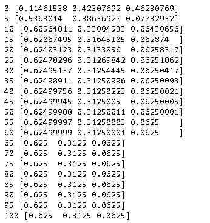
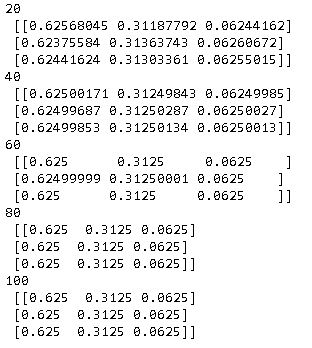
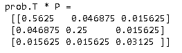
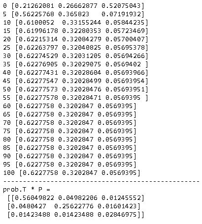

马尔可夫链（Markov chain），又称离散时间马尔可夫链，因俄国数学家安德烈·马尔可夫得名。马尔可夫链是状态空间中经过从一个状态到另一个状态的转换的随机过程。该过程要求具备”无记忆“的性质，即下一状态的概率分布只能由当前状态决定，在时间序列中它前面的事件均与之无关。

举个形象的比喻，假如每天的天气是一个状态的话，那个今天是不是晴天只依赖于昨天的天气，而和前天的天气没有任何关系。当然这么说可能有些武断（在大数据情况下，反而会比较稳定），但是这样做可以大大简化模型的复杂度。下面看看马尔可夫链数学定义。

## 定义

假设某个序列状态是$...x_{t-2}, x_{t-1}, x_{t}, x_{t+1},...$，那么在时刻$x_{t+1}$的状态的条件概率仅仅依赖于时刻$x_t$，即：
$$
P(x_{t+1} \vert \cdots , x_{t-2}, x_{t-1}, x_{t} ) = P(x_{t+1}  \vert  x_{t})
$$
既然某一时刻状态转移的概率只依赖于它的前一个状态，那么只要能求出系统中任意两个状态之间的转换概率，就可以确定马尔科夫链模型了。

比如，下图中表示了股市的模型，共有三种状态：牛市（Bull market）, 熊市（Bear market）和横盘（Stagnant market）。每一个状态都以一定的概率转化到下一个状态。比如，牛市以0.025的概率转化到横盘的状态。

这个状态概率转化图可以以矩阵的形式表示。这个矩阵称之为**转移矩阵**。
$$
P=\begin{bmatrix} 0.9&0.075&0.025 \\ 0.15&0.8& 0.05 \\ 0.25&0.25&0.5 \end{bmatrix}
$$

从状态$i$到状态$j$的概率可以用$P_{ij}$来表示，显然每一行的和都是$1$，即$\sum_{j} P_{ij} = 1$。

## 平稳分布

经过多次迭代，很多马尔科夫链都收敛到一个稳定的分布，而这个分布被称为**“平稳分布”**。

假设股市的初始状态的分布是$\pi_0$，然后按照上面的转移矩阵进行迭代演变，即
$$
\pi_0  P  P P \cdot \cdots
$$
这时我们可以发现，随着迭代的次数增加，最终的状态分布会收敛到一个固定的分布$\begin{bmatrix} 0.625 & 0.3125 &  0.0625\end{bmatrix} $，而且进一步，无论初始的状态分布如何，经过若干次的迭代，最终的分布都会收敛到这个分布。代码如下。

~~~python
import numpy as np

def markov_chain(P, steps=100):
    pi_0 = np.random.randint(1, 1000, 3)
    pi_0 = pi_0/np.sum(pi_0)        
    print(0, pi_0)
    
    prob = pi_0
    for i in range(steps):
        prob = prob @ P
        if (i+1) % 5==0: print(i+1, prob.ravel())  
    return pi_0, prob
    
P = np.array([[0.9,   0.075, 0.025],
              [0.15,  0.8,   0.05 ],
              [0.25,  0.25,  0.5  ]], dtype=float)

pi_0, pi = markov_chain(P)
~~~

这似乎有些神奇，这背后发生了什么呢？下面我们来计算$P^n$。

~~~python
prob = P
for i in range(100):
    prob = prob @ P
    if (i+1) % 20==0: print(i+1, '\n' , prob)
~~~

可以发现，当$n>60$以后，$P^n$的值将不再变化，每一行也正好是$\begin{bmatrix} 0.625 & 0.3125 &  0.0625\end{bmatrix} $，也就是最终的分布。

设最终的分布收敛到$\pi = \begin{bmatrix}\pi_1 & \pi_2 & \pi_3 & \cdots & \cdots \end{bmatrix}，\sum\limits_{i=1}^{\infty} \pi_i = 1$，则：
$$
\lim_{n \to \infty} P^n =
\begin{bmatrix} 
\pi  \\ 
\pi  \\ 
\pi \\ 
\vdots
\end{bmatrix}
$$
另设$\pi_0 = \begin{bmatrix} \pi_{01} &  \pi_{02} &  \pi_{03}   & \cdots \end{bmatrix}$，满足$\sum\limits_{i=1}^{\infty} \pi_{0i} = 1$，则：
$$
\begin{align}
\pi_0 \lim_{n \to \infty} P^n &= \begin{bmatrix} \pi_{01} &  \pi_{02} & \pi_{03} & \cdots \end{bmatrix} \begin{bmatrix} 
\pi  \\ 
\pi  \\ 
\pi \\ 
\vdots
\end{bmatrix}
\\ &= \pi_{01} \pi + \pi_{02} \pi + \pi_{03} \pi + \cdots
\\ &= \sum \pi_0 \pi
\\ &= \pi
\end{align}
$$
上面的推导证明了：对于股市状态的转移矩阵，无论初始的状态分布如何，经过若干次的迭代后，最终的分布都会收敛到一个固定分布。那么对于任意的转移矩阵，是否也会有这个性质呢？下面我们从结果来反推。

假设，对于某个转移矩阵，其经过多次迭代后收敛到了分布$\pi$，这时再迭代一次，分布肯定还是$\pi$，即：
$$
\pi P = \pi \tag 1
$$
把$P$的每一列看成一个向量，设$P = \begin{bmatrix} P_1 &  P_2 & \cdots & P_j & \cdots \end{bmatrix}$，则：
$$
\pi_j = \pi P_j \tag 2
$$

也即是说，要满足平稳性分布的要求，其充要条件是公式$(1)$或$(2)$。

> 按照书本上说法，对于绝大多数的转移矩阵，都会收敛到一个平稳分布，而周期性马尔可夫链是无法收敛的。但什么是周期性马尔可夫链呢？有没有实际的例子呢？

## 细致平稳条件

在实际的工作中，可以观察到时间很多时间序列，比如股市的涨跌，天气的变化，很明显，这些序列的前后状态是有关联性的。可以很容易统计各个状态的分布，然后根据马尔可夫链的假设，这个分布后面其实有一个隐藏的转移矩阵，但如何来计算出这个矩阵呢？要解答这个问题，需要先看看马尔科夫链的细致平稳条件。

如果非周期马尔科夫链的状态转移矩阵$P$和概率分布$\pi$对于所有的$i, j$满足：
$$
\pi_iP_{ij} = \pi_jP_{ji} \tag 3
$$
则称概率分布$\pi$是状态转移矩阵$P$的平稳分布。公式$(3)$称为马尔可夫链的细致平稳条件（Detailed Balance Condition）。

上面的公式有一点抽象，可以使用矩阵的方式来形象理解这个公式。

设
$$
\pi = \begin{bmatrix}\pi_1 \\ \pi_2  \\ \vdots \\ \pi_i \\ \vdots \\ \pi_j \\ \vdots \end{bmatrix}^T，P = \begin{bmatrix} P_1 \\  P_2 \\ \vdots \\  P_i \\ \vdots \\  P_j \\ \vdots \end{bmatrix}
$$

则：
$$
\begin{align}
\pi^T \circ  P 
&= 
\begin{bmatrix}
\pi_1P_1 \\ \pi_2P_2 \\ \vdots  \\ \pi_iP_i \\ \vdots  \\ \pi_jP_j \\ \vdots 
\end{bmatrix} 
\\   &= 
\begin{bmatrix}
\pi_1P_{11} & \pi_1P_{12} & \cdots & \cdots & \cdots  & \cdots & \cdots & \\
\pi_2P_{21} & \pi_2P_{22} & \cdots & \cdots & \cdots & \cdots & \cdots & \\
\vdots & \vdots & \ddots  & \cdots & \cdots & \cdots &  \cdots \\
\vdots & \vdots & \vdots &  \ddots & \cdots &  \pi_iP_{ij} &  \cdots \\
\vdots & \vdots & \vdots &  \vdots &  \ddots & \cdots  &  \cdots \\
\vdots & \vdots & \vdots & \vdots & \pi_jP_{ji} & \ddots  &  \cdots  \\
\vdots & \vdots & \vdots & \vdots & \vdots & \vdots  & \ddots 
\end{bmatrix} 
\end{align}
$$

> 上面公式中$\circ$表示哈达玛积，参见[Broadcasting](https://eipi10.cn/linear-algebra/2019/12/02/vector-and-matrix/#broadcasting)。

很明显，当$\pi^T \circ  P $是对称矩阵，满足公式$(3)$。这种条件下，$P$是平稳分布$\pi$的转移矩阵。证明如下。
$$
\begin{align}
\pi P 
&= sum(\pi^T \circ P,\  axis=0)
\\ &= 
\begin{bmatrix}
\sum_{i=1}^{\infin} \pi_iP_{i1} & 
\sum_{i=1}^{\infin} \pi_iP_{i2} & 
\cdots  & 
\sum_{i=1}^{\infin} \pi_iP_{ij} & 
\cdots   
\end{bmatrix} 
\\ &= 
\begin{bmatrix}
\sum_{i=1}^{\infin} \pi_1P_{1i} & 
\sum_{i=1}^{\infin} \pi_2P_{2i} & 
\cdots  & 
\sum_{i=1}^{\infin} \pi_jP_{ji} & 
\cdots   
\end{bmatrix} 
\\ &= 
\begin{bmatrix}
\pi_1\sum_{i=1}^{\infin} P_{1i} & 
\pi_2\sum_{i=1}^{\infin} P_{2i} & 
\cdots  & 
\pi_j\sum_{i=1}^{\infin} P_{ji} & 
\cdots   
\end{bmatrix} 
\\ &= 
\begin{bmatrix}
\pi_1 & 
\pi_2 & 
\cdots  & 
\pi_j & 
\cdots   
\end{bmatrix} 
\\ &= \pi
\end{align}
$$

下面我们来验证一下上文的股市转移矩阵，是否符合细致平稳条件。
$$
P=\begin{bmatrix} 0.9&0.075&0.025 \\ 0.15&0.8& 0.05 \\ 0.25&0.25&0.5 \end{bmatrix} \\
\pi =\begin{bmatrix} 0.625 & 0.3125 &  0.0625\end{bmatrix}
$$

~~~python
p = pi.reshape((3,1)) * P
print("prob.T * P =\n", p)
np.testing.assert_array_almost_equal(p, p.T)
~~~

可以看到$\pi^T \circ  P $是是对称矩阵，满足细致平稳条件。然而，**细致平稳条件只是马尔可夫链平稳分布的充分条件之一，它不是必要条件**。比如，当修改第一行的概率，这时$\pi^T \circ  P $不是对称矩阵了。代码如下。
$$
P=\begin{bmatrix} 0.9&0.08&0.02 \\ 0.15&0.8& 0.05 \\ 0.25&0.25&0.5 \end{bmatrix}
$$

~~~python
P = np.array([[0.9, 0.08, 0.02],
              [0.15, 0.8, 0.05],
              [0.25, 0.25, 0.5]], dtype=float)

pi_0, pi = markov_chain(P)

print('-'*50)
p = pi.reshape((3,1)) * P
print("prob.T * P =\n", p)
~~~

上面的结果验证了，细致平稳条件只是马尔可夫链平稳分布的充分条件之一。对于一个平稳分布，可以根据细致平稳条件来求解其转移矩阵，但是问题是如何找到一个矩阵满足细致平稳条件呢？

答案是MCMC采样可以来解决，本文将不再描述，详见[MCMC采样](mcmc.md) 。

>对于一个平稳分布，其对应转移矩阵式是唯一的吗？

## 基于马尔科夫链采样

假设我们知道某一个平稳分布的转移矩阵，很容易构建样本集。步骤如下

1. 初始化：随机生成一个初始概率分布$\pi_0$，然后根据$\pi_0$，使用多项式分布采样生成第一个样本（也就是状态）$x_0$。并设$t=0$
2. 迭代过程。
   1. 根据转移矩阵中的$P(x|x_t)$，再生成下一个样本$x_{t+1}$。
   2. $t=t+1$

> 上文，股市的系统状态是只有三个值，也就是说是离散的，其实，也可以这个状态也可以是连续值，也就说，这个初始概率相当于一个概率密度分布（PDF），转移矩阵相当于，从某一个样本到另外一个样本转移的概率，如果是连续的，这个矩阵就是无限维的。

## 参考

- [马尔可夫链](https://zh.wikipedia.org/wiki/%E9%A9%AC%E5%B0%94%E5%8F%AF%E5%A4%AB%E9%93%BE)
- [MCMC(二)马尔科夫链](https://www.cnblogs.com/pinard/p/6632399.html)
- [MCMC(三)MCMC采样和M-H采样](https://www.cnblogs.com/pinard/p/6638955.html)