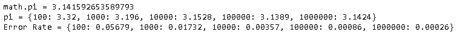
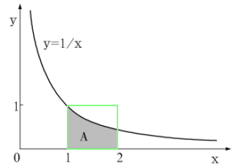
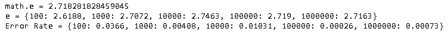
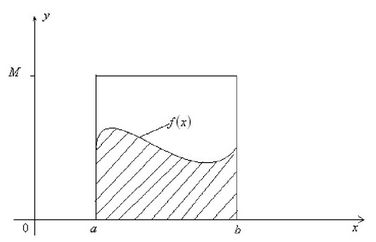

[蒙特卡罗方法（Monte Carlo Methods）](https://zh.wikipedia.org/wiki/%E8%92%99%E5%9C%B0%E5%8D%A1%E7%BE%85%E6%96%B9%E6%B3%95)是一种模拟计算方法。原理是通过大量随机样本，去了解一个系统，进而估算所要计算的值。它诞生于上个世纪40年代美国的"曼哈顿计划"，科学家[斯塔尼斯拉夫·乌拉姆](https://zh.wikipedia.org/wiki/斯塔尼斯拉夫·乌拉姆)、[约翰·冯·诺伊曼](https://zh.wikipedia.org/wiki/冯·诺伊曼)和[尼古拉斯·梅特罗波利斯](https://zh.wikipedia.org/wiki/尼古拉斯·梅特罗波利斯)发明了它。它的名字来源于乌拉姆的叔叔经常在[摩纳哥](https://zh.wikipedia.org/wiki/摩納哥)的[蒙特卡洛](https://zh.wikipedia.org/wiki/蒙特卡洛)赌场输钱。蒙特卡罗方法以概率为基础的方法，而赌场赢钱，同样需要计算概率，故此这个名字被大家广泛接受。

在生活中，有很多事情很难精确评估。比如：如何统计一个瓶子里面装了多少颗糖，或者你的头上有多少根头发。如果要一一穷举（即一个一个数），需要的时间太长，但我们可以采用采样的方法来进行估计，统计学已经证明，采样的数量越大，估计值越接近实际值。蒙特卡罗方法也是源于这样的思路，下面我们来逐步介绍。

### 通俗理解

下面通过几个例子来通俗理解蒙特卡罗方法。

#### 计算圆周率$\pi$

下面正方形内部有一个相切的圆，则圆和正方形的面积之比是$\frac \pi 4$。

现在，在这个正方形内部，随机产生10000个点（即10000个坐标对$ (x, y)$），计算它们与中心点的距离，从而判断是否落在圆的内部。如果这些点均匀分布，那么圆内的点应该占到所有点的 $\frac \pi 4$，因此将这个比值乘以4，就是$\pi$的值。

代码如下：

~~~python
import math
import random
from pprint import pprint

random.seed(10)

def random_circle():
    x = random.random()-0.5
    y = random.random()-0.5
    return x, y

def in_circle(xy):
    x, y = xy
    distance = math.sqrt(x**2 + y**2)
    return True if distance <= 0.5 else False
    
def monte_carlo(n, random_fun, limit_fun):
    m = 0
    for i in range(n):
        sim = random_fun()
        in_limit = limit_fun(sim)
        if in_limit:
            m += 1
    return m  
    
pi_simulates = [100, 1000, 10000, 100000, 1000000]
pi = {n:round(4*monte_carlo(n, random_fun=random_circle, limit_fun=in_circle)/n,4)  for n in pi_simulates}

print("math.pi =", math.pi)
print("pi =", pi)
print("Error Rate =", { key:round(abs(value - math.pi)/math.pi,5) for key, value in pi.items()})
~~~

从上面的结果，可以看到，当模拟10000次，误差率是$0.357\% $，模拟次数越多，误差率越小。

#### 计算自然常数$e$

上面的方法加以推广，就可以计算任意一个积分的值。下面的例子是计算自然常数$e$。

上图中，A区域的面积是：
$$
S = \int_1^2 \frac 1 x dx = \ln2 - \ln1 = ln2
$$
采用蒙特卡洛方法，图中绿色正方形区域在随机生成$n$个点，假设其中$m$个位于曲线下方，则A区域面积是：
$$
S = \frac m n
$$
而$e$的公式是：
$$
\begin{align}
\frac m n &= \ln 2 \\
e^{\frac m n} &= 2 \\
e &= 2^{\frac  n m}
\end{align}
$$
代码如下：

~~~python
def random_square():
    x = random.random()+1
    y = random.random()
    return x, y

def in_square(xy):
    x, y = xy
    return True if y <= 1/x else False

e_simulates = [100, 1000, 10000, 100000, 1000000]
e = {n:round(2**(n/monte_carlo(n, random_fun=random_square, limit_fun=in_square)),4)  for n in e_simulates}

print("math.e =", math.e)
print("e =", e)
print("Error Rate =", { key:round(abs(value - math.e)/math.e,5) for key, value in e.items()})
~~~

更多的例子参见[蒙特卡罗方法入门](http://www.ruanyifeng.com/blog/2015/07/monte-carlo-method.html)。

### [蒙特卡罗积分（Monte Carlo Integration）](https://en.wikipedia.org/wiki/Monte_Carlo_integration)

如何求解$f(x)$曲线在$[a, b]$区间的面积呢？显然，这个面积可以用定积分表达：
$$
F = \int_D  f(x)dx
$$
当$f(x)$非常复杂，我们无法求解出其原函数，那如何来计算上诉的积分呢？答案是可以用*蒙特卡罗积分*来模拟求解出近似值。
$$
F^{N} = \frac {1}{N}\sum _{i=1}^{N}\frac {f(X_{i})}{ p(X_{i}) }
$$
当$N \to +\infin$，可以认为：
$$
\begin{equation} \int_D {f(x){\rm{d}}x}  = \mathop {\lim }\limits_{N \to \infty } \frac{1}{N}\sum\limits_{i = 1}^N {\frac{{f(X_i )}}{{p(X_i )}}}  \end{equation}
$$
借用http://www.scratchapixel.com/的一个很好的例子来说明：

## 参考

- [蒙特卡罗方法入门](http://www.ruanyifeng.com/blog/2015/07/monte-carlo-method.html)

- [蒙特·卡罗方法（Monte Carlo method）](https://houbb.github.io/2020/01/28/math-03-monte-carlo-method)

- [蒙特·卡罗(Monte Carlo)积分详解](https://www.qiujiawei.com/monte-carlo/)

- [MCMC随机采样](https://zhuanlan.zhihu.com/p/30003899)

- [Mathematical Foundations of Monte Carlo Methods](https://www.scratchapixel.com/lessons/mathematics-physics-for-computer-graphics/monte-carlo-methods-mathematical-foundations)

  

作为一种随机采样方法，马尔科夫链蒙特卡罗（Markov Chain Monte Carlo，以下简称MCMC）在机器学习,深度学习以及自然语言处理等领域都有广泛的应用，是很多复杂算法求解的基础。
