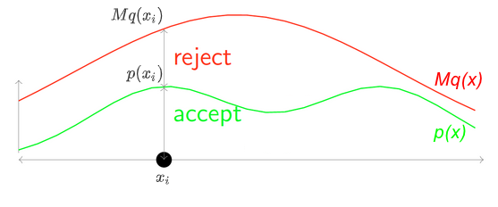
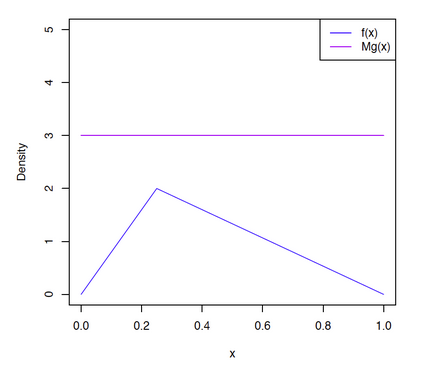
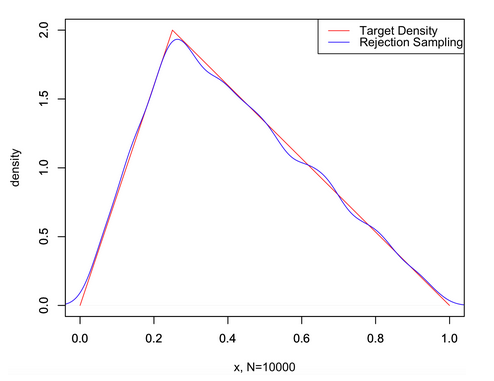

逆变换采样（Inverse Transform Sampling）可以得到符合指定分布的样本，但它的缺点也很明显的，那就是必须知道 CDF 及其 反函数。当我们在只知道概率密度函数（PDF），而其CDF 或其反函数无法计算得到时，我们可能需要用到其它的采样方法，比如——[拒绝采样]()（Rejection Sampling）。 

## 基本思想

假设我们想对 PDF 为$p(x)$的函数进行采样，但是由于种种原因（例如这个函数很复杂），对其进行采样是相对困难的。 但是另外一个 PDF 为$q(x)$的函数则相对容易采样。那么，当我们将$q(x)$与一个常数$M$相乘之后，可以实现下图所示之关系，即红色的 $Mq(x)$将绿色的$p(x)$完全“罩住”。

然后重复如下步骤，直到获得$m$个被接受的采样点。

1. 从$q(x)$中获得一个随机采样点$x_i$

2. 对于$x_i$计算接受概率（acceptance probability） 
   $$
   \alpha = \frac {p(xi)} {Mq(x_i)}
   $$

3. 从 Uniform(0,1) 中随机生成一个值，用$u$表示

4. 如果$\alpha \geq  u $，则接受$x_i$作为一个来自$p(x)$的采样值，否则就拒绝$x_i$并回到第一步

从上面的步骤可以看出，拒绝分布的难点在于是否能找到一个合适的$M q(x)$，如果$Mq(x)$距离$p(x)$总是非常远，$\alpha$将非常小，则$x_i$被接受的概率很低，这样将照成采样的效率很低。

> 感觉拒绝采样的确思路很好啊，适用情况比逆变换采样更加广泛，蒙特卡洛方法的思想的确很神奇啊。

## 证明

下面来证明，拒绝抽样的得到的采样点就是符合 $p(x)$的分布的。

参见 [R——概率统计与模拟（四）拒绝抽样](https://zhuanlan.zhihu.com/p/90672524)

## 代码

假设现在我们希望从下面这个PDF中抽样：
$$
f(x)=\begin{cases}
8x&, if\ 0\leq x<0.25\\
\displaystyle \frac{8}{3}-\frac{8}{3}x&, if\ 0.25\leq x\leq 1\\
0&,otherwise
\end{cases}
$$
下面图所示，$q(x)$我们选择的是均匀分布 （可以选择其他的分布，但采用均匀分布是最简单的处理方式）。而且令常数$M=3$。

~~~python
代码如下
~~~

## 参考

- [蒙特卡洛采样之拒绝采样（Reject Sampling）](http://www.twistedwg.com/2018/05/30/MC-reject-sampling.html)： 有例子，讲的很清楚。
- [拒绝采样（reject sampling)的简单认识](https://gaolei786.github.io/statistics/reject.html)
- [R——概率统计与模拟（四）拒绝抽样](https://zhuanlan.zhihu.com/p/90672524)：有证明
- [机器学习中的Monte Carlo](https://applenob.github.io/machine_learning/MCMC/)

