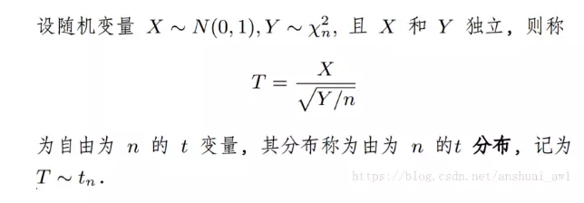
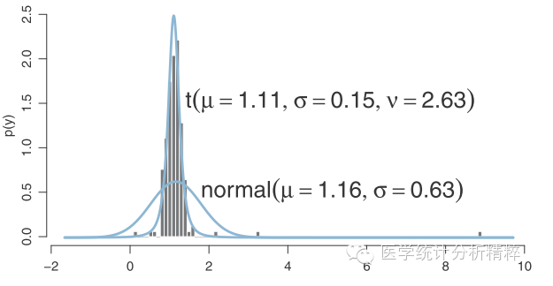

##  T分布：温良宽厚

数学定义如下：

“t”，是伟大的Fisher为之取的名字。Fisher最早将这一分布命名为“Student's distribution”，并以“t”为之标记。

而Student，则是William Sealy Gosset（戈塞特）的笔名。他当年在爱尔兰都柏林的一家酒厂工作，设计了一种后来被称为t检验的方法来评价酒的质量。因为行业机密，酒厂不允许他的工作内容外泄，所以当他后来将其发表到至今仍十分著名的一本杂志《Biometrika》时，就署了student的笔名。所以现在很多人知道student，知道t，却不知道Gosset。

我们平常说的t分布，都是指小样本的分布。但其实正态分布，可以算作t分布的特例。也就是说，t分布，在大小样本中都是通用的。

> 之前有读者问过：“是不是样本量大于30或者大于50，就不能用t分布了呀”？
>
> 完全不是这样的！t分布，大小通吃！具体且看下文分解。

相对于正态分布，t分布额外多了一个参数，自由度。自由度 $v= n - 1$。我们先看几个例子，主观感受一下t分布。

- $v=1$ ：红色为t分布；蓝色为正态分布

  

- $v=2$ ：红色$v=2$，高于的$v=1$的绿色，低于正态分布。

  

- $v=3$ ：红色 $v=3$，高于$v=1, 2$的绿色，低于正态分布。

  

- $v=10$ ：红色 $v=10$，高于$v=1,2,3, \cdots, 9$的绿色，低于正态分布。

  

可见，随着样本量n，即自由度$v$的增加，t分布越来越接近正态分布。正态分布，可以看做只是t分布的一个特例而已。

大家仔细比较一下下图。t分布（红色）虽然也是钟型曲线，但是中间较低、两侧尾巴却很高。

这就是t分布的优势！这个特征相当重要，百年来，t分布就指着这个特征活着的！

比较一下上图两条曲线，我用这样一个词，“宽厚”，来形容t分布曲线的特征。是不是比正态分布曲线更**宽**啊？是不是比正态分布曲线更**厚**呢？

大家都说重要的事要重复三遍，我们再重复一下，样本量越小（自由度越小），t分布的尾部越高（中部越低，约宽厚）。

我们来比较一下下图中的两条曲线。这两条曲线同样都是对图中底部6个黑色点（数值）进行分布拟合。

我们首先看一下那条矮的、正态分布的曲线。我们前面说过，正态分布的曲线不具备“宽厚”的特征。它的尾部很低，尾部与横轴之间高度很“狭窄”。也就是说，正态分布不能够容忍它长长的尾部出现大概率的事件（图中横轴值为15处一圆点出现概率为六分之一），所以正态分布就很无奈地，将这一点纳入它的胸膛而非留在尾部。于是乎，**恶果**就出现了：图中**正态分布的均数，远远偏离了大多数点所在的位置，标准差也极大**。总之，与我们所期待的很不一致。

再看一下那条高高的t分布曲线。我们前面说过了，t分布“**温良宽厚**”，它的尾巴很高（本图中不明显，参见上面自由度为1,2,3时所对应的图片），高高的长尾让它有“**容人的雅量**”。所以，这条t分布的曲线，很好的捕捉到了数据点的集中趋势（横坐标：0附近）和离散趋势（标准差：只是那条正态分布曲线标准差的四分之一）。

这也是T分布盛行的原因，即T分布被广泛应用于**小样本**假设检验的原因。虽然是很小的样本，但是，却强大到可以**轻松的排除异常值的干扰，准确把握住数据的特征**（集中趋势和离散趋势）！

准确捕捉变量的集中趋势和离散趋势在统计中有极为重要的意义，几句话难以说清，简单举几个栗子：

1. 研究样本量的估计量更小。熟悉样本量计算的朋友也知道，标准差是样本量计算的一个重要参数。上例中，我们t分布的标准差只是正态分布的四分之一，那么我们计算所需的样本量也会极大的减少（只需原来的16分之一），极大地降低研究经费和工作量！（关注“医学统计分析精粹”，回复关键词“样本量”，可以看到很handy的样本量计算工具哦！）
2. 我们缩小了标准差，熟悉假设检验（将在后续“看图说话”系列文章中出现）的朋友也不难看出，如此，我们更容易得到一个有意义的P值！
3. 点估计更准确。如果我们需要根据一个小样本数据来估计学生的平均身高。那么使用正态分布来拟合，很容易就受到离群异常值的影响而得到错误的估计。
4. 回归中应用t分布，可以得到更稳健的估计量（β值或OR值），这也是我们实现“稳健回归”的一个重要手段。

通过下面一幅图，我们巩固一下t分布的“**宽厚**”：

与正态分布曲线（矮胖）比较，t分布以其高高的尾部（本图中不明显，参见上面自由度为1,2,3时所对应的图片），容忍了在横轴为9处的异常值，得到了更稳健的集中趋势估计值（均值1.11）和更紧凑的离散趋势估计值（标准差差0.15，又是正态分布的四分之一）。要知道，我们如果单单想通过增加样本量来将标准误（假设检验中使用的参数，标准差除以自由度的平方根）缩减到四分之一，需要16倍的样本量！可见，t分布当真是威力无穷！

PS：上述两幅图中的t分布曲线并不是频率学派应用t分布的常规套路（更像是贝叶斯学派的用法）。细心者可以发现，我们使用的t分布的自由度明显低于n - 1的自由度计算方法。这里的自由度是根据最大似然法估计出来的，用以更恰当地拟合数据的分布。虽然这与我们平时的用法不同，但小编觉得，这一点点不同不仅无伤大雅，反而更有利于大家深入理解t分布的特征——**温良宽厚**。

## 卡方分布的应用

若n个相互独立的随机变量ξ₁、ξ₂、……、ξn ，均服从标准正态分布（也称独立同分布于标准正态分布），则这n个服从标准正态分布的随机变量的平方和
$$
Q=\sum_{i=1}^{n}ξ_i^2
$$
构成一新的随机变量，其卡方分布规律称为x^2,分布（chi-square distribution），其中参数n称为自由度，正如正态分布中均值或方差不同就是另一个x2x2正态分布一样，自由度不同就是另一个分布。记为 Q~x^2(k). 卡方分布是由正态分布构造而成的一个新的分布，当自由度n很大时，X^2分布近似为正态分布。 对于任意正整数k， 自由度为 k的卡方分布是一个随机变量X的机率分布。

### 4 问题描述：抽奖机之谜？

#### 问题一：卡方检验拟合优度案例

下面是某台抽奖机的期望分布，其中X代表每局游戏的净收益（每局独立事件）：

  
实际中人们收益的频数为：
  
在5%的显著性水平下，看看能否有足够证据证明判定抽奖机被人动了手脚。

> 1、算出每个x值的实际频率与根据概率分布得出的期望频率进行比较？
> 2、利用抽奖机的观察频率和期望频率表计算检验统计量？
> 3、要检验的原假设是什么？备择假设是什么？
> 4、自由度为4且5%水平的拒绝域是多少？
> 5、检验统计量是多少？
> 6、检验统计量是在拒绝域以内还是拒绝域以外？
> 7、你将接受还是拒绝原假设？

#### 问题二：卡方检验独立性案例

下表显示各位庄家的观察频数，
      
以1%的显著性水平进行假设检验，看看赌局结果是否独立于坐庄庄家。

> 1、你是任务是算出所有期望频数。
> 2、根据上面所求期望频数，计算检验统计量X^2.
> 3、确定要进行检验的假设以及备择假设。
> 4、求出期望频率和自由度？
> 5、确定用于做决策的拒绝域。
> 6、计算检验统计量X^2
> 7、看看检验统计量是否位于拒绝域内。
> 8、作出决策。

## F分布

## 参考

- [t分布, 卡方x分布，F分布](https://www.cnblogs.com/think-and-do/p/6509239.html)
- [卡方分布的应用](http://www.cnblogs.com/baiboy/p/tjx11.html)