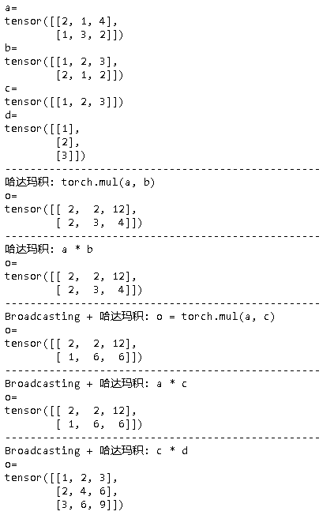
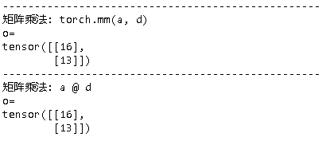
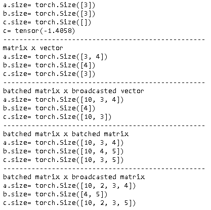

## 张量乘法

### 哈达玛积

~~~python
torch.mul(input, other, out=None)
~~~

参见[torch.mul](https://pytorch.org/docs/stable/generated/torch.mul.html?highlight=mul#torch.mul)。

~~~python
import torch

a = torch.tensor([[2, 1, 4],[1, 3, 2]])
b = torch.tensor([[1, 2, 3],[2, 1, 2]])
c = torch.tensor([[1, 2, 3]])
d = torch.tensor([[1], [2], [3]])

print("a=\n{}".format(a))
print("b=\n{}".format(b))
print("c=\n{}".format(c))
print("d=\n{}".format(d))

print("-"*50+"\n哈达玛积: torch.mul(a, b)")
o = torch.mul(a, b)
print("o=\n{}".format(o))

print("-"*50+"\n哈达玛积: a * b")
o = a * b
print("o=\n{}".format(o))

print("-"*50+"\nBroadcasting + 哈达玛积: o = torch.mul(a, c)")
o = torch.mul(a, c)
print("o=\n{}".format(o))

print("-"*50+"\nBroadcasting + 哈达玛积: a * c")
o = a * c
print("o=\n{}".format(o))
~~~

## 矩阵乘法

当矩阵是二维矩阵的时候，调用如下方法。

~~~
torch.mm(input, mat2, out=None)
~~~

当`input` 是 $n \times m$ tensor, `mat2`是$m \times p$ tensor, `out` 是$n \times p$ tensor。参见[torch.mm](https://pytorch.org/docs/stable/generated/torch.mm.html?highlight=mm#torch.mm)。

~~~python
print("-"*50+"\n矩阵乘法: torch.mm(a, d)")
o = torch.mm(a, d)
print("o=\n{}".format(o))

print("-"*50+"\n矩阵乘法: a @ d")
o = a @ d
print("o=\n{}".format(o))
~~~

### 张量乘法

~~~
torch.matmul(input, other, out=None)
~~~

参见[torch.matmul](https://pytorch.org/docs/stable/generated/torch.matmul.html?highlight=mul#torch.matmul)。

~~~python
# print("-"*50+"\n"+"vector x vector")
a = torch.randn(3)
b = torch.randn(3)
c = torch.matmul(a, b)
print("a.size=", a.size())
print("b.size=", b.size())
print("c.size=", c.size())
print("c=", c)

print("-"*50+"\n"+"matrix x vector")
a = torch.randn(3, 4)
b = torch.randn(4)
c = torch.matmul(a, b)
print("a.size=", a.size())
print("b.size=", b.size())
print("c.size=", c.size())

print("-"*50+"\n"+"batched matrix x broadcasted vector")
a = torch.randn(10, 3, 4)
b = torch.randn(4)
c = torch.matmul(a, b)
print("a.size=", a.size())
print("b.size=", b.size())
print("c.size=", c.size())

print("-"*50+"\n"+"batched matrix x batched matrix")
a = torch.randn(10, 3, 4)
b = torch.randn(10, 4, 5)
c = torch.matmul(a, b)
print("a.size=", a.size())
print("b.size=", b.size())
print("c.size=", c.size())

print("-"*50+"\n"+"batched matrix x broadcasted matrix")
a = torch.randn(10, 2, 3, 4)
b = torch.randn(4, 5)
c = torch.matmul(a, b)
print("a.size=", a.size())
print("b.size=", b.size())
print("c.size=", c.size())
~~~

