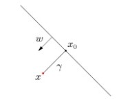

# 向量的内积（点乘）

两个向量的内积可以有多个意义。

1. 从物理上，可以理解为做功。

2.  

$$

 \frac {a} {\|a\|}， \frac {b} {\|b\|} 

$$

都是单位向量，  $cos(\theta ) = \frac {a} {\|a\|} \cdot \frac {b} {\|b \|}  $, 其中 $\theta $是两个向量的夹角。

3. $a \cdot \frac {b} {|b|} $ 表示a向量在 $b$单位向量上的投影长度。

4.  $a \cdot \frac {b} {|b|} * \frac {b} {|b|}   $ 表示a向量在 $b$单位向量上的投影向量。

5. $a \cdot b =  a \cdot \frac {b} {|b|} * |b| $  表示a向量在 $ \frac {b} {|b|} $上的投影长度再乘以$|b|$, 也就是做功的物理意义。

6. $w \cdot x = 0$，表示w和x是垂直的; $w \cdot x >0 $, 表示w和x的夹角小于90度; $w \cdot x < 0 $, 表示w和x的夹角大于90度。

7. $w \cdot x = 0$，还表示一个过原点的平面方程。对于空间上的任何一个点u：
   * 如果$w \cdot u > 0 $, 则点u在平面上方（w和u的夹角小于90度），反之在平面下方（w和u的夹角大于90度）。
   * $ \frac 1 {|w|} w \cdot  u  $, 可以表示成为点u到平面的距离。

   注： 平面上方和下方是以w的方向作为参照的，如果和w同向，就是上方，反之就是下方。

# 点到平面的距离

平面方程为:  $ w \cdot x + b = 0$

- 如果是二维空间，则表示是一个直线方程
- 如果是三维空间, 是一个平面. 如果大于3维空间，则是一个超平面。

空间任意一点$x$到平面的距离是:  

$$

\gamma = \frac 1 {|w|} (w \cdot x + b)

$$

- $ \gamma >0 $，表示$x$在平面上方
- $\gamma<0$，表示$x$在平面下方

## 公式推导一：

点$x_0 $是指点$ x $在超平面上的投影点.  

 $ x - x_0 = \gamma  \frac w {|w|}$

 $ w \cdot (x- x_0) = w \cdot \gamma  \frac w {|w|} $

 由于$ w \cdot x_0 + b = 0  $, 即 $ w \cdot x_0  = -b  $, 上面的公式可以变成

  $ \gamma = \frac 1 {|w|}(w \cdot x + b) $

## 公式推导二： 

对于平面方程$w \cdot x = 0$, 也就是说这个平面是过原点的， w是垂直于平面的向量，这时很容易推出

  $ \gamma = \frac 1 {|w|}(w \cdot x) $

然后对平面做一个坐标变化，把坐标原点变换到$x_1$

$$

x_1 = 
\begin{bmatrix} 
0 \\
0 \\
... \\
-b/w_i \\
0 \\
0
\end{bmatrix}

$$

新的平面方程变成

$$

w \cdot x^{'}

$$

其中 $x = x^{'}+ x_1 $

$ \gamma_x = \gamma_{x^{'}} = \frac 1 {|w|} w \cdot  x^{'} = \frac 1 {|w|} w \cdot  (x-x_1) = \frac 1 {|w|} (w \cdot x + b) $

# 公式推导三：

设$
x^{'} = 
\begin{bmatrix} 
1 \\
x
\end{bmatrix}
， 
w^{'} = 
\begin{bmatrix} 
b \\
w
\end{bmatrix}
$，则平面方程变成$w^{'}  \cdot x^{'}=0$

$$

 \gamma_{x^{'}} = \frac 1 {|w^{'}|} w^{'} \cdot x^{'} 

$$

略！