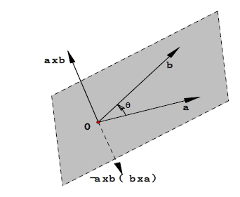
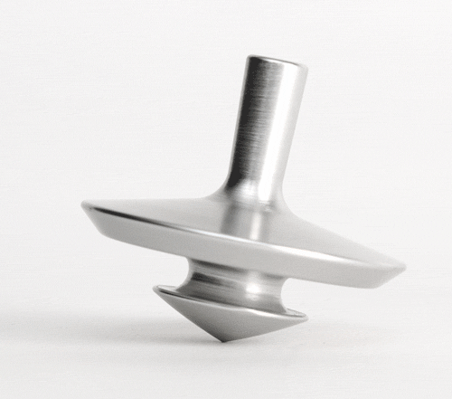

向量的外积（Cross Product）也译作叉积。内积的计算符号是一个点，所以也叫点积（Dot Product），而叉积计算符号是一个叉（$\times$），所以叫叉积。

## 定义

假设三维空间中的两个向量， $a = [a_x, a_y, a_z]^T$， $b = [b_x, b_y, b_z]^T$，则叉积定义如下：
$$
a \times b = [a_yb_z - a_zb_y, a_zb_x-a_xb_z, a_xb_y-a_yb_x]^T  \tag 1
$$

$$
a \times b = |a||b|\sin\theta N  \tag 2
$$

其中 $N$是垂直于$a$ 和 $b$展成的平面的单位向量，它的方向可以用右手法则来帮助记忆。右手的大拇指指向向量$a \times b$的方向，则弯曲的四指则指向向量$a$ 和 $b$叉乘的顺序：从向量$a$沿着$a $和 $b$间较小夹角转向向量$b$。反过来，如果已知两个向量进行叉乘，那么用右手法则则可以知道这两个向量叉乘出来的向量的方向。

根据公式$(2)$，很明显两个三维向量的叉积相当于$a$ 和 $b$构成的平行四边形的面积，可以理解为一个有方向的面积。

## 物理意义

当我们逆时针旋转陀螺的时候，会产出一个向上的力（抵消重力），这使得陀螺保持稳定。而这个力就是叉积产生的。

叉积其实对应的物理上的概念是*力矩*。力矩是个向量，力矩的方向与它所造成的旋转运动的旋转轴同方向。定义如下：
$$
\tau \stackrel{def}{=} r \times F
$$
其中$r$表示从转轴到施力点的位移，$F$表示力。力矩大小为：
$$
\vert r \vert \vert  F \vert \sin \theta
$$
它方向是垂直于$a$ 和 $b$展成的平面，同样根据右手法则可以确定。

## 向量的直积

对于向量 $a = [a_x, a_y, a_z]^T$， $b = [b_x, b_y, b_z]^T$，可以把它们改写成带有$x, y, z$坐标轴的多项式形式，也就是：
$$
a = a_x\mathbf i +a_y\mathbf j+a_z \mathbf k \\
b = b_x\mathbf i +b_y\mathbf j+b_z \mathbf k
$$
其中$\mathbf i= [1, 0, 0]^T$，$\mathbf  j = [0, 1, 0]^T$，$\mathbf k= [0, 0, 1]^T$，则向量的直积是两个多项式的乘积：
$$
\begin{align}
a b =& (a_x\mathbf i +a_y\mathbf j+a_z\mathbf k)(b_x\mathbf i +b_y\mathbf j+b_z\mathbf k)
\\ =& a_xb_x\mathbf i\mathbf i+a_yb_y\mathbf j\mathbf j + a_zb_z \mathbf k \mathbf k + \\
   & (a_xb_y \mathbf i \mathbf j +  a_yb_x \mathbf j \mathbf i) + 
     (a_xb_z \mathbf i \mathbf k +  a_zb_x \mathbf k \mathbf i) + 
     (a_yb_z \mathbf j \mathbf k +  a_zb_y \mathbf k \mathbf j)
\end{align}
$$
下面根据计算方式，可以简化上面的公式。

- 当$\mathbf i$，$\mathbf j$，$\mathbf k$为内积计算方式，即$\mathbf i \mathbf i =\mathbf j \mathbf j =\mathbf k \mathbf k =1,\mathbf i \mathbf j =\mathbf j \mathbf i =\mathbf i \mathbf k =\mathbf k \mathbf i =\mathbf j \mathbf k=\mathbf k \mathbf j=0$，则
  $$
  a b  \stackrel{内积}{=}  a \cdot b  = a_xb_x+a_yb_y + a_zb_z
  $$

- 当$\mathbf i$，$\mathbf j$，$\mathbf k$为叉积计算方式，即$\mathbf i \mathbf i =\mathbf j \mathbf j =\mathbf k \mathbf k =0,\mathbf i \mathbf j =-\mathbf j \mathbf i =\mathbf  k，\mathbf i \mathbf k = -\mathbf k \mathbf i  =\mathbf j， \mathbf j \mathbf  k = -\mathbf k \mathbf j=\mathbf i$，则
  $$
  a b  \stackrel{叉积}{=} a \times b = (a_xb_y -  a_yb_x)\mathbf k  + 
       (a_xb_z  -  a_zb_x )\mathbf j + 
       (a_yb_z -  a_zb_y)\mathbf i
  $$

根据上面的两种简化，可以认为向量的直积相当于内积加上外积，即：
$$
ab = a\cdot b + a \times b
$$

### 直积的物理意义

在物理上，内积相当于做功，即
$$
W = F\cdot d
$$
其中$d$表示距离，$F$表示力。

内积加上叉积可以完整的描述很多运动，比如，我们施加一个垂直于半径的力使得陀螺旋转，它相当于：

$$
rF + dF = (r \cdot F + r \times F) + (d \cdot F +  d \times F)
$$

其中$d$是线速度。由于

- $r$和$F$垂直，所以它们之间做功（内积）为0
- $d$和$F$同向，所以它们之间力矩（叉积）为0

则：
$$
rF + dF = r \times F + d \cdot F
$$

## 叉积的行列式表达

上节中，叉积可以表示成：
$$
a \times b = (a_xb_y -  a_yb_x)\mathbf k  + 
     (a_xb_z  -  a_zb_x )\mathbf j + 
     (a_yb_z -  a_zb_y)\mathbf i
$$
仔细观察，$i,j,k$的系数，可以发现其符合[行列式](https://zh.wikipedia.org/zh-hans/%E8%A1%8C%E5%88%97%E5%BC%8F)的表达，所以叉积也可以表示成：
$$
a \times b  =
\left|\begin{array}{cccc} 
    a_x &   a_y  \\ 
    b_x &    b_y \\ 
\end{array}\right| \mathbf k + 
\left|\begin{array}{cccc} 
    a_x &   a_z  \\ 
    b_x &    b_z \\ 
\end{array}\right| \mathbf j +
\left|\begin{array}{cccc} 
    a_y &   a_z  \\ 
    b_y &    b_z \\ 
\end{array}\right| \mathbf i
$$
上式符合[拉普拉斯展开](https://zh.wikipedia.org/wiki/拉普拉斯展开)，所以又可以写成：
$$
a \times b  =
\left|\begin{array}{} 
    \mathbf i &\mathbf  j &\mathbf  k \\
    a_x &  a_y & a_z \\ 
    b_x &   b_y & b_z \\ 
\end{array}\right|
$$
上面的形式无疑非常简明好记了。从这个意义上说，可以把叉积理解为，把把两个三维向量投影分别投影到三个平面（二维空间）中，每个平面都构成一个平行四边形，而平行四边形的面积构成了新向量的坐标。

和内积不同，叉积一般指两个三维向量之间的乘法。**是否可以拓展到四维，甚至更高维度呢？**网上简单查了一下，没有得到确定的回答。但是根据上面的理解，三个四维向量的叉乘是否可以定义为如下形式呢？
$$
a \times b  =
\left|\begin{array}{} 
\mathbf  i & \mathbf  j & \mathbf  k & \mathbf  l \\
 a_x &  a_y & a_z & a_w \\ 
 b_x &   b_y & b_z  & a_w \\ 
 c_x &   c_y & c_z  & c_w \\ 
\end{array}\right|
$$
如果可以，可以这么来看叉积，在$n \times n$ 线性空间中，把$n-1$个向量，分别投影到$n-1$维空间，产生了$n$个超立方体，这$n$个超立方体的体积，构成了新向量的坐标。

## 参考

- [力矩](https://zh.wikipedia.org/wiki/%E5%8A%9B%E7%9F%A9)
- [线性代数的几何意义](http://www.ycxy.com/UploadFiles/ce/tzzy/2015/2015%E7%BA%BF%E6%80%A7%E4%BB%A3%E6%95%B0%E7%9A%84%E5%87%A0%E4%BD%95%E6%84%8F%E4%B9%892.pdf)