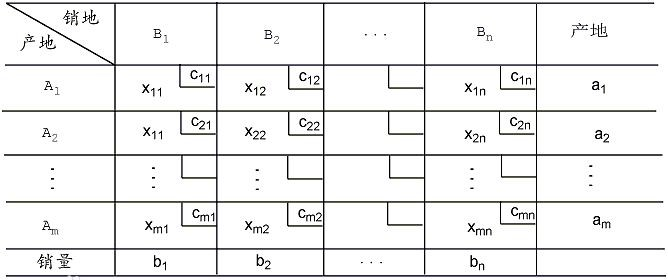

运输问题的典型情况是研究单一物品的运输调度问题：设某种物品有m个产地$A_1, A_2, ···, A_m$，各产地的产量分别是$a_1, a_2, ···,  a_n$，有n个销地$B_1, B_2, ···, B_m$，各个销地的销量分别为$b_1, b_2, ···,  b_n$。从产地$A_i(i=1,2,···,m)$向销地$B_j(j=1,2,···,n)$运输单位物品的运费和运价分别为$x_{ij}, \ c_{ij}$，问怎么调运这些物品才能使总运费最小？

转化成数学问题。

**目标函数：** 

$$

min\ z = \sum_{i=1}^m\sum_{j=1}^n c_{ij}x_{ij}

$$

**约束方程**：

$$

\begin{equation}
\left\{
\begin{array}{lr}
\sum_{i=1}^m a_i = \sum_{j=1}^n b_j \\
\sum_{i=1}^m x_{ij} = b_{j}  \\
\sum_{j=1}^n x_{ij} = a_{i}  \\
x_{ij} >= 0 
\end{array}
\right.
\end{equation}

$$

## 参考

- [运筹学S01E03——运输问题](https://zhuanlan.zhihu.com/p/33299659)